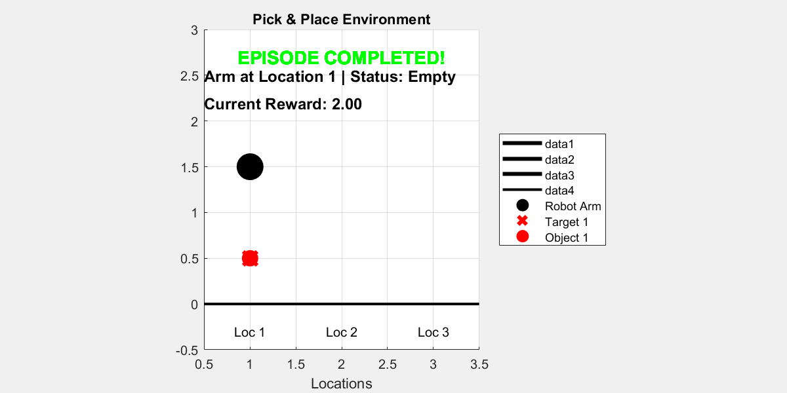
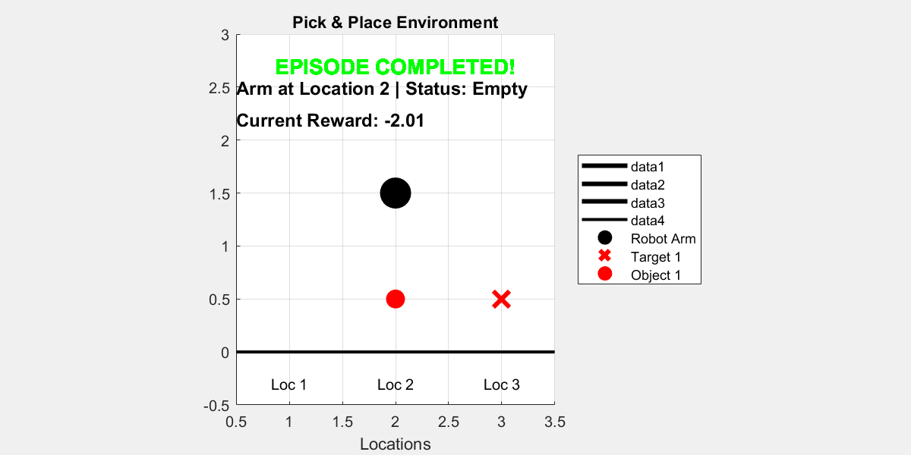

# Aprendizaje por refuerzo para la planificación de tareas

El **Aprendizaje por Refuerzo** es un paradigma de aprendizaje automático en el que un **agente** aprende interactuando con un **entorno**, recibiendo **recompensas** (feedback) basadas en las consecuencias de sus acciones.


En aprendizaje por refuerzo, el entorno suele modelarse como un **Proceso de Decisión de Markov (MDP)**. Esto significa que la probabilidad de pasar al siguiente estado depende solo del estado actual y de la acción, no del historial completo de estados anteriores. Esto se conoce como la **propiedad de Markov**, e implica que el estado actual contiene toda la información necesaria para tomar decisiones óptimas, **simplificando el cálculo**.


En cada instante temporal $t$ , el agente:

-  Observa un estado $s_t$  
-  Elige una acción $a_t$ 
-  Recibe una recompensa $r_{t+1}$ 
-  Transiciona a un nuevo estado $s_{t+1}$ 

El objetivo es aprender una  **política** $\pi \left(a|s\right)$  que maximice las **recompensas futuras acumuladas**.


El proceso de entrenamiento implica que el agente explore el entorno probando distintas acciones y observando los resultados. Usando esta experiencia, el agente actualiza su política para favorecer las acciones que conducen a recompensas más altas. Esto suele hacerse mediante algoritmos que estiman el retorno esperado de las acciones, como Q\-learning o los métodos de gradiente de política.


Para tener éxito, un agente debe encontrar un equilibrio entre **exploración** —probar acciones desconocidas para descubrir sus efectos— y **explotación** —elegir acciones que se sabe que producen alta recompensa—.


 **¿Por qué usar aprendizaje por refuerzo para la planificación de tareas en** ***Pick and Place*****?**


En tareas robóticas como *pick and place*, el robot necesita tomar decisiones paso a paso para mover un objeto de una ubicación a otra. Puede tener que evitar obstáculos, actuar con precisión y adaptarse a condiciones cambiantes en el entorno. El aprendizaje por refuerzo (RL) ofrece varias ventajas para este tipo de planificación de tareas:

1.   **Puede manejar ruido en sensores o acciones:** En un entorno del mundo real, las cámaras pueden producir imágenes inexactas, las detecciones pueden ser ruidosas y el brazo robótico puede no ejecutar las acciones exactamente como se pretende. El aprendizaje por refuerzo permite al robot aprender a actuar de forma eficaz incluso cuando sus observaciones o acciones son imperfectas.
2. **Puede adaptarse eficientemente a los fallos:** Si el robot intenta agarrar un objeto y falla, o si el objeto se resbala y cae, un planificador tradicional podría necesitar recalcular un plan completo desde cero. En cambio, un agente entrenado con aprendizaje por refuerzo sigue una política aprendida que le permite responder dinámicamente y realizar otra acción sin volver a planificar desde cero.
3. **Está bien adaptado a entornos estocásticos:** En robótica, las acciones a menudo no son deterministas: mover el brazo a una determinada posición puede dar resultados distintos según el entorno (por ejemplo, si otros objetos se están moviendo o si hay fuerzas externas presentes). El RL está específicamente diseñado para aprender en entornos donde las acciones no siempre producen el mismo resultado.
4. **Toma decisiones paso a paso y es eficiente en tiempo de ejecución:** Una vez entrenado, el agente no necesita calcular un plan completo en cada paso. Simplemente observa el estado actual y elige la mejor acción según su política. Esto permite al robot actuar de manera rápida y eficiente en tiempo real, sin un cálculo pesado durante la ejecución.

**Objetivo de la lección**


En esta lección, el estudiante implementará los componentes principales del entorno `PickPlaceDiscreteEnv`, que simula un brazo robótico encargado de mover objetos a posiciones objetivo a lo largo de una cuadrícula discreta unidimensional.


El agente será entrenado usando el **algoritmo DQN**, y más adelante se mejorará con **Hindsight Experience Replay (HER)** para mejorar el aprendizaje en escenarios de recompensas dispersas.

# Instalación

**Instalar Reinforcement Learning Toolbox**


Para completar esta lección, necesitas la **Reinforcement Learning Toolbox**™.


Si aún no la has instalado, sigue estos pasos:

1.  Abre MATLAB.
2. Ve a la pestaña **Home**.
3. Haz clic en **Add\-Ons > Get Add\-Ons**.
4. Busca **"Reinforcement Learning Toolbox**™**"** y haz clic en **Install**.

**Verificar la instalación en código**


Puedes ejecutar el siguiente código para comprobar si la toolbox está instalada:

```matlab
toolboxTable = matlab.addons.installedAddons;
if ~any(contains(toolboxTable.Name, "Reinforcement Learning Toolbox"))
    error(['Reinforcement Learning Toolbox is not installed.\n' ...
           'Please install it via Add-On Explorer (Home > Add-Ons > Get Add-Ons).']);
else
    disp("✅ Reinforcement Learning Toolbox is installed.");
end
```

```matlabTextOutput
✅ Reinforcement Learning Toolbox is installed.
```


# Creación de un entorno
## Ejercicio 1 \- Inicialización del estado del entorno:

En este primer ejercicio, implementarás una función que reinicia el estado del entorno y devuelve una observación inicial.


El estado de nuestro entorno está compuesto por **cuatro elementos**, que representan lo que el agente de aprendizaje por refuerzo "ve" en cada paso temporal:


 **1.** **`this.arm_pos`** **— Posición del brazo robótico** 


Indica la posición actual del brazo robótico.


Su valor es un entero entre `1` y `num_locations`.


Al comienzo de cada episodio, este valor se selecciona aleatoriamente dentro de ese rango.


 **2.** **`this.arm_state`** **— Estado de sujeción del brazo** 


Indica si el brazo robótico está sujetando un objeto.


Su valor va de `0` a `num_objects`:

-  `0` significa que el brazo está vacío. 
-  `1` significa que está sujetando **el objeto 1**, 
-  `2` significa que está sujetando **el objeto 2**, y así sucesivamente. El brazo siempre empieza vacío, por lo que el valor por defecto es `0`. 

 **3.** **`this.objects_pos`** **— Posiciones actuales de los objetos** 


Un array que indica la posición actual de cada objeto.

-  `objects_pos(1)` es la posición del **objeto 1**, 
-  `objects_pos(2)` es la posición del **objeto 2**, y así sucesivamente. 

Estas posiciones se asignan aleatoriamente al principio, pero **deben cumplir dos condiciones**:

-  No puede haber dos objetos colocados en la misma ubicación. 
-  Ningún objeto puede comenzar en la misma ubicación que el brazo robótico. 

 **4.** **`this.target_pos`** **— Posiciones objetivo de los objetos** 


Un array que indica la **posición objetivo** de cada objeto:

-  `target_pos(1)` es el objetivo del **objeto 1**, 
-  `target_pos(2)` es el objetivo del **objeto 2**, y así sucesivamente. 

Estas posiciones objetivo también son aleatorias, pero deben cumplir:

-  Ningún par de objetos puede compartir la misma ubicación objetivo. 
-  La posición objetivo de un objeto no puede ser la misma que su posición **inicial**. 

**Tarea**


Tu objetivo es escribir la lógica que genere el estado inicial para estas cuatro variables (`arm_pos`, `arm_state`, `objects_pos` y `target_pos`) siguiendo las restricciones descritas arriba.


Este estado inicial será devuelto por la función `reset()` del entorno.


**Pistas**


Puede que las siguientes funciones de MATLAB te resulten útiles para implementar este ejercicio:

-  `randi` – para generar enteros aleatorios dentro de un rango. 
-  `randperm` – para generar permutaciones aleatorias. 
-  `setdiff` – para eliminar valores concretos de un conjunto . 

```matlab
 % Reiniciar el entorno al estado inicial y devolver la observación inicial
 function [this, InitialObservation] = resetFunc(this)

    % Aleatorizar la posición inicial del brazo (indexación basada en 1)

    % Generar posiciones válidas para los objetos (excluyendo la posición del brazo)

    % Asegurar que haya suficientes posiciones válidas para todos los objetos


    % Generar posiciones objetivo (cada una distinta de la posición de su objeto correspondiente)
    this.target_pos = zeros(this.num_objects, 1);
    assigned_targets = [];  % Llevar un registro de los objetivos ya asignados para evitar repeticiones

    % Construir el vector de observación inicial
    InitialObservation = [this.arm_pos;this.arm_state;this.objects_pos; this.target_pos];
    this.State = InitialObservation;

end
```

```matlab
% Reiniciar el entorno al estado inicial y devolver la observación inicial
function [this, InitialObservation] = resetFuncSolution(this)
    this.arm_state = 0; % 0 = vacío, >0 = sujetando un objeto

    % Aleatorizar la posición inicial del brazo (indexación basada en 1)
    this.arm_pos = randi([1,this.num_locations]);

    % Generar posiciones válidas para los objetos (excluyendo la posición del brazo)
    valid_positions = setdiff(1:this.num_locations, this.arm_pos);

     % Inicializar el mapa de objetos (todas las ubicaciones vacías)
     this.map_objects = zeros(this.num_locations, 1);

    % Asegurar que haya suficientes posiciones válidas para todos los objetos
    if length(valid_positions) >= this.num_objects
        % Seleccionar posiciones aleatorias para los objetos (sin solapamiento y no en el brazo)
        selected_indices = randperm(length(valid_positions), this.num_objects);
        this.objects_pos = valid_positions(selected_indices)';
        for i = 1:this.num_objects
            this.map_objects(this.objects_pos(i)) = i;
        end
    else
        error('Not enough valid positions for objects');
    end

    % Generar posiciones objetivo (cada una distinta de la posición de su objeto correspondiente)
    this.target_pos = zeros(this.num_objects, 1);
    assigned_targets = [];  % Llevar un registro de los objetivos ya asignados para evitar repeticiones

    for i = 1:this.num_objects
        % Las posiciones objetivo válidas excluyen la posición actual del objeto y los objetivos ya asignados
        valid_targets = setdiff(1:this.num_locations, [this.objects_pos(i), assigned_targets]);
        % Seleccionar un objetivo aleatorio de entre las posiciones válidas
        selected_index = randperm(length(valid_targets), 1);
        this.target_pos(i) = valid_targets(selected_index);
        % Añadir este objetivo a los objetivos ya asignados
        assigned_targets = [assigned_targets, this.target_pos(i)];
    end

    % Construir el vector de observación inicial
    InitialObservation = [this.arm_pos;this.arm_state;this.objects_pos; this.target_pos];
    this.State = InitialObservation;

end
```

### Probar la función Reset
```matlab
test = tests.TestResetFuncPickPlaceEnv;
test.ResetFuncHandle = @resetFuncSolution;
result = run(test);
```

```matlabTextOutput
Running tests.TestResetFuncPickPlaceEnv
.....
Done tests.TestResetFuncPickPlaceEnv
__________
```

## **Ejercicio 2 – Implementación de la función Step:**

En este ejercicio, implementarás la **función step** del entorno, que define cómo el entorno pasa de un estado a otro en respuesta a una acción realizada por el agente.


El agente interactúa con el entorno usando acciones discretas:


 **Acción 1: Pick** 


El brazo robótico intenta recoger un objeto en su posición actual.


Esta acción solo es válida si:

-  El brazo está vacío. 
-  Hay un objeto en la posición del brazo. 

**Acción 2: Place**


El brazo robótico intenta colocar el objeto que está sujetando actualmente en su posición actual.


Esta acción solo es válida si:

-  El brazo está sujetando un objeto. 
-  La posición objetivo está vacía. 

**Acciones 3 y superiores: Mover a una ubicación**


El brazo robótico se mueve a una nueva ubicación.


Estas acciones se corresponden con mover el brazo a una ubicación concreta. Sin embargo, como las acciones `1` y `2` ya están reservadas para **pick** y **place**, el índice de la ubicación debe obtenerse restando un desplazamiento de `2` al valor de la acción.

-  Por ejemplo: 
-  `Action 3` → mover a la `ubicación 1` 
-  `Action 4` → mover a la `ubicación 2` 
-  `Action 5` → mover a la `ubicación 3` 

**Tarea**


Tu objetivo es escribir la lógica de la función `step()` que realice lo siguiente:

-  Ejecutar la acción especificada por la entrada `Action` 
-  Actualizar el estado interno del entorno en consecuencia 
-  Devolver el nuevo estado 

**Pistas**

-  Usa  "`Action - 2"` para calcular el índice de la ubicación objetivo en las acciones de movimiento. 
```matlab
function [this, Observation, Reward, IsDone, Info] = stepFucntion(this, Action)

    % Gestionar la acción de recoger
    if Action == 1 

    % Gestionar la acción de colocar
    elseif Action == 2

     % Gestionar la acción de mover a una ubicación
    elseif Action > 2 


    end


    % Construir el nuevo vector de observación
    Observation = [this.arm_pos;this.arm_state;this.objects_pos; this.target_pos];

    % Calcular la recompensa usando la función de recompensa externa
    Reward = RewardFunc({this.State}, {Action}, {Observation});
    % Almacenar la recompensa actual para visualización
    this.CurrentReward = Reward;
    % Comprobar si el episodio ha terminado usando una función externa
    IsDone = IsDoneFunc({this.State}, {Action}, {Observation});
    % Actualizar los estados del sistema
    this.State = Observation;
    Info = [];

    % Actualizar la bandera interna de finalización
    this.IsDone = IsDone;

end
```

```matlab
function [this, Observation, Reward, IsDone, Info] = stepFuncSolution(this, Action)

    % Gestionar la acción de recoger
    if Action == 1 % pick
        % El brazo debe estar vacío y debe haber un objeto en la posición del brazo
        if this.arm_state == 0 && this.map_objects(this.arm_pos) > 0
            obj_index = this.map_objects(this.arm_pos);
            % Recoger el objeto
            this.arm_state = obj_index;
            this.map_objects(this.arm_pos) = 0;
            this.objects_pos(obj_index) = 0; % 0 significa que el objeto está siendo transportado
        end

        % Gestionar la acción de colocar
    elseif Action == 2 % place
        % El brazo debe estar sujetando un objeto y la ubicación debe estar vacía
        if this.arm_state > 0 && this.map_objects(this.arm_pos) == 0
            obj_index = this.arm_state;
            new_obj_pos = this.arm_pos;
            current_target_pos = this.target_pos(obj_index);
            % Colocar el objeto en la posición actual del brazo
            this.map_objects(new_obj_pos) = obj_index;
            this.objects_pos(obj_index) = new_obj_pos;
            this.arm_state = 0; % El brazo ahora está vacío
        end

        % Gestionar la acción de mover a una ubicación
    elseif Action > 2 % move to location
        is_holding_obj = this.arm_state > 0;
        obj_index = this.arm_state;

        new_location = Action - 2; % Las acciones 3,4,5,... se corresponden con las ubicaciones 1,2,3,...
        % Mover el brazo a la nueva ubicación
        this.arm_pos = new_location;

    end

    % Construir el nuevo vector de observación
    Observation = [this.arm_pos;this.arm_state;this.objects_pos; this.target_pos];

    % Calcular la recompensa usando la función de recompensa externa
    Reward = RewardFunc({this.State}, {Action}, {Observation});
    % Almacenar la recompensa actual para visualización
    this.CurrentReward = Reward;
    % Comprobar si el episodio ha terminado usando una función externa
    IsDone = IsDoneFunc({this.State}, {Action}, {Observation});
    % Actualizar los estados del sistema
    this.State = Observation;
    Info = [];

    % Actualizar la bandera interna de finalización
    this.IsDone = IsDone;


end
```

### Probar la función Step
```matlab
test = tests.TestStepFuncPickPlaceEnv;
test.StepFuncHandle = @stepFuncSolution;
result = run(test);
```

```matlabTextOutput
Running tests.TestStepFuncPickPlaceEnv
........
Done tests.TestStepFuncPickPlaceEnv
__________
```

## **Ejercicio 3 – Implementación de la función IsDone:**

En este **breve** ejercicio (solo una línea de código), implementarás una función que comprueba si la tarea se ha completado con éxito. Esta función se llamará en cada paso temporal y deberá devolver `true` si se ha alcanzado el objetivo, y `false` en caso contrario.


Esta lógica es útil para señalar el final de un episodio en aprendizaje por refuerzo.


En esta tarea, asumimos que hay **solo un objeto** en el entorno.


**Pista**


Puedes acceder a los valores del estado usando `NextState{1}`. Por ejemplo, para acceder al primer valor, usa `NextState{1}(1)`.


```matlab
function isdone = IsDoneFunc(State, Action, NextState)
    %isdone = .... solo necesitas completar esta línea
    isdone = IsDoneFuncSolution(State, Action, NextState);
end

```

```matlab
function isdone = IsDoneFuncSolution(State, Action, NextState)
    isdone = NextState{1}(3) == NextState{1}(4);
end
```

### Probar la función IsDone
```matlab
test = tests.TestIsDoneFuncPickPlaceEnv;
test.IsDoneFuncHandle = @IsDoneFuncSolution;
result = run(test);
```

```matlabTextOutput
Running tests.TestIsDoneFuncPickPlaceEnv
..
Done tests.TestIsDoneFuncPickPlaceEnv
__________
```

## Comprender la función de recompensa

La función de recompensa está diseñada para guiar al agente de aprendizaje paso a paso hacia la finalización de la tarea, al mismo tiempo que penaliza acciones improductivas o no válidas. Proporciona tanto **feedback positivo por el progreso** como **penalizaciones por errores**, moldeando eficazmente el comportamiento del agente con el tiempo.


Al comienzo de cada paso, el agente recibe una **penalización de \-2 por cada objeto que aún no esté en su posición objetivo**. Esto anima al agente a reducir el número de objetos mal colocados lo más rápido posible.


Para incentivar el progreso, se añaden pequeñas recompensas positivas por cada subobjetivo alcanzado:

-  **+0.5** por mover el brazo hacia un objeto que no está en su ubicación objetivo. 
-  **+1** por recoger ese objeto (siempre que no esté ya correctamente colocado). 
-  **+1.5** por mover el objeto hacia su ubicación objetivo. 
-  **Recompensa final de +2** cuando la tarea se completa por completo (es decir, todos los objetos están en sus ubicaciones objetivo). 

**Penalizaciones por acciones no válidas**


Para desalentar comportamientos inadecuados, el agente es penalizado:

-  **−5** por acciones no válidas como: 
-  Intentar recoger un objeto cuando no hay ninguno. 
-  Intentar recoger cuando ya está sujetando algo. 
-  Intentar colocar un objeto donde ya existe otro. 
-  **−0.01** por movimientos ineficientes o redundantes, como moverse a la misma ubicación. 

**Propósito general**


El objetivo de esta función de recompensa es servir como una especie de **distancia heurística al objetivo**. Al proporcionar recompensas y penalizaciones intermedias, ayuda al agente de aprendizaje por refuerzo a entender **qué acciones lo acercan al objetivo**, y cuáles son inútiles o perjudiciales. Este feedback estructurado es esencial para un aprendizaje eficaz en entornos complejos.

```matlab
function reward = RewardFunc(State, Action, NextState)

    % Comprobar si la tarea se ha completado
    isdone = IsDoneFunc(State, Action, NextState);

    if isdone
        % Si la tarea ha terminado, dar una recompensa positiva alta
        reward = 2;
    else
        % Empezar desde recompensa cero y ajustar según la acción
        reward = 0;

        % Extraer información del estado actual
        arm_pos = State{1}(1);            % Posición actual del brazo robótico
        arm_state = State{1}(2);          % Si el brazo está sujetando un objeto
        objects_pos = State{1}(3);      % Posiciones actuales de los dos objetos
        target_pos = State{1}(4);       % Posiciones objetivo de los dos objetos

        Action = Action{1};               % Extraer el valor escalar de la acción

        % Acción 1: Recoger un objeto
        if Action == 1
            % Comprobar si hay un objeto en la posición del brazo
            [hasObject, idx] = hasObjectAtPosition(objects_pos, arm_pos);

            % Recogida válida: el brazo está vacío y hay un objeto que recoger
            if arm_state == 0 && hasObject
                % Recompensa positiva si el objeto no está ya en su objetivo
                if target_pos(idx) ~= arm_pos 
                    reward = reward + 1;
                else
                    % Penalización por recoger un objeto que ya está en su ubicación objetivo
                    reward = reward - 5;
                end
            else
                % Recogida no válida (o bien el brazo no está vacío o no hay objeto presente)
                reward = reward - 5;
            end

        % Acción 2: Colocar un objeto
        elseif Action == 2
            [hasObject, idx] = hasObjectAtPosition(objects_pos, arm_pos);

            % Colocación válida: el brazo está sujetando un objeto y la ubicación está vacía
            if arm_state > 0 && ~hasObject
                obj_index = arm_state;  % Objeto que se está sujetando
                % Aquí no se añade recompensa extra, la recompensa se gestiona abajo si el estado pasa a ser "done"
            else
                % Colocación no válida (intentando colocar en una posición ocupada o con el brazo vacío)
                reward = reward - 5;
            end

        % Acción > 2: Mover el brazo a otra ubicación
        elseif Action > 2
            is_holding_obj = arm_state > 0;
            obj_index = arm_state;
            new_location = Action - 2;  % Convertir el número de acción en el índice de ubicación

            [hasObject, idx] = hasObjectAtPosition(objects_pos, new_location);

            if arm_pos == new_location
                % Penalizar movimiento innecesario hacia la ubicación actual
                reward = reward - 0.01;

            elseif is_holding_obj && new_location == target_pos(obj_index)
                % Recompensa por moverse directamente hacia el objetivo con el objeto
                reward = reward + 1.5;

            elseif ~is_holding_obj && hasObject && target_pos(idx) ~= new_location
                % Recompensa por moverse hacia un objeto que necesita ser recogido
                reward = reward + 0.5;

            else
                % Ligera penalización para otros tipos de movimiento
                reward = reward - 0.01;
            end
        end

        % Penalización final por cualquier objeto que no esté en su posición objetivo
        objects_pos = NextState{1}(3);
        target_pos = NextState{1}(4);

        for i = 1:length(objects_pos)
            if objects_pos(i) ~= target_pos(i)
                reward = reward - 2;
            end
        end
    end
end

function [hasObject, idx] = hasObjectAtPosition(objects_pos, position)
    % Comprobar si hay algún objeto en la posición especificada
    % objects_pos: array que contiene las posiciones de los objetos [obj1_pos, obj2_pos, ...]
    % position: posición a comprobar
    % Devuelve: hasObject (true si hay un objeto en la posición, false en caso contrario)
    %          idx (índice del objeto si se encuentra, -1 en caso contrario)

    idx = find(objects_pos == position, 1); % Encuentra el primer índice
    if ~isempty(idx)
        hasObject = true;
    else
        hasObject = false;
        idx = -1;
    end
end
```

# Entrenamiento de un modelo

**Fijar el generador de números aleatorios para reproducibilidad**


El código de ejemplo puede implicar el cálculo de números aleatorios en distintas etapas. Fijar el generador de números aleatorios al principio de varias secciones del código de ejemplo preserva la secuencia de números aleatorios en la sección cada vez que la ejecutas, y aumenta la probabilidad de reproducir los resultados. Para más información, consulta [Reproducibilidad de resultados](https://es.mathworks.com/help/reinforcement-learning/ug/train-reinforcement-learning-agents.html#mw_cfb4600e-9d19-4e4e-89c8-2749894fee3a).


Fija el generador de números aleatorios con semilla `0` y el algoritmo Mersenne Twister. Para más información sobre cómo controlar la semilla usada para la generación de números aleatorios, consulta [`rng`](https://es.mathworks.com/help/matlab/ref/rng.html).

```matlab
previousRngState = rng(0,"twister");
```


**Crear una instancia del entorno**


Esta línea crea una instancia de un entorno personalizado de pick\-and\-place.

```matlab
env_pick_place = PickPlaceDiscreteEnv2(1, 3, @stepFuncSolution, @resetFuncSolution);
```


**Crear un agente DQN**


Aquí definimos el agente que aprenderá a interactuar con el entorno.

-  `obsInfo` y `actInfo` proporcionan la estructura de los espacios de observación y acción, respectivamente. 
-  `rlDQNAgent` crea un agente Deep Q\-Network (DQN), que aproxima la función óptima de valor Q usando una red neuronal. 
```matlab
obsInfo = getObservationInfo(env_pick_place);
actInfo = getActionInfo(env_pick_place);
dqnAgent = rlDQNAgent(obsInfo,actInfo);
```


**Configurar los parámetros del agente**


Estos ajustes controlan el comportamiento y la dinámica de aprendizaje del agente:

-  **Exploración epsilon\-greedy**: empieza con exploración total (`Epsilon = 1.0`) y se reduce gradualmente para favorecer la explotación a medida que avanza el aprendizaje. 
-  **Tamaño del mini\-batch**: número de experiencias muestreadas del replay buffer durante cada paso de entrenamiento. 
-  **Tasa de aprendizaje**: controla la rapidez con la que se actualiza la red crítica. 
-  **Umbral de gradiente**: evita gradientes explosivos durante el entrenamiento estableciendo un límite sobre su magnitud. 
```matlab
dqnAgent.AgentOptions.EpsilonGreedyExploration.Epsilon = 1.0;
dqnAgent.AgentOptions.EpsilonGreedyExploration.EpsilonMin = 0.01;
dqnAgent.AgentOptions.EpsilonGreedyExploration.EpsilonDecay = .0001;
dqnAgent.AgentOptions.MiniBatchSize = 32;
dqnAgent.AgentOptions.CriticOptimizerOptions.LearnRate = 5e-4;
dqnAgent.AgentOptions.CriticOptimizerOptions.GradientThreshold = 10;
```


**Configurar los parámetros de entrenamiento**


Estas opciones definen cómo se llevará a cabo el entrenamiento:

-  El agente se entrenará durante un máximo de 100 episodios, cada uno con una duración máxima de 29 pasos. 
-  El entrenamiento se detendrá automáticamente antes si la puntuación media supera 1.9. 
```matlab
maxEpisodes = 100;
maxStepsPerEpisode = 20;
trainOpts = rlTrainingOptions(...
    MaxEpisodes=maxEpisodes, ...
    MaxStepsPerEpisode=maxStepsPerEpisode, ...
    Verbose=false, ...
    ScoreAveragingWindowLength=100,...
    Plots="training-progress",...
    StopTrainingCriteria="EvaluationStatistic",...
    StopTrainingValue=1.9);   
```


Se añade una política de evaluación para probar periódicamente el rendimiento del agente de forma determinista:

-  Cada 50 episodios, el agente se evalúa durante 10 episodios usando semillas aleatorias fijas. 
```matlab
evaluator = rlEvaluator( ...
    EvaluationFrequency=50, ...
    NumEpisodes=10, ...
    RandomSeeds=101:110);
```

**Iniciar el entrenamiento**

```matlab
trainingStats = train(dqnAgent, env_pick_place, trainOpts, Evaluator=evaluator);
```


**Visualizar al agente entrenado interactuando con el entorno**

```matlab

plot(env_pick_place)

for i = 1:10
    rng();
    simOptions = rlSimulationOptions(MaxSteps=15);
    sim(env_pick_place, agent, simOptions);

    pause(1); 
end
```

```matlabTextOutput
ans = struct with fields:
     Type: 'twister'
     Seed: 0
    State: [625x1 uint32]

ans = struct with fields:
     Type: 'twister'
     Seed: 0
    State: [625x1 uint32]

ans = struct with fields:
     Type: 'twister'
     Seed: 0
    State: [625x1 uint32]

ans = struct with fields:
     Type: 'twister'
     Seed: 0
    State: [625x1 uint32]

ans = struct with fields:
     Type: 'twister'
     Seed: 0
    State: [625x1 uint32]

ans = struct with fields:
     Type: 'twister'
     Seed: 0
    State: [625x1 uint32]

ans = struct with fields:
     Type: 'twister'
     Seed: 0
    State: [625x1 uint32]

ans = struct with fields:
     Type: 'twister'
     Seed: 0
    State: [625x1 uint32]

ans = struct with fields:
     Type: 'twister'
     Seed: 0
    State: [625x1 uint32]

ans = struct with fields:
     Type: 'twister'
     Seed: 0
    State: [625x1 uint32]

```




**Guardar el modelo**

```matlab
save('dqn_1_object.mat', 'dqnAgent');
```


**Cargar el modelo**

```matlab
load('dqn_1_object.mat', 'dqnAgent');
```
# Uso de HER para entrenar un modelo

En aprendizaje por refuerzo (RL), los *entornos con recompensas dispersas* presentan un gran desafío. En estos entornos, los agentes reciben recompensas distintas de cero solo cuando alcanzan estados objetivo muy específicos. Esto significa que durante el entrenamiento, el agente puede realizar muchas acciones sin recibir ningún feedback significativo, lo que dificulta aprender políticas eficaces.


**Hindsight Experience Replay (HER** es una técnica potente para abordar este problema. La idea principal de HER es *reinterpretar episodios fallidos como si hubieran tenido éxito*, cambiando la meta durante el replay. Por ejemplo, supongamos que el agente intentaba alcanzar la meta **g** pero acabó en un estado final distinto **s′**. En lugar de descartar esta trayectoria como un fallo, HER permite reetiquetar la experiencia fingiendo que la meta del agente era en realidad **g′ = s′**, el estado final al que sí llegó.


Al hacer esto, el agente todavía puede aprender algo útil del episodio, incluso si no alcanzó la meta original. Esto incrementa drásticamente el número de ejemplos de entrenamiento informativos, especialmente en entornos con recompensas dispersas.


En MATLAB, HER puede implementarse modificando el replay buffer para almacenar metas alternativas y generar datos de entrenamiento adicionales durante el experience replay.


[Documentación de HER](https://es.mathworks.com/help/reinforcement-learning/ref/rl.replay.rlhindsightreplaymemory.html)


**Crear un agente DQN**

```matlab
obsInfo = getObservationInfo(env_pick_place);
actInfo = getActionInfo(env_pick_place);
herAgent = rlDQNAgent(obsInfo,actInfo);
```


**Configurar los parámetros del agente**

```matlab
herAgent.AgentOptions.EpsilonGreedyExploration.Epsilon = 1.0;
herAgent.AgentOptions.EpsilonGreedyExploration.EpsilonMin = 0.01;
herAgent.AgentOptions.EpsilonGreedyExploration.EpsilonDecay = 0.0001;
herAgent.AgentOptions.MiniBatchSize = 32;
herAgent.AgentOptions.CriticOptimizerOptions.LearnRate = 5e-4;
herAgent.AgentOptions.CriticOptimizerOptions.GradientThreshold = 10;

```

### **Añadir Hindsight Experience Replay (HER)**

Para integrar **Hindsight Experience Replay (HER)** en Reinforcement Learning Toolbox de MATLAB, hay algunos componentes importantes que debes definir:


&nbsp;&nbsp;&nbsp;&nbsp;&nbsp;&nbsp;&nbsp;&nbsp; 1. Una **función de recompensa** personalizada con el siguiente formato:

```
function reward = RewardFunc(State, Action, NextState)
```

Esta función calcula la recompensa escalar dado el `State` actual, la `Action` ejecutada y el `NextState` resultante. Estas entradas deben pasarse **como cell arrays**, por ejemplo:


`State     = {[``1` `,` `0` `,` `1` `,` `3``]};`


`Action    = {1``};`


`NextState = {[1` `,` `1` `,` `0` `,` `3``]};`


Este formato es necesario para HER porque extrae subobjetivos y comprueba condiciones usando indexación explícita.


&nbsp;&nbsp;&nbsp;&nbsp;&nbsp;&nbsp;&nbsp;&nbsp; 2. Una **función de condición terminal** para determinar si un episodio ha terminado:

```
function isdone = IsDoneFunc(State, Action, NextState)

```

Esta función debe devolver `true` si se considera que se ha alcanzado la meta o si el episodio ha terminado por cualquier otro motivo. Al igual que la función de recompensa, también usa cell arrays como entrada.


 *En este caso, tanto* *`RewardFunc`* *como* *`IsDoneFunc`* ***ya se habían implementado correctamente*** *de antemano.*


&nbsp;&nbsp;&nbsp;&nbsp;&nbsp;&nbsp;&nbsp;&nbsp; 3. Especificar cómo es la **condición de meta** para que HER pueda reemplazar la meta real por una meta retrospectiva en el replay buffer.

```matlab
% State = [arm_pos, arm_state, obj_pos, target_pos]
% Definimos la meta como "obj_pos == target_pos"
% Canal = 1 (porque tenemos un vector de observación)
% Índices = 3 (posición del objeto), 4 (posición objetivo)

goalConditionInfo = {{1, [3], 1, [4]}};
```

 Esto significa: en el canal 1, los elementos del índice 3 (posición del objeto) deben coincidir con los elementos del índice 4 (posición objetivo) en el canal 1.


```matlab
rewardFcn = @RewardFunc;
isDoneFcn = @IsDoneFunc;
bufferLength = 5e4;
herAgent.ExperienceBuffer = rlHindsightReplayMemory(obsInfo,actInfo,...
    rewardFcn,isDoneFcn,goalConditionInfo,bufferLength);
```


**Configurar los parámetros de entrenamiento**

```matlab
maxEpisodes = 100;
maxStepsPerEpisode = 20;
trainOpts = rlTrainingOptions(...
    MaxEpisodes=maxEpisodes, ...
    MaxStepsPerEpisode=maxStepsPerEpisode, ...
    Verbose=false, ...
    ScoreAveragingWindowLength=100,...
    Plots="training-progress",...
    StopTrainingCriteria="EvaluationStatistic",...
    StopTrainingValue=1.9);   
```

```matlab
evaluator = rlEvaluator( ...
    EvaluationFrequency=50, ...
    NumEpisodes=10, ...
    RandomSeeds=101:110);
```

**Iniciar el entrenamiento**

```matlab
trainingStats = train(herAgent, env_pick_place, trainOpts, Evaluator=evaluator);
```


**Visualizar al agente entrenado interactuando con el entorno**

```matlab
plot(env_pick_place)

for i = 1:10
    rng();
    simOptions = rlSimulationOptions(MaxSteps=15);
    sim(env_pick_place, herAgent, simOptions);

    pause(1); 
end
```




En este ejemplo sencillo con **solo un objeto**, usar **DQN con o sin Hindsight Experience Replay (HER)** **no muestra una diferencia significativa** en el rendimiento. 


Sin embargo, al entrenar con **dos objetos**, la tarea se vuelve más compleja y las recompensas son más dispersas. En este caso:

-  **DQN por sí solo** tiene dificultades para aprender. 
-  **DQN con HER** aprende significativamente más rápido y de forma más fiable. 

HER ayuda transformando episodios fallidos en experiencias útiles.


**Guardar el modelo**

```matlab
save('dqn_her_1_object.mat', 'herAgent');
```

**Cargar el modelo**

```matlab
load('dqn_her_1_object.mat', 'herAgent');
```
# Dos objetos con HER 

En esta sección, ampliamos la implementación anterior de **Hindsight Experience Replay (HER)** para manejar **dos objetos** en un entorno discreto de pick\-and\-place. 


Comenzamos definiendo un nuevo entorno con **2 objetos** y **6 posiciones**:

```matlab
env_pick_place = PickPlaceDiscreteEnv2(2, 6, @stepFuncSolution, @resetFuncSolution);
```


**Crear un agente DQN**

```matlab
obsInfo = getObservationInfo(env_pick_place);
actInfo = getActionInfo(env_pick_place);
herv2Agent = rlDQNAgent(obsInfo,actInfo);
```


**Configurar los parámetros del agente**

```matlab
herv2Agent.AgentOptions.EpsilonGreedyExploration.Epsilon = 1.0;
herv2Agent.AgentOptions.EpsilonGreedyExploration.EpsilonMin = 0.005;
herv2Agent.AgentOptions.EpsilonGreedyExploration.EpsilonDecay = 0.0008;
herv2Agent.AgentOptions.MiniBatchSize = 32;
herv2Agent.AgentOptions.CriticOptimizerOptions.LearnRate = 5e-4;
herv2Agent.AgentOptions.CriticOptimizerOptions.GradientThreshold = Inf;

```

## Añadir Hindsight Experience Replay (HER)

Para habilitar HER con **dos objetos**, necesitamos modificar la función de recompensa, la condición terminal (`IsDoneFunc`) y la información de la condición de meta.


**Función de recompensa**


En la función de recompensa, solo necesitamos cambiar este código:


Original para un objeto:

```
objects_pos = State{1}(3);
target_pos = State{1}(4);
```

Actualizado para dos objetos:

```
objects_pos = State{1}(3:4);
target_pos = State{1}(5:6);
```

**Función IsDone**


Original

```
function isdone = PickPlaceIsDoneFunc(State, Action, NextState)
    isdone = NextState{1}(3) == NextState{1}(4) ;
end
```

Actualizado:

```
function isdone = PickPlaceIsDoneFunc(State, Action, NextState)
    isdone = NextState{1}(3) == NextState{1}(5) && NextState{1}(4) == NextState{1}(6);
end
```

**Condición de meta**


Definimos la condición de meta usando `goalConditionInfo`, que especifica cómo HER reconoce cuándo se ha alcanzado una meta:

```matlab
% State = [arm_pos, arm_state, obj1_pos, obj2_pos, target1_pos, target2_pos]
% Condición de meta: ambas posiciones de los objetos deben coincidir con sus objetivos

goalConditionInfo = {{1, [3, 4], 1, [5, 6]}};
```

```matlab
rewardFcn = @twoObjects.PickPlaceRewardFunc;
isDoneFcn = @twoObjects.PickPlaceIsDoneFunc;
bufferLength = 5e4;
herv2Agent.ExperienceBuffer = rlHindsightReplayMemory(obsInfo,actInfo,...
    rewardFcn,isDoneFcn,goalConditionInfo,bufferLength);
```


**Configurar los parámetros de entrenamiento**

```matlab
maxEpisodes = 3000;
maxStepsPerEpisode = 45;
trainOpts = rlTrainingOptions(...
    MaxEpisodes=maxEpisodes, ...
    MaxStepsPerEpisode=maxStepsPerEpisode, ...
    Verbose=false, ...
    ScoreAveragingWindowLength=100,...
    Plots="training-progress",...
    StopTrainingCriteria="EvaluationStatistic",...
    StopTrainingValue=1.9);   
```

```matlab
evaluator = rlEvaluator( ...
    EvaluationFrequency=50, ...
    NumEpisodes=10, ...
    RandomSeeds=101:110);
```

**Iniciar el entrenamiento**


**Advertencia**: Entrenar el modelo con estos parámetros puede tardar alrededor de 8 horas.

```matlab
trainingStats = train(herv2Agent, env_pick_place, trainOpts, Evaluator=evaluator);
```


**Visualizar al agente entrenado interactuando con el entorno**

```matlab
plot(env_pick_place)

for i = 1:10
    rng();
    simOptions = rlSimulationOptions(MaxSteps=15);
    sim(env_pick_place, herAgent, simOptions);

    pause(1); 
end
```

**Guardar el modelo**

```matlab
save('dqn_her_2_object.mat', 'herv2Agent');
```

**Cargar el modelo**

```matlab
load('dqn_her_2_object.mat', 'herv2Agent');
```