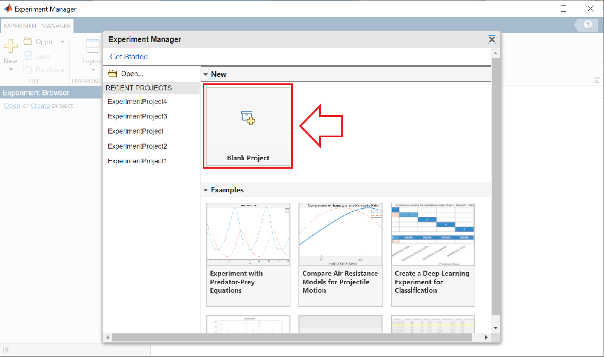
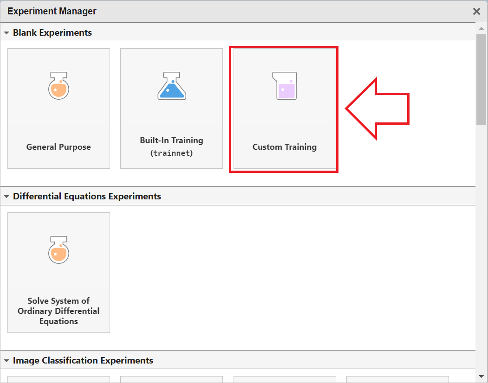
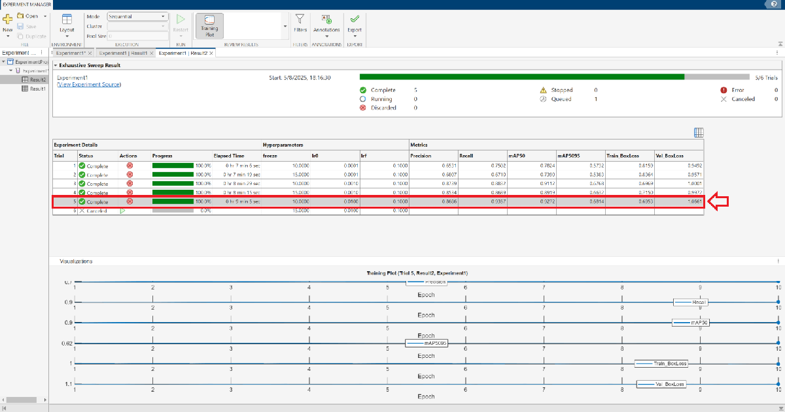
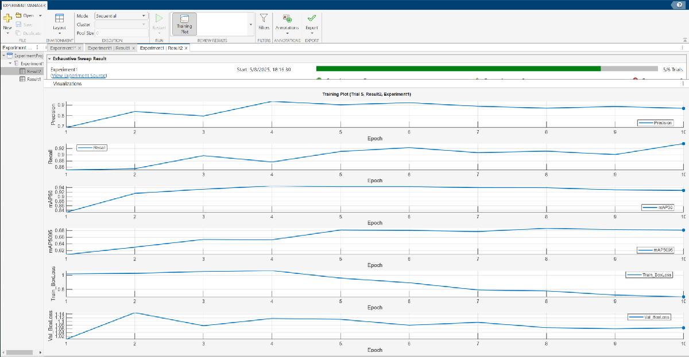

# Experimentación \- Ajuste de hiperparámetros

En la Lección 2, aprendimos cómo entrenar un modelo de detección de objetos YOLOv8 en MATLAB. En la Lección 4, vimos cómo evaluar modelos usando métricas como precisión, recall, F1\-score y mAP. En esta lección, exploraremos cómo realizar experimentación sistemática variando los hiperparámetros del modelo y los ajustes de aumento de datos para identificar configuraciones óptimas.


Al final de esta sesión, podrás:

-  Identificar y aplicar **hiperparámetros clave de entrenamiento** y **aumento de datos**, comprendiendo su impacto en el rendimiento del modelo. 
-  Configurar el **Experiment Manager de MATLAB** para ejecutar múltiples pruebas usando búsqueda en cuadrícula u optimización bayesiana. 

# **Resumen**

En la Lección 2, vimos que el siguiente código se puede usar para entrenar un modelo:

```
[yolov8Det, results] = trainYOLOv8ObjectDetector( ...
    configFile, ...
    baseModel, ...
    options, ...
    optionalArgs{:});
```

En esa lección, solo trabajamos con el parámetro `Freeze` de `optionalArgs`. En esta sesión, exploraremos `optionalArgs` adicionales.


# Hiperparámetros del modelo

Puedes encontrar la lista completa de hiperparámetros, sus valores por defecto y recomendaciones en el siguiente enlace: [Hiperparámetros de Yolo](https://docs.ultralytics.com/usage/cfg/).


Estos son algunos de los hiperparámetros opcionales:

-  **time** (*float*): Tiempo máximo de entrenamiento en horas. Si se establece, el entrenamiento se detendrá automáticamente una vez alcanzado este límite de tiempo, aunque no se haya completado el número especificado de épocas. Útil para entrenamientos con restricciones de tiempo. 
-  **optimizer** (*str*): Especifica el optimizador utilizado durante el entrenamiento. Las opciones habituales incluyen `'SGD'`, `'Adam'`, `'AdamW'`, `'RMSProp'` o `'auto'` para la selección automática en función del modelo y la tarea. El optimizador influye en la velocidad y la estabilidad del aprendizaje. 
-  **lr0** (*float*): Tasa de aprendizaje inicial que controla la rapidez con la que el modelo actualiza sus pesos al inicio del entrenamiento. Elegir un valor adecuado es importante para un aprendizaje efectivo. 
-  **lrf** (*float*): Fracción final de la tasa de aprendizaje. Define la fracción de la tasa de aprendizaje inicial (`lr0`) hasta la que decaerá la tasa de aprendizaje al final del entrenamiento, a menudo utilizada con planificadores de tasa de aprendizaje. 
-  **momentum** (*float*): Factor de momentum utilizado por optimizadores como SGD o Adam, que controla la influencia de los gradientes pasados en las actualizaciones actuales de los pesos, lo que ayuda a estabilizar y acelerar el entrenamiento. 
-   **batch\_size** (int/ float) **:**  El tamaño de batch puede configurarse de tres formas: como un entero (por ejemplo, batch=16) para un tamaño de batch fijo; como \-1 para usar automáticamente aproximadamente el 60% de la memoria de la GPU; o como una fracción entre 0 y 1 (por ejemplo, batch=0.70) para usar esa fracción de la memoria de la GPU. El tamaño de batch afecta a la velocidad de entrenamiento y al uso de memoria. 
-  **weight\_decay** (*float*): Coeficiente de regularización L2 que penaliza pesos grandes del modelo para reducir el sobreajuste y mejorar la generalización. 
-  **patience** (*int*): Número de épocas sin mejora en las métricas de validación tras el cual el entrenamiento se detiene anticipadamente. Ayuda a evitar el sobreentrenamiento. 

**Ejemplo**

```
optionalArgs = {
    'time', 1, ...
    'optimizer', 'SGD', ...
    'lr0', 0.01, ...
    'lrf', 0.0001, ...
    'momentum', 0.937, ...
    'batch', 16, ...
    'weight_decay', 0.0005, ...
    'patience', 10 ...
     'save', true, ...
};
```

# **Hiperparámetros de aumento de datos**

Hasta ahora, los hiperparámetros que hemos definido estaban relacionados con la configuración del modelo. A continuación, explicaremos y definiremos los **hiperparámetros de aumento de datos**. Puedes encontrar la lista completa de hiperparámetros de aumento de datos en el siguiente enlace: [Aumento de datos en Yolo](https://docs.ultralytics.com/usage/cfg/#augmentation-settings).


**El aumento de datos es una técnica fundamental en machine learning que amplía artificialmente el tamaño y la diversidad de un dataset de entrenamiento.** Su objetivo principal es mejorar el rendimiento del modelo, potenciar la generalización y aumentar la robustez introduciendo variaciones controladas en los datos.


En el contexto de los modelos YOLO, el aumento de datos implica aplicar pequeñas transformaciones a las imágenes originales de entrenamiento para crear nuevas versiones ligeramente modificadas. Estas transformaciones ayudan a los modelos YOLO a adaptarse a diferentes condiciones, como cambios de iluminación, escala o perspectiva, haciéndolos más fiables y efectivos en escenarios del mundo real.


La siguiente lista describe cada parámetro de aumento, su función y su impacto:

-   **hsv\_h** (float): Ajusta el tono de la imagen mediante una fracción de la rueda de color (0.0 \- 1.0). Introduce variabilidad de color para ayudar al modelo a generalizar bajo diferentes condiciones de iluminación. 
-   **hsv\_s** (float): Altera la saturación de la imagen mediante una fracción (0.0 \- 1.0), afectando a la intensidad del color. Útil para simular diversas condiciones ambientales. 
-   **hsv\_v** (float): Modifica el brillo (valor) de la imagen mediante una fracción (0.0 \- 1.0), ayudando al rendimiento bajo distintos escenarios de iluminación. 
-   **degrees** (float): Rota aleatoriamente la imagen dentro de un rango de 0.0 a 180 grados para mejorar el reconocimiento de objetos en diferentes orientaciones. 
-   **translate** (float): Desplaza la imagen horizontal y verticalmente mediante una fracción de su tamaño (0.0 \- 1.0), ayudando a detectar objetos parcialmente visibles o desplazados. 
-   **scale** (float): Escala la imagen mediante un factor de ganancia (≥ 0.0), simulando objetos a distintas distancias. Valor por defecto: 0.5. 
-   **shear** (float): Aplica cizallamiento a la imagen en grados que van de \-180 a +180, imitando diferentes ángulos de visión. 
-  **perspective** (float): Aplica distorsión de perspectiva aleatoria (0.0 \- 0.001) para mejorar la comprensión espacial 3D. 
-   **flipud** (float): Voltea la imagen verticalmente con una probabilidad dada (0.0 \- 1.0), aumentando la variedad de los datos sin alterar las características del objeto. 
-   **fliplr** (float): Voltea la imagen de izquierda a derecha con una probabilidad (0.0 \- 1.0), útil para aprender características simétricas y aumentar la diversidad del dataset.  
-  **mosaic** (float): Combina cuatro imágenes de entrenamiento en una sola con una probabilidad (0.0 \- 1.0), simulando escenas complejas e interacciones entre objetos para mejorar la generalización. 


**Ejemplo**

```
optionalArgs = {
    'hsv_h', 0.015, ...
    'hsv_s', 0.7, ...
    'hsv_v', 0.4, ...
    'degrees', 0.0, ...
    'translate', 0.1, ...
    'scale', 0.5, ...
    'shear', 0.0, ...
    'perspective', 0.0, ...
    'flipud', 0.0, ...
    'fliplr', 0.5, ...
    'mosaic', 1.0 ...
};
```

# **Crear un experimento**

Para crear el experimento, usaremos el **Experiment Manager** de MATLAB.


Para más información, consulta la documentación oficial: [documentación de Experiment Manager](https://es.mathworks.com/help/matlab/ref/experimentmanager-app.html) y también puedes consultar este proyecto de ejemplo: [Ejemplo de Experiment Manager](https://es.mathworks.com/help/deeplearning/ug/custom-training-experiment-using-parallel-workers.html).


Para abrir la herramienta, podemos ejecutar el siguiente comando:

```matlab
experimentManager
```

Una vez que se abra la herramienta, debemos crear un **Blank Project** con **Custom Training**.








Después de crear el nuevo proyecto, deberías ver una interfaz similar a esta. Haz clic para editar la función de entrenamiento:


# **Definir la función de entrenamiento**

Sustituye el código existente por este.


Lo único que debes hacer es definir `workingDirectory`: debes establecerlo en el directorio donde hemos estado trabajando hasta ahora.


Puedes encontrar tu directorio de trabajo actual ejecutando el comando `pwd` (print working directory) en la terminal.


Además, debes especificar con qué parámetros quieres experimentar.


En este ejemplo, experimentaremos con `freeze`, `lr0` y `lrf`.


Para añadir más parámetros, usa el mismo formato.

```
function output = Experiment1_training1(params,monitor)
    addpath('help-module');
    workingDirectory = "Write here the directory where you are working (pwd)";
    cd(workingDirectory)

    configFile = fullfile(workingDirectory, 'datasets', 'fruits_3_4998', 'data.yaml');
    baseModel = 'yolov8s-oiv7.pt';
    options.MaxEpochs = 10;
    options.ImageSize = [128 128 3];
    
    opts = params;

    % Especifica con qué parámetros quieres experimentar
    optionalArgs = {
        % Si no se especifica ningún optimizador, se elegirá uno automáticamente.  
        % Ten en cuenta que parámetros como lr0 y momentum dependen del optimizador seleccionado y pueden ignorarse si son incompatibles.

        'optimizer', 'SGD' ...
        'freeze', opts.freeze, ...
        'lr0', opts.lr0, ...
        'lrf', opts.lrf
    };

      
    [yolov8Det, results] = trainYOLOv8ObjectDetector( ...
    configFile, ...
    baseModel, ...
    options, ...
    optionalArgs{:});

    %-----------------------------------------------------------------------------
    % Esta sección contiene código para mostrar los resultados
    dict = results.results_dict;

    precision = double(dict{'metrics/precision(B)'});
    recall    = double(dict{'metrics/recall(B)'});
    mAP50     = double(dict{'metrics/mAP50(B)'});
    mAP5095   = double(dict{'metrics/mAP50-95(B)'});
    
    monitor.Metrics = ["Precision", "Recall", "mAP50", "mAP5095"];
    monitor.XLabel = "Epoch";
    
    % Ruta al archivo CSV generado por Ultralytics
    saveDirStr = char(results.save_dir.as_posix());  % o .__str__() si esto no funciona
    csvPath = fullfile(saveDirStr, 'results.csv');
    
    if isfile(csvPath)
        data = readmatrix(csvPath);
        % Columnas: epoch, box_loss, obj_loss, cls_loss, precision, recall, mAP_50, mAP_50-95
        train_boxloss = data(:, 2); 
        train_cls_loss = data(:, 3);
        train_dfl_loss = data(:, 4);
        precision = data(:, 5);
        recall    = data(:, 6);
        mAP50     = data(:, 7);
        mAP5095   = data(:, 8);
        val_boxloss = data(:, 9); 
        val_cls_loss = data(:, 10);
        val_dfl_loss = data(:, 11);
        epochs = size(data, 1);

        % Añadir todas las métricas a monitor
        % monitor.Metrics = [monitor.Metrics, "Train_BoxLoss", "Train_CLSLoss", "Train_DFLLoss", "Val_BoxLoss", "Val_CLSLoss", "Val_DFLLoss"];
        monitor.Metrics = [monitor.Metrics, "Train_BoxLoss", "Val_BoxLoss" ];
        monitor.XLabel = "Epoch";

        for epoch = 1:epochs
            monitor.recordMetrics(epoch, ...
                "Precision", precision(epoch), ...
                "Recall", recall(epoch), ...
                "mAP50", mAP50(epoch), ...
                "mAP5095", mAP5095(epoch), ...
                "Train_BoxLoss", train_boxloss(epoch), ...
                "Val_BoxLoss", val_boxloss(epoch));
                %"Train_CLSLoss", train_cls_loss(epoch), ...
                %"Train_DFLLoss", train_dfl_loss(epoch), ...
                %"Val_CLSLoss", val_cls_loss(epoch), ...
                %"Val_DFLLoss", val_dfl_loss(epoch));
        end
    else
        warning('No se encontró results.csv en %s', csvPath);
    end
    output.trainedDetector = yolov8Det;
    output.metrics = results.results_dict;
    output.modelPath = saveDirStr;
end
```

# **Definir rangos de hiperparámetros**

Una vez definida la función de entrenamiento, el siguiente paso es especificar el rango de hiperparámetros que se quiere explorar. Esto se hace dentro del Experiment Manager.


**Importante:** Los nombres de los parámetros que uses aquí deben coincidir exactamente con los usados en la función de entrenamiento. Por ejemplo:


Los nombres de los parámetros deben empezar por una letra, seguida de letras, dígitos o guiones bajos.


Ejemplos:

-  `distance` 
-  `a_2` 

Los valores de los parámetros deben ser escalares o vectores. El Experiment Manager realiza una búsqueda exhaustiva ejecutando una prueba para cada combinación única de valores de parámetros especificados en la tabla.


Ejemplos:

-  `0.01` 
-  `0.01:0.01:0.05` 
-  `[0.01 0.02 0.04 0.08]` 
-  `["alpha" "beta" "gamma"]` 

**Tipos de datos compatibles:**


`double | single | int8 | int16 | int32 | int64 | uint8 | uint16 | uint32 | uint64 | logical | string | char`

# **Elegir una estrategia**

Hay dos tipos de estrategias:

-  **Barrido exhaustivo:** Ejecuta un experimento para cada combinación posible de todos los hiperparámetros especificados. 
-  **Optimización bayesiana:** Especificas hiperparámetros con sus rangos de valores y el número de iteraciones que se ejecutarán. En cada iteración, el algoritmo selecciona las combinaciones de hiperparámetros más prometedoras basándose en los resultados anteriores, evitando así la necesidad de probar todo el espacio de parámetros, que a menudo es enorme. 

Al usar optimización bayesiana, debes especificar el tipo de cada variable, el número máximo de pruebas, es decir, las configuraciones máximas que se probarán, y opcionalmente un tiempo máximo de ejecución. Además, debes especificar qué métrica se usará como objetivo de optimización. Esta métrica debe registrarse durante el entrenamiento. En nuestro caso, la métrica recomendada es **mAP5095**, ya que tiene en cuenta tanto la precisión de localización de las bounding boxes como la corrección de la predicción de clases.


# **Ejecutar el experimento**

Una vez definida la estrategia, puedes hacer clic en **RUN** para iniciar el experimento.


En la pestaña de entrenamiento, después de que se complete cada iteración, puedes revisar las métricas de esa iteración.


Además, si haces clic en el botón **Training Plot** situado en la parte superior central, se abrirá una nueva ventana que mostrará gráficos con la evolución de las métricas definidas en la función de entrenamiento a lo largo de las épocas para la prueba seleccionada:


Para seleccionar una prueba, simplemente haz clic sobre ella en la tabla usando el ratón.








# Tensor Board

Otra opción para visualizar las métricas de entrenamiento es **TensorBoard**. Puedes iniciarlo usando el siguiente comando, que arrancará un servidor local. Después, abre tu navegador web y ve a la siguiente URL: [http://localhost:6006/](http://localhost:6006/)

```matlab
pyInterpreter = char(getPythonInterpreter());
logdir = fullfile(pwd)

if ispc
    command = ['start "" "' pyInterpreter '" -m tensorboard.main --logdir "' logdir '"'];
else 
    command = [pyInterpreter ' -m tensorboard.main --logdir "' logdir '" &'];
end

disp(command) 
system(command); 

disp('✅ TensorBoard is running in the background (http://localhost:6006/)...');
```