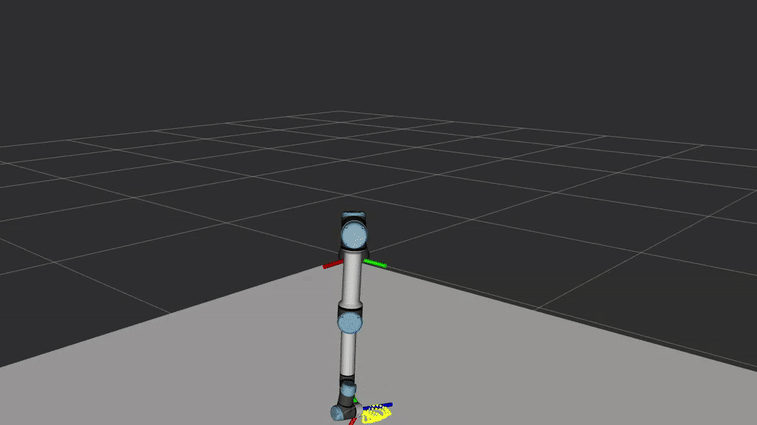

# De Código a Robot

<strong><em>Un currículo práctico de robótica, visión por computador e IA utilizando MATLAB y robots UR</em></strong>

**Código**: [https://github.com/iocroblab/from_code_to_robot.git](https://github.com/iocroblab/from_code_to_robot.git)

## Contenidos

- [Visión general](#visión-general)
    - [Objetivo general](#objetivo-general)
    - [Objetivos del proyecto](#objetivos-del-proyecto)
    - [Público objetivo](#público-objetivo)
    - [Características principales](#características-principales)
    - [Flexibilidad educativa](#flexibilidad-educativa)
- [Principales resultados de aprendizaje](#principales-resultados-de-aprendizaje)
- [Estructura del currículo](#estructura-del-currículo)
    - [Robótica](#robótica)
    - [Visión por computador](#visión-por-computador)
    - [Inteligencia artificial](#inteligencia-artificial)
- [Requisitos de software](#requisitos-de-software)
- [Créditos](#créditos)
- [Acerca del proyecto](#acerca-del-proyecto)

# Visión general

**From Code to Robot** es un currículo abierto, modular y práctico diseñado para enseñar los fundamentos de:

- 🤖 Robótica  
- 👁️ Visión por computador  
- 🧠 Inteligencia artificial  

utilizando **MATLAB** y manipuladores **Universal Robots (UR)**.

El proyecto combina teoría con experimentación práctica mediante simulación, plataformas robóticas reales y scripts ejecutables de MATLAB. Está pensado para cursos de grado y máster en:

- Ingeniería Industrial  
- Robótica  
- Informática  
- Automatización y Control  
- Inteligencia Artificial  

El currículo está organizado como una colección flexible de tutoriales, demostraciones, ejercicios y proyectos que los instructores pueden adaptar fácilmente a diferentes cursos y niveles académicos.

## Objetivo general

Proporcionar a los estudiantes un marco práctico e interdisciplinar para diseñar, simular, percibir, planificar y ejecutar tareas robóticas utilizando herramientas modernas de robótica, visión por computador e inteligencia artificial.

El currículo conecta la teoría con aplicaciones robóticas reales mediante ejercicios prácticos reproducibles utilizando MATLAB y robots UR.

## Objetivos del proyecto

- Desarrollar materiales docentes abiertos para la educación en robótica
- Promover el aprendizaje interdisciplinar entre robótica, visión e IA
- Facilitar la adopción de cursos prácticos de robótica
- Apoyar la experimentación con plataformas robóticas industriales
- Publicar resultados de innovación docente e investigación educativa
- Proporcionar tutoriales, demostraciones y documentación reutilizables

## Público objetivo

- Estudiantes de ingeniería
- Investigadores en robótica
- Docentes e instructores
- Profesionales de la IA y la visión por computador
- Laboratorios que introducen educación práctica en robótica

## Características principales

✅ Aprendizaje práctico basado en proyectos  
✅ Currículo modular adaptable a muchos cursos  
✅ Integración de Robótica + Visión + IA  
✅ Flujo de trabajo centrado en MATLAB  
✅ Simulación y ejecución en robots reales  
✅ Recursos educativos abiertos  
✅ Materiales disponibles en:
    - Inglés
    - Español
    - Catalán

## Flexibilidad educativa

El currículo es intencionadamente modular.

Se puede utilizar:

- Como un curso completo interdisciplinar de robótica
- Como módulos independientes en cursos de robótica, visión o IA
- En programas de grado o máster
- En sesiones de laboratorio, proyectos o tutoriales

Esta flexibilidad permite a los instructores adaptar los materiales a sus propios objetivos docentes y estructuras de curso.

---

# Principales resultados de aprendizaje

Después de completar el currículo, los estudiantes serán capaces de:

- Modelar y controlar manipuladores robóticos
- Resolver problemas de cinemática directa e inversa
- Planificar trayectorias y analizar el movimiento del robot
- Comprender la dinámica del robot y el control descentralizado
- Entrenar y validar modelos de detección de objetos utilizando YOLOv8
- Construir conjuntos de datos y aplicar técnicas de aumento de datos
- Integrar percepción con manipulación robótica
- Implementar planificación de tareas robóticas utilizando Reinforcement Learning
- Diseñar comportamientos robóticos inteligentes utilizando Q-learning y Deep Q-learning
- Conectar la toma de decisiones basada en IA con la ejecución robótica
- Desarrollar pipelines robóticas completas desde la percepción hasta la acción

---

# Estructura del currículo

El currículo está organizado en tres pilares interconectados.

---

## Robótica

Este módulo introduce los fundamentos de los manipuladores robóticos mediante simulaciones en MATLAB y experimentos con robots UR.

### Temas tratados

- Modelado con parámetros DH
- Cinemática directa e inversa
- Cinemática diferencial y jacobianos
- Singularidades y redundancia
- Planificación de trayectorias
- Modelado dinámico
- Control de movimiento
- Simulación con Simulink

### Componentes prácticos

- MATLAB live scripts 
- Symbolic Math Toolbox
- Robotics System Toolbox
- Modelos de Simulink
- Simulaciones con UR3 utilizando:
    - entorno ROS 2 Jazzy reproducible basado en Docker.
- Experimentos con robot real utilizando:
    - Universal Robots Support Package

### Resultados de aprendizaje

Los estudiantes aprenden a modelar matemáticamente, simular y controlar manipuladores robóticos industriales en escenarios realistas.

---

## Visión por computador

Este módulo se centra en la detección de objetos y la percepción robótica utilizando técnicas de aprendizaje profundo.

### Temas tratados

- Detección de objetos con YOLOv8
- Generación y anotación de conjuntos de datos
- Etiquetado de bounding boxes
- Aumento de datos
- Transfer learning
- Entrenamiento y validación de modelos
- Calibración de cámara
- Transformación de coordenadas de visión a robot

### Componentes prácticos

- MATLAB Deep Learning Toolbox
- Transfer learning con modelos YOLOv8 preentrenados
- Integración con tareas de manipulación robótica
- Detección de objetos personalizados para la interacción con el robot

### Resultados de aprendizaje

Los estudiantes aprenden a entrenar sistemas de visión capaces de detectar objetos y proporcionar información espacial para la manipulación robótica.

---

## Inteligencia artificial

Este módulo introduce la planificación de tareas robóticas utilizando técnicas de Reinforcement Learning.

### Temas tratados

- Representaciones STRIPS
- Planificación de tareas
- Q-learning
- Deep Q-learning
- Toma de decisiones secuencial
- Poda de acciones
- Comportamientos robóticos inteligentes

### Componentes prácticos

- MATLAB Reinforcement Learning Toolbox
- Pipelines de planificación conectadas a la ejecución del robot
- Secuenciación de tareas guiada por IA
- Integración con los módulos de robótica y visión por computador

### Resultados de aprendizaje

Los estudiantes aprenden cómo los robots pueden tomar decisiones de forma autónoma, optimizar la ejecución de tareas y planificar comportamientos complejos.

---

# Requisitos de software 

El currículo se basa en MATLAB y varios toolboxes de MathWorks para robótica, visión por computador e inteligencia artificial.

## Software recomendado

- MATLAB (versión recomendada: R2025a o R2025b)
- Simulink

## Toolboxes de MATLAB

- Robotics System Toolbox
- Symbolic Math Toolbox
- Deep Learning Toolbox
- Reinforcement Learning Toolbox
- Computer Vision Toolbox
- Image Processing Toolbox

## Hardware sugerido

- Manipuladores Universal Robots UR3 / UR5
- Cámara RGB

---

# Créditos

**From Code to Robot** es un proyecto desarrollado en la Universitat Politècnica de Catalunya y financiado por MathWorks y Universal Robots.

## Desarrolladores

1. **Robótica**

    - Constantin Sul (Universitat Politècnica de Catalunya)
    - Prof. Jan Rosell (Universitat Politècnica de Catalunya)

2. **Visión por computador e Inteligencia artificial**

    - Noel Nathan Planell (Universitat Politècnica de Catalunya)
    - Prof. Isiah Zaplana (Universitat Politècnica de Catalunya)

## Asesores

- Jennifer Gago (MathWorks)
- Carlos Pérez (Universal Robots)

---

# Acerca del proyecto

**Versión actual**: 0.0.1

# Ejemplos

Elipsoide de manipulabilidad

<!--   -->

  

Control de par

<!--  -->

  

