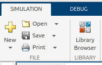
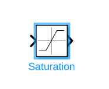
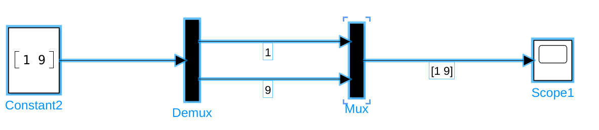
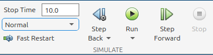
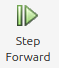

# Simulink 
# Cómo añadir bloques 

En Simulink, haz doble clic en un campo vacío y busca el bloque que quieras insertar en tu planta.  

Como alternativa, puedes navegar por la biblioteca de bloques. Ve a la pestaña Simulation y haz clic en Library Browser. 

Se abrirá el navegador, desde donde puedes arrastrar los bloques deseados a tu planta. 

# Conectar bloques

Para conectar bloques, simplemente selecciona el cable de señal o la salida del bloque y la entrada del bloque deseado. 

# Formatear bloques

Puedes cambiar la apariencia de los bloques formateándolos. 

-  Haz clic derecho en un bloque y despliega la pestaña Format. Desde aquí puedes rotar o voltear el bloque.  
-  Puedes cambiar el tamaño de un bloque arrastrando una de sus esquinas.  

# Formatear la planta

Puedes seleccionar una sección de tu modelo y arrastrarla para crear más espacio; las líneas de señal permanecerán intactas y se extenderán/retraerán. 

Puedes arrastrar las líneas de señal para que la planta sea más fácil de leer. 

# Herramientas y bloques que usar

En Simulink puedes usar una variedad de bloques diferentes para conseguir el comportamiento deseado. A continuación presentaremos algunos bloques que puedes usar para resolver los ejercicios de este currículo. (¡Las soluciones alternativas no son incorrectas!)

### Constant

Constant te permite insertar un escalar o array numérico, que también puedes cargar desde tu espacio de trabajo. 

### Sum

El bloque Sum te permite sumar o restar señales entre sí. Cambiando la configuración dentro del bloque puedes aumentar la cantidad de señales que se van a procesar. Añadiendo un | puedes cambiar las posiciones de las entradas. 

### Scope

El bloque Scope te permite visualizar las trayectorias de tus señales. Haz clic encima o debajo de una entrada para crear una entrada de señal adicional. Puedes eliminarla seleccionando la entrada y pulsando "del"

### Matrix Multiply

Para multiplicar matrices (matriz como entrada). También puede usarse para multiplicar una matriz por un vector. 

### Gain

Tiene una ganancia estática. Puede cargarse desde el espacio de trabajo mediante el nombre de una variable. 

Permite valores escalares y matrices como ganancia. 

Selecciona la opción de multiplicación deseada para tu aplicación. 

### MatlabFunction

Permite usar código dentro de Simulink. Define entradas y salidas en la declaración de la función. 

### Saturation

Este bloque se usa para limitar una señal. Define el límite superior e inferior permitido. 

Puede tomar un vector como límites (correspondiente al tamaño del vector de entrada). 

### Mux/Demux

Los bloques Mux y Demux pueden usarse para separar o combinar señales en un vector. 

# Ejecutar una simulación 

Ve a la sección Simulation. La verás bajo la pestaña SIMULATE. 

Para ejecutar una simulación, primero debes establecer la duración deseada de la simulación. 

Establece un número positivo o inf para una ejecución continua. 

Para iniciar la simulación, pulsa Run 

También puedes simular paso a paso pulsando el botón Step Forward. Sin embargo, esto es más útil en aplicaciones offline. 

Una vez en ejecución, puedes pausar o detener la simulación pulsando: 

