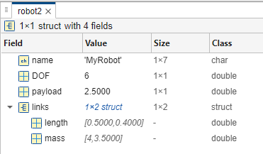

```matlab
clear all;
```
# Estructuras en MATLAB

En este tutorial explicaremos qué son las estructuras de MATLAB y cómo trabajar con ellas.


Activa "Output inline" en el lado derecho de tu barra de desplazamiento. 


 

# Crear una estructura simple

Una estructura es un tipo de dato que agrupa datos relacionados usando campos con nombre.


Puedes crear una usando asignación directa o con la función struct.

```matlab
robot.name      = 'MyRobot';
robot.DOF       = 6;
robot.payload   = 2.5           
```

```matlabTextOutput
robot = struct with fields:
       name: 'MyRobot'
        DOF: 6
    payload: 2.5000

```


Creación equivalente con struct()

```matlab
robot2 = struct('name','MyRobot', ...
    'DOF',6, ...
    'payload',2.5)
```

```matlabTextOutput
robot2 = struct with fields:
       name: 'MyRobot'
        DOF: 6
    payload: 2.5000

```

# Estructuras anidadas

Las estructuras pueden contener otras estructuras, lo que permite datos jerárquicos.

```matlab
robot2.links(1) = struct('length',0.5,'mass',4.0)
```

```matlabTextOutput
robot2 = struct with fields:
       name: 'MyRobot'
        DOF: 6
    payload: 2.5000
      links: [1x1 struct]

```

```matlab
robot2.links(2) = struct('length',0.4,'mass',3.5)
```

```matlabTextOutput
robot2 = struct with fields:
       name: 'MyRobot'
        DOF: 6
    payload: 2.5000
      links: [1x2 struct]

```




# Acceder a campos

Se accede a los campos con notación de punto: NombreEstructura.NombreCampo

## Leer un campo
```matlab
robotName=robot.name
```

```matlabTextOutput
robotName = 'MyRobot'
```

## Escribir/actualizar un campo
```matlab
robot.payload = 3.0
```

```matlabTextOutput
robot = struct with fields:
       name: 'MyRobot'
        DOF: 6
    payload: 3

```

## Acceder a un campo anidado
```matlab
link1_length = robot2.links(1).length
```

```matlabTextOutput
link1_length = 0.5000
```

```matlab
robot2.links(2).length = 0.8;
```
# Nombres de campo dinámicos

Puedes añadir campos o acceder a ellos con nombres de variables usando paréntesis.

```matlab
newfield = 'maxSpeed';
robot.(newfield) = 1.2;               % añade un nuevo campo maxSpeed
```
## Comprobar la existencia antes de acceder
```matlab
if isfield(robot, newfield)
    RobotMaxSpeed = robot.maxSpeed
end
```

```matlabTextOutput
RobotMaxSpeed = 1.2000
```

# Añadir y eliminar campos

Usa setfield y rmfield, o manipulación directa.


Añadir un campo

```matlab
robot = setfield(robot, 'manufacturer', 'UniversalRobots')
```

```matlabTextOutput
robot = struct with fields:
            name: 'MyRobot'
             DOF: 6
         payload: 3
        maxSpeed: 1.2000
    manufacturer: 'UniversalRobots'

```


Eliminar un campo

```matlab
robot = rmfield(robot, 'manufacturer')
```

```matlabTextOutput
robot = struct with fields:
        name: 'MyRobot'
         DOF: 6
     payload: 3
    maxSpeed: 1.2000

```