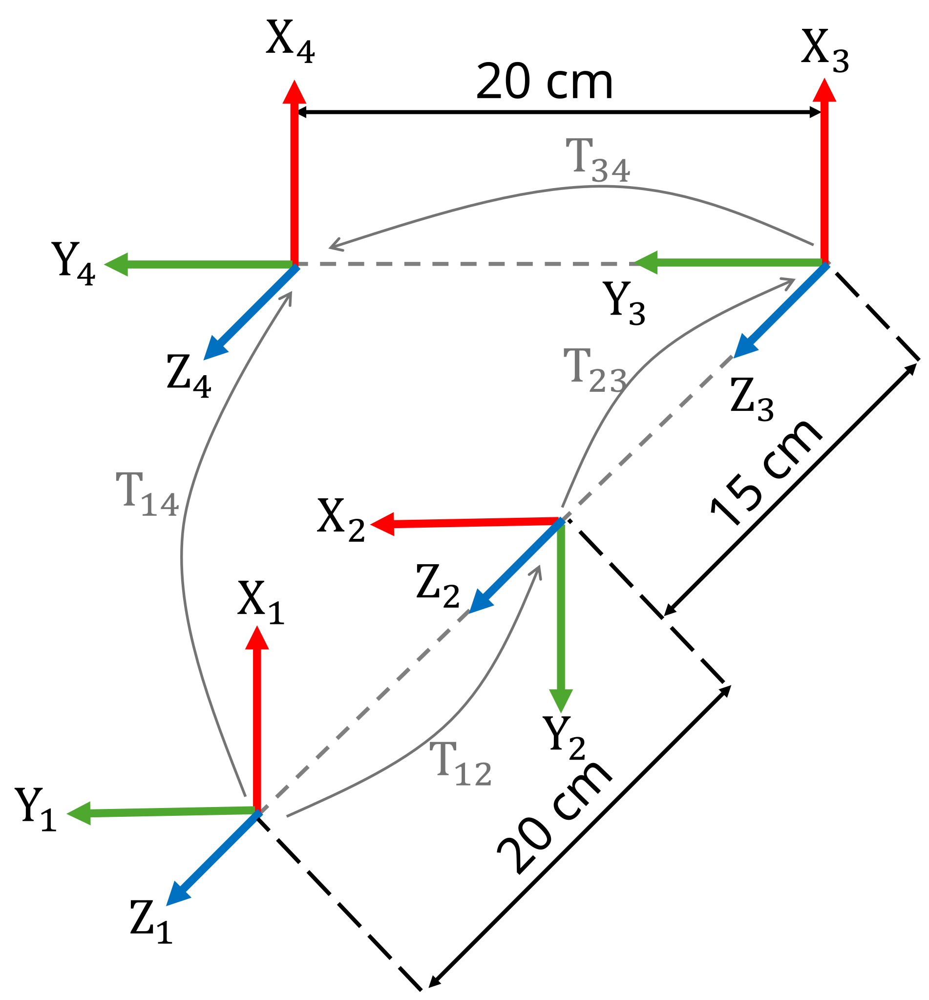

```matlab
clear all; 
```
# Ejercicio 1.1 \- Encontrar las transformaciones

En este ejercicio tendrás que encontrar transformaciones entre sistemas de coordenadas. 


¡Guarda tus soluciones en las variables predefinidas!

# Descripción de la tarea:

Dado este conjunto de sistemas de coordenadas:





Responde todas las preguntas y guarda tu solución en la variable correcta

# Tarea 1
1.  Encuentra las transformaciones homogéneas entre los sistemas 1 y 2
2. Encuentra las transformaciones homogéneas entre los sistemas 2 y 3
3. Encuentra las transformaciones homogéneas entre los sistemas 3 y 4

Usa las siguientes variables para guardar tu solución:

-  T12 (transformación homogénea del sistema 1 al sistema 2) 
-  T23 (transformación homogénea del sistema 2 al sistema 3) 
-  T34 (transformación homogénea del sistema 3 al sistema 4) 
```matlab
T12 = [];  
T23 = []; 
T34 = [];  
```

Puedes comprobar tu trabajo haciendo clic en Run: 

```matlab
 
check_exercise('1-1-1')
```

```matlabTextOutput
Checking exercise 1-1-1: Check a homogeneous transformation matrix

Checking variables:
 
Checking Variable T12
[OK] T12 is of type double
[OK] T12 correct

Checking Variable T23
[OK] T23 is of type double
[OK] T23 correct

Checking Variable T34
[OK] T34 is of type double
[OK] T34 correct
```

# Tarea 2
1.  Encuentra la transformación homogénea entre el sistema 1 y el sistema 4.
2. Encuentra el origen del sistema 4 respecto al sistema 1.

Usa las siguientes variables para guardar tu solución: 

-  T14 (transformación homogénea del sistema 1 al sistema 4) 
-  origin14 (vector que contiene las coordenadas xyz) 
```matlab
T14 = []; 
origin14 = []; 
```

Puedes comprobar tu trabajo haciendo clic en Run: 

```matlab
 
check_exercise('1-1-2')
```

```matlabTextOutput
Checking exercise 1-1-2: Check transform and position of origin

Checking variables:
 
Checking Variable T14
[OK] T14 is of type double
[OK] T14 correct

Checking Variable origin14
[OK] origin14 is of type double
[OK] origin14 correct
```

# Tarea 3
1.  Encuentra la transformación homogénea del sistema 4 al sistema 1.
2. Da el origen del sistema 1 respecto al sistema 4.

Usa las siguientes variables para guardar tu solución: 

-  T41 (transformación homogénea del sistema 4 al sistema 1) 
-  origin41 (vector que contiene las coordenadas xyz) 
```matlab
T41 = []; 
origin41 = []; 
```

Puedes comprobar tu trabajo haciendo clic en Run: 

```matlab
 
check_exercise('1-1-3')
```

```matlabTextOutput
Checking exercise 1-2: Check a homogeneous transformation matrix

Checking variable structure:
[FAIL] TB0 not found in workspace
[FAIL] TB1 not found in workspace

 Running 1 functional test(s):

Test 1: Checking Transform TB0
```

# Tarea 4

Calibra la cámara y encuentra la ubicación del objeto respecto al sistema mundo. 


Observa la siguiente configuración: 


Para calibrar la cámara queremos localizarla respecto al sistema mundo.


Sabes que la posición y orientación relativas del sistema mundo al marcador de calibración son:

 $$ T_{\textrm{WC}} =\left\lbrack \begin{array}{cccc} 0 & -1 & 0 & 0\ldotp 14\newline 1 & 0 & 0 & 0\ldotp 25\newline 0 & 0 & 1 & 0\newline 0 & 0 & 0 & 1 \end{array}\right\rbrack $$ 

A partir de la imagen de la cámara puedes obtener la posición relativa entre la cámara y el marcador de calibración: 

 $$ T_{\textrm{CamC}} =\left\lbrack \begin{array}{cccc} 0\ldotp 9397 & -0\ldotp 2620 & 0\ldotp 2198 & -0\ldotp 3237\newline 1 & -0\ldotp 6428 & -0\ldotp 766 & 0\ldotp 4655\newline 0\ldotp 342 & 0\ldotp 7198 & -0\ldotp 604 & 0\ldotp 4507\newline 0 & 0 & 0 & 1 \end{array}\right\rbrack $$ 

A partir de la imagen de la cámara también puedes obtener la posición relativa entre la cámara y el objeto deseado: 

 $$ T_{\textrm{CamO}} =\left\lbrack \begin{array}{cccc} 0\ldotp 9397 & -0\ldotp 2620 & 0\ldotp 2198 & -0\ldotp 0893\newline 1 & -0\ldotp 6428 & -0\ldotp 766 & 0\ldotp 4749\newline 0\ldotp 342 & 0\ldotp 7198 & -0\ldotp 604 & 0\ldotp 3916\newline 0 & 0 & 0 & 1 \end{array}\right\rbrack $$ 

1.  Encuentra la transformación entre el mundo y la cámara
2. Encuentra la transformación entre el mundo y el objeto

Usa las siguientes variables para guardar tu solución: 

-  TWCam (transformación homogénea del sistema mundo al sistema cámara) 
-  TWO (transformación homogénea del mundo al objeto) 
```matlab
TWC = [
    0  -1   0   0.14;
    1   0   0   0.25;
    0   0   1   0 ;
    0   0   0   1];

TCamC = [
    0.9397    -0.2620     0.2198     -0.3237;
    0        -0.6428     -0.766    0.4655 ;
    0.342    0.7198         -0.604    0.4507 ;
    0        0             0        1];

TCamO = [
    0.9397    -0.2620     0.2198     -0.0893 ;
    0        -0.6428     -0.766    0.4749 ;
    0.342    0.7198         -0.604    0.3916;
    0        0             0        1];

TWCam = [];

TWO = [];
```

Puedes comprobar tu trabajo haciendo clic en Run: 

```matlab
 
check_exercise('1-1-4')
```