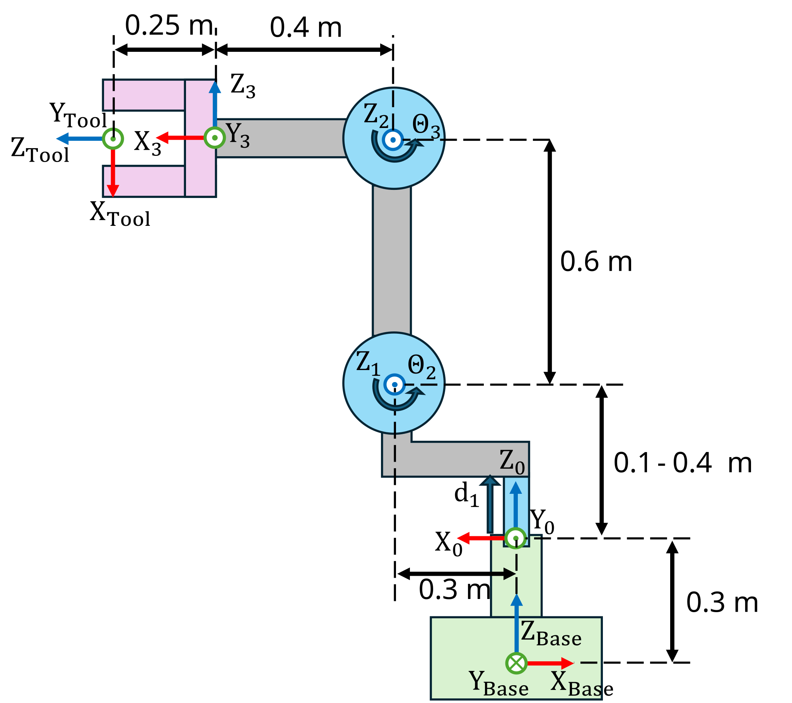

```matlab
clear all; 
```
# Ejercicio 1.3 \- Encontrar los parámetros DH

En este ejercicio calcularás los parámetros DH de un manipulador robótico arbitrario, configurarás las ecuaciones usando la toolbox simbólica y definirás el robot usando la Robotic System Toolbox. 


¡Guarda tus soluciones en las variables predefinidas!

# Descripción de la tarea:

Encuentra los parámetros DH y las transformaciones homogéneas para describir el siguiente manipulador robótico:





Responde todas las preguntas y guarda tu solución en la variable correcta

# Tarea 1
1.  Define variables simbólicas reales para cada articulación (q1, ..., qn)
2. Guárdalas en un array columna (q)
3. Define los límites de posición para cada una de las articulaciones; para las articulaciones rotativas el límite es $\pm 2\pi \;$ (limit\_1, ..., limit\_n)

Usa las siguientes variables para guardar tu solución:

-  qi (posición articular de la articulación i) 
-  q (un array con todos los estados articulares simbólicos) 
-  limit\_i (array con el valor articular mínimo y máximo permitido) 
```matlab
q=[];
limit_1=[];
```

Puedes comprobar tu trabajo haciendo clic en Run: 

```matlab
 
check_exercise('1-3-1')
```
# Tarea 2
1.  Calcula los parámetros DH, incluye las articulaciones simbólicas en su posición correcta.
2. Calcula la transformación homogénea entre la base y la primera articulación (TB0)
3. Calcula la transformación homogénea entre el sistema 3 y el sistema herramienta (T4tool)

Puedes usar la función dh2tf(DH) para obtener la transformación homogénea a partir de una fila de parámetros DH. 


Usa las siguientes variables para guardar tu solución:

-  DH (a , alpha, d, theta) 
-  TB0 (transformación homogénea de la base al sistema 0) 
-  T3tool 
```matlab
DH=[
   %a       alpha       d       theta

   ];
TB0 = [];
T3tool = []; 
```

Puedes comprobar tu trabajo haciendo clic en Run: 

```matlab
 
check_exercise('1-3-2')

```
# Tarea 3
1.  Configura el robot usando la Robotic System Toolbox
2. Define el formato de datos como column

usa los siguientes nombres:

-  body\_base (nombre del cuerpo para el desplazamiento de la base) 
-  base\_link (nombre de la articulación para body\_base) 
-  body\_1, ..., body\_n (cuerpos para articulaciones) 
-  joint\_1, ..., joint\_n (articulaciones del robot) 
-  tool (nombre del cuerpo de la herramienta) 
-  tool\_link (nombre de la articulación para el cuerpo de la herramienta) 

Usa las siguientes variables para guardar tu solución:

-  robot (nombre de tu robot) 
-  bodies (array de celdas que contiene todos los cuerpos) 
-  joints (array de celdas que contiene todas las articulaciones) 

Nota: 


Para usar tus parámetros DH configurados previamente, necesitas convertirlos a double. Usa la función subs() para sustituir tus variables simbólicas por valores numéricos. Recuerda que la toolbox ignorará cualquier elemento en el campo controlado (por ejemplo, theta para articulaciones rotativas)

```matlab
bodies = [];
joints = []; 
robot = [];
```

Puedes comprobar tu trabajo haciendo clic en Run: 

```matlab
 
check_exercise('1-3-3')
```
# Tarea 4
1.  Establece la configuración inicial para que el robot coincida con la imagen (usa el límite inferior para la primera articulación)
2. Establece los límites articulares


Puedes comprobar tu trabajo haciendo clic en Run: 

```matlab
 
check_exercise('1-3-4')
```