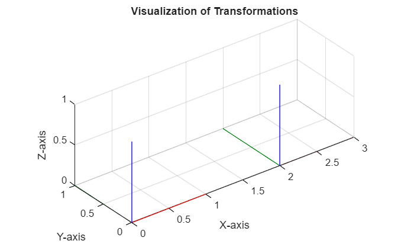
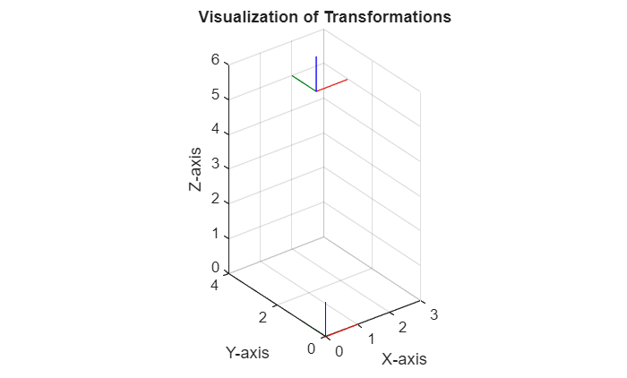
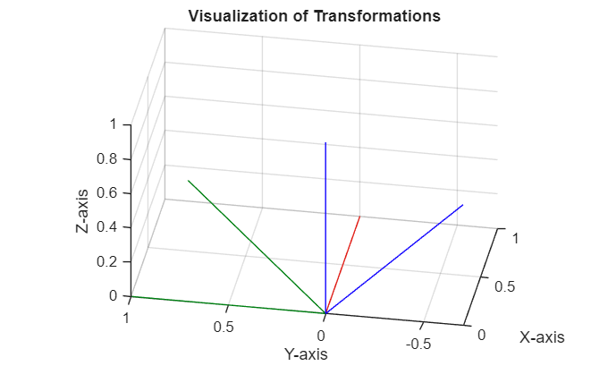
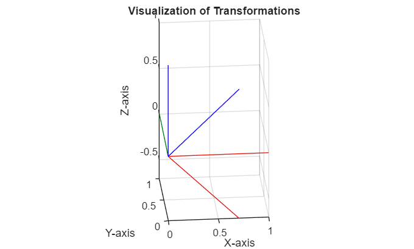
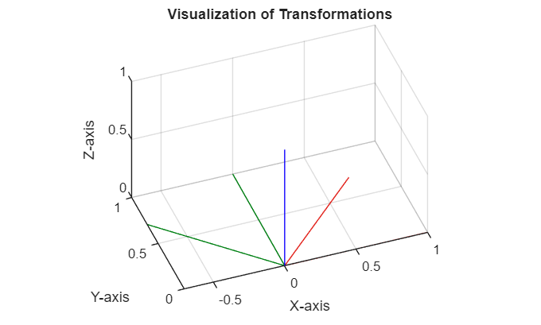
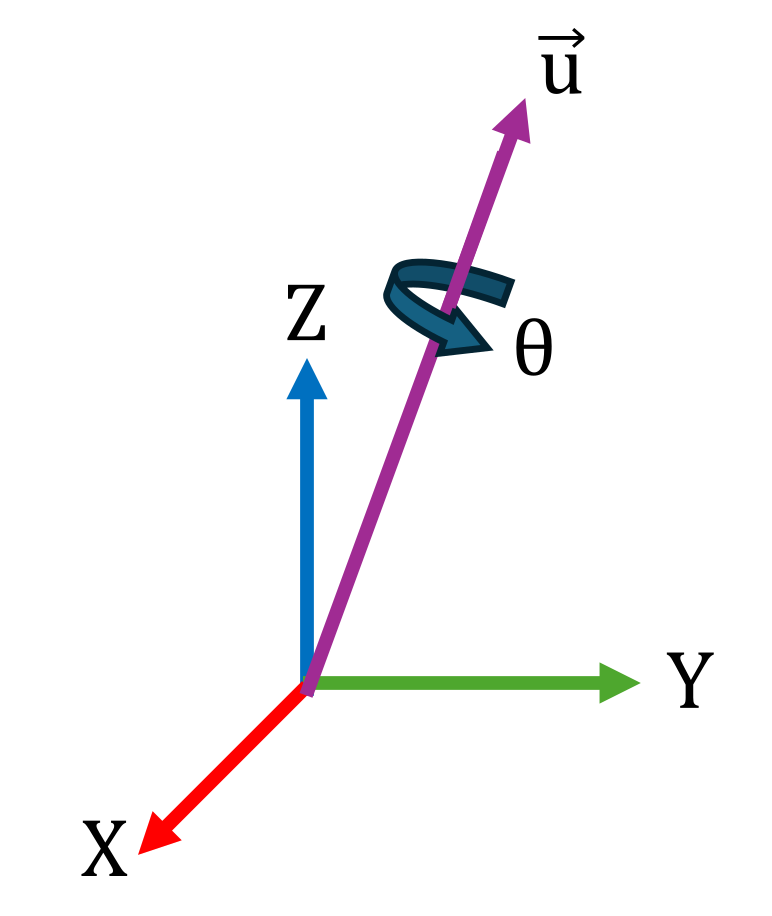

# Conceptos básicos de traslación y rotación
# Introducción

En esta sección aprenderás cómo representar traslaciones y rotaciones en un espacio 3D. 


Después de entender las ideas básicas de traslación y rotación, las combinaremos en matrices de transformación homogénea, que serán la base del siguiente tutorial. 

# Traslación

Las traslaciones se representan mediante un vector de las mismas dimensiones que el espacio de tarea ${\mathbb{R}}^n \to {\mathbb{R}}^n$ 


Una traslación a lo largo del eje x puede representarse mediante $\left\lbrack \begin{array}{c} \Delta \;x\newline 0\newline 0 \end{array}\right\rbrack$. Ten en cuenta que los valores son respecto al sistema de origen. 

```matlab
visualizeTranslation([2,0,0]);
```



Para una traslación a lo largo de todos los ejes, el vector será $\left\lbrack \begin{array}{c} \Delta \;x\newline \Delta \;y\newline \Delta \;z \end{array}\right\rbrack$. Ten en cuenta que los valores son respecto al sistema de origen. 

```matlab
visualizeTranslation([2,3,5]);
```




Con el siguiente código, puedes crear un nuevo sistema y dar a conocer su ubicación. La función `transl()` define un nuevo sistema de coordenadas cuyo origen está desplazado (trasladado) respecto a su sistema padre (punto de partida) las distancias proporcionadas. A continuación, `TargetFrameBroadcaster` publica este nuevo sistema. Fija valores entre \-1 y 1.

```matlab
x_trans=0.34
```

```matlabTextOutput
x_trans = 0.4400
```

```matlab
y_trans=0.02
```

```matlabTextOutput
y_trans = 0.0200
```

```matlab
z_trans=0.62
```

```matlabTextOutput
z_trans = 0.6200
```

```matlab

TargetFrameBroadcaster(transl([x_trans,y_trans,z_trans]),'my_frame')
```

```matlabTextOutput
TargetFrameBroadcaster is not found in the current folder or on the MATLAB path, but exists in:
    /home/janrosell/git-projects/from-code-to-robot/from-code-to-robot/robotics/Ros/Functions

Change the MATLAB current folder or add its folder to the MATLAB path.
```

## Obtener el vector de traslación

Podemos calcular el vector de traslación restando los orígenes de los sistemas de coordenadas como: 

 $$ \textrm{vector}\;\textrm{de}\;\textrm{traslación}=\textrm{sistema}\;\textrm{objetivo}-\textrm{sistema}\;\textrm{origen}\; $$ 

para el ejemplo anterior: 

 $$ \left\lbrack \begin{array}{c} t_x \newline t_y \newline t_z  \end{array}\right\rbrack =\left\lbrack \begin{array}{c} 2\newline 3\newline 5 \end{array}\right\rbrack -\left\lbrack \begin{array}{c} 0\newline 0\newline 0 \end{array}\right\rbrack =\left\lbrack \begin{array}{c} 2\newline 3\newline 5 \end{array}\right\rbrack $$ 
# Rotaciones

Las rotaciones pueden representarse de varias formas diferentes. Vamos a trabajar con una representación matricial, donde $R\in {\mathbb{R}}^{3x3}$ 


El ángulo de rotación para un movimiento en sentido antihorario es positivo (usa la regla de la mano derecha). 


## Cómo definir una rotación simple

Podemos usar funciones predefinidas para obtener estas matrices para una rotación dada. 

```matlab
syms alpha beta gamma 
Rx=rotx(alpha)
```
Rx = 

  $$ \displaystyle \left(\begin{array}{ccc} 1 & 0 & 0\newline 0 & \cos \left(\alpha \right) & -\sin \left(\alpha \right)\newline 0 & \sin \left(\alpha \right) & \cos \left(\alpha \right) \end{array}\right) $$ 
 

```matlab
visualizeRotation(double(subs(Rx, alpha, pi/4)),'x') %alpha = 45° = pi/4
```



```matlab
Ry=roty(beta)
```
Ry = 

  $$ \displaystyle \left(\begin{array}{ccc} \cos \left(\beta \right) & 0 & \sin \left(\beta \right)\newline 0 & 1 & 0\newline -\sin \left(\beta \right) & 0 & \cos \left(\beta \right) \end{array}\right) $$ 
 

```matlab
visualizeRotation(double(subs(Ry, beta, pi/4)),'y') %beta = 45° = pi/4
```



```matlab
Rz=rotz(gamma)
```
Rz = 

  $$ \displaystyle \left(\begin{array}{ccc} \cos \left(\gamma \right) & -\sin \left(\gamma \right) & 0\newline \sin \left(\gamma \right) & \cos \left(\gamma \right) & 0\newline 0 & 0 & 1 \end{array}\right) $$ 
 

```matlab
visualizeRotation(double(subs(Rz, gamma, pi/4)), 'z') %gamma = 45° = pi/4
```



Multiplicar estas rotaciones entre sí nos da rotaciones complejas en el espacio 3D. 


El orden de las rotaciones individuales es importante para la matriz final, ya que cada rotación consecutiva se refiere al nuevo sistema de coordenadas. 

```matlab
clear all; 
```
## Notación de rotación

En robótica a menudo necesitamos cambiar entre diferentes formas de describir una rotación 3D. En lugar de dar una matriz completa, podemos representar cualquier rotación mediante un conjunto de ángulos y un orden específico. 


Las principales representaciones son:

## **Ángulos de Euler (ZYZ)**

También llamados ángulos de Euler de **ejes móviles** (ϕ,  θ,  ψ), ya que las rotaciones giran alrededor del eje actualizado:

1.  Rota ϕ alrededor del z original.
2. Rota θ alrededor del nuevo y.
3. Rota ψ alrededor del z más reciente.
```matlab
syms phi theta psi
R = rotz(phi) * roty(theta) * rotz(psi)
```
R = 

  $$ \displaystyle \left(\begin{array}{ccc} \cos \left(\phi \right)\,\cos \left(\psi \right)\,\cos \left(\theta \right)-\sin \left(\phi \right)\,\sin \left(\psi \right) & -\cos \left(\psi \right)\,\sin \left(\phi \right)-\cos \left(\phi \right)\,\cos \left(\theta \right)\,\sin \left(\psi \right) & \cos \left(\phi \right)\,\sin \left(\theta \right)\newline \cos \left(\phi \right)\,\sin \left(\psi \right)+\cos \left(\psi \right)\,\cos \left(\theta \right)\,\sin \left(\phi \right) & \cos \left(\phi \right)\,\cos \left(\psi \right)-\cos \left(\theta \right)\,\sin \left(\phi \right)\,\sin \left(\psi \right) & \sin \left(\phi \right)\,\sin \left(\theta \right)\newline -\cos \left(\psi \right)\,\sin \left(\theta \right) & \sin \left(\psi \right)\,\sin \left(\theta \right) & \cos \left(\theta \right) \end{array}\right) $$ 
 

También podemos usar las funciones integradas para valores numéricos:

```matlab
Angles = [phi, theta, psi]; 
Angles_num = double(subs(Angles, [phi, theta, psi], [pi/2, pi/3, pi/4]));
R_func = eul2rotm(Angles_num, "ZYZ")
```

```matlabTextOutput
R_func = 3x3
   -0.7071   -0.7071    0.0000
    0.3536   -0.3536    0.8660
   -0.6124    0.6124    0.5000

```

### Calcular ángulos de Euler a partir de una matriz de rotación

Para el problema inverso (calcular los ángulos a partir de una matriz de rotación), podemos resolverlo analíticamente: 

 $$ R=\left\lbrack \begin{array}{ccc} r_{11}  & r_{12}  & r_{13} \newline r_{21}  & r_{22}  & r_{23} \newline r_{31}  & r_{32}  & r_{33}  \end{array}\right\rbrack $$ 

 $$ \phi =\textrm{atan2}\left(r_{23} ,\;r_{13} \right)=\textrm{atan2}\left(-r_{23} ,\;-r_{13} \right) $$ 

 $$ \theta =\textrm{atan2}\left(\sqrt{\;r_{13}^2 +r_{23}^2 },r_{33} \right) $$ 

 $$ \psi =\textrm{atan2}\left(r_{32} ,\;{-r}_{31} \right)=\textrm{atan2}\left(-r_{32} ,\;r_{31} \right) $$ 


También podemos usar la función integrada rotm2eul(R, sequence) o tform2eul(T, sequence) para transformaciones homogéneas. 


Para los valores de ejemplo: 

 $$ \begin{array}{l} \phi =~0\newline \theta =\frac{\pi }{2}\newline \psi =\frac{\pi }{3} \end{array} $$ 

sustituyendo $\phi ,~\theta ~y~\psi$: 

```matlab
R_subs = double(subs(R, [phi, theta, psi], [0, pi/2, pi/3]));  
ZYZ_angles = rotm2eul(R_subs, "ZYZ")
```

```matlabTextOutput
ZYZ_angles = 1x3
   -3.1416   -1.5708   -2.0944

```


 *Ten en cuenta que una misma matriz de rotación puede obtenerse con diferentes combinaciones de ángulos de Euler. Por eso, los ángulos obtenidos no son iguales a los calculados.* 

```matlab
clear all; 
```
## Ángulos de Euler (RPY/ZYX)

También llamados **roll\-pitch\-yaw** (ejes fijos) o ángulos de Euler ZYX (roll,  pitch,  yaw). Aquí los ángulos corresponden a un sistema de referencia fijo donde: 


 $\theta_r ~=~Roll~~\Rightarrow$ Rotación alrededor del eje X


 $\theta_p ~=~Pitch~\Rightarrow$ Rotación alrededor del eje Y


 $\theta_y ~=~Yaw~~\Rightarrow$ Rotación alrededor del eje Z


Esto se consigue aplicando los ángulos en el siguiente orden:

1.  Rota $\theta_y$ alrededor del Z original.
2. Rota $\theta_p$ alrededor del Y original.
3. Rota $\theta_r$ alrededor del X original.
```matlab
syms roll pitch yaw 
R = rotz(yaw) * roty(pitch) * rotx(roll)
```
R = 

  $$ \displaystyle \left(\begin{array}{ccc} \cos \left(\textrm{pitch}\right)\,\cos \left(\textrm{yaw}\right) & \cos \left(\textrm{yaw}\right)\,\sin \left(\textrm{pitch}\right)\,\sin \left(\textrm{roll}\right)-\cos \left(\textrm{roll}\right)\,\sin \left(\textrm{yaw}\right) & \sin \left(\textrm{roll}\right)\,\sin \left(\textrm{yaw}\right)+\cos \left(\textrm{roll}\right)\,\cos \left(\textrm{yaw}\right)\,\sin \left(\textrm{pitch}\right)\newline \cos \left(\textrm{pitch}\right)\,\sin \left(\textrm{yaw}\right) & \cos \left(\textrm{roll}\right)\,\cos \left(\textrm{yaw}\right)+\sin \left(\textrm{pitch}\right)\,\sin \left(\textrm{roll}\right)\,\sin \left(\textrm{yaw}\right) & \cos \left(\textrm{roll}\right)\,\sin \left(\textrm{pitch}\right)\,\sin \left(\textrm{yaw}\right)-\cos \left(\textrm{yaw}\right)\,\sin \left(\textrm{roll}\right)\newline -\sin \left(\textrm{pitch}\right) & \cos \left(\textrm{pitch}\right)\,\sin \left(\textrm{roll}\right) & \cos \left(\textrm{pitch}\right)\,\cos \left(\textrm{roll}\right) \end{array}\right) $$ 
 

También podemos usar las funciones integradas para valores numéricos:

```matlab
RPY = [roll, pitch, yaw];
RPY_num = double(subs(RPY, [roll, pitch, yaw], [pi/2, pi/3, pi]));
R_num = eul2rotm(RPY_num, "ZYX")
```

```matlabTextOutput
R_num = 3x3
    0.0000    1.0000    0.0000
    0.5000    0.0000   -0.8660
   -0.8660    0.0000   -0.5000

```

### Calcular ángulos RPY a partir de una matriz de rotación

Para el problema inverso (calcular los ángulos a partir de una matriz de rotación), podemos resolverlo analíticamente: 

 $$ R=\left\lbrack \begin{array}{ccc} r_{11}  & r_{12}  & r_{13} \newline r_{21}  & r_{22}  & r_{23} \newline r_{31}  & r_{32}  & r_{33}  \end{array}\right\rbrack $$ 

 $$ \theta_r =\textrm{atan2}\left(r_{21} ,\;r_{11} \right)=\textrm{atan2}\left(-r_{21} ,\;-r_{11} \right) $$ 

 $$ \theta_p =\textrm{atan2}\left(-r_{31} ,\;\sqrt{\;r_{32}^2 +r_{33}^2 }\right)=\textrm{atan2}\left(-r_{31} ,\;-\sqrt{\;r_{32}^2 +r_{33}^2 }\right) $$ 

 $$ \theta_y =\textrm{atan2}\left(r_{32} ,\;r_{33} \right)=\textrm{atan2}\left(-r_{32} ,-r_{33} \right) $$ 


También podemos usar la función integrada rotm2eul(R, sequence) o tform2eul(T,sequence) para transformaciones homogéneas.  


Para los valores de ejemplo: 

 $$ \begin{array}{l} \theta_r =~0\newline \theta_p =\frac{\pi }{2}\newline \theta_y =\frac{\pi }{3} \end{array} $$ 

sustituyendo $\phi ,~\theta ~y~\psi$: 

```matlab
R_subs = double(subs(R, [roll, pitch, yaw], [0, pi/2, pi/3])); 
RPY_angles = rotm2eul(R_subs, "ZYX")
```

```matlabTextOutput
RPY_angles = 1x3
         0    1.5708   -1.0472

```


 *Ten en cuenta que una misma matriz de rotación puede obtenerse con diferentes combinaciones de ángulos de Euler. Por eso, los ángulos obtenidos no son iguales a los calculados.* 

```matlab
clear all; 
```
## Cuaterniones

Los cuaterniones proporcionan una forma de cuatro parámetros, libre de singularidades, de codificar cualquier rotación 3D.





Un cuaternión unitario se representa mediante $q=\left\lbrack w\;,x,y,z\right\rbrack$ 


con 

 $$ \begin{array}{l} w=\cos \left(\frac{\theta }{2}\right)\newline x=\sin \left(\frac{\theta }{2}\right)\cdot u_x \newline y=\sin \left(\frac{\theta }{2}\right)\cdot u_y \newline z=\sin \left(\frac{\theta }{2}\right)\cdot u_z  \end{array} $$ 

La matriz de rotación puede construirse como: 

 $$ R=\left\lbrack \begin{array}{ccc} 2\cdot \;\left(w^2 +x^2 \right)-1 & \;\;\;\;\;2\cdot \;\left(x\cdot \;y-w\cdot z\right) & \;\;\;\;\;2\cdot \;\left(x\cdot z-w\cdot y\right)\newline 2\cdot \;\left(x\cdot \;y-w\cdot z\right) & \;\;\;\;\;2\cdot \;\left(w^2 +y^2 \right)-1 & \;\;\;\;\;2\cdot \;\left(y\cdot z-w\cdot x\right)\newline 2\cdot \;\left(x\cdot z-w\cdot y\right) & \;\;\;\;\;2\cdot \;\left(y\cdot z-w\cdot x\right) & \;\;\;\;\;2\cdot \;\left(w^2 +z^2 \right)-1 \end{array}\right\rbrack $$ 

Podemos usar funciones integradas para calcular la matriz de rotación a partir de cuaterniones. Por ejemplo, un cuaternión que describe una rotación alrededor de x de 90° sería: 

 $$ \theta =\frac{\pi }{2}=90° $$ 

 $$ \vec{\;u} =\vec{\;x} =\left\lbrack \begin{array}{c} 1\newline 0\newline 0 \end{array}\right\rbrack $$ 
```matlab
q = [cos(pi/4)    1*sin(pi/4)    0    0];
RotxMat=rotx(pi/2)
```

```matlabTextOutput
RotxMat = 3x3
1.0000         0         0
         0    0.0000   -1.0000
         0    1.0000    0.0000

```

```matlab
R = quat2rotm(q)
```

```matlabTextOutput
R = 3x3
1.0000         0         0
         0    0.0000   -1.0000
         0    1.0000    0.0000

```

### Calcular cuaterniones a partir de una matriz de rotación

Para el problema inverso (calcular los ángulos a partir de una matriz de rotación), podemos resolverlo analíticamente: 

 $$ R=\left\lbrack \begin{array}{ccc} r_{11}  & r_{12}  & r_{13} \newline r_{21}  & r_{22}  & r_{23} \newline r_{31}  & r_{32}  & r_{33}  \end{array}\right\rbrack $$ 

 $$ w=\frac{1}{2}\cdot \sqrt{\;r_{11} +r_{22} +r_{33} +1} $$ 

 $$ x=\frac{r_{32} -r_{23} }{4\cdot \;w} $$ 

 $$ y=\frac{r_{13} -r_{31} }{4\cdot \;w} $$ 

 $$ z=\frac{r_{21} -r_{12} }{4\cdot \;w} $$ 
### **Casos especiales**

El problema principal se encuentra cuando la traza de la matriz (suma de los elementos diagonales) es menor o igual que 0. Si es así, los cálculos deben ajustarse; de lo contrario, podrías acabar con números imaginarios para w o con una división por 0 al calcular x/y/z. 


Para evitarlo, primero debes identificar el mayor elemento diagonal y luego calcular un factor de escala (S)

 $$ {\mathit{\mathbf{r}}}_{11} >{\mathit{\mathbf{r}}}_{22} \;\;\textrm{and}\;{\mathit{\mathbf{r}}}_{11} >{\mathit{\mathbf{r}}}_{33} $$ 

 $$ S=2\cdot \sqrt{1+\;r_{11} -r_{22} -r_{33} }=4\cdot x $$ 

 $$ w=\frac{r_{32} -r_{23} }{S} $$ 

 $$ x=\frac{1}{2}\cdot \sqrt{1+\;r_{11} -r_{22} -r_{33} }=0\ldotp 25\cdot S $$ 

 $$ y=\frac{r_{12} +r_{21} }{S}\;\; $$ 

 $$ z=\frac{r_{13} +r_{31} }{S}\;\; $$ 

 $$ {\mathit{\mathbf{r}}}_{22} >{\mathit{\mathbf{r}}}_{11} \;\;\textrm{and}\;{\mathit{\mathbf{r}}}_{22} >{\mathit{\mathbf{r}}}_{33} $$ 

 $$ S=2\cdot \sqrt{1+\;r_{22} -r_{11} -r_{33} }=4\cdot y $$ 

 $$ w=\frac{r_{13} -r_{31} }{S} $$ 

 $$ x=\frac{r_{12} +r_{21} }{S} $$ 

 $$ y=0\ldotp 25\cdot S $$ 

 $$ z=\frac{r_{23} +r_{32} }{S}\;\; $$ 

 $$ {\mathit{\mathbf{r}}}_{33} >{\mathit{\mathbf{r}}}_{11} \;\;\textrm{and}\;{\mathit{\mathbf{r}}}_{33} >{\mathit{\mathbf{r}}}_{22} $$ 

 $$ S=2\cdot \sqrt{1+\;r_{33} -r_{11} -r_{22} }=4\cdot z $$ 

 $$ w=\frac{r_{21} -r_{12} }{S} $$ 

 $$ x=\frac{r_{13} +r_{31} }{S} $$ 

 $$ y=\frac{r_{23} +r_{32} }{S} $$ 

 $$ z=0\ldotp 25\cdot S\;\; $$ 
### Implementación de la toolbox

También podemos usar la función integrada rotm2quat(R) para calcular los cuaterniones a partir de una matriz de rotación

```matlab
q=rotm2quat(R)
```

```matlabTextOutput
q = 1x4
    0.7071    0.7071         0         0

```

```matlab
clear all; 
```
# Transformaciones homogéneas

Las transformaciones homogéneas nos permiten codificar una traslación y una rotación en una sola matriz de la forma: 

 $$ T=\left\lbrack \begin{array}{ccccc}  &  &  & | & \newline  & R\in {\mathbb{R}}^{3\textrm{x3}}  &  & | & t\in {\mathbb{R}}^{3\textrm{x1}} \newline  &  &  & | & \newline -- & -- & -- & + & --\newline 0 & 0 & 0 & | & 1 \end{array}\right\rbrack =\left\lbrack \begin{array}{cccc} r_{11}  & r_{12}  & r_{13}  & \Delta \;x\newline r_{21}  & r_{22}  & r_{23}  & \Delta \;y\newline r_{13}  & r_{32}  & r_{33}  & \Delta \;z\newline 0 & 0 & 0 & 1 \end{array}\right\rbrack $$ 
### Implementación en MATLAB

Aquí tienes algunas formas de crearlas:

```matlab
syms theta dx dy dz real
T = eye(4); %crea una matriz identidad de 4x4
T=sym(T) %Convierte la matriz a simbólica 
```
T = 

  $$ \displaystyle \left(\begin{array}{cccc} 1 & 0 & 0 & 0\newline 0 & 1 & 0 & 0\newline 0 & 0 & 1 & 0\newline 0 & 0 & 0 & 1 \end{array}\right) $$ 
 

```matlab
T(1:3,1:3) = rotx(theta) %rellena la parte de rotación 
```
T = 

  $$ \displaystyle \left(\begin{array}{cccc} 1 & 0 & 0 & 0\newline 0 & \cos \left(\theta \right) & -\sin \left(\theta \right) & 0\newline 0 & \sin \left(\theta \right) & \cos \left(\theta \right) & 0\newline 0 & 0 & 0 & 1 \end{array}\right) $$ 
 

```matlab
translation_vector = [dx, dy, dz]' 
```
translation_vector = 

  $$ \displaystyle \left(\begin{array}{c} \textrm{dx}\newline \textrm{dy}\newline \textrm{dz} \end{array}\right) $$ 
 

```matlab
T(1:3,4) = translation_vector %rellena la parte de traslación
```
T = 

  $$ \displaystyle \left(\begin{array}{cccc} 1 & 0 & 0 & \textrm{dx}\newline 0 & \cos \left(\theta \right) & -\sin \left(\theta \right) & \textrm{dy}\newline 0 & \sin \left(\theta \right) & \cos \left(\theta \right) & \textrm{dz}\newline 0 & 0 & 0 & 1 \end{array}\right) $$ 
 


También podemos usar funciones para crear matrices de transformación homogénea:

```matlab
T_Rotx = trotx(theta)
```
T_Rotx = 

  $$ \displaystyle \left(\begin{array}{cccc} 1 & 0 & 0 & 0\newline 0 & \cos \left(\theta \right) & -\sin \left(\theta \right) & 0\newline 0 & \sin \left(\theta \right) & \cos \left(\theta \right) & 0\newline 0 & 0 & 0 & 1 \end{array}\right) $$ 
 

```matlab
T_Roty = troty(theta)
```
T_Roty = 

  $$ \displaystyle \left(\begin{array}{cccc} \cos \left(\theta \right) & 0 & \sin \left(\theta \right) & 0\newline 0 & 1 & 0 & 0\newline -\sin \left(\theta \right) & 0 & \cos \left(\theta \right) & 0\newline 0 & 0 & 0 & 1 \end{array}\right) $$ 
 

```matlab
T_Rotz = trotz(theta)
```
T_Rotz = 

  $$ \displaystyle \left(\begin{array}{cccc} \cos \left(\theta \right) & -\sin \left(\theta \right) & 0 & 0\newline \sin \left(\theta \right) & \cos \left(\theta \right) & 0 & 0\newline 0 & 0 & 1 & 0\newline 0 & 0 & 0 & 1 \end{array}\right) $$ 
 

```matlab
T_trans = transl([dx,dy,dz])
```
T_trans = 

  $$ \displaystyle \left(\begin{array}{cccc} 1 & 0 & 0 & \textrm{dx}\newline 0 & 1 & 0 & \textrm{dy}\newline 0 & 0 & 1 & \textrm{dz}\newline 0 & 0 & 0 & 1 \end{array}\right) $$ 
 

```matlab
T_combined = T_trans * T_Rotx %ten en cuenta el orden de los multiplicandos 
```
T_combined = 

  $$ \displaystyle \left(\begin{array}{cccc} 1 & 0 & 0 & \textrm{dx}\newline 0 & \cos \left(\theta \right) & -\sin \left(\theta \right) & \textrm{dy}\newline 0 & \sin \left(\theta \right) & \cos \left(\theta \right) & \textrm{dz}\newline 0 & 0 & 0 & 1 \end{array}\right) $$ 