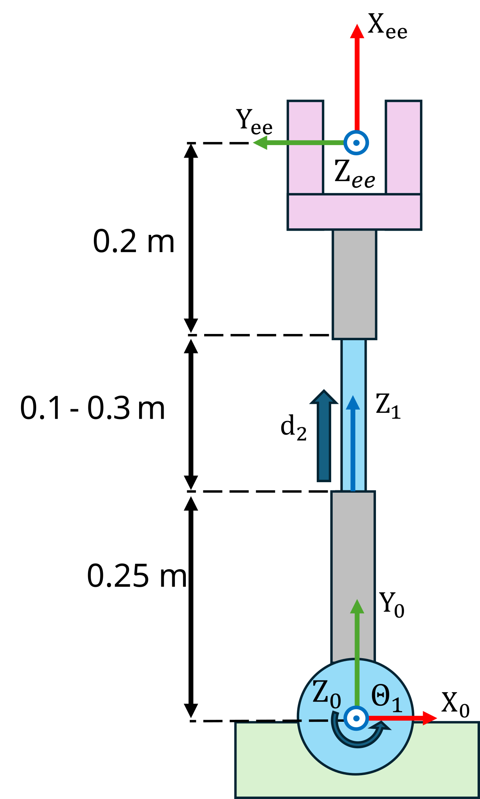
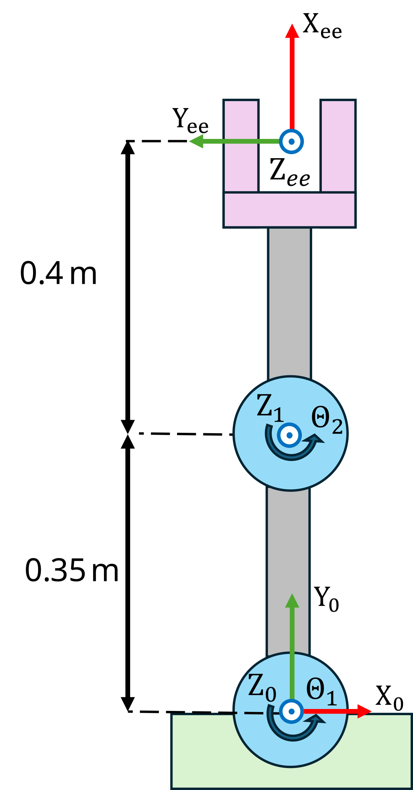
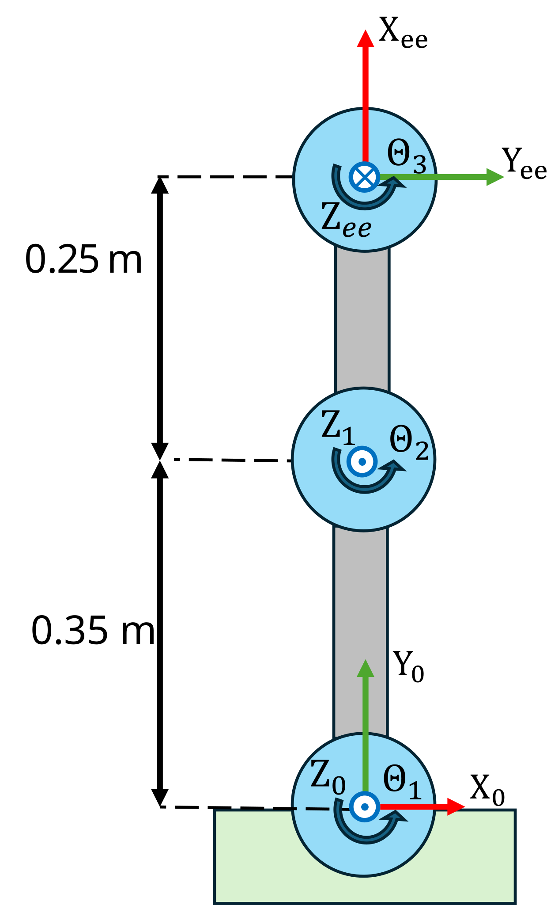

```matlab
clear all; 
```
# Ejercicio 2.2 \- Cinemática inversa de brazos planares

En este ejercicio calcularás las soluciones de cinemática inversa de diferentes manipuladores planares.


¡Guarda tus soluciones en las variables predefinidas!

# Descripción de la tarea:

Calcula las soluciones de cinemática inversa para alcanzar una posición o pose deseada.


Responde todas las preguntas y guarda tu solución en la variable correcta

# Tarea 1




Alcanza la posición 

 $$ t_{\textrm{desired}} =\left\lbrack \begin{array}{c} 0\ldotp 3333\newline 0\ldotp 4989\newline 0 \end{array}\right\rbrack $$ 

respecto al sistema 0

1.  calcula la solución para alcanzar esta posición

Usa las siguientes variables para guardar tu solución:

-  sol\_1 (vector fila como: $begin:math:display$q1\,q2$end:math:display$) 
```matlab
sol_1 = []; 
```

```matlabTextOutput
Error using atan2
Argument must be real.
```


Puedes comprobar tu trabajo haciendo clic en Run: 

```matlab
 
check_exercise('2-2-1')
```
# Tarea 2




Alcanza la posición 

 $$ t_{\textrm{desired}} =\left\lbrack \begin{array}{c} 0\ldotp 2582\newline 0\ldotp 6944\newline 0 \end{array}\right\rbrack $$ 

respecto al sistema 0

1.  encuentra todas las soluciones de este problema

Usa las siguientes variables para guardar tu solución:

-  sol\_2 (matriz donde cada fila representa una solución como: $begin:math:display$q1\,q2$end:math:display$) 
```matlab
sol_2 = [];
```

Puedes comprobar tu trabajo haciendo clic en Run: 

```matlab
 
check_exercise('2-2-2')

```
# Tarea 3




Alcanza la pose: 

 $$ T_{\textrm{desired}} =\left\lbrack \begin{array}{cccc} 0\ldotp 3303 & 0\ldotp 9439 & 0 & 0\ldotp 2828\newline 0\ldotp 9439 & -0\ldotp 3303 & 0 & 0\ldotp 6328\newline 0 & 0 & -1 & 0\newline 0 & 0 & 0 & 1 \end{array}\right\rbrack $$ 

respecto al sistema 0

1.  Encuentra todas las soluciones de cinemática inversa

Usa las siguientes variables para guardar tu solución:

-  sol\_3 (matriz donde cada fila representa una solución como: $begin:math:display$q1\,q2\,q3$end:math:display$) 
```matlab
sol_3 = []; 
```

Puedes comprobar tu trabajo haciendo clic en Run: 

```matlab
 
check_exercise('2-2-3')

```