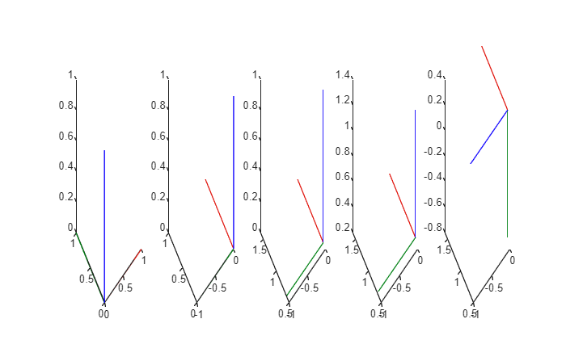

# Cinemática directa

Una capacidad fundamental que permite a los robots interactuar de forma fiable con su entorno es la capacidad de calcular dónde estará cada parte del mecanismo, dado un conjunto de entradas articulares. Este proceso, conocido como **cinemática directa**, sustenta desde la visualización básica del movimiento hasta la planificación avanzada de trayectorias. En este tutorial, exploraremos el marco matemático y las estrategias prácticas de implementación que permiten determinar la pose de un efector final (posición y orientación) en el espacio, dada la configuración de sus articulaciones.

# Problema

En esencia, la cinemática directa es el problema de mapear el **espacio articular**, el vector de variables de actuadores o articulaciones, al **espacio cartesiano**, la pose espacial de un eslabón del robot o del efector final.


Esto se consigue usando los parámetros DH para calcular una matriz de transformación homogénea que depende de un estado articular. Recuerda que una transformación homogénea se define como: 

 $$ T=\left\lbrack \begin{array}{ccccc}  &  &  & | & \newline  & R\in {\mathbb{R}}^{3\textrm{x3}}  &  & | & t\in {\mathbb{R}}^{3\textrm{x1}} \newline  &  &  & | & \newline -- & -- & -- & + & --\newline 0 & 0 & 0 & | & 1 \end{array}\right\rbrack =\left\lbrack \begin{array}{cccc} r_{11}  & r_{12}  & r_{13}  & \Delta \;x\newline r_{21}  & r_{22}  & r_{23}  & \Delta \;y\newline r_{13}  & r_{32}  & r_{33}  & \Delta \;z\newline 0 & 0 & 0 & 1 \end{array}\right\rbrack $$ 

El objetivo es calcular una matriz de transformación que dependa únicamente de la variable del actuador q: 

 $$ T\left(q\right)=\left\lbrack \begin{array}{ccccc}  &  &  & | & \newline  & R\left(q\right) &  & | & t\left(q\right)\newline  &  &  & | & \newline -- & -- & -- & + & --\newline 0 & 0 & 0 & | & 1 \end{array}\right\rbrack $$ 

Estas matrices de transformación definen la traslación y la rotación entre dos articulaciones consecutivas. Concatenarlas nos permite calcular la pose de una serie de eslabones hasta el efector final. 


Considera el Universal Robots UR3. Como todas las articulaciones son rotativas, las variables articulares q\_i se asignan al parámetro theta en la tabla DH siguiente:

```matlab
syms q1 q2 q3 q4 q5 q6 real
DH=[ %por Universal Robots (sitio web)
   %a       alpha       d       theta
   0        pi/2        0.1519  q1;
   -0.24365 0           0       q2;
   -0.21325 0           0       q3;
   0        pi/2        0.11235 q4;
   0        -pi/2       0.08535 q5;
   0        0           0.0819  q6;
    ];
```

Usando Symbolic Math Toolbox podemos transformar estos parámetros DH en una matriz de transformación homogénea que depende del estado articular q. 

# Symbolic Math Toolbox

Para modelar el robot usando Symbolic Math Toolbox, necesitamos definir matrices de transformación usando variables simbólicas. Más adelante podemos sustituirlas por valores reales para calcular la pose cartesiana de una serie de eslabones. 

## DH a transformación homogénea

Entendamos cómo construir una matriz de transformación homogénea a partir de los parámetros DH. 


Recuerda que los parámetros DH describen la cinemática de un manipulador robótico definiendo la posición y orientación relativas de cada eslabón adyacente. Se resumen mediante cuatro parámetros:

-           **θ** (theta) → Ángulo articular (rotación alrededor de z\_i\-1 para ir de x\_i\-1 a x\_i) → usado para **articulaciones rotativas**. 
-          **d** → distancia a lo largo de z\_i\-1 entre x\_i\-1 y x\_i → usado para **articulaciones prismáticas**. 
-          **a** → distancia a lo largo de x\_i entre z\_i\-1 y z\_i 
-           **α** (alpha) → ángulo entre z\_i\-1 y z\_i desde x\_i 

Básicamente, la transformación del modelado DH implica dos traslaciones y dos rotaciones, realizadas en el siguiente orden: 

1.  **Rotación alrededor de Z**, alineando las normales comunes (eje X) usando theta (usando el parámetro DH $\theta \;$; para articulaciones rotativas, esta es la entrada q).
2. **Traslación a lo largo del eje Z**, colocando los orígenes en el mismo punto. (usando el parámetro DH d; para articulaciones prismáticas, esta será la entrada q)
3. **Traslación a lo largo del eje X**, colocando los orígenes en el mismo plano Y\-Z (usando el parámetro DH a).
4. **Rotación alrededor del eje X**, alineando ambos ejes Z. (usando el parámetro DH $\alpha$ )
```matlab
syms alpha theta a d real %configura variables simbólicas y defínelas como reales 

FirstRotation=trotz(theta) %crea una matriz de transformación homogénea -->Rota alrededor del eje z
```
FirstRotation = 

  $$ \displaystyle \left(\begin{array}{cccc} \cos \left(\theta \right) & -\sin \left(\theta \right) & 0 & 0\newline \sin \left(\theta \right) & \cos \left(\theta \right) & 0 & 0\newline 0 & 0 & 1 & 0\newline 0 & 0 & 0 & 1 \end{array}\right) $$ 
 

```matlab
FirstTranslation=transl([a 0 0]) %crea una matriz de transformación homogénea --> Desplaza a lo largo del eje x
```
FirstTranslation = 

  $$ \displaystyle \left(\begin{array}{cccc} 1 & 0 & 0 & a\newline 0 & 1 & 0 & 0\newline 0 & 0 & 1 & 0\newline 0 & 0 & 0 & 1 \end{array}\right) $$ 
 

```matlab
SecondTranslation=transl([0 0 d]) %crea una matriz de transformación homogénea --> desplaza a lo largo del eje z 
```
SecondTranslation = 

  $$ \displaystyle \left(\begin{array}{cccc} 1 & 0 & 0 & 0\newline 0 & 1 & 0 & 0\newline 0 & 0 & 1 & d\newline 0 & 0 & 0 & 1 \end{array}\right) $$ 
 

```matlab
SecondRotation=trotx(alpha) %crea una matriz de transformación homogénea -->rota alrededor del eje x
```
SecondRotation = 

  $$ \displaystyle \left(\begin{array}{cccc} 1 & 0 & 0 & 0\newline 0 & \cos \left(\alpha \right) & -\sin \left(\alpha \right) & 0\newline 0 & \sin \left(\alpha \right) & \cos \left(\alpha \right) & 0\newline 0 & 0 & 0 & 1 \end{array}\right) $$ 
 

Visualicemos qué ocurre con cada una de estas transformaciones.


Considera este conjunto arbitrario de parámetros DH: 

```matlab
          % a      alpha     d          theta
DHexample=[0.6,    -pi/2,    0.24,      pi/2]
```

```matlabTextOutput
DHexample = 1x4
    0.6000   -1.5708    0.2400    1.5708

```


Observa cómo cada paso se multiplica por la transformación anterior: 

```matlab
                                % Matriz de entrada      variable    valor 
exampleFirstRotation =      subs(FirstRotation,     theta,      DHexample(4));
exampleFirstTranslation =   subs(FirstTranslation,  a,          DHexample(1));
exampleSecondTranslation =  subs(SecondTranslation, d,          DHexample(3));
exampleSecondRotation =     subs(SecondRotation,    alpha,      DHexample(2));

M=zeros(4,4,5);
M(:,:,1)=eye(4); 
M(:,:,2)=M(:,:,1)*double(exampleFirstRotation); 
M(:,:,3)=M(:,:,2)*double(exampleFirstTranslation); 
M(:,:,4)=M(:,:,3)*double(exampleSecondTranslation);
M(:,:,5)=M(:,:,4)*double(exampleSecondRotation); 

figure; 
axis(2*[-1,1,-1,1,-1,1])
for i=1:5
subplot(1,5,i)
plotTransforms(M(1:3,4,i)',tform2quat(M(:,:,i)))
end
```



Seguir estos pasos dará como resultado una matriz de transformación homogénea que concatena todos los parámetros DH. Llamaremos a estas matrices de transformación $A_{\textrm{eslabón}\;\textrm{origen}\to \textrm{eslabón}\;\textrm{objetivo}}$. Usando Symbolic Toolbox podemos configurar una plantilla como:

```matlab
Ai=FirstRotation*FirstTranslation*SecondTranslation*SecondRotation
```
Ai = 

  $$ \displaystyle \left(\begin{array}{cccc} \cos \left(\theta \right) & -\cos \left(\alpha \right)\,\sin \left(\theta \right) & \sin \left(\alpha \right)\,\sin \left(\theta \right) & a\,\cos \left(\theta \right)\newline \sin \left(\theta \right) & \cos \left(\alpha \right)\,\cos \left(\theta \right) & -\sin \left(\alpha \right)\,\cos \left(\theta \right) & a\,\sin \left(\theta \right)\newline 0 & \sin \left(\alpha \right) & \cos \left(\alpha \right) & d\newline 0 & 0 & 0 & 1 \end{array}\right) $$ 
 

o definirla manualmente como:

```matlab
Ai_symbolic = [
                  cos(theta)     -sin(theta)*cos(alpha)    sin(theta)*sin(alpha)     a*cos(theta);
                  sin(theta)     cos(theta)*cos(alpha)     -cos(theta)*sin(alpha)    a*sin(theta);
                  0              sin(alpha)                cos(alpha)                d;
                  0              0                         0                         1
              ]
```
Ai_symbolic = 

  $$ \displaystyle \left(\begin{array}{cccc} \cos \left(\theta \right) & -\cos \left(\alpha \right)\,\sin \left(\theta \right) & \sin \left(\alpha \right)\,\sin \left(\theta \right) & a\,\cos \left(\theta \right)\newline \sin \left(\theta \right) & \cos \left(\alpha \right)\,\cos \left(\theta \right) & -\sin \left(\alpha \right)\,\cos \left(\theta \right) & a\,\sin \left(\theta \right)\newline 0 & \sin \left(\alpha \right) & \cos \left(\alpha \right) & d\newline 0 & 0 & 0 & 1 \end{array}\right) $$ 
 

Usar esta matriz simbólica nos permite sustituir fácilmente diferentes parámetros DH para calcular las transformaciones entre dos sistemas consecutivos. 


Para el UR3, las matrices resultantes son: 

```matlab
A01 = subs(Ai_symbolic, [a alpha d theta], DH(1,:))
```
A01 = 

  $$ \displaystyle \left(\begin{array}{cccc} \cos \left(q_1 \right) & 0 & \sin \left(q_1 \right) & 0\newline \sin \left(q_1 \right) & 0 & -\cos \left(q_1 \right) & 0\newline 0 & 1 & 0 & \frac{1519}{10000}\newline 0 & 0 & 0 & 1 \end{array}\right) $$ 
 

```matlab
A12 = subs(Ai_symbolic, [a alpha d theta], DH(2,:))
```
A12 = 

  $$ \displaystyle \left(\begin{array}{cccc} \cos \left(q_2 \right) & -\sin \left(q_2 \right) & 0 & -\frac{4873\,\cos \left(q_2 \right)}{20000}\newline \sin \left(q_2 \right) & \cos \left(q_2 \right) & 0 & -\frac{4873\,\sin \left(q_2 \right)}{20000}\newline 0 & 0 & 1 & 0\newline 0 & 0 & 0 & 1 \end{array}\right) $$ 
 

```matlab
A23 = subs(Ai_symbolic, [a alpha d theta], DH(3,:))
```
A23 = 

  $$ \displaystyle \left(\begin{array}{cccc} \cos \left(q_3 \right) & -\sin \left(q_3 \right) & 0 & -\frac{853\,\cos \left(q_3 \right)}{4000}\newline \sin \left(q_3 \right) & \cos \left(q_3 \right) & 0 & -\frac{853\,\sin \left(q_3 \right)}{4000}\newline 0 & 0 & 1 & 0\newline 0 & 0 & 0 & 1 \end{array}\right) $$ 
 

```matlab
A34 = subs(Ai_symbolic, [a alpha d theta], DH(4,:))
```
A34 = 

  $$ \displaystyle \left(\begin{array}{cccc} \cos \left(q_4 \right) & 0 & \sin \left(q_4 \right) & 0\newline \sin \left(q_4 \right) & 0 & -\cos \left(q_4 \right) & 0\newline 0 & 1 & 0 & \frac{2247}{20000}\newline 0 & 0 & 0 & 1 \end{array}\right) $$ 
 

```matlab
A45 = subs(Ai_symbolic, [a alpha d theta], DH(5,:))
```
A45 = 

  $$ \displaystyle \left(\begin{array}{cccc} \cos \left(q_5 \right) & 0 & -\sin \left(q_5 \right) & 0\newline \sin \left(q_5 \right) & 0 & \cos \left(q_5 \right) & 0\newline 0 & -1 & 0 & \frac{1707}{20000}\newline 0 & 0 & 0 & 1 \end{array}\right) $$ 
 

```matlab
A56 = subs(Ai_symbolic, [a alpha d theta], DH(6,:))
```
A56 = 

  $$ \displaystyle \left(\begin{array}{cccc} \cos \left(q_6 \right) & -\sin \left(q_6 \right) & 0 & 0\newline \sin \left(q_6 \right) & \cos \left(q_6 \right) & 0 & 0\newline 0 & 0 & 1 & \frac{819}{10000}\newline 0 & 0 & 0 & 1 \end{array}\right) $$ 
 

Componer estas transformaciones nos permite encontrar transformaciones más complejas entre una serie de sistemas. Para obtener la transformación entre el sistema 0 y el sistema 2, simplemente podemos multiplicar A01 y A12: 

```matlab
A02=A01*A12
```
A02 = 

  $$ \displaystyle \left(\begin{array}{cccc} \cos \left(q_1 \right)\,\cos \left(q_2 \right) & -\cos \left(q_1 \right)\,\sin \left(q_2 \right) & \sin \left(q_1 \right) & -\frac{4873\,\cos \left(q_1 \right)\,\cos \left(q_2 \right)}{20000}\newline \cos \left(q_2 \right)\,\sin \left(q_1 \right) & -\sin \left(q_1 \right)\,\sin \left(q_2 \right) & -\cos \left(q_1 \right) & -\frac{4873\,\cos \left(q_2 \right)\,\sin \left(q_1 \right)}{20000}\newline \sin \left(q_2 \right) & \cos \left(q_2 \right) & 0 & \frac{1519}{10000}-\frac{4873\,\sin \left(q_2 \right)}{20000}\newline 0 & 0 & 0 & 1 \end{array}\right) $$ 
 

Para encontrar la posición del sistema 2 en la configuración $begin:math:display$0\, 0$end:math:display$, podemos sustituir: 

```matlab
A02_configuration = subs(A02, [q1,q2], [0,0])
```
A02_configuration = 

  $$ \displaystyle \left(\begin{array}{cccc} 1 & 0 & 0 & -\frac{4873}{20000}\newline 0 & 0 & -1 & 0\newline 0 & 1 & 0 & \frac{1519}{10000}\newline 0 & 0 & 0 & 1 \end{array}\right) $$ 
 

Puedes verlo como decimal con n decimales así: 

```matlab
n=4; 
A02_config_decimal = vpa(A02_configuration, n)
```
A02_config_decimal = 

  $$ \displaystyle \left(\begin{array}{cccc} 1.0 & 0 & 0 & -0.2436\newline 0 & 0 & -1.0 & 0\newline 0 & 1.0 & 0 & 0.1519\newline 0 & 0 & 0 & 1.0 \end{array}\right) $$ 
 

Usando esta composición podemos calcular la posición del efector final al concatenar: 

```matlab
A06 = A01 * A12 * A23 * A34 * A45 * A56; 
A06_config=vpa(subs(A06,[q1,q2,q3,q4,q5,q6],[0,0,0,0,0,0]),4)
```
A06_config = 

  $$ \displaystyle \left(\begin{array}{cccc} 1.0 & 0 & 0 & -0.4569\newline 0 & 0 & -1.0 & -0.1943\newline 0 & 1.0 & 0 & 0.06655\newline 0 & 0 & 0 & 1.0 \end{array}\right) $$ 
 
# Robotic System Toolbox

Carga un robot predefinido o configúralo tú mismo.

```matlab
ur3=loadrobot("universalUR3", "DataFormat", "column");
```

Puedes obtener la matriz de transformación usando la función getTransform(). 


Úsala proporcionando las siguientes entradas: 

1.  Estructura RigidBodyTree (robot)
2. Configuración articular (dependiendo de tu formato de datos, es un vector fila/columna o una estructura)
3. Nombre del eslabón objetivo
4. Nombre del eslabón origen
```matlab

A06_RS_toolbox = getTransform(ur3, [0;0;0;0;0;0], "wrist_3_link", "base")
```

```matlabTextOutput
A06_RS_toolbox = 4x4
1.0000    0.0000   -0.0000   -0.4569
    0.0000   -1.0000   -0.1124
   -0.0000         0   -1.0000    0.0666
         0         0         0    1.0000

```


Podemos visualizar una configuración en MATLAB como

```matlab
figure; 
show(ur3,[0;0;0;0;0;0]);
```


O mostrarla en ROS usando la función predefinida (asegúrate de haberla inicializado): 

```matlab
JointStatesToRviz([0;0;0;0;0;0],'ur3');
```

Recuerda que primero necesitas inicializar el robot usando StartTutorialApplication().