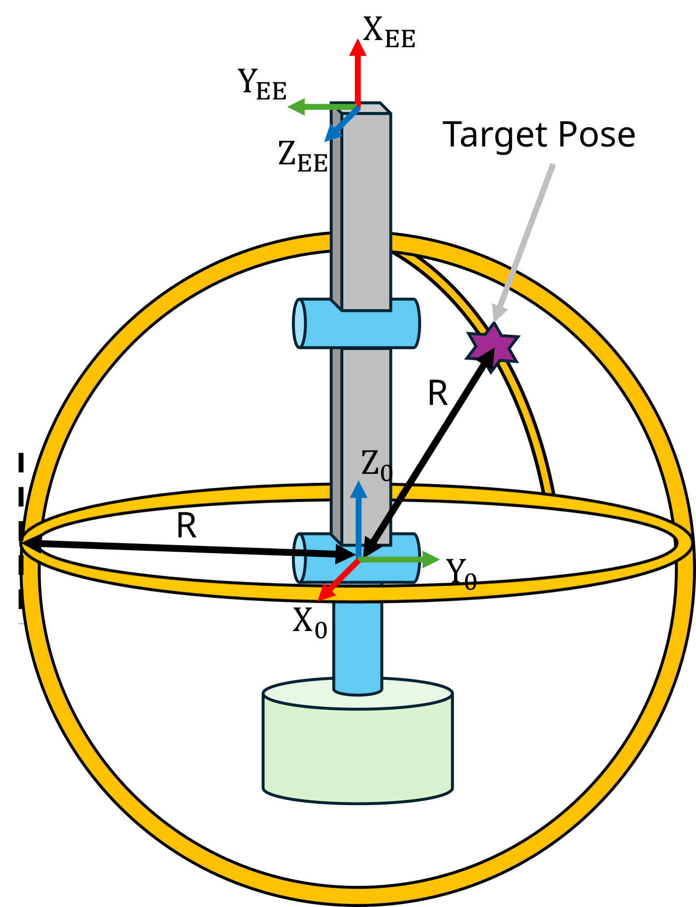
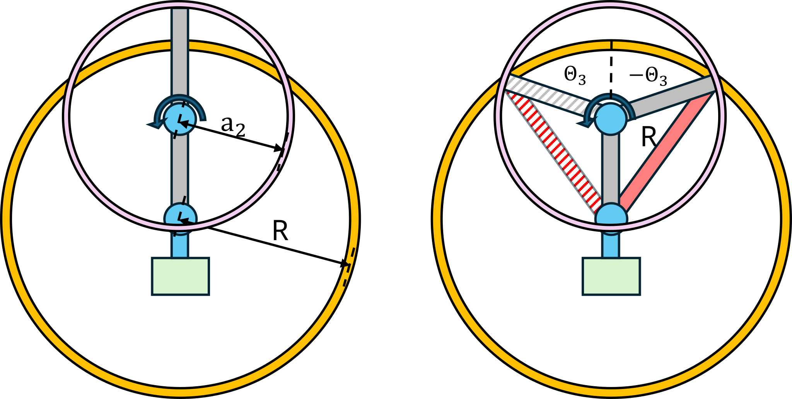
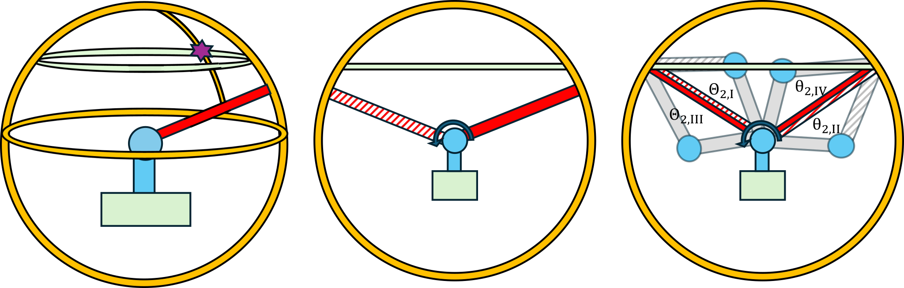
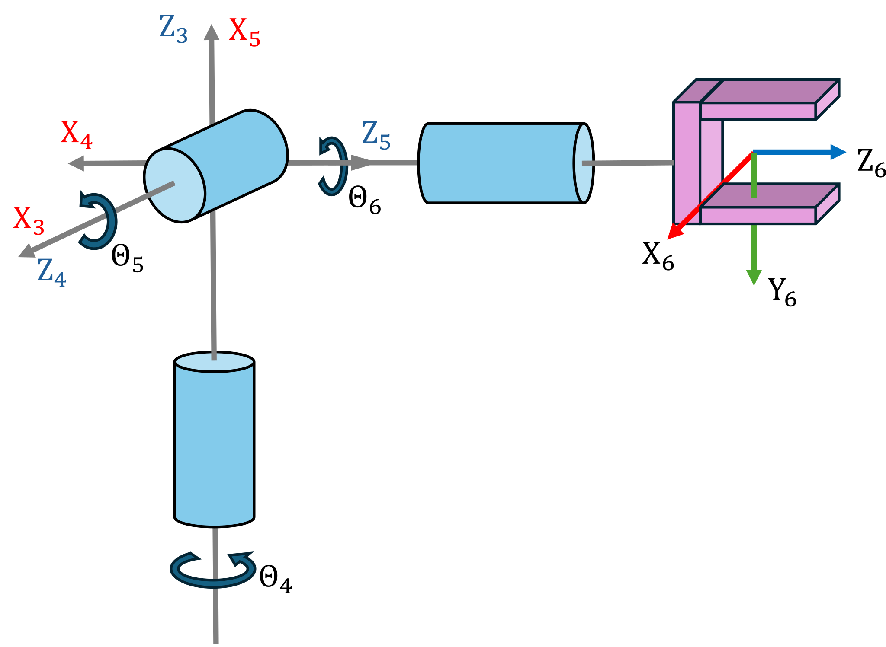

# Cinemática inversa

Mientras que la cinemática directa pregunta "Dados los ángulos articulares, ¿dónde está el efector final?", la cinemática inversa (IK) plantea la pregunta inversa: "Dada una pose deseada del efector final, ¿qué ángulos articulares la logran?" La IK es la piedra angular de la planificación y el control del movimiento robótico. Ya sea programando un manipulador para agarrar un objeto, guiando la mano de un humanoide hacia un interruptor o coordinando el brazo y la base de un manipulador móvil, calcular configuraciones articulares válidas a partir de objetivos espaciales es esencial.


Si la función de cinemática directa de un manipulador 

 $$ T\left(q\right)=\left\lbrack \begin{array}{ccccc}  &  &  & | & \newline  & R\left(q\right) &  & | & t\left(q\right)\newline  &  &  & | & \newline -- & -- & -- & + & --\newline 0 & 0 & 0 & | & 1 \end{array}\right\rbrack $$ 

mapea variables articulares $q\in {\mathbb{R}}^n \;$ a una pose del efector final T, entonces la cinemática inversa busca una o más soluciones q tales que

 $$ T\left(q\right)=T_{\textrm{desired}} =\left\lbrack \begin{array}{ccccc}  &  &  & | & \newline  & R_{\textrm{desired}}  &  & | & t_{\textrm{desired}} \newline  &  &  & | & \newline -- & -- & -- & + & --\newline 0 & 0 & 0 & | & 1 \end{array}\right\rbrack $$ 

A diferencia de la cinemática directa, el problema de IK puede tener cero, una o infinitas soluciones, dependiendo de la geometría del manipulador, la alcanzabilidad y la redundancia.


Algunas estructuras de manipuladores tienen soluciones en forma cerrada, lo que nos permite calcular analíticamente todas las soluciones para la transformación deseada. Todos los modelos de Universal Robot poseen la propiedad de soluciones en forma cerrada, lo que hace que sea eficiente trabajar con ellos. 

# Brazo antropomórfico

El brazo antropomórfico es un ejemplo de una estructura con solución en forma cerrada. Esta configuración se usa a menudo porque es posible calcular algebraicamente las diferentes soluciones y controlar la posición (traslación) del efector final sin considerar una orientación específica. Las tres primeras articulaciones de un robot universal forman esta configuración. 

```matlab
anthropomorphic_arm=loadrobot("universalUR3", DataFormat="column");
%eliminar todos los enlaces adicionales
removeBody(anthropomorphic_arm, "tool0");
removeBody(anthropomorphic_arm, "ee_link");
removeBody(anthropomorphic_arm, "wrist_3_link");
removeBody(anthropomorphic_arm, "wrist_2_link");
removeBody(anthropomorphic_arm, "wrist_1_link");
show(anthropomorphic_arm, [0,-pi/2,0]')
```


```matlabTextOutput
ans = 
  Axes (Primary) with properties:

             XLim: [-0.5000 0.5000]
             YLim: [-0.5000 0.5000]
           XScale: 'linear'
           YScale: 'linear'
    GridLineStyle: '-'
         Position: [0.1300 0.1100 0.7750 0.8150]
            Units: 'normalized'

  Show all properties

```


Para un conjunto de parámetros DH a, alpha, d (theta es el estado articular), encontramos la matriz de transformación homogénea A03

||||||
| :-: | :-: | :-: | :-: | :-: |
| Eslabón  | a $begin:math:display$m$end:math:display$  | alpha  | d $begin:math:display$m$end:math:display$  | theta   |
| 1  | 0  | pi/2  | 0  | q1   |
| 2  | a2  | 0  | 0  | q2   |
| 3  | a3  | 0  | 0  | q3   |

```matlab
syms a2 a3 q1 q2 q3 real
DH = [
        0 pi/2  0 q1; 
        a2 0    0 q2; 
        a3 0    0 q3
]; 
A01 = dh2tf(DH(1,:));
A12 = dh2tf(DH(2,:));
A23 = dh2tf(DH(3,:));
A03 = A01 * A12 * A23; 
A03 = simplify(A03)
```
A03 = 

  $$ \displaystyle \begin{array}{l} \left(\begin{array}{cccc} \cos \left(q_2 +q_3 \right)\,\cos \left(q_1 \right) & -\sin \left(q_2 +q_3 \right)\,\cos \left(q_1 \right) & \sin \left(q_1 \right) & \cos \left(q_1 \right)\,\sigma_1 \newline \cos \left(q_2 +q_3 \right)\,\sin \left(q_1 \right) & -\sin \left(q_2 +q_3 \right)\,\sin \left(q_1 \right) & -\cos \left(q_1 \right) & \sin \left(q_1 \right)\,\sigma_1 \newline \sin \left(q_2 +q_3 \right) & \cos \left(q_2 +q_3 \right) & 0 & a_3 \,\sin \left(q_2 +q_3 \right)+a_2 \,\sin \left(q_2 \right)\newline 0 & 0 & 0 & 1 \end{array}\right)\\\mathrm{}\\\textrm{where}\\\mathrm{}\\\;\;\sigma_1 =a_3 \,\cos \left(q_2 +q_3 \right)+a_2 \,\cos \left(q_2 \right)\end{array} $$ 
 

Para una ubicación deseada del efector final en el espacio de trabajo alcanzable, podemos resolverlo usando un conjunto de ecuaciones. 

 $$ t_{\textrm{desired}} =\left\lbrack \begin{array}{c} x_{\textrm{desired}} \newline y_{\textrm{desired}} \newline z_{\textrm{desired}}  \end{array}\right\rbrack =\left\lbrack \begin{array}{c} \cos \left(q_1 \right)\cdot \left(a_3 \cdot \cos \left(\textrm{q2}+\textrm{q3}\right)+a_2 \cdot \cos \left(\textrm{q2}\right)\right)\newline \sin \left(q_1 \right)\cdot \left(a_3 \cdot \cos \left(\textrm{q2}+\textrm{q3}\right)+a_2 \cdot \cos \left(\textrm{q2}\right)\right)\newline a_3 \cdot \sin \left(q_2 +q_3 \right)+a_2 \cdot \sin \left(q_2 \right) \end{array}\right\rbrack $$ 


Considera este esquema de un brazo antropomórfico, sus sistemas y una pose objetivo deseada. Observa que el origen del Sistema 0 y del Sistema 1 coinciden, por lo tanto la distancia desde Z0 y Z1 hasta el objetivo es idéntica. En la figura siguiente, la distancia desde el sistema 1 hasta el objetivo está marcada como R. Considera una esfera (amarilla) alrededor de la Articulación 1 con un radio R. 




## $$ {\textrm{Calcular}\;\theta }_3 $$

Observa la proyección 2D siguiente. El círculo amarillo es la esfera con radio R, la esfera rosa es la rotación de la Articulación 3 con $\theta_3$ con un radio de $a_2$, correspondiente a la longitud de la Articulación 3. Queremos encontrar las soluciones para $\theta_3$ de modo que el sistema del efector final se encuentre sobre la esfera amarilla. Observa cómo hay dos soluciones que cumplen esta tarea:


 


Elevar al cuadrado y sumar las coordenadas cartesianas desde el Sistema 1 (o Sistema 0 si coinciden) hasta la pose objetivo nos da una expresión para el alcance requerido del brazo:

 $$ \;x_{\textrm{desired}}^2 +y_{\textrm{desired}}^2 +z_{\textrm{desired}}^2 =a_2^2 +a_3^2 +2\cdot \cos \left(q_3 \right)\cdot a_2 \cdot a_3 $$ 

Esta ecuación representa la ley del coseno ( $c^2 =a^{2\;} +b^2 -2\textrm{ab}\cdot \cos \left(\gamma \right)$ ); sin embargo, en robótica un brazo completamente extendido se representa con un ángulo articular de 0. Por el contrario, en la ley del coseno para geometría estándar, este brazo extendido se calcularía con un ángulo de 180° (o $\pi$ ). 


Este cambio en la referencia angular da como resultado la siguiente expresión de la ley del coseno:

 $$ \vec{{||P}_{\textrm{desired}} ||} =a_2^2 +a_3^2 -2\cdot \cos \left(\theta \;+\pi \right)\cdot a_2 \cdot a_3 $$ 

donde hemos sustituido $\cos \left(\theta +\pi \;\right)$ por $-\cos \left(\theta \right)$.


Despejar $\cos \left(q_3 \right)$ produce la expresión: 

 $$ \cos \left(q_3 \right)=\frac{x_{\textrm{desired}}^2 +y_{\textrm{desired}}^2 +z_{\textrm{desired}}^2 -a_2^2 -a_3^2 }{\;2\cdot a_2 \cdot a_3 }\; $$ 

La solución es admisible si $-1\le \cos \left(q_3 \right)\le 1$, lo que equivale a que el punto deseado esté dentro del espacio de trabajo alcanzable. 

 $$ |a_2 -a_3 |\le \sqrt{x_{\textrm{desired}}^2 +y_{\textrm{desired}}^2 +z_{\textrm{desired}}^2 \;}\le |a_2 +a_3 | $$ 

donde $|a_2 -a_3 |\;$ representa el brazo plegado sobre sí mismo $q_3 =\pi \;$ 


y $|a_2 +a_3 |$ el brazo completamente extendido $q_3 =0$.


Usar la propiedad: 


 ${\sin \left(q_3 \;\right)}^2 +{\cos \left(q_3 \right)}^{2\;} =1$ nos permite obtener dos soluciones para $\sin \left(\beta \;\right)$ como: 

 $$ \sin \left(q_3 \right)=\pm \sqrt{\;1-\cos \left(q_3 \;\right)}\;\left\lbrace \begin{array}{ll} \sin^+ \left(q_3 \right)=+\sqrt{\;1-\cos \left(q_3 \right)} & \newline \sin^- \left(q_3 \right)=-\sqrt{\;1-\cos \left(q_3 \right)} &  \end{array}\right. $$ 

con esto puedes calcular $q_3$ como

 $$ q_3 =\theta_3 =\textrm{atan2}\left(\sin \left(q_3 \right),\cos \left(q_3 \right)\right)\left\lbrace \begin{array}{ll} \theta_{3,I} =\textrm{atan2}\left(\sin^+ \left(q_3 \right),\cos \left(q_3 \right)\right)\in \left\lbrack -\pi ,\pi \;\right\rbrack  & \newline \theta_{3,\textrm{II}} =\textrm{atan2}\left(\sin^- \left(q_3 \right),\cos \left(q_3 \right)\right)=-\theta {\;}_{3,1}  &  \end{array}\right. $$ 
## $$ \textrm{Calcular}\;\theta_2 $$

En la figura siguiente (izquierda) ves un toroide verde, que está sobre la superficie de la esfera a la altura Z de la pose objetivo. Para calcular $\theta_2$, alineas el eslabón (rojo) que resulta del $\theta_3$ elegido con el círculo verde. Observa cómo para cada ángulo de $\theta_3$ hay dos soluciones, lo que da como resultado un total de cuatro soluciones que cumplen esta tarea:





A partir de las expresiones para $x_{\textrm{desired}}$ e $y_{\textrm{desired}}$ podemos obtener la ecuación: 

 $$ x_{\textrm{desired}}^2 +y_{\textrm{desired}}^2 ={\left(a_2 \cdot \cos \left(q_2 \right)+a_3 \cdot \cos \left(q_2 +q_3 \right)\right)}^2 $$ 

Incluir la ecuación para $z_{\textrm{desired}}$ produce un sistema de ecuaciones que nos permite resolver $q_2$:

 $$ \textrm{Sistema}\;\textrm{de}\;\textrm{ecuaciones}\left\lbrace \begin{array}{ll} a_2 \cdot \cos \left(q_2 \right)+a_3 \cdot \cos \left(q_2 +q_3 \right)=\pm \sqrt{\;x_{\textrm{desired}}^2 +y_{\textrm{desired}}^2 } & \newline z_{\textrm{desired}} =a_2 \cdot \sin \left(q_2 \right)+a_3 \cdot \sin \left(q_2 +q_3 \right) &  \end{array}\right. $$ 

esto nos permite expresar el seno y el coseno de $q_2 \;$ como:

 $$ \cos \left(q_2 \right)=\frac{\pm \sqrt{\;x_{\textrm{desired}}^2 +y_{\textrm{desired}}^2 }\cdot \left(a_2 +a_3 \cdot \cos \left(q_3 \right)\right)+z_{\textrm{desired}} \cdot a_3 \cdot \sin \left(q_3 \right)}{\;a_2^2 +a_3^2 +2\cdot a_2 \cdot a_3 \cdot \cos \left(q_3 \right)} $$ 

 $$ \sin \left(q_2 \right)=\frac{z_{\textrm{desired}} \cdot \left(a_2 +a_3 \cdot \cos \left(q_3 \right)\right)\mp \sqrt{\;x_{\textrm{desired}}^2 +y_{\textrm{desired}}^2 }\cdot a_3 \cdot \sin \left(q_3 \right)}{\;a_2^2 +a_3^2 +2\cdot a_2 \cdot a_3 \cdot \cos \left(q_3 \right)} $$ 


usando estas expresiones podemos derivar las soluciones para $\theta_2$ 

 $ \theta_2 =\textrm{atan2}\left(\sin \left(q_2 \right),\;\cos \left(q_2 \right)\right)= $ $ \left\lbrace \begin{array}{ll} \theta_{2,I}  & when~using~sin(q_3 )^+ ~(\theta_{3,I} )~and~+\sqrt{~~~}~\newline \theta_{2,II}  & when~using~sin(q_3 )^+ ~(\theta_{3,I} )~and~-\sqrt{~~~}\newline \theta_{2,III}  & when~using~sin(q_3 )^- ~(\theta_{3,II} )~and~+\sqrt{~~~}\newline \theta_{2,IV}  & when~using~sin(q_3 )^- ~(\theta_{3,II} )~and~-\sqrt{~~~} \end{array}\right. $ 

## $$ \textrm{Calcular}\;\theta_1 $$

La figura siguiente es una proyección 2D desde arriba. Para alinear el efector final con la pose objetivo, rota el eje $Z_0$ con $\theta_1$. Observa cómo hay dos soluciones dependiendo de la configuración de $\theta_3$ y $\theta_2$: 


Podemos reescribir las expresiones para $x_{\textrm{desired}}$ e $y_{\textrm{desired}}$ como:

 $$ x_{\textrm{desired}} =\pm \cos \left(q_1 \right)\cdot \sqrt{x_{\textrm{desired}}^2 +y_{\textrm{desired}}^2 } $$ 

 $$ y_{\textrm{desired}} =\pm \sin \left(q_1 \right)\cdot \sqrt{x_{\textrm{desired}}^2 +y_{\textrm{desired}}^2 } $$ 

usando esto podemos calcular las soluciones para $\theta_1$. Observa cómo las expresiones se simplifican, ya que $\sqrt{x_{\textrm{desired}}^2 +y_{\textrm{desired}}^2 }$ es un factor constante:

 $$ \theta_1 =\textrm{atan2}\left(\sin \left(q_1 \right),\cos \left(q_1 \right)\right)=\left\lbrace \begin{array}{ll} \;\theta_{1,I} =\textrm{atan2}\left(y_{\textrm{desired}} ,\;\;\;\;\;\;\;\;x_{\textrm{desired}} \right) & \textrm{when}\;\textrm{using}+\sqrt{\;\;\;\;\;\;}\newline \theta_{1,\textrm{II}} =\textrm{atan2}\left({-y}_{\textrm{desired}} ,{\;-x}_{\textrm{desired}} \right) & \textrm{when}\;\textrm{using}-\sqrt{\;\;\;\;\;\;} \end{array}\right. $$ 

## Soluciones de cinemática inversa del brazo antropomórfico

La IK del brazo antropomórfico tiene cuatro soluciones: 

||||
| :-- | :-- | :-- |
|  | $\displaystyle {\sin \left(q_3 \right)}^+$  | $\displaystyle \sin \left(q_3 {\left.\right)}^- \right.$   |
| $\displaystyle +\sqrt{\;\;\;\;\;\;\;}$  | $\displaystyle \theta_{1,\mathrm{I}} \;;\;\theta_{2,\mathrm{I}} \;;\theta_{3,\mathrm{I}}$  | $\displaystyle \theta_{1,\mathrm{I}} \;;\;\theta_{2,\textrm{III}} \;;\theta_{3,\textrm{II}}$   |
| $\displaystyle -\sqrt{\;\;\;\;\;\;\;}$  | $\displaystyle \theta_{1,\textrm{II}} \;;\;\theta_{2,\textrm{II}} \;;\theta_{3,\mathrm{I}}$  | $\displaystyle \theta_{1,\textrm{II}} \;;\;\theta_{2,\textrm{IV}} \;;\theta_{3,\textrm{II}}$   |


Aplicar una configuración solución da como resultado que el brazo antropomórfico alcance la pose objetivo. 


A continuación puedes ver las diferentes soluciones ilustradas 


# Muñeca esférica

La muñeca esférica es otro ejemplo de una configuración única para soluciones en forma cerrada. Observa cómo todos los orígenes de los sistemas articulares se cruzan en un único punto. La configuración de muñeca esférica se usa para controlar la orientación del efector final. 





Para un conjunto de parámetros DH a, alpha, d (theta es el estado articular), encontramos la matriz de transformación homogénea A36

||||||
| :-: | :-: | :-: | :-: | :-: |
| Eslabón  | a $begin:math:display$m$end:math:display$  | alpha  | d $begin:math:display$m$end:math:display$  | theta   |
| 4  | 0  | \-pi/2  | 0  | q4   |
| 5  | 0  | pi/2  | 0  | q5   |
| 6  | 0  | 0  | d6  | q6   |

```matlab
syms d6 q4 q5 q6 real
DH = [
        0  -pi/2    0   q4; 
        0  pi/2     0   q5; 
        0  0        d6  q6
]; 

A34 = dh2tf(DH(1,:));
A45 = dh2tf(DH(2,:));
A56 = dh2tf(DH(3,:));

A36 = A34 * A45 * A56;
simplify(A36)
```
ans = 

  $$ \displaystyle \left(\begin{array}{cccc} \cos \left(q_4 \right)\,\cos \left(q_5 \right)\,\cos \left(q_6 \right)-\sin \left(q_4 \right)\,\sin \left(q_6 \right) & -\cos \left(q_6 \right)\,\sin \left(q_4 \right)-\cos \left(q_4 \right)\,\cos \left(q_5 \right)\,\sin \left(q_6 \right) & \cos \left(q_4 \right)\,\sin \left(q_5 \right) & d_6 \,\cos \left(q_4 \right)\,\sin \left(q_5 \right)\newline \cos \left(q_4 \right)\,\sin \left(q_6 \right)+\cos \left(q_5 \right)\,\cos \left(q_6 \right)\,\sin \left(q_4 \right) & \cos \left(q_4 \right)\,\cos \left(q_6 \right)-\cos \left(q_5 \right)\,\sin \left(q_4 \right)\,\sin \left(q_6 \right) & \sin \left(q_4 \right)\,\sin \left(q_5 \right) & d_6 \,\sin \left(q_4 \right)\,\sin \left(q_5 \right)\newline -\cos \left(q_6 \right)\,\sin \left(q_5 \right) & \sin \left(q_5 \right)\,\sin \left(q_6 \right) & \cos \left(q_5 \right) & d_6 \,\cos \left(q_5 \right)\newline 0 & 0 & 0 & 1 \end{array}\right) $$ 
 

Para calcular los ángulos articulares $\theta_4 ,\theta_5$ y $\theta_6$ de modo que: 

 $$ R_6^3 \left(\theta_4 ,\theta_5 ,\theta_6 \right)=R_{\textrm{desired}} =\left\lbrack \begin{array}{ccc} n_x  & s_x  & a_x \newline n_y  & s_y  & a_y \newline n_z  & s_z  & a_z  \end{array}\right\rbrack $$ 
## Calcular $\theta_4 ,\theta_5$ y $\theta_6$ 
 $$ \theta_5 =\textrm{atan2}\left(\pm \sqrt{{\left(a_x \right)}^2 +{\left(a_y \right)}^2 },a_z \right) $$ 

 $$ \theta_5 =\left\lbrace \begin{array}{ll} \;\theta_5 \in \left(0,\pi \;\right) & \textrm{if}+\sqrt{\;\;\;\;\;\;\;}\textrm{is}\;\textrm{chosen}\to \sin \left(\theta_5 \right)>0\newline \theta_5 \in \left(-\pi \;,0\right) & \textrm{if}-\sqrt{\;\;\;\;\;\;\;}\textrm{is}\;\textrm{chosen}\to \sin \left(\theta_5 \right)<0 \end{array}\right. $$ 
### Caso $\sin \left(\theta_5 \right)>0$:
 $$ \theta_4 =\textrm{atan2}\left(a_y ,a_x \right) $$ 

 $$ \theta_6 =\textrm{atan2}\left(s_z ,-n_z \right) $$ 
### Caso $\sin \left(\theta_5 \right)<0$:
 $$ \theta_4 =\textrm{atan2}\left({-a}_y ,-a_x \right) $$ 

 $$ \theta_6 =\textrm{atan2}\left(-s_z ,n_z \right) $$ 

## Ángulo de Euler ZYZ

Observa cómo los ángulos articulares de una muñeca esférica configurada como arriba son idénticos a una notación de Euler ZYZ. 

```matlab
syms roll pitch yaw real 
Eul_ZYZ = rotz(roll)*roty(pitch)*rotz(yaw)
```
Eul_ZYZ = 

  $$ \displaystyle \left(\begin{array}{ccc} \cos \left(\textrm{pitch}\right)\,\cos \left(\textrm{roll}\right)\,\cos \left(\textrm{yaw}\right)-\sin \left(\textrm{roll}\right)\,\sin \left(\textrm{yaw}\right) & -\cos \left(\textrm{yaw}\right)\,\sin \left(\textrm{roll}\right)-\cos \left(\textrm{pitch}\right)\,\cos \left(\textrm{roll}\right)\,\sin \left(\textrm{yaw}\right) & \cos \left(\textrm{roll}\right)\,\sin \left(\textrm{pitch}\right)\newline \cos \left(\textrm{roll}\right)\,\sin \left(\textrm{yaw}\right)+\cos \left(\textrm{pitch}\right)\,\cos \left(\textrm{yaw}\right)\,\sin \left(\textrm{roll}\right) & \cos \left(\textrm{roll}\right)\,\cos \left(\textrm{yaw}\right)-\cos \left(\textrm{pitch}\right)\,\sin \left(\textrm{roll}\right)\,\sin \left(\textrm{yaw}\right) & \sin \left(\textrm{pitch}\right)\,\sin \left(\textrm{roll}\right)\newline -\cos \left(\textrm{yaw}\right)\,\sin \left(\textrm{pitch}\right) & \sin \left(\textrm{pitch}\right)\,\sin \left(\textrm{yaw}\right) & \cos \left(\textrm{pitch}\right) \end{array}\right) $$ 
 

```matlab
Spherical_rot = subs(A36(1:3,1:3), [q4, q5, q6], [roll, pitch, yaw])
```
Spherical_rot = 

  $$ \displaystyle \left(\begin{array}{ccc} \cos \left(\textrm{pitch}\right)\,\cos \left(\textrm{roll}\right)\,\cos \left(\textrm{yaw}\right)-\sin \left(\textrm{roll}\right)\,\sin \left(\textrm{yaw}\right) & -\cos \left(\textrm{yaw}\right)\,\sin \left(\textrm{roll}\right)-\cos \left(\textrm{pitch}\right)\,\cos \left(\textrm{roll}\right)\,\sin \left(\textrm{yaw}\right) & \cos \left(\textrm{roll}\right)\,\sin \left(\textrm{pitch}\right)\newline \cos \left(\textrm{roll}\right)\,\sin \left(\textrm{yaw}\right)+\cos \left(\textrm{pitch}\right)\,\cos \left(\textrm{yaw}\right)\,\sin \left(\textrm{roll}\right) & \cos \left(\textrm{roll}\right)\,\cos \left(\textrm{yaw}\right)-\cos \left(\textrm{pitch}\right)\,\sin \left(\textrm{roll}\right)\,\sin \left(\textrm{yaw}\right) & \sin \left(\textrm{pitch}\right)\,\sin \left(\textrm{roll}\right)\newline -\cos \left(\textrm{yaw}\right)\,\sin \left(\textrm{pitch}\right) & \sin \left(\textrm{pitch}\right)\,\sin \left(\textrm{yaw}\right) & \cos \left(\textrm{pitch}\right) \end{array}\right) $$ 
 

```matlab
isequal(Eul_ZYZ, Spherical_rot)
```

```matlabTextOutput
ans = logical
   1

```

## Condiciones de solución en forma cerrada

Un manipulador de seis GDL tiene una solución en forma cerrada si se cumple cualquiera de las condiciones:

-  Tres articulaciones consecutivas se cruzan en un punto común (como en el caso de la muñeca esférica), 
-  Tres ejes articulares rotativos consecutivos son paralelos (como en los robots UR) 
# Robotic System Toolbox

La Robotic System Toolbox incluye diferentes solucionadores para obtener soluciones de cinemática inversa.

```matlab
ur3e=loadrobot("universalUR3e", DataFormat="column");
% Define la pose objetivo para el efector final
TargetPose=getTransform(ur3e, [0;0;0;0;0;0], "tool0", "base_link")
```

```matlabTextOutput
TargetPose = 4x4
   -1.0000    0.0000    0.0000    0.4567
    0.0000    0.0000    1.0000    0.2231
    0.0000    1.0000   -0.0000    0.0665
         0         0         0    1.0000

```

## Solucionador genérico

Empieza creando un objeto de cinemática inversa como: 

```matlab
ik = inverseKinematics('RigidBodyTree', ur3e);
```

Define pesos para determinar la tolerancia respecto a la orientación y la posición.


Las tres primeras posiciones definen la tolerancia para la orientación, las tres últimas definen la tolerancia para la posición. Hazlas iguales entre sí si no se da información adicional. 

```matlab
weights = [1, 1, 1, 1, 1, 1];
```

Define la condición inicial de la configuración articular. Esto ayudará a encontrar soluciones cercanas al estado articular actual, optimizando el esfuerzo para alcanzar una pose objetivo específica. 

```matlab
initialConfig = [-pi; pi; pi/2; 0; 0; 0];
```

Este solucionador encontrará una solución desde el sistema base hasta el sistema objetivo especificado. Si no estás seguro de cuál es el sistema base, puedes obtener el nombre como: 

```matlab
base_name = ur3e.BaseName
```

```matlabTextOutput
base_name = 'base_link'
```


Para obtener una solución, llama al objeto de cinemática inversa, especifica el sistema del efector final, los pesos de la pose objetivo y los estados articulares iniciales. 

```matlab
[configSol, solInfo] = ik('tool0', TargetPose, weights, initialConfig);
```

encontrarás la solución en configSol e información adicional en solInfo. La solución obtenida tendrá el mismo formato de datos que el definido previamente en el robot, lo que facilita trabajar con ella. 

```matlab
getTransform(ur3e, configSol,"tool0", base_name)
```

```matlabTextOutput
ans = 4x4
   -1.0000   -0.0000    0.0000    0.4568
    0.0000   -0.0000    1.0000    0.2231
   -0.0000    1.0000    0.0000    0.0665
         0         0         0    1.0000

```

## Cinemática inversa analítica

La Robotic System Toolbox también incluye un solucionador de cinemática inversa analítica. Puede usarse para obtener todas las soluciones si el robot tiene tres articulaciones consecutivas que se cruzan en un punto común (por ejemplo, una muñeca esférica). 


Al analizar los modelos UR, observarás que, aunque tienen tres articulaciones paralelas consecutivas, los modelos UR no presentan una muñeca esférica. Debido a esto, no pueden resolverse mediante el solucionador de cinemática inversa analítica. A continuación se muestra un ejemplo de un robot que sí presenta esta configuración específica: 

```matlab
robot = loadrobot('abbIrb120','DataFormat','column');
%show(robot, robot.homeConfiguration)
```

Define la pose objetivo como una matriz de transformación homogénea:

```matlab
TargetPose = transl([0 0.5 0.5])
```

```matlabTextOutput
TargetPose = 4x4
1.0000         0         0         0
         0    1.0000         0    0.5000
         0         0    1.0000    0.5000
         0         0         0    1.0000

```


Configura el solucionador analítico:

```matlab
AnalyticalSolver = analyticalInverseKinematics(robot)
```

```matlabTextOutput
AnalyticalSolver = 
  analyticalInverseKinematics with properties:

             KinematicGroup: [1x1 struct]
              RigidBodyTree: [1x1 rigidBodyTree]
         KinematicGroupType: 'RRRSSS'
    KinematicGroupConfigIdx: [1 2 3 4 5 6]
          IsValidGroupForIK: 1

```


Tu robot puede tener varias articulaciones que cumplan los requisitos para la resolución analítica. Visualiza y elige el grupo deseado usando:

```matlab
AnalyticalSolver.showdetails()
```

```matlabTextOutput
--------------------
Robot: (8 bodies)

Index      Base Name   EE Body Name     Type                    Actions
-----      ---------   ------------     ----                    -------
    1      base_link         link_6   RRRSSS   Use this kinematic group
    2      base_link          tool0   RRRSSS   Use this kinematic group
```


Para ver el grupo cinemático elegido: 

```matlab
AnalyticalSolver.KinematicGroup
```

```matlabTextOutput
ans = struct with fields:
               BaseName: 'base_link'
    EndEffectorBodyName: 'tool0'

```


Genera un objeto función para el grupo cinemático seleccionado: 

```matlab
generateIKFunction(AnalyticalSolver,'IKSolver')
```

```matlabTextOutput
ans = function_handle with value:
    @IKSolver

```


Obtén las soluciones analíticas del robot mediante: 

```matlab
ikConfig = IKSolver(TargetPose)
```

```matlabTextOutput
ikConfig = 4x6
   -1.4278   -1.5406   -0.6641    1.4553    1.6553    0.6290
1.7138    0.8130   -0.6641   -1.5494    1.7122    1.7212
   -1.4278   -1.5406   -0.6641   -1.6863   -1.6553    3.7706
1.7138    0.8130   -0.6641    1.5922   -1.7122   -1.4204

```


Esta función siempre devolverá un formato de datos de fila. Tenlo en cuenta al usar las soluciones. 


Echa un vistazo a las soluciones: 

```matlab
numSolutions = size(ikConfig, 1); 
figure; 
for i = 1:size(ikConfig,1)
    subplot(1,numSolutions,i)
    show(robot,ikConfig(i,:)');
end
```

