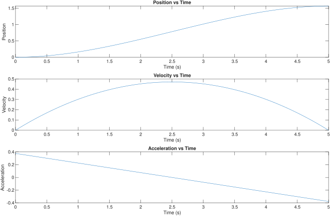
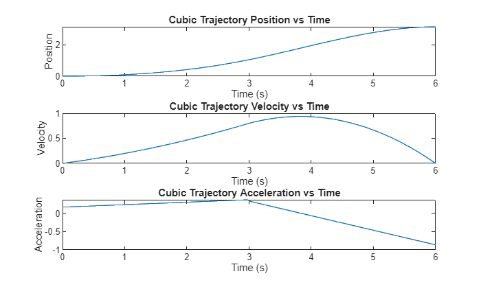
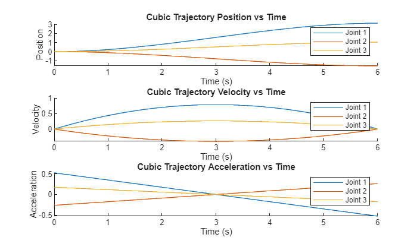
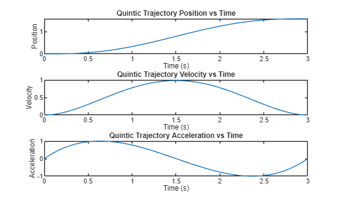
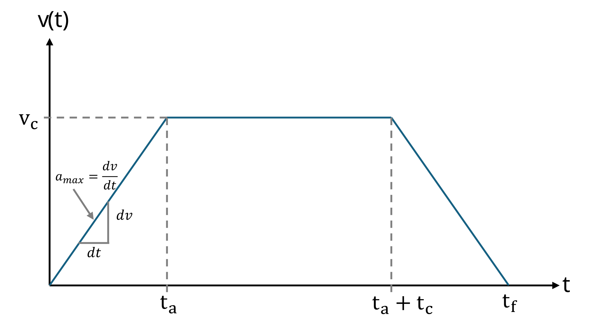
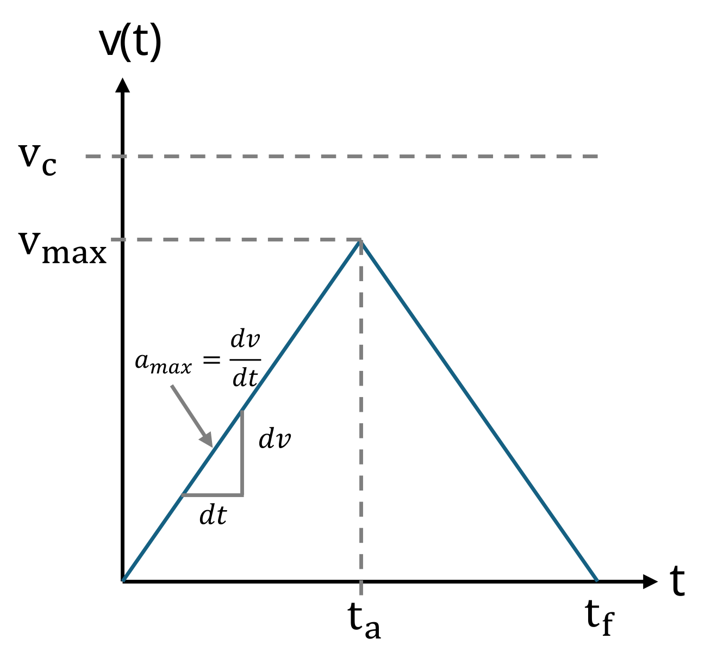
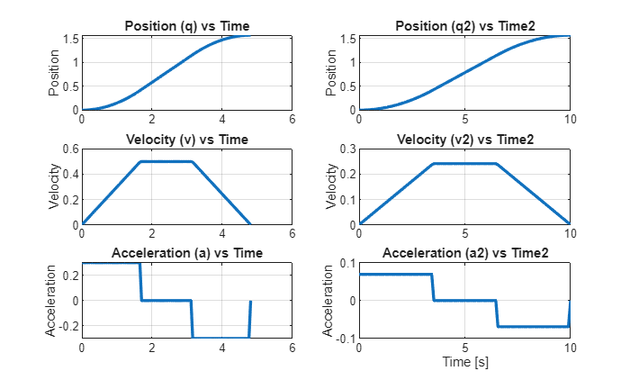

# Planificación de trayectorias en el espacio articular 

La planificación de trayectorias es una piedra angular del control del movimiento robótico: define **cómo** se mueve un robot entre dos configuraciones o poses del efector final a lo largo del tiempo, sujeto a requisitos de suavidad, temporización y límites físicos (velocidades, aceleraciones) de sus articulaciones o eslabones. Al generar perfiles continuos de posición, velocidad y aceleración, los planificadores de trayectorias permiten que los robots realicen tareas de forma segura, precisa y eficiente, ya sea siguiendo una trayectoria de pick\-and\-place, soldando una junta o cooperando con humanos.

# Espacio cartesiano y espacio articular

La solución de cinemática inversa mapea coordenadas cartesianas al espacio articular. Si queremos mover el robot de una pose cartesiana a otra, obtenemos las posiciones articulares iniciales y la solución en la pose deseada. Dadas estas configuraciones, necesitamos calcular cómo se moverá cada articulación para tener una trayectoria suave.

# Interpolación polinómica

La interpolación polinómica nos permite calcular los estados articulares, las velocidades y las aceleraciones para seguir un perfil específico. Normalmente usarás una ecuación cúbica o quíntica.

## Perfil cúbico

Para conseguir un perfil cúbico como el que se ve a continuación, necesitas resolver las siguientes ecuaciones paramétricas:


 $S\left(t\right)=A\cdot t^3 +B\cdot t^2 +C\cdot t+D$ = Posición articular


 $\dot{\;S} \left(t\right)=3\cdot A\cdot t^2 +2\cdot B\cdot t+C$ = Velocidad articular


Este sistema de ecuaciones tiene cuatro incógnitas (A,B,C,D), por lo tanto necesitas plantear 4 ecuaciones para resolver este sistema. 


Para un conjunto de parámetros deseados como: 

-          Estado articular inicial = 0 
-          Estado articular deseado = $\frac{\pi }{2}$ 
-          Velocidad inicial = 0 
-          Velocidad deseada en el estado articular deseado = 0 
-          Tiempo para el movimiento = 5 s 

da como resultado el siguiente sistema lineal: 

 $$ \left\lbrace \begin{array}{ll} ~I & S(0)=0=D\newline ~II & \dot{S} (0)=0=C\newline ~III & S(5)=\pi /2=A\cdot 5^3 +B\cdot 5^2 +C\cdot 5+D\newline ~IV & \dot{S} (5)=0=3\cdot A\cdot 5^2 +2\cdot B\cdot 5+C \end{array}\right. $$ 

Podemos simplificar las ecuaciones III y IV al sustituir los resultados de I&II como: 

 $$ \left\lbrace \begin{array}{ll} ~I & S(0)=0=D\newline ~II & \dot{S} (0)=0=C\newline ~III & S(5)=\pi /2=A\cdot 5^3 +B\cdot 5^2 \newline ~IV & \dot{S} (5)=0=3\cdot A\cdot 5^2 +2\cdot B\cdot 5 \end{array}\right. $$ 

donde podemos encontrar una ecuación paramétrica para B reescribiendo IV como:

 $$ B=-7\ldotp 5\cdot A $$ 

Sustituyendo esto en la ecuación III podemos derivar: 

 $$ A=-\frac{\pi }{125} $$ 

y finalmente 

 $$ B=\frac{3}{50}\cdot \pi \; $$ 

Usar estos valores produce las trayectorias: 


*La gráfica de posición sigue la función cúbica con los parámetros A,B,C,D.*





Puedes programar esto usando la toolbox simbólica. Para hacerlo, crea variables simbólicas para los parámetros y el tiempo

```matlab
clear all 
syms A B C D t real
```

Define la función paramétrica y su derivada: 

```matlab
S = A * t^3 + B*t^2 + C*t + D;
S_d = diff(S, t);
```

Crea expresiones para t=0 

```matlab
S_0 = subs(S, t, 0) == 0;
S_d0 = subs(S_d, t, 0) == 0;
```

y para T = tiempo deseado

```matlab
T = 5; 
S_T = subs(S, t, T) == pi/2;
S_dT = subs(S_d, t, T) == 0;
```

Ahora encuentra las soluciones algebraicamente o usa la función solve de la toolbox simbólica: 

```matlab
eqns = [S_0, S_d0,  S_T, S_dT];
vars = [A, B, C, D];
% Usa vpasolve para soluciones numéricas
sol = solve(eqns, vars);
```

Convierte la solución a una matriz: 

```matlab
% Convierte la solución a una matriz
solution = struct2cell(sol);
solution = cell2mat(solution);
```

Sustituye los valores de los parámetros A,B,C,D en las ecuaciones de posición, velocidad y aceleración:

```matlab
posfunc = subs(S, vars, solution')
```
posfunc = 
 $\displaystyle \frac{3\,\pi \,t^2 }{50}-\frac{\pi \,t^3 }{125}$
 

```matlab
velfunc = subs(S_d, vars, solution')
```
velfunc = 
 $\displaystyle \frac{3\,\pi \,t}{25}-\frac{3\,\pi \,t^2 }{125}$
 

```matlab
S_dd = diff(S_d, t);
accfunc = subs(S_dd, vars, solution')
```
accfunc = 
 $\displaystyle \frac{3\,\pi }{25}-\frac{6\,\pi \,t}{125}$
 

Para obtener un vector que contenga los estados articulares en tiempos discretos, puedes sustituir un vector de tiempo en las ecuaciones y obtener las posiciones, velocidades y aceleraciones articulares:

```matlab
time = linspace(0, T, 100);
position = double(subs(posfunc, t, time));
velocity = double(subs(velfunc, t, time));
acceleration = double(subs(accfunc, t, time));
```
### Robotic System Toolbox

Para generar esta trayectoria usando la Robotic System Toolbox, puedes usar la función cubicpolytraj(): 


Empieza creando un vector de tiempo que defina la resolución:

```matlab
clear all
T = 3; 
```

Crea un vector de tiempo igualmente espaciado como: 

```matlab
timevec = linspace(0, T, 100);
```

Define el waypoint deseado

```matlab
waypoints = [0, pi/2]; 
```

Define en qué tiempos deben alcanzarse estos waypoints

```matlab
timepoints = [0,T];
```

Finalmente, llama a la función de planificación de trayectorias

```matlab
[position,velocity,acceleration,pp] = cubicpolytraj(waypoints,timepoints,timevec); 
% Representa gráficamente la trayectoria cúbica
figure;
subplot(3,1,1);
plot(timevec,position);
title('Cubic Trajectory Position vs Time');
xlabel('Time (s)');
ylabel('Position');

subplot(3,1,2);
plot(timevec,velocity);
title('Cubic Trajectory Velocity vs Time');
xlabel('Time (s)');
ylabel('Velocity');

subplot(3,1,3);
plot(timevec,acceleration);
title('Cubic Trajectory Acceleration vs Time');
xlabel('Time (s)');
ylabel('Acceleration');
```


### Múltiples waypoints

También puedes proporcionar varios waypoints a la vez. Puedes definirlos siguiendo este código: 

```matlab
timevec = linspace(0, 2*T, 100);
waypoints = [0, pi/3,pi]; 
timepoints = [0,T, 2*T];
velocities = [0,0.8,0];
[position,velocity,acceleration,pp] = cubicpolytraj(waypoints,timepoints,timevec, "VelocityBoundaryCondition",velocities); 

% Representa gráficamente la trayectoria quíntica
figure;
subplot(3,1,1);
plot(timevec,position);
title('Cubic Trajectory Position vs Time');
xlabel('Time (s)');
ylabel('Position');

subplot(3,1,2);
plot(timevec,velocity);
title('Cubic Trajectory Velocity vs Time');
xlabel('Time (s)');
ylabel('Velocity');

subplot(3,1,3);
plot(timevec,acceleration);
title('Cubic Trajectory Acceleration vs Time');
xlabel('Time (s)');
ylabel('Acceleration');
```



para acceder a los coeficientes polinómicos usa:  

```matlab
pp.coefs(2,:) %coeficientes para la trayectoria de 0 -> pi/2 (igual que lo calculado arriba)
```

```matlabTextOutput
ans = 1x4
    0.0113    0.0824         0         0

```


donde cada fila corresponde a un waypoint

```matlab
pp.coefs(3,:) %coeficientes para la trayectoria de pi/2 -> pi 
```

```matlabTextOutput
ans = 1x4
   -0.0663    0.1648    0.8000    1.0472

```

### Configuraciones articulares

También puedes calcular las trayectorias de configuraciones articulares completas: 

```matlab
initialConfig = [0, 0, 0]; 
desiredConfig = [pi, -pi/2, pi/3]; 
timepoints = [0,timevec(end)]
```

```matlabTextOutput
timepoints = 1x2
     0     6

```

```matlab
waypoints = [initialConfig; desiredConfig]'
```

```matlabTextOutput
waypoints = 3x2
         0    3.1416
         0   -1.5708
         0    1.0472

```

```matlab
[position,velocity,acceleration,pp] = cubicpolytraj(waypoints,timepoints,timevec); 

figure;

% Define colores para cada articulación
colors = lines(size(position, 1));

% Posición
subplot(3,1,1);
hold on;
for i = 1:size(position, 1)
    plot(timevec, position(i,:), 'Color', colors(i,:), 'DisplayName', sprintf('Joint %d', i));
end
title('Cubic Trajectory Position vs Time');
xlabel('Time (s)');
ylabel('Position');
legend show;
hold off;

% Velocidad
subplot(3,1,2);
hold on;
for i = 1:size(velocity, 1)
    plot(timevec, velocity(i,:), 'Color', colors(i,:), 'DisplayName', sprintf('Joint %d', i));
end
title('Cubic Trajectory Velocity vs Time');
xlabel('Time (s)');
ylabel('Velocity');
legend show;
hold off;

% Aceleración
subplot(3,1,3);
hold on;
for i = 1:size(acceleration, 1)
    plot(timevec, acceleration(i,:), 'Color', colors(i,:), 'DisplayName', sprintf('Joint %d', i));
end
title('Cubic Trajectory Acceleration vs Time');
xlabel('Time (s)');
ylabel('Acceleration');
legend show;
hold off;
```


## Perfil **quíntico**

Mientras que el perfil cúbico solo tiene en cuenta la posición y la velocidad deseadas en el tiempo objetivo, el perfil quíntico permite definir también una aceleración deseada al inicio y al final de un movimiento. Esto puede hacer que la aceleración sea 0 al inicio y al final, haciendo así que el movimiento del robot sea mucho más suave que en un perfil cúbico (mira los perfiles en la figura siguiente). 


Para conseguir un perfil quíntico como el que se ve a continuación, necesitas resolver las siguientes ecuaciones paramétricas:


 $S\left(t\right)=A\cdot t^5 +B\cdot t^4 +C\cdot t^3 +D\cdot t^2 +E\cdot t+F$ = Posición articular


 $\dot{\;S} \left(t\right)=5\cdot A\cdot t^4 +4\cdot B\cdot t^3 +3\cdot C\cdot t^2 +2\cdot D\cdot t+E$ = Velocidad articular


 $\ddot{\;S} \left(t\right)=20\cdot A\cdot t^3 +12\cdot B\cdot t^2 +6\cdot C\cdot t+2\cdot D$ = Aceleración articular


resolver estas ecuaciones dará como resultado la siguiente trayectoria:  


### Robotic System Toolbox

Para generar esta trayectoria usando la Robotic System Toolbox, puedes usar la función quinticpolytraj(). 


Para definir la resolución, primero debemos crear un vector de tiempo:

```matlab
clear all
T = 3; 
```

y luego crear un vector de tiempo igualmente espaciado como: 

```matlab
timevec = linspace(0, T, 100);
```

Define el waypoint deseado

```matlab
waypoints = [0, pi/2]; 
```

Define en qué tiempos deben alcanzarse estos waypoints

```matlab
timepoints = [0,T];
```

llama a la función de planificación de trayectorias

```matlab
[position,velocity,acceleration,pp] = quinticpolytraj(waypoints,timepoints,timevec); 
% Representa gráficamente la trayectoria quíntica
figure;
subplot(3,1,1);
plot(timevec,position);
title('Quintic Trajectory Position vs Time');
xlabel('Time (s)');
ylabel('Position');

subplot(3,1,2);
plot(timevec,velocity);
title('Quintic Trajectory Velocity vs Time');
xlabel('Time (s)');
ylabel('Velocity');

subplot(3,1,3);
plot(timevec,acceleration);
title('Quintic Trajectory Acceleration vs Time');
xlabel('Time (s)');
ylabel('Acceleration');
```



# Perfil trapezoidal

Un perfil trapezoidal se define mediante tres fases:

-  Fase de aceleración, con una aceleración constante $a_{\max }$ 
-  Fase de velocidad constante, con la velocidad de crucero constante $v_c$ 
-  Fase de desaceleración, con una aceleración constante $-a_{\max }$ 

Observa el perfil de velocidad articular siguiente. 





Esta trayectoria se define mediante la velocidad de crucero $v_c$ y la aceleración máxima $a_{\max }$.


Los estados articulares pueden describirse mediante el siguiente conjunto de ecuaciones:  

 $$ q(t)=\left\lbrace \begin{array}{ll} q_0 +\frac{1}{2}\cdot sign(\Delta q)\cdot a_{\max } \cdot t^2 , & 0\le t<t_a \newline q_a +sign(\Delta q)\cdot v_{\textrm{c}} \cdot (t-t_a ), & t_a \le t<t_a +t_c \newline q_f -\frac{1}{2}\cdot sign(\Delta q)\cdot a_{\max } \cdot (t_f -t)^2 , & t_a +t_c \le t\le t_f  \end{array}\right. $$ 

con el estado articular inicial $q_0$ y el estado articular objetivo $q_f$ en el tiempo $t_f$ y la dirección del desplazamiento $\textrm{sign}\left(\Delta q\right)$. 


El tiempo para alcanzar $t_a$ puede calcularse como: 

 $$ t_a =\frac{v_c }{a_{\max } } $$ 

lo que da como resultado el estado articular 

 $$ q\left(t_a \right)=q_a =q_0 +\frac{1}{2}\cdot a_{\max } \cdot t_a^2 $$ 

con un desplazamiento de

 $$ \Delta q_a =\frac{1}{2}\cdot a_{\max } \cdot t_a^2 $$ 

Ahora sea

 $$ \Delta q=q_f -q_0 $$ 

Como el desplazamiento entre $t_0$ y $t_a$ es igual al desplazamiento entre $t_c$ y $t_f$, podemos usar la siguiente formulación para determinar el valor de $t_c$, que representa el tiempo pasado a velocidad constante 

 $$ {\Delta q}_c =\Delta q-2\cdot \left(\frac{1}{2}\cdot a_{\max } \cdot t_a^2 \right) $$ 

donde $\Delta q_c$ representa el desplazamiento durante la fase de velocidad constante. La posición articular resultante al final de esta fase se define como:

 $$ q_c =q_a +\Delta q_c \; $$ 

Finalmente, obtenemos la duración de la fase de velocidad constante: 

 $$ t_c =\frac{{\Delta \;q}_c }{v_c } $$ 

lo que da como resultado un tiempo total de

 $$ t_f =2\cdot t_a +t_c $$ 
## Caso especial

En caso de que el desplazamiento articular $\Delta q\;$ sea pequeño respecto a la velocidad de crucero y la aceleración deseadas, es posible que la velocidad de crucero no se alcance antes de la fase de desaceleración. 





La velocidad máxima alcanzable puede calcularse como:

 $$ v_{\max } =\sqrt{\;a_{\max } \cdot |\Delta q|\;} $$ 

si $v_{\max } <v_c$, este perfil tendrá una forma triangular sin alcanzar $v_c$.


donde: 

 $$ t_a =\sqrt{\;\frac{|\Delta q|\;}{a_{\max } }} $$ 

y

 $$ t_f =2\cdot t_a $$ 
```matlab
q0 = 0; 
qf = pi/2; 
v_c = 0.5; 
a_max=0.3; 

direction = sign(qf - q0);
delta_q = abs(qf - q0);

v_max = sqrt(a_max*delta_q);

if v_max <= v_c
    t_a = sqrt(delta_q/a_max)
else
    t_a = v_c / a_max;
end

q_a = 0.5 * a_max * t_a^2;

delta_qc = delta_q - 2 * q_a;
t_c = delta_qc / v_c;

t_f = 2 * t_a + t_c;

syms t real
delta_q_2a = 0.5 * a_max * t^2;
delta_q_2c = q_a + v_c * (t - t_a);
delta_q_2f = delta_q - 0.5 * a_max * (t_f - t)^2;

time = linspace(0, t_f, 100); 
q = zeros(100,1); 
v = zeros(100,1); 
a = zeros(100,1);

for i = 1:length(time)
    ti = time(i);
    if ti <= t_a
        q(i) = subs(delta_q_2a, t, ti);
        v(i) = subs(diff(delta_q_2a, t), t, ti);
        a(i) = a_max;
    elseif ti <= (t_a + t_c)
        q(i) = subs(delta_q_2c, t, ti);
        v(i) = subs(diff(delta_q_2c, t), t, ti);
        a(i) = 0;
    else
        q(i) = subs(delta_q_2f, t, ti);
        v(i) = subs(diff(delta_q_2f, t), t, ti);
        a(i) = -a_max;
    end
end

% Aplica dirección y offset
q = q0 + direction * double(q);
v = direction * double(v);
a = direction * a;

subplot(3,1,1); 
plot(time, q, 'LineWidth', 2);
ylabel('Position'); grid on;

subplot(3,1,2); 
plot(time, v, 'LineWidth', 2);
ylabel('Velocity'); grid on;

subplot(3,1,3); 
plot(time, a, 'LineWidth', 2);
ylabel('Acceleration'); xlabel('Time [s]'); grid on;
```


```matlab
clear all
```
## Robotic System Toolbox

Para generar esta trayectoria usando la Robotic System Toolbox, puedes usar la función trapveltraj(): 


Define los waypoints 

```matlab
q0 = 0; 
qf = pi/2; 
v_c = 0.5; 
a_max=0.3; 
waypoints = [q0 , qf];
```

Define la cantidad de pasos para alcanzar los waypoints

```matlab
N = 100; 
```

Llama a la función con las opciones para las restricciones de velocidad y aceleración:

```matlab
[q, v, a, time, pp]=trapveltraj(waypoints, N, "PeakVelocity", v_c, "Acceleration", a_max);
```

Otras restricciones opcionales son EndTime para definir la duración de la trayectoria y AccelTime, que define la duración de las fases de aceleración. 

```matlab
desiredTime = 10; 
desiredAccelerationTime = 3.5;
[q2, v2, a2, time2, pp2]=trapveltraj(waypoints, N, "EndTime",desiredTime, "AccelTime",desiredAccelerationTime);
```

Puedes combinar cualquier combinación de dos restricciones para generar una trayectoria.

```matlab
figure;
subplot(3,2,1); 
plot(time, q, 'LineWidth', 2);
title('Position (q) vs Time');
ylabel('Position'); 
grid on;

subplot(3,2,3); 
plot(time, v, 'LineWidth', 2);
title('Velocity (v) vs Time');
ylabel('Velocity'); 
grid on;

subplot(3,2,5); 
plot(time, a, 'LineWidth', 2);
title('Acceleration (a) vs Time');
ylabel('Acceleration'); 
grid on;

subplot(3,2,2); 
plot(time2, q2, 'LineWidth', 2);
title('Position (q2) vs Time2');
ylabel('Position'); 
grid on;

subplot(3,2,4); 
plot(time2, v2, 'LineWidth', 2);
title('Velocity (v2) vs Time2');
ylabel('Velocity'); 
grid on;

subplot(3,2,6); 
plot(time2, a2, 'LineWidth', 2);
title('Acceleration (a2) vs Time2');
ylabel('Acceleration'); 
xlabel('Time [s]'); 
grid on;
```


# Ejemplos de trayectorias en Rviz

Ejecuta los botones siguientes para ver una trayectoria en Rviz. 

```matlab
initialConfig = zeros(1,6); 
desiredConfig = [0, -pi/2, pi/3, 0, -pi/2, pi]; 
wayPoints = [initialConfig;desiredConfig]';
timePoints = [0,5]; 
N=200; 
tSamples = linspace(0, 5, N);

[qc, qdc, qddc, ppc] = cubicpolytraj(wayPoints, timePoints, tSamples);
[qq, qdq, qddq, ppq] = quinticpolytraj(wayPoints, timePoints, tSamples);
[qt, qdt, qddt, ppt] = trapveltraj(wayPoints, N, "EndTime",5);

JointStatesToRviz(initialConfig)
```

```matlabTextOutput
ans = logical
   1

```

```matlab
  
JointStatesToRviz(qc', [], 5)
```

```matlabTextOutput
ans = logical
   1

```

```matlab
 
JointStatesToRviz(qq', [], 5)
```

```matlabTextOutput
ans = logical
   1

```

```matlab
 
JointStatesToRviz(qt', [], 5)
```

```matlabTextOutput
ans = logical
   1

```


Para ver tu propia trayectoria, puedes usar la función predefinida JointStatesToRviz con las entradas: 

1.  Estado articular o trayectoria
2. Modelo UR (déjalo vacío como "$begin:math:display$ $end:math:display$" para tener ur3e por defecto)
3. Tiempo para completar la trayectoria articular
4. (opcional) entrada 'trajectory' y un valor booleano para mostrar la trayectoria como una línea amarilla en Rviz; esto es true por defecto para trayectorias. (para detener la visualización de una trayectoria antigua, pulsa el botón reset en la esquina inferior izquierda)
```matlab
 
yourTrajectory = zeros(1,6); 
TimeToComplete = 1; 
URModel = 'ur5e';
JointStatesToRviz(yourTrajectory, URModel, TimeToComplete)
```

```matlabTextOutput
ans = logical
   1

```


*Ten en cuenta que este código enviará tu brazo robótico a la pose $begin:math:display$0 0 0 0 0 0$end:math:display$*