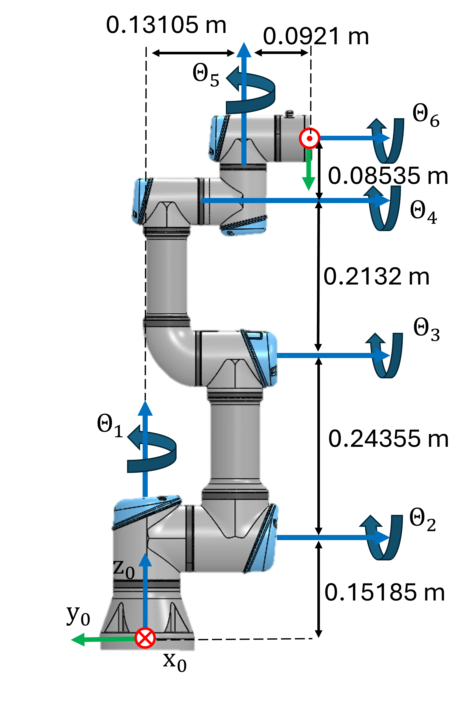

```matlab
clear all; 
```
# Ejercicio 3.1 \- Jacobiano 

En este ejercicio configurarás diferentes funciones relacionadas con el jacobiano de un robot UR3e. 


Considera este robot UR3e y sus dimensiones. 




# Tarea 1

Configura el jacobiano geométrico usando la toolbox simbólica. La expresión simbólica resultante debe depender solo de los estados articulares 

1.  Encuentra los parámetros DH y configura la matriz jacobiana.

Usa las siguientes variables para guardar tu solución:

-  q1 ... q6 (variable simbólica real para el ángulo articular Theta 1\-6) 
-  Jp (parte traslacional del jacobiano) 
-  Jtheta (parte rotacional del jacobiano) 
-  J (jacobiano completo como $J\left(q\right)=\left\lbrack \begin{array}{c} J_{\theta } \left(q\right)\newline J_p \left(q\right) \end{array}\right\rbrack$ )  

Resuelve este ejercicio usando el enfoque geométrico. Usa la función: 

-  cross() 

Resuelve este ejercicio sin usar la función: 

-  dh2tf() 

y sin usar la matriz de relación $T_A \left(\Phi \right)$: 

-  $\displaystyle T_A \left(\Phi \right)=\left\lbrack \begin{array}{ccc} 0 & -\sin \left(\phi \right) & \cos \left(\phi \right)\cdot \sin \left(\theta \right)\newline 0 & -\sin \left(\phi \right)\cdot \sin \left(\theta \right) & -\sin \left(\phi \right)\cdot \sin \left(\theta \right)\newline 1 & \cos \left(\theta \right) & \cos \left(\theta \right) \end{array}\right\rbrack$ 
```matlab
Jp = []; 
Jtheta = []; 
J = []; 
```

Puedes comprobar tu trabajo haciendo clic en Run: 

```matlab
 
check_exercise('3-1-1')
```
# Tarea 2

Escribe una función que calcule el jacobiano analítico (usando ángulos de Euler ZYZ) para una configuración dada. Esta función toma un vector como entrada: 

1.  configuraciones (q) como vector fila ( $q\in {\mathbb{R}}^{6\textrm{x1}}$ )

y devuelve el jacobiano analítico como $J_a \left(q\right)=\left\lbrack \begin{array}{c} J_{\Phi \;} \left(q\right)\newline J_p \left(q\right) \end{array}\right\rbrack$ y su rango en la configuración.


Usa el siguiente nombre de función para tu solución:

-   ComputeAnalyticalJacobian(q) 

Resuelve este ejercicio usando un enfoque analítico. Usa la función: 

-  diff() 

Resuelve este ejercicio sin usar la matriz de relación $T_A \left(\Phi \right)$: 

-  $\displaystyle T_A \left(\Phi \right)=\left\lbrack \begin{array}{ccc} 0 & -\sin \left(\phi \right) & \cos \left(\phi \right)\cdot \sin \left(\theta \right)\newline 0 & -\sin \left(\phi \right)\cdot \sin \left(\theta \right) & -\sin \left(\phi \right)\cdot \sin \left(\theta \right)\newline 1 & \cos \left(\theta \right) & \cos \left(\theta \right) \end{array}\right\rbrack$ 
```matlab
function [Ja, Rank] = ComputeAnalyticalJacobian(q)
```

```matlabTextOutput
Ja = 6x6
1.0000    0.0000    0.0000    0.0000    1.0000         0
         0   -0.0000   -0.0000   -0.0000    0.0000         0
         0    1.0000    1.0000    1.0000    0.0000    1.0000
    0.2231   -0.5421   -0.2985   -0.0853    0.0921         0
    0.0000         0         0         0    0.0000         0
         0    0.0000    0.0000    0.0000   -0.0000         0

Rank = 4
```

```matlab

Ja = []; 
Rank = rank(Ja); 

end
```

Puedes comprobar tu trabajo haciendo clic en Run: 

```matlab
 
check_exercise('3-1-2')
```

```matlabTextOutput
Error using fileread (line 10)
Could not open file exercises\exercise-3-1-2.json. No such file or directory.

Error in check_exercise (line 8)
    data = jsondecode( fileread(json_file) );
    ^^^^^^^^^^^^^^^^^^^^^^^^^^^^^^^^^^^^^^^^^
```

# Tarea 3

Escribe una función que calcule las velocidades articulares necesarias para lograr un movimiento traslacional específico del efector final para una configuración dada. Considera solo la posición del efector final y no su orientación. Esta función toma dos vectores como entrada: 

1.  configuración (q) como vector fila ( $q\in {\mathbb{R}}^{6\textrm{x1}}$ )
2. movimiento deseado v, relativo al sistema base, como vector fila donde $v=\left\lbrack \begin{array}{c} \dot{x} \newline \dot{y} \newline \dot{z}  \end{array}\right\rbrack$

y devuelve las velocidades articulares necesarias como vector fila ( $\dot{q} \in {\mathbb{R}}^{6\textrm{x1}}$ ) y el rango del jacobiano.


Usa el siguiente nombre de función para tu solución:

-   ComputeJointSpeed(q,v) 

Resuelve este ejercicio usando un enfoque geométrico. Usa la función: 

-  cross() 
```matlab
function [qdot , Rank]= ComputeJointSpeed(q,v)

qdot = []; 
Rank = []; 

end
```

Puedes comprobar tu trabajo haciendo clic en Run: 

```matlab
 
check_exercise('3-1-3')
```
# Tarea 4

Usa tu función de la Tarea 3 para calcular una trayectoria que siga el movimiento deseado. 


Aproxima los nuevos estados articulares mediante $q_{k+1} =q_k +\dot{q} \cdot \Delta t$, donde $\dot{q}$ es la velocidad articular calculada para la configuración $q_k$. 


La función toma cuatro entradas: 

1.  Configuración articular inicial (q)
2. movimiento deseado (v)
3. paso de tiempo (dt)
4. tiempo total (T)

La función tiene tres salidas: 

1.  Trayectoria de estados articulares ( $q_{\textrm{traj}} \in {\mathbb{R}}^{6\textrm{xN}}$ donde N es la cantidad de puntos en la trayectoria, normalmente $N=\frac{T}{\Delta t}$ )
2. Trayectoria de velocidades articulares ( $\dot{q_{\textrm{traj}} } \in {\mathbb{R}}^{6\textrm{xN}}$ )
3. Success, false si el manipulador alcanza una singularidad en las dimensiones del movimiento deseado (success $\in \left\lbrack \textrm{false},\textrm{true}\right\rbrack$ ). Si se alcanza una singularidad, la función debe terminar y enviar los estados articulares hasta la singularidad

Usa el siguiente nombre de función para tu solución:

-   ComputeLinearTrajectory(q, v, dt, T) 
```matlab
function [q_traj, qdot_traj, success] = ComputeLinearTrajectory(q,v, dt, T)

end
```

Puedes comprobar tu trabajo haciendo clic en Run: 

```matlab
 
check_exercise('3-1-4')
```

Puedes ver tu trayectoria en Rviz: 

```matlab
  

q_example = [-2.5408, -1.3607, 0.7146, 0.3767, 1.7134, 0]';
v_example = [-0.5;-0.5;0]; 
dt_example =0.01; 
T_example = 1; 
[q_traj_ex, q_dot_traj ,success_example] = ComputeLinearTrajectory(q_example, v_example, dt_example, T_example); 

if success_example
    JointStatesToRviz(q_traj_ex, 'ur3e', T_example);
else
    [~,points_until_singular,~] = size(q_traj_ex);
    Time_until_singular = points_until_singular*dt; 
    JointStatesToRviz(q_traj_ex, 'ur3e', Time_until_singular, 'Ellipsoid', true); 
end

plotTrajectory(q_traj_ex, q_dot_traj, linspace(0,T_example,T_example/dt_example))
```

Prueba a ajustar algunos parámetros y observa cómo se comporta la trayectoria. Ten en cuenta que el cálculo puede tardar algo de tiempo dependiendo de la resolución y del hardware. 