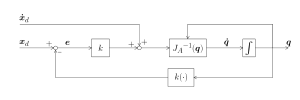

```matlab
clear all; 
```
# Ejercicio 3.2 \- Algoritmo de cinemática inversa

En este ejercicio configurarás un algoritmo de cinemática inversa usando la pseudoinversa del jacobiano. 


Considera este robot UR3e: 


Considera esta tabla DH para el UR3e: 

||||||
| :-: | :-- | :-: | :-: | :-: |
| Eslabón  | a $begin:math:display$m$end:math:display$  | alpha  | d $begin:math:display$m$end:math:display$  | theta   |
| 1  | 0  | pi/2  | 0.15185  | q1   |
| 2  | \-0.24355  | 0  | 0  | q2   |
| 3  | \-0.2132  | 0  | 0  | q3   |
| 4  | 0  | pi/2  | 0.13105  | q4   |
| 5  | 0  | \-pi/2  | 0.08535  | q5   |
| 6  | 0  | 0  | 0.0921  | q6   |


El esquema de control que debes implementar es: 





donde $k\left(\cdot \right)$ es la cinemática directa de q. 

# Tarea 1

Escribe una función que calcule una solución de cinemática inversa usando la pseudoinversa del jacobiano. La función tiene las siguientes entradas: 

1.  los estados articulares iniciales como vector fila ( $q_0 \in {\mathbb{R}}^{6\textrm{x1}}$ )
2. vector de pose deseada usando ángulos de Euler (ZYZ) $x_{\textrm{desired}} =\left\lbrack \begin{array}{c} x\newline y\newline z\newline \phi \newline \theta \newline \psi  \end{array}\right\rbrack$
3. ganancia (k)
4. tolerancia (tol)
5. máximo de iteraciones (Imax)

La función debe devolver los estados articulares necesarios como vector fila ( $q\in {\mathbb{R}}^{6\textrm{x1}}$ )


Para esta tarea, considera $\dot{x_d } =\left\lbrack \begin{array}{c} 0\newline 0\newline 0\newline 0\newline 0\newline 0 \end{array}\right\rbrack$ y $\Delta t=0\ldotp 01\;s$ 


Usa el siguiente nombre de función para tu solución:

-   PseudoInverseAlgorithm(q0, x\_desired, k, tol, Imax) 

Puedes usar la función siguiente para calcular la transformación simbólica desde la base hasta el efector final. 

-  dh2tf() 

Resuelve este ejercicio sin usar la función: 

-  inverseKinematics() 
```matlab
function q = PseudoInverseAlgorithm(q0, x_desired, k, tol, Imax)
syms q1 q2 q3 q4 q5 q6 real
DH=[
   %a       alpha       d       theta
   0        pi/2        0.15185  q1;
   -0.24355 0           0       q2;
   -0.2132  0           0       q3;
   0        pi/2        0.13105 q4;
   0        -pi/2       0.08535 q5;
   0        0           0.0921  q6;
    ];
```
DH = 

  $$ \displaystyle \left(\begin{array}{cccc} 0 & \frac{\pi }{2} & \frac{3037}{20000} & q_1 \newline -\frac{4871}{20000} & 0 & 0 & q_2 \newline -\frac{533}{2500} & 0 & 0 & q_3 \newline 0 & \frac{\pi }{2} & \frac{2621}{20000} & q_4 \newline 0 & -\frac{\pi }{2} & \frac{1707}{20000} & q_5 \newline 0 & 0 & \frac{921}{10000} & q_6  \end{array}\right) $$ 
 

```matlab

A06 = dh2tf(DH); 
```
ans = 

  $$ \displaystyle \begin{array}{l} \left(\begin{array}{cccc} \cos \left(q_6 \right)\,\sigma_3 -\sigma_1 \,\cos \left(q_1 \right)\,\sin \left(q_6 \right) & -\sin \left(q_6 \right)\,\sigma_3 -\sigma_1 \,\cos \left(q_1 \right)\,\cos \left(q_6 \right) & \cos \left(q_5 \right)\,\sin \left(q_1 \right)-\sigma_4 \,\cos \left(q_1 \right)\,\sin \left(q_5 \right) & \frac{2621\,\sin \left(q_1 \right)}{20000}-\frac{4871\,\cos \left(q_1 \right)\,\cos \left(q_2 \right)}{20000}+\frac{921\,\cos \left(q_5 \right)\,\sin \left(q_1 \right)}{10000}-\frac{921\,\sigma_4 \,\cos \left(q_1 \right)\,\sin \left(q_5 \right)}{10000}+\frac{1707\,\cos \left(q_2 +q_3 \right)\,\cos \left(q_1 \right)\,\sin \left(q_4 \right)}{20000}+\frac{1707\,\sin \left(q_2 +q_3 \right)\,\cos \left(q_1 \right)\,\cos \left(q_4 \right)}{20000}-\frac{533\,\cos \left(q_1 \right)\,\cos \left(q_2 \right)\,\cos \left(q_3 \right)}{2500}+\frac{533\,\cos \left(q_1 \right)\,\sin \left(q_2 \right)\,\sin \left(q_3 \right)}{2500}\newline -\cos \left(q_6 \right)\,\sigma_2 -\sigma_1 \,\sin \left(q_1 \right)\,\sin \left(q_6 \right) & \sin \left(q_6 \right)\,\sigma_2 -\sigma_1 \,\cos \left(q_6 \right)\,\sin \left(q_1 \right) & -\cos \left(q_1 \right)\,\cos \left(q_5 \right)-\sigma_4 \,\sin \left(q_1 \right)\,\sin \left(q_5 \right) & \frac{533\,\sin \left(q_1 \right)\,\sin \left(q_2 \right)\,\sin \left(q_3 \right)}{2500}-\frac{921\,\cos \left(q_1 \right)\,\cos \left(q_5 \right)}{10000}-\frac{4871\,\cos \left(q_2 \right)\,\sin \left(q_1 \right)}{20000}-\frac{2621\,\cos \left(q_1 \right)}{20000}-\frac{921\,\sigma_4 \,\sin \left(q_1 \right)\,\sin \left(q_5 \right)}{10000}+\frac{1707\,\cos \left(q_2 +q_3 \right)\,\sin \left(q_1 \right)\,\sin \left(q_4 \right)}{20000}+\frac{1707\,\sin \left(q_2 +q_3 \right)\,\cos \left(q_4 \right)\,\sin \left(q_1 \right)}{20000}-\frac{533\,\cos \left(q_2 \right)\,\cos \left(q_3 \right)\,\sin \left(q_1 \right)}{2500}\newline \sigma_4 \,\sin \left(q_6 \right)+\sigma_1 \,\cos \left(q_5 \right)\,\cos \left(q_6 \right) & \sigma_4 \,\cos \left(q_6 \right)-\sigma_1 \,\cos \left(q_5 \right)\,\sin \left(q_6 \right) & -\sigma_1 \,\sin \left(q_5 \right) & \frac{1707\,\sin \left(q_2 +q_3 \right)\,\sin \left(q_4 \right)}{20000}-\frac{4871\,\sin \left(q_2 \right)}{20000}-\sin \left(q_5 \right)\,{\left(\frac{921\,\cos \left(q_2 +q_3 \right)\,\sin \left(q_4 \right)}{10000}+\frac{921\,\sin \left(q_2 +q_3 \right)\,\cos \left(q_4 \right)}{10000}\right)}-\frac{1707\,\cos \left(q_2 +q_3 \right)\,\cos \left(q_4 \right)}{20000}-\frac{533\,\sin \left(q_2 +q_3 \right)}{2500}+\frac{3037}{20000}\newline 0 & 0 & 0 & 1 \end{array}\right)\\\mathrm{}\\\textrm{where}\\\mathrm{}\\\;\;\sigma_1 =\sin \left(q_2 +q_3 +q_4 \right)\\\mathrm{}\\\;\;\sigma_2 =\cos \left(q_1 \right)\,\sin \left(q_5 \right)-\sigma_4 \,\cos \left(q_5 \right)\,\sin \left(q_1 \right)\\\mathrm{}\\\;\;\sigma_3 =\sin \left(q_1 \right)\,\sin \left(q_5 \right)+\sigma_4 \,\cos \left(q_1 \right)\,\cos \left(q_5 \right)\\\mathrm{}\\\;\;\sigma_4 =\cos \left(q_2 +q_3 +q_4 \right)\end{array} $$ 
 

```matlab

q=[]; 

end

```

Puedes comprobar tu trabajo haciendo clic en Run: 

```matlab
 
check_exercise('3-2-1')
```
# Tarea 2

Amplía tu función anterior. 


Añade la entrada: 

-  dt (tiempo para el paso discreto del algoritmo) 

Añade las salidas: 

-  total\_time (tiempo que tarda el algoritmo en encontrar una solución) 
-  total\_iterations (iteraciones hasta encontrar la solución) 
-  solution\_error (error cuadrático de la pose para la configuración solución $\left({\textrm{error}}_{\textrm{solution}} \left(q\right)={e\left(q\right)}^T \cdot e\left(q\right)\right)$ ) 

Usa "tic" y "toc" para medir el tiempo de cálculo. 


Usa el siguiente nombre de función para tu solución:

-   ExtendedPseudoInverseAlgorithm(t\_desired, k, dt, tol, Imax) 

Resuelve este ejercicio sin usar la función: 

-  inverseKinematics() 
```matlab
function [q,total_time,total_iterations,solution_error] = ExtendedPseudoInverseAlgorithm(t_desired, k, dt, tol, Imax)

q=[]; 
total_time = []; 
total_iterations=[]; 
solution_error = []; 

end
```

Analiza cómo se comporta tu algoritmo cuando cambias la tolerancia, la ganancia o el paso de tiempo. 