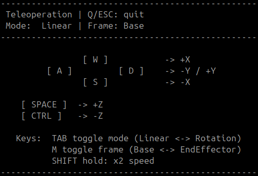

```matlab
clear all
```
# Ejercicio 3.3 \- Teleoperación por velocidad

En este ejercicio escribirás un código para teleoperar un robot Universal de tu elección. 


Al usar una interfaz de teleoperación, usarás tu teclado para controlar un robot simulado. 

# Tarea: 

Escribe un código que mapee la velocidad cartesiana deseada al espacio articular y envíe las velocidades articulares al entorno de simulación. La velocidad cartesiana que se debe controlar está referida al sistema Base o al sistema EndEffector. 

# Herramientas: 

Puedes usar funciones predefinidas para recuperar información del entorno de simulación. 

-  GetJointStates() devuelve un vector que contiene la configuración actual como $\vec{q} \in {\mathbb{R}}^{6\textrm{x1}}$ 
-  GetTeleoperation() devuelve un vector que contiene la velocidad cartesiana como $\vec{v} =\left\lbrack \begin{array}{c} \dot{x} \newline \dot{y} \newline \dot{z} \newline \omega_x \newline \omega_y \newline \omega_z  \end{array}\right\rbrack$ y  

&nbsp;&nbsp;&nbsp;&nbsp;&nbsp;&nbsp;&nbsp;&nbsp;&nbsp;&nbsp;&nbsp;&nbsp;&nbsp;&nbsp;&nbsp; una cadena que contiene el sistema de referencia actual como $\textrm{Mode}\in \left\lbrack \textrm{"Base"},\textrm{"EndEffector"}\right\rbrack$ 

-  SendJointSpeeds(q\_dot) publicará las velocidades articulares calculadas en el entorno de simulación 
# Consejos de implementación: 
-  Puedes elegir modelar el robot usando la Robotic System Toolbox o la Symbolic Toolbox.  
-  Usa la función waitfor(time) para implementar un retardo entre publicaciones; empieza con una frecuencia de 50 Hz.  
### Pistas: 
-  Recuerda que la Robotic System Toolbox devuelve el jacobiano como $J=\left\lbrack \begin{array}{c} J_{\Theta \;} \newline J_p  \end{array}\right\rbrack$ 
-  Si norm(q\_dot) > 1, deberías normalizar las velocidades como $q_{\textrm{dot},\textrm{norm}} =\frac{q_{\textrm{dot}} }{\textrm{norm}\left(q_{\textrm{dot}} \right)}$; esto te permite analizar mejor el comportamiento cerca de singularidades.  
-  Dependiendo de la potencia de procesamiento de tu ordenador, puede que puedas representar el elipsoide de manipulabilidad llamando a JointStatesToRviz(q, ur\_model, $begin:math:display$ $end:math:display$, 'Ellipsoid', true, 'SendJointStates', false) con la configuración actual. Si estás usando un sistema operativo Windows con Docker, esto puede volverse lento. Puedes intentar disminuir la resolución del elipsoide con JointStatesToRviz(q, ur\_model, $begin:math:display$ $end:math:display$, 'Ellipsoid', true, 'EllipsoidResolution', 15, 'SendJointStates', false) o publicarlo solo cada n pasos.  
# Interfaz de teleoperación

El programa de teleoperación da las siguientes opciones de entrada: 


Velocidad deseada (lineal o angular) controlada mediante las teclas W\-A\-S\-D\-SPACE\-CTRL; consulta el terminal para más información)

-  W para ${\dot{x} }^+ \;\textrm{o}\;\omega_x^+$ 
-  S para ${\dot{x} }^- \;\textrm{o}\;\omega_x^-$ 
-  D para ${\dot{y} }^+ \;\textrm{o}\;\omega_y^+$ 
-  A para ${\dot{y} }^- \;\textrm{o}\;\omega_y^-$ 
-  SPACE para ${\dot{z} }^+ \;\textrm{o}\;\omega_z^+$ 
-  CTRL (Control) para  ${\dot{z} }^- \;\textrm{o}\;\omega_z^-$ 

Puedes alternar entre velocidad angular o lineal pulsando: 

-  TAB  

Puedes alternar el sistema de referencia de "Base" a "EndEffector" pulsando: 

-  M 

Puedes duplicar el comando de velocidad manteniendo pulsado: 

-  SHIFT 

Para detener el programa, pulsa: 

-  q o ESC 

Puedes ver los controles en el terminal: 




# Iniciar aplicaciones: 

Para iniciar los programas y simulaciones necesarios, ejecuta (una vez): 

```matlab
% StartTutorialApplication('Simulation', 'Controller','Speed','model','ur5e'); 
% StartTutorialApplication('Teleoperation');
```

Si ejecutas esto en un sistema Ubuntu nativo (sin Docker): 

```matlab
StartTutorialApplication('Simulation', 'Controller', 'Speed', 'Docker',false,'model','ur5e'); 
StartTutorialApplication('Teleoperation', 'Docker', false);
```

Para ver la trayectoria del efector final puedes ejecutar: 

```matlab
% StartTutorialApplication('Trajectory'); 
% Si usas ROS en un sistema Ubuntu nativo, usa: 
StartTutorialApplication('Trajectory', 'Docker', false);
```
# Código aquí: 
```matlab
%%añade aquí tu código de configuración: 

while true
    try %%try ayuda a evitar que el código falle al iniciarlo antes de que los programas estén ejecutándose
        %%añade aquí tu código del bucle: 


    end
end
```