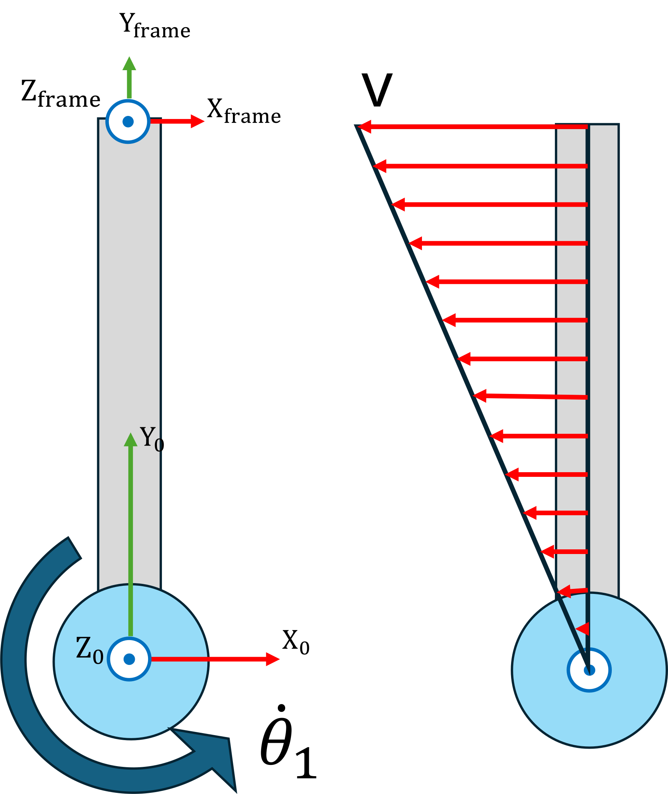
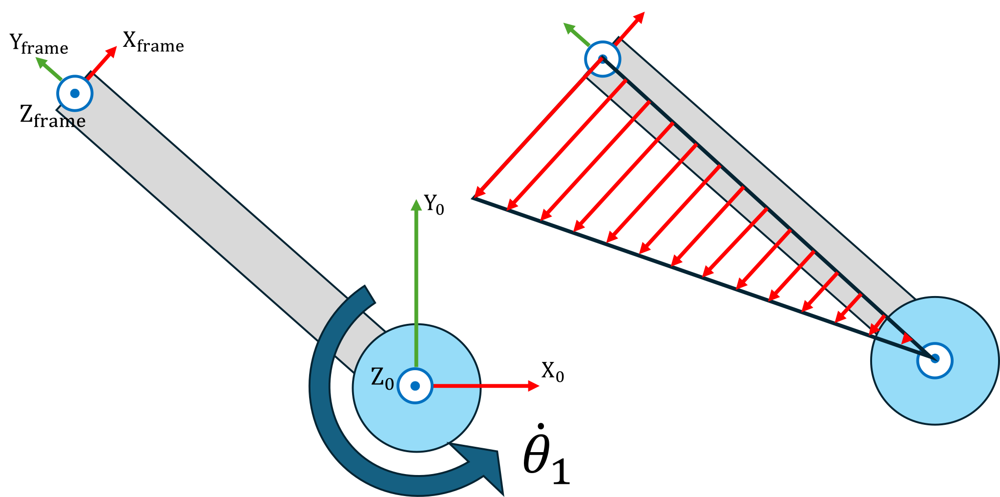
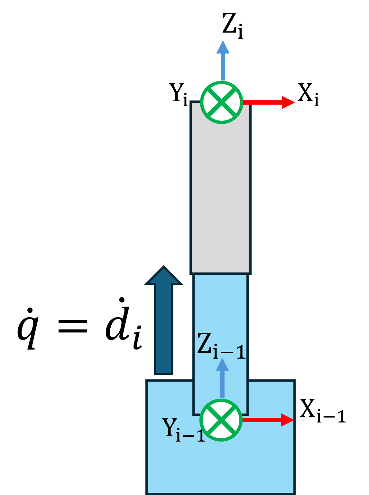

# Cinemática diferencial \- Jacobianos

La cinemática diferencial es el estudio de cómo los cambios infinitesimales en las coordenadas articulares de un robot se traducen en velocidades lineales y angulares instantáneas de su efector final. Al centrarse en relaciones de velocidad en lugar de desplazamientos finitos, proporciona la base para el control de velocidad, el seguimiento de trayectorias y la planificación de movimiento en tiempo real en manipuladores robóticos.


En el núcleo de la cinemática diferencial se encuentra el **jacobiano geométrico**, J(q), que mapea el vector de velocidades articulares $\dot{\;q}$ a la velocidad espacial del efector final, $v=\left\lbrack \begin{array}{c} \dot{\;p} \newline \omega  \end{array}\right\rbrack =\left\lbrack \begin{array}{c} \dot{\;x} \newline \dot{\;y} \newline \dot{\;z} \newline \omega_x \newline \omega_y \newline \omega_z  \end{array}\right\rbrack$, mediante $v=J\left(q\right)\cdot \dot{\;q}$. 


Aquí, el bloque superior de J(q) captura cómo los movimientos articulares inducen velocidad traslacional, mientras que el bloque inferior captura la velocidad angular inducida.


Además de la forma geométrica, a menudo se trabaja con el **jacobiano analítico**, que relaciona las velocidades articulares con la derivada temporal de una parametrización de orientación elegida (por ejemplo, ángulos de Euler ZYZ). Esto requiere una transformación adicional que tenga en cuenta la cinemática de la representación de orientación, asegurando compatibilidad con las coordenadas angulares que se usen para control o especificación de trayectorias.

# Jacobiano geométrico

El jacobiano geométrico puede dividirse en dos partes. 

 $$ J\left(q\right)=\left\lbrack \begin{array}{c} J_p \left(q\right)\newline J_{\Theta } \left(q\right) \end{array}\right\rbrack $$ 

la parte traslacional $J_p \left(q\right)\in {\mathbb{R}}^{3\;x\;n}$ 


y la parte rotacional $J_{\Theta } \left(q\right)\in \mathbb{R}{\;}^{3\;x\;n\;}$ 


para n articulaciones. 


Imagina una sola articulación que rota a una velocidad angular constante $\dot{\;\theta \;}$. Como toda la articulación rotará a esta velocidad angular, podemos visualizar las velocidades lineales en un momento dado. La velocidad respecto al eje articular puede calcularse como $||\vec{\;v} ||=\dot{\theta} \cdot \textrm{distancia}\;\textrm{al}\;\textrm{centro}\;\textrm{de}\;\textrm{rotación}$, lo que da como resultado un aumento de la velocidad lineal con la distancia al eje. Observa la imagen siguiente: puedes ver que, en esta configuración, una rotación de $\dot{\theta_1 }$ dará como resultado una velocidad en la dirección x, y ninguna velocidad en la dirección y o z. 





En la siguiente configuración, la situación ha cambiado. Aunque sigue sin haber velocidad en la dirección z, el vector de velocidad ahora tiene una componente no nula en x e y. Observa cómo un jacobiano solo es válido para la configuración articular para la que se calculó, por lo que debe recalcularse para cada instante de tiempo. 




## Parte de traslación $J_p \left(q\right)$ \- Articulaciones rotativas

Para encontrar la dirección de la velocidad, usas el producto vectorial. Recuerda que el producto vectorial de dos vectores da como resultado un vector perpendicular a los vectores usados en su cálculo. Para esta aplicación, queremos encontrar el vector que es perpendicular tanto al eje articular (z) como a la dirección hacia el efector final o sistema objetivo. El tamaño (magnitud) de este vector estará definido por la distancia (longitud) al efector final, ya que la longitud del eje z es $\vec{\;z_i } =A_{i-1}^0 \cdot \;\;\left\lbrack \begin{array}{c} 0\newline 0\newline 1 \end{array}\right\rbrack$ con $||\vec{\;z_i } ||=1$ 


La fórmula es

 $$ J_{p,i} \;\left(q\right)=\vec{\;z_{i-1} } \times \left(p_{\textrm{ee}} -p_{i-1} \right) $$ 

donde debes considerar todas las articulaciones y eslabones que vienen después de la articulación dada, ya que una rotación de la base influirá en todas las articulaciones consecutivas en la dirección del efector final. 


Abajo puedes ver una imagen que ilustra cómo puede comportarse la velocidad del efector final si se accionan varias articulaciones. Observa cómo la Articulación 1 impacta tanto el sistema Z1 como el sistema EE, mientras que la segunda articulación solo influye en el sistema objetivo. 


## Parte de traslación $J_p \left(q\right)$ \- Articulaciones prismáticas

La parte traslacional para articulaciones prismáticas se calcula de forma más sencilla, ya que la velocidad del actuador $\dot{\;q}$ es directamente la velocidad de la articulación. Por tanto, la magnitud del vector de velocidad es

 $$ ||\vec{\;v} ||=\dot{\;q} =\dot{\;d} =||\;\vec{\;z} \cdot \dot{\;q} \;|| $$ 




La fórmula es 

 $$ J_{p,i} \;\left(q\right)=\vec{\;z_{i-1} } =A_{i-1}^0 \cdot \;\;\left\lbrack \begin{array}{c} 0\newline 0\newline 1 \end{array}\right\rbrack $$ 
### Vector de velocidad a partir de la parte de traslación $J_{p\;} \left(q\right)$ 

Para calcular el vector de velocidad, multiplica el vector de velocidades articulares como: 

 $$ \left\lbrack \begin{array}{c} \dot{x\;} \newline \dot{y\;} \newline \dot{z\;}  \end{array}\right\rbrack =J_p \left(q\right)\cdot \dot{\;q} $$ 
## Parte rotacional $J_{\Theta } \left(q\right)$ \- Articulaciones rotativas

De forma similar a la traslación de una articulación prismática, la parte rotacional de $J_{\Theta } \left(q\right)$ es la velocidad articular. 

 $$ ||\omega_i ||=\dot{\;q} =\dot{\;\theta \;} $$ 

ahora 

 $$ J_{\theta ,i} \;\left(q\right)=\vec{\;z_{i-1} } $$ 
## Parte rotacional $J_{\Theta } \left(q\right)$ \- Articulaciones prismáticas

Las articulaciones prismáticas solo actúan linealmente, por lo que la parte rotacional se vuelve 0. 

 $$ J_{\Theta ,i} \;\left(q\right)=0 $$ 
### Vector de velocidad a partir de la parte rotacional $J_{\Theta } \left(q\right)$ 

Para usar la parte rotacional del jacobiano, multiplica el vector de velocidades articulares como: 

 $$ \left\lbrack \begin{array}{c} \omega_x \;\newline \omega_y \newline \omega_z  \end{array}\right\rbrack =J_{\Theta \;} \left(q\right)\cdot \dot{\;q} $$ 
## Implementación en MATLAB


considera los parámetros DH de un brazo antropomórfico:

||||||
| :-: | :-- | :-: | :-: | :-- |
| Eslabón  | a $begin:math:display$m$end:math:display$  | alpha  | d $begin:math:display$m$end:math:display$  | theta   |
| 1  | 0  | pi/2  | 0  | $\displaystyle \theta_1$   |
| 2  | 0.3  | 0  | 0  | $\displaystyle \theta_2$   |
| 3  |   0.4  | pi/2  | 0  | $\displaystyle \theta_3$   |

```matlab
syms q1 q2 q3 q4 q5 q6 real 
% Tabla de parámetros DH
        % a      alpha      d       theta
DH = [    0,     pi/2,     0,       q1;    % Eslabón 1
          0.3,   0,        0,       q2;    % Eslabón 2
          0.4,   0,        0,       q3;    % Eslabón 3
          ]; 

A01 = dh2tf(DH(1,:)); 
A12 = dh2tf(DH(2,:));
A23 = dh2tf(DH(3,:));

A02 = A01 * A12; 
A03 = A02 * A23; 

R01 = A01(1:3,1:3); 
R02 = A02(1:3,1:3);
R03 = A03(1:3,1:3); 

z0 = [0;0;1]; 
z1 = R01 * z0; 
z2 = R02 * z0; 

p0 = [0;0;0]; 
p1 = A01(1:3,4); 
p2 = A02(1:3,4); 

pee=A03(1:3,4); 

Jp1 = cross(z0,(pee-p0));
Jp2 = cross(z1, (pee - p1));
Jp3 = cross(z2, (pee - p2));

J(1:3,:) = [Jp1,Jp2,Jp3]; 
J(4:6,:) = [z0, z1, z2];

simplify(J)

Config = [0,-pi/2,0]; 

% Sustituye las variables articulares por los valores de configuración
J_substituted = subs(J, [q1, q2, q3], Config(1:3))

```
### Implementación con Robotic System Toolbox

Podemos usar la Robotic System Toolbox para obtener el jacobiano geométrico. Sin embargo, la función geometricJacobian devuelve el jacobiano en el formato: 

 $$ J=\left\lbrack \begin{array}{c} J_{\Theta \;} \newline J_p  \end{array}\right\rbrack $$ 

Observa cómo la parte de traslación y la de rotación están intercambiadas. 

```matlab
ur3e = loadrobot("universalUR3e", "DataFormat", "column"); 
Config2 = [0,-pi/3,pi/7,pi/2,pi/2,0]';
J_toolbox = geometricJacobian(ur3e, Config2, 'tool0')
J_p_toolbox = J_toolbox(4:6,:); 
J_theta_toolbox = J_toolbox(1:3,:); 
```
# Jacobiano analítico

El jacobiano analítico relaciona directamente las velocidades articulares de un manipulador con las derivadas temporales de una parametrización de posición–orientación elegida del efector final, como ángulos de Euler o roll–pitch–yaw.


A diferencia del jacobiano geométrico, que usa vectores de velocidad angular para la parte rotacional, el jacobiano analítico expresa tanto el movimiento lineal como el angular en términos que coinciden con la representación de coordenadas elegida. La parte de velocidad lineal se obtiene derivando el vector de posición del efector final respecto a las variables articulares, mientras que la parte angular se obtiene transformando la velocidad angular en tasas de los parámetros de orientación mediante una matriz de mapeo dependiente de la configuración.


Esta forma es particularmente útil cuando las leyes de control, la planificación de trayectorias o las restricciones se especifican directamente en coordenadas de posición–orientación en lugar de en forma de velocidad espacial.


El jacobiano analítico consta de dos partes: 

 $$ J_A \left(q\right)=\left\lbrack \begin{array}{c} J_p \left(q\right)\newline J_{\Phi } \left(q\right) \end{array}\right\rbrack =\left\lbrack \begin{array}{c} \frac{\partial p_{\textrm{ee}} }{\partial q}\newline \frac{\partial \;\Phi_{\textrm{ee}} \;}{\partial q} \end{array}\right\rbrack $$ 

A diferencia del jacobiano geométrico, usando el enfoque de cálculo analítico del jacobiano, solo hay una fórmula para articulaciones prismáticas y rotativas.

## Parte de traslación $J_p \left(q\right)$ 

Como el jacobiano analítico se basa en derivación, mapea directamente los cambios en estados articulares a velocidades (y por tanto a posición), sin usar relaciones geométricas. Las partes de traslación del jacobiano geométrico y analítico son idénticas. 


Dado un vector de traslación del efector final $p_{\textrm{ee}}$ (aquí el brazo antropomórfico), la parte traslacional $J_p \left(q\right)$ se calcula de la siguiente forma: 

 $$ p_{\textrm{ee}} =\left\lbrack \begin{array}{c} \cos \left(q_1 \right)\cdot \left(a_2 \cdot \cos \left(q_2 \right)+a_3 \cdot \cos \left(q_2 +q_3 \right)\right)\newline \sin \left(q_1 \right)\cdot \left(a_2 \cdot \cos \left(q_2 \right)+a_3 \cdot \cos \left(q_2 +q_3 \right)\right)\newline a_2 \cdot \sin \left(q_2 \right)+a_3 \cdot \sin \left(q_2 +q_3 \right) \end{array}\right\rbrack =\left\lbrack \begin{array}{c} x\newline y\newline z \end{array}\right\rbrack $$ 

 $$ J_p (\mathbf{q})=\left\lbrack \begin{array}{ccc} \frac{\partial x}{\partial q_1 } & \frac{\partial x}{\partial q_2 } & \frac{\partial x}{\partial q_3 }\newline \frac{\partial y}{\partial q_1 } & \frac{\partial y}{\partial q_2 } & \frac{\partial y}{\partial q_3 }\newline \frac{\partial z}{\partial q_1 } & \frac{\partial z}{\partial q_2 } & \frac{\partial z}{\partial q_3 } \end{array}\right\rbrack =\left\lbrack \begin{array}{ccc} -\sin (q_1 )\cdot \big(a_2 \cdot \cos (q_2 )+a_3 \cdot \cos (q_2 +q_3 )\big) & -\cos (q_1 )\cdot \big(a_2 \cdot \sin (q_2 )+a_3 \cdot \sin (q_2 +q_3 )\big) & -\cos (q_1 )\cdot a_3 \cdot \sin (q_2 +q_3 )\newline \cos (q_1 )\cdot \big(a_2 \cdot \cos (q_2 )+a_3 \cdot \cos (q_2 +q_3 )\big) & -\sin (q_1 )\cdot \big(a_2 \cdot \sin (q_2 )+a_3 \cdot \sin (q_2 +q_3 )\big) & -\sin (q_1 )\cdot a_3 \cdot \sin (q_2 +q_3 )\newline 0 & a_2 \cdot \cos (q_2 )+a_3 \cdot \cos (q_2 +q_3 ) & a_3 \cdot \cos (q_2 +q_3 ) \end{array}\right\rbrack . $$ 

## Parte rotacional $J_{\Phi \;} \left(q\right)$ \- ZYZ 

Para calcular la parte rotacional del jacobiano analítico, primero hay que decidir qué representación angular usar. 


Ejemplo: 


Para los ángulos de Euler ZYZ $\phi ,\theta \;$ y $\psi \;$ necesitas encontrar una expresión que represente los ángulos en términos de la matriz de rotación del efector final. Consulta el tutorial "Transforms" en la sección Modelling para otras representaciones. 


Dada la matriz de rotación del efector final $R_{\textrm{ee}}$:

 $$ R_{ee} =\Phi_{ee} =\left\lbrack \begin{array}{ccc} \cos (q_1 )\cdot \cos (q_2 +q_3 ) & -\cos (q_1 )\cdot \sin (q_2 +q_3 ) & \sin (q_1 )\newline \sin (q_1 )\cdot \cos (q_2 +q_3 ) & -\sin (q_1 )\cdot \sin (q_2 +q_3 ) & -\cos (q_1 )\newline \sin (q_2 +q_3 ) & \cos (q_2 +q_3 ) & 0 \end{array}\right\rbrack =\left\lbrack \begin{array}{ccc} r_{11}  & r_{12}  & r_{13} \newline r_{21}  & r_{22}  & r_{23} \newline r_{31}  & r_{32}  & r_{33}  \end{array}\right\rbrack =R_z (\phi )\cdot R_{y^{\prime } } (\theta )\cdot R_{z^{\prime \prime } } (\psi ) $$ 

 $$ \begin{array}{l} \phi =atan2(r_{23} ,\,r_{13} )=atan2\big(-\cos (q_1 ),\,\sin (q_1 )\big)=q_1 -\frac{\pi }{2}\newline \theta =atan2\big(\sqrt{r_{13}^2 +r_{23}^2 },\,r_{33} \big)=atan2(1,\,0)=\frac{\pi }{2}\newline \psi =atan2(r_{32} ,\,-r_{31} )=atan2\big(\cos (q_2 +q_3 ),\,-\sin (q_2 +q_3 )\big)=q_2 +q_3 +\frac{\pi }{2} \end{array} $$ 

ahora, derivar estos ángulos respecto a las articulaciones da la parte rotacional del jacobiano $J_{\Phi \;} \left(q\right)$ 

 $$ J_{\phi } (\mathbf{q})=\left\lbrack \begin{array}{ccc} \frac{\partial \phi }{\partial q_1 } & \frac{\partial \phi }{\partial q_2 } & \frac{\partial \phi }{\partial q_3 }\newline \frac{\partial \theta }{\partial q_1 } & \frac{\partial \theta }{\partial q_2 } & \frac{\partial \theta }{\partial q_3 }\newline \frac{\partial \psi }{\partial q_1 } & \frac{\partial \psi }{\partial q_2 } & \frac{\partial \psi }{\partial q_3 } \end{array}\right\rbrack =\left\lbrack \begin{array}{ccc} 1 & 0 & 0\newline 0 & 0 & 0\newline 0 & 1 & 1 \end{array}\right\rbrack $$ 
### Conversión entre $J_{\Theta } \left(q\right)$ y $J_{\Phi } \left(q\right)$ 

Las partes rotacionales de los jacobianos geométrico y analítico están relacionadas por la matriz $T_A \left(\Phi \right)$ y pueden convertirse entre sí. 

 $$ J_{\Theta \;} \left(q\right)=T_A \left(\Phi \right)\cdot J_{\Phi } \left(q\right) $$ 

con 

 $$ T_A \left(\Phi \right)=\left\lbrack \begin{array}{ccc} 0 & -\sin \left(\phi \right) & \cos \left(\phi \right)\cdot \sin \left(\theta \right)\newline 0 & -\sin \left(\phi \right)\cdot \sin \left(\theta \right) & -\sin \left(\phi \right)\cdot \sin \left(\theta \right)\newline 1 & \cos \left(\theta \right) & \cos \left(\theta \right) \end{array}\right\rbrack $$ 

 $$ J_{\Theta } (\mathbf{q})=T_A (\Phi )\cdot J_{\Phi } (q)=\left\lbrack \begin{array}{ccc} 0 & -\sin (\phi ) & \cos (\phi )\cdot \sin (\theta )\newline 0 & \cos (\phi ) & \sin (\phi )\cdot \sin (\theta )\newline 1 & 0 & \cos (\theta ) \end{array}\right\rbrack \cdot \left\lbrack \begin{array}{ccc} 1 & 0 & 0\newline 0 & 0 & 0\newline 0 & 1 & 1 \end{array}\right\rbrack =\left\lbrack \begin{array}{ccc} 0 & \cos (\phi )\cdot \sin (\theta ) & \cos (\phi )\cdot \sin (\theta )\newline 0 & \sin (\phi )\cdot \sin (\theta ) & \sin (\phi )\cdot \sin (\theta )\newline 1 & \cos (\theta ) & \cos (\theta ) \end{array}\right\rbrack $$ 

como $\phi =q_1 -\frac{\pi }{2}$ y $\theta =\frac{\pi }{2}$, entonces $\cos \left(\phi \right)=\sin \left(q_1 \right),\;\;\;\sin \left(\phi \right)=-\cos \left(q_1 \right),\;\;\cos \left(\theta \right)=0$ y $\sin \left(\theta \right)=1$. Por tanto: 

 $$ J_{\Theta } \left(q\right)=\left\lbrack \begin{array}{ccc} 0 & \sin \left(q_1 \right) & \sin \left(q_1 \right)\newline 0 & -\cos \left(q_1 \right) & -\cos \left(q_1 \right)\newline 1 & 0 & 0 \end{array}\right\rbrack $$ 
### Vector de velocidad a partir de la parte rotacional $J_{\Phi \;} \left(q\right)$ 

Para usar la parte rotacional del jacobiano, multiplica el vector de velocidades articulares como: 

 $$ \left\lbrack \begin{array}{c} \dot{\;\phi \;} \newline \dot{\;\theta \;} \newline \dot{\;\psi \;}  \end{array}\right\rbrack =J_{\Phi } \left(q\right)\cdot \dot{\;q} $$ 
## Implementación en MATLAB
```matlab
 Jpa_1 = diff(pee, q1);
 Jpa_2 = diff(pee, q2);
 Jpa_3 = diff(pee, q3);
 
 Ree = simplify(R03); 
 
 phi = atan2(Ree(2,3), Ree(1,3)); 
 theta = atan2(sqrt(Ree(1,3)^2+Ree(2,3)^2),Ree(3,3));
 psi = atan2(Ree(3,2), -Ree(3,1)); 

 Jphi = [phi; theta; psi]; 

 Jphi_1 = diff(Jphi, q1); 
 Jphi_2 = diff(Jphi, q2); 
 Jphi_3 = diff(Jphi, q3);

 J_A = simplify([Jpa_1,Jpa_2,Jpa_3; ...
     Jphi_1, Jphi_2, Jphi_3]) 
```
J_A = 

  $$ \displaystyle \begin{array}{l} \left(\begin{array}{ccc} -\frac{\sin \left(q_1 \right)\,\sigma_2 }{10} & -\frac{\cos \left(q_1 \right)\,\sigma_1 }{10} & -\frac{2\,\sin \left(q_2 +q_3 \right)\,\cos \left(q_1 \right)}{5}\newline \frac{\cos \left(q_1 \right)\,\sigma_2 }{10} & -\frac{\sin \left(q_1 \right)\,\sigma_1 }{10} & -\frac{2\,\sin \left(q_2 +q_3 \right)\,\sin \left(q_1 \right)}{5}\newline 0 & \sigma_3 +\frac{3\,\cos \left(q_2 \right)}{10} & \sigma_3 \newline 1 & 0 & 0\newline 0 & 0 & 0\newline 0 & 1 & 1 \end{array}\right)\\\mathrm{}\\\textrm{where}\\\mathrm{}\\\;\;\sigma_1 =4\,\sin \left(q_2 +q_3 \right)+3\,\sin \left(q_2 \right)\\\mathrm{}\\\;\;\sigma_2 =4\,\cos \left(q_2 +q_3 \right)+3\,\cos \left(q_2 \right)\\\mathrm{}\\\;\;\sigma_3 =\frac{2\,\cos \left(q_2 +q_3 \right)}{5}\end{array} $$ 
 

```matlab

 J_A_subs = subs(J_A, [q1,q2,q3], Config)
```
J_A_subs = 

  $$ \displaystyle \left(\begin{array}{ccc} 0 & \frac{7}{10} & \frac{2}{5}\newline 0 & 0 & 0\newline 0 & 0 & 0\newline 1 & 0 & 0\newline 0 & 0 & 0\newline 0 & 1 & 1 \end{array}\right) $$ 