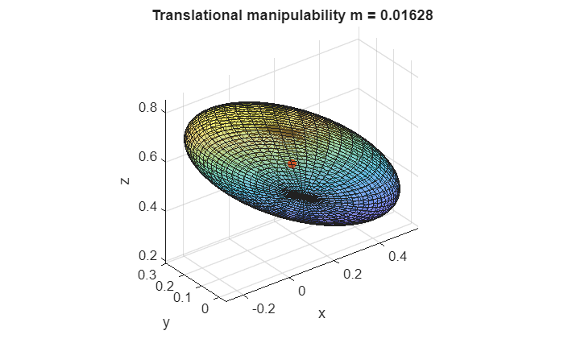
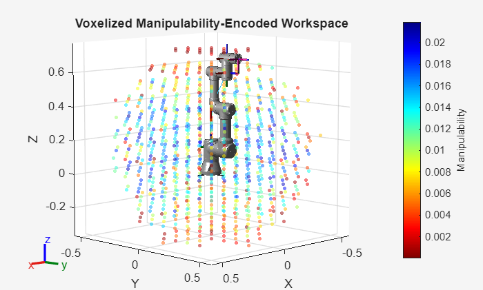
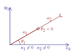

# Manipulabilidad

La manipulabilidad es un concepto clave en robótica que cuantifica con qué facilidad un manipulador puede producir movimiento o ejercer fuerzas en diferentes direcciones desde una configuración dada. Está estrechamente vinculada a las propiedades de la matriz jacobiana del robot, que mapea velocidades articulares a velocidades del efector final. Al estudiar el *rango* del jacobiano, podemos determinar si el robot puede alcanzar velocidades arbitrarias en el espacio de tarea o si está operando bajo restricciones. Las situaciones en las que el jacobiano pierde rango se conocen como *singularidades*. En estas configuraciones *singulares*, ciertas direcciones de movimiento se vuelven inalcanzables o requieren velocidades articulares desproporcionadamente grandes. Por el contrario, los robots con más articulaciones que el mínimo requerido para realizar una tarea presentan *redundancia*, que puede explotarse para mejorar la manipulabilidad, evitar obstáculos u optimizar criterios secundarios. Entender estos conceptos interrelacionados es esencial para una planificación del movimiento, un control y una operación segura eficaces de manipuladores robóticos.


**1. Elipsoides de manipulabilidad**


Podemos visualizar la manipulabilidad como un elipsoide. 


Al proyectar el jacobiano en el espacio de tarea, podemos visualizar el conjunto de velocidades alcanzables del efector final para una norma unitaria de velocidades articulares. Los valores propios y vectores propios de $J_p$ o $J_{\Theta \;}$ definen la forma del elipsoide, donde los vectores propios corresponden a la dirección y el valor propio a la longitud de ese eje. Este conjunto forma un **elipsoide**:

-  **Ejes grandes** → el movimiento es fácil en esa dirección. 
-  **Ejes pequeños** → el movimiento está limitado. 
-  **Ejes colapsados** → el movimiento es imposible en esa dirección (singularidad). 

Considera el robot UR3e en una configuración aleatoria

```matlab
ur3e = loadrobot("universalUR3e", "DataFormat","column");

%config = [0,-pi/2,0,-pi/2,0,0]'; 
config = randomConfiguration(ur3e); 
config = [0,-pi/1.5, pi/2.5, -pi/2,-pi/2,0]'; 
% config = [0,-pi/2,0,-pi/2,0,0]'; 
```

para cada parte del jacobiano (traslación y rotación), podemos calcular los ejes usando la descomposición en valores singulares (SVD). Con 

 $$ J_t \;=U*\Sigma *V\prime $$ 

donde $U$ es una matriz de los vectores de los semiejes del elipsoide, $\Sigma$ contiene los valores singulares, $\sigma_i$, que son iguales a la longitud de los ejes. Finalmente, $V$ contiene la configuración relativa para conseguir velocidades en los ejes de $U$. 


El índice de manipulabilidad es el volumen del elipsoide. 


Para calcular el índice de manipulabilidad para una configuración específica:

 $$ m_{\textrm{trans}} =\sqrt{\det \left(J_p \cdot J_p^T \right)}=\sqrt{\lambda_1 \cdot \lambda_2 \cdot \lambda_3 }=\sigma_1 \cdot \sigma_2 \cdot \sigma_3 $$ 

y


 $m_{\textrm{rot}} =\sqrt{\det \left(J_{\Theta } \cdot J_{\Theta \;\;} \right)}$ o $\sqrt{\det \left(J_{\Phi \;} \cdot J_{\Phi \;} \right)}=\sqrt{\lambda_1 \cdot \lambda_2 \cdot \lambda_3 }=\sigma_1 \cdot \sigma_2 \cdot \sigma_3$ 

```matlab
J  = geometricJacobian(ur3e, config, "tool0");   % 6×6, sistema base
J_r = J(1:3,:); 
J_t = J(4:6,:);   
T = getTransform(ur3e, config, 'tool0'); 
p_ee = T(1:3,4); 

% SVD: J_t = U*S*V'

[U_t,S_t,~] = svd(J_t,'econ');                        % U: ejes (sistema base), S: diag(σ)
trans_axes_lengths = diag(S_t)';                          % [σ1 σ2 σ3]
m_t = prod(trans_axes_lengths)                           % índice de manipulabilidad
```

```matlabTextOutput
m_t = 0.0163
```

```matlab

[U_r,S_r,~] = svd(J_r,'econ');                        % U: ejes (sistema base), S: diag(σ)
rot_axes_lengths = diag(S_r)';                          % [σ1 σ2 σ3]
m_r = prod(rot_axes_lengths)   
```

```matlabTextOutput
m_r = 2.4495
```

```matlab

% % Esfera unitaria -> elipsoide: E = U*S*[puntos de la esfera]
[xu,yu,zu] = sphere(50);
P_t = [xu(:)'; yu(:)'; zu(:)'];                           % 3×N
E_t = U_t*S_t*P_t;                                        % 3×N, sistema base
x_t = reshape(E_t(1,:), size(xu))+p_ee(1);
y_t = reshape(E_t(2,:), size(yu))+p_ee(2);
z_t = reshape(E_t(3,:), size(zu))+p_ee(3);

figure; surf(x_t,y_t,z_t,'FaceAlpha',0.4'); hold on;

plot3(p_ee(1),p_ee(2),p_ee(3),'.','MarkerSize',20,'Color','r');
axis equal; grid on; xlabel x; ylabel y; zlabel z;
title(sprintf('Translational manipulability m = %.4g', m_t)); hold off; 
```



ver en Rviz

```matlab
JointStatesToRviz(config, 'ur3e', [],  'Ellipsoid', true);
```
## Robotic System Toolbox

Usando la Robotic System Toolbox, puedes calcular fácilmente el índice de manipulabilidad de una configuración:

```matlab
m_rs = manipulabilityIndex(ur3e, config');
```

donde esto devolverá la manipulabilidad combinada de traslación y rotación. 


Para un conjunto de dimensiones del espacio de tarea, puedes comprobar el índice como: 

```matlab
m_rs_rot = manipulabilityIndex(ur3e, config',MotionComponent="angular");
```

o para movimientos específicos puedes usar un vector para especificar el espacio de tarea requerido. 

```matlab
m_rs_custom = manipulabilityIndex(ur3e, config',MotionComponent=[1,0,1,1,0,0]);
```

La función generateRobotWorkspace permite visualizar el espacio de trabajo de tu robot y analizar el índice de manipulabilidad en cada punto. 

```matlab
figure; 
show(ur3e, [0,-pi/2,0,-pi/2,0,0]');
ee = "tool0";

rng default
[workspace,configs] = generateRobotWorkspace(ur3e,{},ee,IgnoreSelfCollision="on");

mIdx = manipulabilityIndex(ur3e,configs,ee);

hold on
showWorkspaceAnalysis(workspace,mIdx,Voxelize=true)
axis auto
title("Voxelized Manipulability-Encoded Workspace")
hold off
```


# Rango del jacobiano 

El rango del jacobiano proporciona información crucial sobre la manipulabilidad del robot. Para una dimensión N del espacio de tarea dada, el rango de la parte correspondiente del jacobiano debería ser N para lograr manipulabilidad completa. Si el rango del jacobiano es menor que N, existe al menos un movimiento que no puede realizarse o controlarse de forma independiente.


En términos de álgebra lineal, el rango corresponde al número de elementos pivote en la forma escalonada por filas del jacobiano. Cada pivote representa una dirección independiente de movimiento en el espacio de tarea. Observa que los pivotes ausentes indican movimientos dependientes y una reducción de la manipulabilidad.


De forma similar, en términos de valores singulares, cada valor singular no nulo corresponde a una dirección controlable. Un valor singular cero indica una dirección en la que el efector final no puede moverse, reflejando directamente la pérdida de manipulabilidad en esa dirección.

```matlab
N = rank(J)
```

```matlabTextOutput
N = 6
```

```matlab
N_t = rank(J_t)
```

```matlabTextOutput
N_t = 3
```

```matlab
N_r = rank(J_r)
```

```matlabTextOutput
N_r = 3
```

# Singularidades

Los puntos donde el jacobiano pierde rango se conocen como singularidades o configuraciones singulares. En estas configuraciones, el elipsoide se convierte en una elipse o en una línea. 


Hay dos tipos de singularidades:

### Singularidades de frontera
-  Ocurren cuando el robot está retraído/extendido (por ejemplo, para UR la configuración $begin:math:display$0\,\\\-pi\/2\,0\,\\\-pi\/2\,0\,0$end:math:display$) 
-  Esto generalmente puede evitarse si la pose objetivo está dentro del espacio de trabajo alcanzable 

La figura siguiente muestra un brazo completamente extendido donde, para la configuración mostrada, no es posible ninguna velocidad en x o y. En otros términos, si $\theta_2 =0$ puedes considerar el brazo robótico como una sola articulación controlada por $\theta_1$ con la longitud $a_1 +a_2$. Como necesitas al menos una articulación por GDL, este manipulador solo tiene 1 GDL restante. 

 $$ J\left(q\right)=\left\lbrack \begin{array}{cc} -a_1 \cdot \sin \left(q_1 \right)-a_2 \cdot \sin \left(q_1 +q_2 \right) & -a_2 \cdot \sin \left(q_1 +q_2 \right)\newline a_1 \cdot \cos \left(q_1 \right)+a_2 \cdot \cos \left(q_1 +q_2 \right) & a_2 \cdot \cos \left(q_1 +q_2 \right) \end{array}\right\rbrack $$ 



### Singularidades internas 
-  Ocurren dentro del espacio de trabajo alcanzable 
-  Generalmente causadas por la alineación de dos o más ejes de movimiento 

La figura siguiente muestra una muñeca esférica en una configuración singular. Como $\theta_4$ y $\theta_6$ yacen en el mismo eje, controlan el mismo movimiento. Considera la parte rotacional del jacobiano para esta muñeca esférica: 

 $$ J_{\Theta } =\left\lbrack \begin{array}{ccc} \vec{\;z_3 }  & \vec{\;z_4 }  & \vec{\;z_5 }  \end{array}\right\rbrack =\left\lbrack \begin{array}{ccc} \vec{\;z_3 }  & \vec{\;z_4 }  & \vec{\;z_3 }  \end{array}\right\rbrack =\left\lbrack \begin{array}{ccc} 1 & 0 & 1\newline 0 & 1 & 0\newline 0 & 0 & 0 \end{array}\right\rbrack $$ 


## Desacoplamiento de singularidades 

Para un manipulador con muñeca esférica, las singularidades pueden desacoplarse. Esto permite analizar las singularidades del brazo y las singularidades de la muñeca por separado. 


Sea $p_e$ el lugar donde los tres ejes de las articulaciones de la muñeca se cruzan: 

 $$ J=\left\lbrack \begin{array}{cc} J_{11}  & J_{12} \newline J_{21}  & J_{22}  \end{array}\right\rbrack $$ 

 $$ \left\lbrack \begin{array}{c} J_{12} \newline J_{22}  \end{array}\right\rbrack =\left\lbrack \begin{array}{ccc} z_3 \cdot \;\left(p_e -p_3 \right) & z_4 \cdot \;\left(p_e -p_4 \right) & z_5 \cdot \;\left(p_e -p_5 \right)\newline z_3  & z_4  & z_5  \end{array}\right\rbrack =\left\lbrack \begin{array}{ccc} 0 & 0 & 0\newline z_3  & z_4  & z_5  \end{array}\right\rbrack $$ 

Entonces $\det \left(J\right)=\det \left(J_{11} \right)\cdot \det \left(J_{22} \right)$, es decir, las singularidades del manipulador son las del brazo ( $\det \left(J_{11} \right)=0$ ) más las de la muñeca ( $\det \left(J_{22} \right)=0$ ).

### Singularidades del brazo
-  Dependen de la estructura cinemática  
-  Para el brazo antropomórfico:  

 


dado el jacobiano del brazo antropomórfico: 

 $$ J_p (q)=\left\lbrack \begin{array}{ccc} -\sin (q_1 )\cdot \left(a_2 \cdot \cos (q_2 )+a_3 \cdot \cos (q_2 +q_3 )\right) & -\cos (q_1 )\cdot \left(a_2 \cdot \sin (q_2 )+a_3 \cdot \sin (q_2 +q_3 )\right) & -a_3 \cdot \cos (q_1 )\cdot \sin (q_2 +q_3 )\newline +\cos (q_1 )\cdot \left(a_2 \cdot \cos (q_2 )+a_3 \cdot \cos (q_2 +q_3 )\right) & -\sin (q_1 )\cdot \left(a_2 \cdot \sin (q_2 )+a_3 \cdot \sin (q_2 +q_3 )\right) & -a_3 \cdot \sin (q_1 )\cdot \sin (q_2 +q_3 )\newline 0 & a_2 \cdot \cos (q_2 )+a_3 \cdot \cos (q_2 +q_3 ) & a_3 \cdot \cos (q_2 +q_3 ) \end{array}\right\rbrack $$ 

el determinante es:  

 $$ \det \left(J_p \right)=-a_2 \cdot a_3 \cdot \sin \left(q_3 \right)\cdot \left(a_2 \cdot \cos \left(q_2 \right)+a_3 \cdot \cos \left(q_2 +q_3 \right)\right) $$ 

entonces $\det \left(J_p \right)=0$ si:

-  $\displaystyle \sin \left(q_3 \right)=0$ 
-  $\displaystyle a_2 \cdot \cos \left(q_2 \right)+a_3 \cdot \cos \left(q_2 +q_3 \right)=0$ 
### Singularidades de muñeca
-  Causadas por la alineación de $z_3$ y $z_5$ 
-  Ocurre cuando $q_5 =0$, o $q_5 =\pi \;$ 


con $J_{22} =\left\lbrack \begin{array}{ccc} \vec{\;z_3 }  & \vec{\;z_4 }  & \vec{\;z_5 }  \end{array}\right\rbrack$ 


Visualiza el elipsoide en Rviz mientras cruzas una singularidad

```matlab
trajectory1 = quinticpolytraj([0,0,0,0,0,0; 0,-pi/2,0,-pi/2,0,0; -pi/2,-pi/3,pi/5,pi/7,-pi/10,pi;0,0,0,0,0,0]',[0,10, 20,30],linspace(0,30,300));
JointStatesToRviz(trajectory1, 'ur3e', 30, 'Ellipsoid', true, 'EllipsoidKind', 'trans', 'trajectory', false)
```

```matlabTextOutput
ans = logical
   1

```

# Redundancia

Se dice que un manipulador es cinemáticamente redundante cuando tiene más grados de libertad (GDL) que la dimensionalidad de su espacio de tarea. El espacio de tarea normalmente corresponde al número de variables independientes necesarias para especificar completamente la posición y orientación del efector final (por ejemplo, 6 GDL para una pose 3D completa). Por ejemplo, un brazo robótico de 7 articulaciones que opera en el espacio tridimensional tiene 7 GDL, pero la pose del efector final solo requiere 6; el GDL adicional introduce redundancia. La redundancia permite al robot alcanzar la misma pose del efector final con múltiples configuraciones articulares, posibilitando la optimización de criterios secundarios como evitación de obstáculos, evitación de límites articulares, eficiencia energética, posturas preferidas o manipulabilidad. Entender y explotar la redundancia es fundamental en la planificación de trayectorias y la cinemática inversa.


Como el jacobiano puede ser una matriz no cuadrada, necesitaremos usar la pseudoinversa para calcular la configuración articular. 


Recuerda que la pseudoinversa de una matriz viene dada por la siguiente expresión: 

 $$ A^{\dagger} ={\left(A^T \cdot A\right)}^{-1} \cdot A^T $$ 

Para calcular la configuración articular ideal que maximiza la manipulabilidad de un manipulador redundante: 

 $$ \begin{array}{l} \dot{\mathbf{q}} =J^{\dagger} \cdot {\mathbf{v}}_e +\left(I_n -J^{\dagger} \cdot J\right)\cdot {\dot{\mathbf{q}} }_0 \newline {\dot{\mathbf{q}} }_0 =k_0 \cdot {\left(\frac{\partial \omega (\mathbf{q})}{\partial \mathbf{q}}\right)}^T \newline \omega (\mathbf{q})=\sqrt{\det \left(J(\mathbf{q})\cdot J^T (\mathbf{q})\right)} \end{array} $$