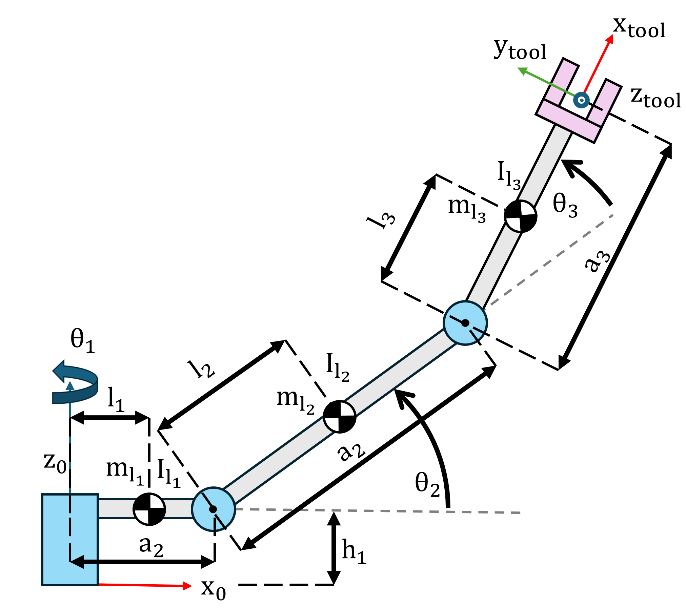
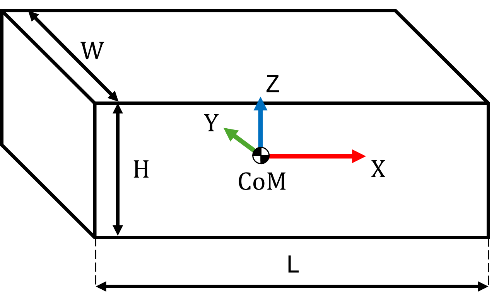

# Ejercicio 4.1 \- Cálculo de términos dinámicos

En este ejercicio configurarás funciones para calcular los términos dinámicos de la formulación de Lagrange para un manipulador de tres eslabones. 




|||||||
| :-- | :-- | :-- | :-- | :-- | :-- |
| Eslabón  | Masa $begin:math:display$kg$end:math:display$  | Anchura del eslabón $begin:math:display$m$end:math:display$  | Altura del eslabón $begin:math:display$m$end:math:display$  | Longitud del eslabón $begin:math:display$m$end:math:display$  | Centro de masa $begin:math:display$m$end:math:display$   |
| 1  | 5  | 0.1  | 0.1  | 0.3  | 0.15   |
| 2  | 3  | 0.1  | 0.1  | 0.5  | 0.25   |
| 3  | 3  | 0.1  | 0.1  | 0.5  | 0.25   |


El manipulador puede modelarse usando estos parámetros DH: 

||||||
| :-: | :-: | :-- | :-: | :-- |
| Eslabón  | a $begin:math:display$m$end:math:display$  | alpha  | d $begin:math:display$m$end:math:display$  | theta   |
| 1  | 0.3  | $\displaystyle \frac{\pi }{2}$  | 0.2  | $\displaystyle q_1$   |
| 2  | 0.5  | 0  | 0  | $\displaystyle q_2$   |
| 3  | 0.5  | 0  | 0  | $\displaystyle q_3$   |


Para este tutorial, considera solo los tres eslabones de barra. 


Puedes calcular sus inercias de la siguiente forma: 




 $$ I_{\textrm{xx}} =\frac{1}{12}\cdot \;m\cdot \left(w^2 +h^2 \right) $$ 

 $$ I_{\textrm{yy}} =I =\frac{1}{12}\cdot \;m\cdot \left(w^2 +h^2 \right) $$ 

 $$ I_{\textrm{zz}} =\frac{1}{12}\cdot \;m\cdot \left(w^2 +L^2 \right) $$ 
# Tarea 1: Configuración

Calcula las inercias para los eslabones en su centro de masa y guárdalas en las variables: 

-  I1 
-  I2 
-  I3 

Configura un array simbólico q que contenga las siguientes variables simbólicas **reales** para los ángulos articulares

-  q1 
-  q2 
-  q3 

Configura un array simbólico qd que contenga las siguientes variables simbólicas **reales** para las velocidades articulares

-  qd1 
-  qd2 
-  qd3 
```matlab

I1 = [];
I2 = []; 
I3 = []; 
q  = []; 
qd = []; 

```

Puedes comprobar tu trabajo haciendo clic en Run: 

```matlab
 
check_exercise('4-1-1')
```
# Tarea 2: Configurar el robot 

Carga el archivo urdf para el manipulador de tres eslabones usando

-  importrobot("threelink\_noInertia.urdf") 

Guárdalo en la variable

-  threelink 
-  Establece la gravedad en $\left\lbrack \begin{array}{c} 0\newline 0\newline -9\ldotp 81 \end{array}\right\rbrack$ 
-  Establece las inercias en el sistema correcto 
-  Establece el centro de masa para cada cuerpo 

*pista: recuerda usar el desplazamiento de ejes paralelos*

```matlab
threelink = []; 

```

Puedes comprobar tu trabajo haciendo clic en Run: 

```matlab
 
check_exercise('4-1-2')
```
# Tarea 3: Matriz de inercia

Construye la matriz de inercia para el manipulador de tres eslabones usando la toolbox simbólica. 


Guarda la matriz en la variable

-  B (B debe depender de q1, q2, q3) 
```matlab
B = 0;
```

Puedes comprobar tu trabajo haciendo clic en Run: 

```matlab
 
check_exercise('4-1-3')
```
# Tarea 3: Matriz de Coriolis 

Construye la matriz de Coriolis para el manipulador de tres eslabones usando la toolbox simbólica. 


Guarda la matriz en la variable

-  C (C debe depender de q1, q2, q3, qd1, qd2, qd3) 
```matlab
C = 0; 
```

*pista: si verificas tu matriz tú mismo, recuerda que la función de la toolbox velocityProduct devuelve C\*qd*


Puedes comprobar tu trabajo haciendo clic en Run: 

```matlab
 
check_exercise('4-1-4')
```
# Tarea 5: Compensación de gravedad 

Construye el término de compensación de gravedad para el manipulador de tres eslabones usando la toolbox simbólica. 


Guarda la matriz en la variable

-  G (G debe depender de q1, q2, q3) 
```matlab
G = 0; 
```

Puedes comprobar tu trabajo haciendo clic en Run: 

```matlab
 
check_exercise('4-1-5')

```