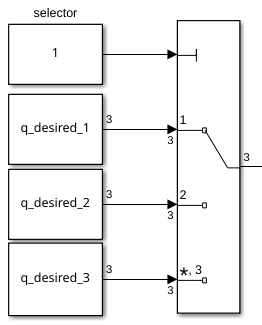

# Ejercicio 5.1 \- Control por esfuerzo de Threelink usando matrices simbólicas

En este ejercicio usarás las matrices calculadas en el Ejercicio 4.1 para controlar el manipulador Threelink en simulación usando Simulink. 

# Iniciar la simulación
```matlab

StartTutorialApplication('Simulation','Controller', 'Effort', 'Model','threelink', 'Docker', false);
StartTutorialApplication('Trajectory', 'Docker', false);
StartTutorialApplication('Safety_nodes','docker',false, 'model','threelink'); %envía un par 0 cuando no se ha enviado ningún otro comando
```

Recuerda que puedes ralentizar la simulación como: 


SetSimulationSpeed( SpeedFactor, 'docker', false)

# Convertir matrices simbólicas a funciones 

Para usar variables simbólicas dentro de Simulink tenemos que convertirlas en una función. 

```matlab
syms symbolic1 symbolic2 real
my_sym_variable = [symbolic1^-1, symbolic2*4];
my_sym_vec = [symbolic1, symbolic2]
```
my_sym_vec = 

  $$ \displaystyle \left(\begin{array}{cc} {\textrm{symbolic}}_1  & {\textrm{symbolic}}_2  \end{array}\right) $$ 
 

```matlab
matlabFunction(my_sym_variable, 'vars',{my_sym_vec}, 'File','my_test_subs_function');
```

Para usar esta función: 

```matlab
test_configuration = [2,2]
```

```matlabTextOutput
test_configuration = 1x2
     2     2

```

```matlab
my_sym_variable_subsituted = my_test_subs_function(test_configuration)
```

```matlabTextOutput
my_sym_variable_subsituted = 1x2
    0.5000    8.0000

```


*pista: Esto puede hacerse usando el bloque MatlabFunction en Simulink*

# Convierte aquí tus matrices simbólicas


```matlabTextOutput
Unrecognized function or variable 'B'.
```

# Parámetros

Configura el límite de par como: 

 $$ {\textrm{tau}}_{\lim } =\left\lbrack \begin{array}{c} 120\newline 120\newline 60 \end{array}\right\rbrack \left\lbrack \textrm{Nm}\right\rbrack $$ 

y la configuración deseada (tanto velocidad como posición)


prueba las configuraciones 

 $$ q\in \left\lbrace \left\lbrack \begin{array}{c} -\frac{\pi }{3}\newline \frac{\pi }{3}\newline \frac{\pi }{10} \end{array}\right\rbrack ,\left\lbrack \begin{array}{c} -\pi \;\newline \frac{\pi }{5}\newline \frac{\pi }{6}\; \end{array}\right\rbrack ,\left\lbrack \begin{array}{c} \frac{\pi }{8}\newline -\frac{\textrm{pi}}{2}\newline \frac{\textrm{pi}}{3} \end{array}\right\rbrack \right\rbrace $$ 

guárdalas como: 

-  q\_desired\_1 
-  q\_desired\_2 
-  q\_desired\_3 
-  qd\_desired 
```matlab
taulim = [120,120,60]';
q_desired_1 = [-pi/3, pi/3, pi/10]'; 
q_desired_2 = [-pi,pi/5,pi/6]'; 
q_desired_3 = [pi/8,-pi/2,pi/3]'; 
qd_desired = [0,0,0]'; 
```

para visualizar las transformaciones objetivo en Rviz:

```matlab
load("5.Control/Resources/targetTransform_threelink.mat");
StaticFrameBroadcaster(targetTransform_threelink_1, 'target1');
```

```matlabTextOutput
Published static transform: base_link → target1
```

```matlab
StaticFrameBroadcaster(targetTransform_threelink_2, 'target2');
```

```matlabTextOutput
Published static transform: base_link → target2
```

```matlab
StaticFrameBroadcaster(targetTransform_threelink_3, 'target3');
```

```matlabTextOutput
Published static transform: base_link → target3
```

# Ganancias

Selecciona las ganancias para tu sistema; como se trata de un esquema de dinámica inversa, sigue el enfoque del Ejercicio 4.2. No escales todavía las ganancias, podrás hacerlo durante la simulación. 


```matlabTextOutput
w_i = 1x3
    3.8095    4.9689    7.1429

```

# Dashboard

En el archivo de Simulink encontrarás la sección dashboard que te permite cambiar entre las configuraciones, ver la salida de par actual y escalar la matriz Kp y Kd durante la simulación. 

### Selector de configuración 

Marca una de estas casillas para seleccionar la configuración deseada. 


este bloque de selección está vinculado a: 




### Escalar Kd y Kp

Usando los deslizadores puedes modificar el valor de ganancia de sus bloques K\_scale correspondientes: 


### Ver trayectoria de par

El scope del Dashboard te permite ver los pares actuales en directo durante la simulación (como un scope). 


# Tarea 1

Abre el archivo Exercise\_5\_1\_1.slx; encontrarás una configuración para usar en este ejercicio. Desde las salidas q y qd (subsistema izquierdo) recibirás la posición y velocidad actuales de las articulaciones como vector columna. 


La entrada al subsistema derecho acepta un vector columna y envía los pares a la simulación. 


Para importar los resultados de tu simulación a MATLAB: 

```matlab
q_data_1 = out.position; 
qd_data_1 = out.velocity; 
tau_data_1 = out.tau; 
t_data_1 = out.tout; 
```

Representa gráficamente tus resultados en MATLAB. 


# Tarea 2 

Reduce la carga computacional considerando solo los términos diagonales de la matriz B y C y analiza el comportamiento comparándolos con los resultados de la Tarea 1. 

## Tarea 2.1 

Configura la nueva matriz simbólica y conviértela en una función.


## Tarea 2.2 

Abre el archivo Exercise 5\_1\_2.slx y configura la planta con las nuevas matrices B' y C'. 


Para importar los resultados de tu simulación a MATLAB: 


