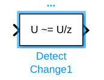
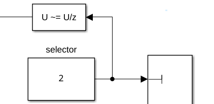

# Ejercicio 5.2 \- Control por esfuerzo de Threelink usando control PD y extensiones

En este ejercicio usarás un esquema de control PD para controlar el manipulador Threelink en simulación usando Simulink. 

# Iniciar la simulación
```matlab
StartTutorialApplication('Simulation','Controller', 'Effort', 'Model','threelink', 'Docker', false);
StartTutorialApplication('Trajectory', 'Docker', false);
StartTutorialApplication('Safety_nodes','docker',false, 'model','threelink'); %envía un par 0 cuando no se ha enviado ningún otro comando
```

Recuerda que puedes ralentizar la simulación como: 


SetSimulationSpeed( SpeedFactor, 'docker', false)

# Parámetros

Configura el límite de par como: 

 $$ {\textrm{tau}}_{\lim } =\left\lbrack \begin{array}{c} 120\newline 120\newline 60 \end{array}\right\rbrack \left\lbrack \textrm{Nm}\right\rbrack $$ 

y la configuración deseada (tanto velocidad como posición)


prueba las configuraciones 

 $$ q\in \left\lbrace \left\lbrack \begin{array}{c} -\frac{\pi }{3}\newline \frac{\pi }{3}\newline \frac{\pi }{10} \end{array}\right\rbrack ,\left\lbrack \begin{array}{c} -\pi \;\newline \frac{\pi }{5}\newline \frac{\pi }{6}\; \end{array}\right\rbrack ,\left\lbrack \begin{array}{c} \frac{\pi }{8}\newline -\frac{\textrm{pi}}{2}\newline \frac{\textrm{pi}}{3} \end{array}\right\rbrack \right\rbrace $$ 

guárdalas como: 

-  q\_desired\_1 
-  q\_desired\_2 
-  q\_desired\_3 
-  qd\_desired 
```matlab
taulim = [120,120,60]';
q_desired_1 = [-pi/3, pi/3, pi/10]'; 
q_desired_2 = [-pi,pi/5,pi/6]'; 
q_desired_3 = [pi/8,-pi/2,pi/3]'; 
qd_desired = [0,0,0]'; 
```

para visualizar las transformaciones objetivo en Rviz:

```matlab
load("5.Control/Resources/targetTransform_threelink.mat");
StaticFrameBroadcaster(targetTransform_threelink_1, 'target1');
```

```matlabTextOutput
Published static transform: base_link → target1
```

```matlab
StaticFrameBroadcaster(targetTransform_threelink_2, 'target2');
```

```matlabTextOutput
Published static transform: base_link → target2
```

```matlab
StaticFrameBroadcaster(targetTransform_threelink_3, 'target3');
```

```matlabTextOutput
Published static transform: base_link → target3
```


Para probar cualquier otra configuración puedes: 

```matlab
syms q1 q2 q3 real 
DH =    [3/10, pi/2, 1/5, q1;
         1/2,    0,   0,  q2;
         1/2,    0,   0,  q3]; 
T03 = dh2tf(DH); 

q_desired_3 = [pi/8,-pi/2,pi/3]'; % inserta aquí tu configuración
targetTransform = double(subs(T03, [q1,q2,q3], q_desired_3')); 
StaticFrameBroadcaster(targetTransform, 'target3');
```

```matlabTextOutput
Published static transform: base_link → Target_frame
```

# Tarea 1: esquema de control PD
## Tarea 1.1 \- Selección de ganancias

El esquema de control PD no cancela las no linealidades como el esquema de control por dinámica inversa de los ejercicios 4.2 y 5.1. Mientras que el esquema de dinámica inversa escala las ganancias seleccionadas con la matriz de inercia, aquí no es así. 


Para tener un punto de partida para ajustar las ganancias, usa las ganancias calculadas en el Ejercicio 4.2 y escálalas de la siguiente manera: 


estima los valores máximos de los términos diagonales de la matriz de inercia B. 


Para estimarlo sin usar un algoritmo de optimización, sustituye todas las funciones sin/cos por $\pm 1$ de modo que el valor resultante se maximice. 

### Ejemplo:
### $$ f\left(x_1 ,x_2 \right)=5\cdot \sin \left(x_1 \right)-2\cdot \cos \left(x_2 \right)+5\cdot \sin \left(\frac{x_1 }{x_2 }\right) $$
### $$ \max \;\hat{\;f} \left(x_1 ,x_2 \right)=5\cdot 1-2\cdot -1+5\cdot 1=12 $$

Después multiplica tus ganancias anteriores por esta estimación como:

 $$ {\textrm{Kp}}_{\textrm{PD}} =\max \hat{\;B} \left(q_1 ,q_2 ,q_3 \right)*{\textrm{Kp}}_{\textrm{inverseDynamic}} $$ 

y

 $$ {\textrm{Kd}}_{\textrm{PD}} =\max \hat{\;B} \left(q_1 ,q_2 ,q_3 \right)*{\textrm{Kd}}_{\textrm{inverseDynamic}} $$ 

(podrás escalar las ganancias durante la simulación) 


Usa la matriz de inercia simbólica del Ejercicio 4.1 para calcular tus ganancias aquí: 


```matlabTextOutput
w_i = 1x3
    3.8095    4.9689    7.1429

```

# Dashboard

En el archivo de Simulink encontrarás la sección dashboard que te permite cambiar entre las configuraciones, ver la salida de par actual y escalar la matriz Kp y Kd durante la simulación. 

### Selector de configuración 

Marca una de estas casillas para seleccionar la configuración deseada. 


este bloque de selección está vinculado a: 


### Escalar Kd y Kp

Usando los deslizadores puedes modificar el valor de ganancia de sus bloques K\_scale correspondientes: 


### Ver trayectoria de par

El scope del Dashboard te permite ver los pares actuales en directo durante la simulación (como un scope). 


## Tarea 1.2

Configura un esquema de control PD. Abre el archivo Exercise\_5\_2\_1.slx y configura la planta. 


Analiza el comportamiento y comprueba si el manipulador alcanza su configuración. 


puedes cargar los resultados de la simulación en MATLAB con: 

```matlab
q_data_1 = out.position; 
qd_data_1 = out.velocity; 
tau_data_1 = out.tau; 
t_data_1 = out.tout; 
```

Representa gráficamente tus resultados en MATLAB. 


# Tarea 2: PD + compensación de gravedad

Para reducir el error en régimen estacionario podemos mejorar el modelo introduciendo la compensación de gravedad. 

## Tarea 2.1 Término de gravedad

convierte tu matriz simbólica de gravedad del Ejercicio 4.1 en una función como hiciste en el Ejercicio 5.1 (o usa el archivo existente). 

## Tarea 2.2 Actualizar la planta

Abre el archivo Exercise\_5\_2\_2.slx e inserta tu planta de la Tarea 1. Ahora añade un bloque MatlabFunction y usa la función de la matriz de gravedad. 


El esquema de control resultante debe ser (antes de aplicar saturación) 

 $$ \textrm{tau}={\textrm{Kp}}_{\textrm{PD}} \cdot e+{\textrm{Kd}}_{\textrm{PD}} \cdot \dot{\;e} +G\left(q\right) $$ 

Analiza el comportamiento de este esquema de control mejorado. 


# Tarea 3: término integral 

Este esquema funciona bien cuando solo te importa el manipulador vacío o el peso de la carga útil es despreciable. Si no es así, podemos mejorar el comportamiento introduciendo un término de integración que crece cuando el robot está cerca de la configuración. 

## Ganancia del integrador Ki 

Empieza definiendo la ganancia Ki como: 

 $$ K_i =\left\lbrack \begin{array}{ccc} 1 & 0 & 0\newline 0 & 1 & 0\newline 0 & 0 & 1 \end{array}\right\rbrack $$ 

Después puedes escalarla durante la simulación usando el deslizador designado en el dashboard. 


## Anti Windup

Es importante que el término de error integral no crezca cuando el desplazamiento es muy grande. Una forma de implementar una lógica anti windup es usando un bloque de función MATLAB. 


Escribe una función que tome las velocidades articulares y el error de posición como entrada y devuelva un vector de incremento de error integral. 


El vector de error de salida solo debe contener valores no nulos en los índices que tienen baja velocidad articular (las articulaciones han alcanzado su par en función de los términos no integrales). Los otros valores deben ser 0. 

## Bloque integrador

Usa el bloque integrador de tiempo discreto. 


Selecciona: 

-  'Integration: Trapezoidal' como método del integrador 
-  Establece el valor de Gain en 1.0  
-  'either' como External reset 

Debes resetear el bloque integrador al cambiar la configuración de referencia. 


Puedes usar un bloque Detect Change:





como entrada puedes usar el bloque Selector del selector de configuración articular. Así, cada vez que cambies la configuración objetivo, reseteas la integral. 




## Añadir una carga útil

Puedes añadir una carga útil al efector final activando el interruptor Attach. 


Puedes definir el peso de la carga útil en gramos.


 


Para adjuntar una nueva carga útil, primero desacopla la anterior, cambia el peso y vuelve a acoplarla. 


Al adjuntar una carga útil, asegúrate de que el efector final no se está moviendo; de lo contrario, la carga útil puede tener un offset (no visible en Rviz). 

## Visualizar la integral del error 

Conecta tu error integral al subsistema Error integral para verlo en el dashboard


