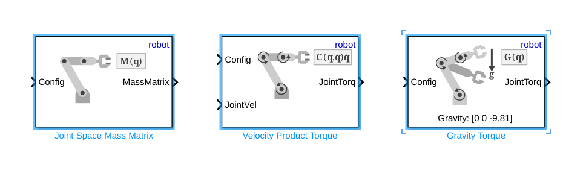

# Ejercicio 5.3 \- Control por esfuerzo de UR usando Robotic System Toolbox

En este ejercicio controlarás un manipulador Universal Robots usando Simulink. 

# Iniciar la simulación
```matlab
urmodel = 'ur3e'
StartTutorialApplication('Simulation','Controller', 'Effort', 'Model',urmodel, 'Docker', false);
StartTutorialApplication('Trajectory', 'Docker', false);
StartTutorialApplication('Safety_nodes','docker',false, 'model','threelink'); %envía un par 0 cuando no se ha enviado ningún otro comando
```

Recuerda que puedes ralentizar la simulación como: 


SetSimulationSpeed( SpeedFactor, 'docker', false)

# Cargar el robot

importa el robot Universal de tu elección usando archivos urdf y establece la gravedad en dirección \-z. 


# Parámetros

Configura tus parámetros como en el Ejercicio 4.2.


Establece: 

-  Kp (se puede escalar durante la simulación) 
-  Kd (se puede escalar durante la simulación) 
-  taulim según tu robot 

# Configuraciones 

Prueba diferentes configuraciones


guárdalas como: 

-  q\_desired\_1 
-  q\_desired\_2 
-  q\_desired\_3 
-  qd\_desired 
# Visualización

calcula la transformación de las configuraciones deseadas y visualízala en rviz. 


# Dashboard

En el archivo de Simulink encontrarás la sección dashboard que te permite cambiar entre las configuraciones, ver la salida de par actual y escalar la matriz Kp y Kd durante la simulación. 

### Selector de configuración 

Marca una de estas casillas para seleccionar la configuración deseada. 


este bloque de selección está vinculado a: 


### Escalar Kd y Kp

Usando los deslizadores puedes modificar el valor de ganancia de sus bloques K\_scale correspondientes: 


### Ver trayectoria de par

El scope del Dashboard te permite ver los pares actuales en directo durante la simulación (como un scope). 


# Tarea 1 

Abre el archivo Exercise\_5\_3\_1.slx y completa el esquema de control con los bloques que faltan de la Robotic System Toolbox. 


Usa los siguientes bloques: 





especifica: 

-  'robot' como árbol de cuerpos rígidos 
# Tarea 2

Abre el archivo Exercise\_5\_3\_2.slx y completa el esquema de control usando el siguiente bloque: 


especifica: 

-  'robot' como árbol de cuerpos rígidos 

Las entradas son idénticas a las explicadas en el Tutorial 4 para la función "inverseDynamics()".