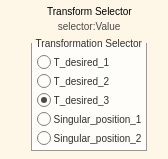
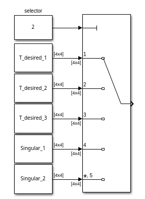
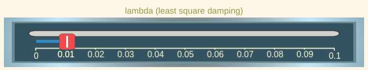
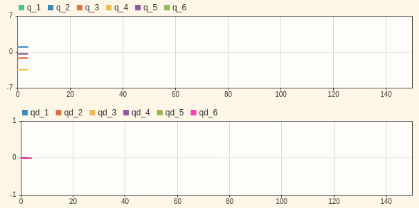
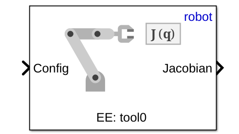
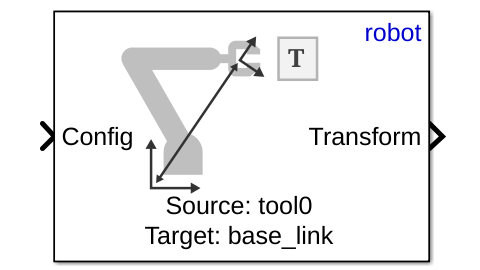
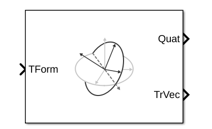

# Ejercicio 5.4 \- Universal Robots en espacio de tarea usando control de velocidad

Hasta ahora todas las implementaciones de control se han hecho en espacio articular.


En este ejercicio configurarás un controlador de velocidad que opera en espacio de tarea. 

# Cargar el robot

Selecciona un UR de tu elección y cárgalo mediante los archivos urdf o desde la Robotic System Toolbox. 

```matlab
urmodel = 'universalUR3e';
robot = loadrobot(robotmodel, DataFormat="column"); 
```
# Iniciar la simulación

No olvides seleccionar el mismo robot como modelo. 

```matlab
StartTutorialApplication('simulation','model', urmodel, 'controller','velocity', 'docker',false)
StartTutorialApplication('safety_nodes', 'docker',false)
StartTutorialApplication('trajectory','docker',false) %envía un par 0 cuando no se ha enviado ningún otro comando
```

Recuerda que puedes ralentizar la simulación como: 


SetSimulationSpeed( SpeedFactor, 'docker', false)

# Límites articulares

Configura el límite de velocidad como: 

 $$ {\dot{\;q} }_{\lim } =\left\lbrack \begin{array}{c} 0\ldotp 7\newline 0\ldotp 7\newline 0\ldotp 7\newline 0\ldotp 7\newline 0\ldotp 7\newline 0\ldotp 7 \end{array}\right\rbrack \left\lbrack \frac{\textrm{rad}}{s}\right\rbrack $$ 
# Configuraciones objetivo

Prueba diferentes configuraciones y conviértelas en una matriz de transformación homogénea. Usa configuraciones que no den lugar a una singularidad. 


Guárdalas como: 

-  T\_desired\_1 
-  T\_desired\_2 
-  T\_desired\_3 

Usar configuraciones articulares y la cinemática directa asegura que las transformaciones resultantes sean alcanzables por el robot.

 $$ T_{\textrm{desired},i} \left(q_{\textrm{config},i} \right)=\textrm{forward}_\textrm{kinematics}\left(q_{\textrm{config},i} \right) $$ 

o usando la función de Robotic System Toolbox como


 $T_{\textrm{desired},i}$ = getTransform(robot, config\_i, "tool0", "base\_link");


Sin embargo, también puedes probar otras matrices de transformación. Puedes construirlas usando las funciones transl() y trotm(angle, 'axis'). 


visualiza las configuraciones en rviz: 


```matlabTextOutput
Published static transform: base_link → target_1
Published static transform: base_link → target_2
Published static transform: base_link → target_3
```

### Configuraciones singulares

A continuación configuraremos algunas configuraciones singulares. 

```matlab
singular_configuration1 = [0,-pi/2,0,-pi/2,0,0]'; 
Singular_1 = getTransform(robot, singular_configuration1, "tool0", "base_link");
StaticFrameBroadcaster(Singular_1, 'singular_1');
```

```matlabTextOutput
Published static transform: base_link → singular_1
```

```matlab

singular_configuration2 = [pi/3,0,0,-pi/2,0,0]'; 
Singular_2 = getTransform(robot, singular_configuration2, "tool0", "base_link");
StaticFrameBroadcaster(Singular_2, 'singular_2');
```

```matlabTextOutput
Published static transform: base_link → singular_2
```

# Cálculo del error

Este controlador opera en **espacio de tarea**, lo que significa que los errores se calculan directamente a partir de las matrices de **transformación homogénea** deseada y actual.


Sea

 $$ T_{\textrm{desired}} =\left\lbrack \begin{array}{cc} R_{\textrm{desired}}  & t_{\textrm{desired}} \newline 0 & 1 \end{array}\right\rbrack $$ 

 $$ T_{\textrm{current}} \left(q\right)=\left\lbrack \begin{array}{cc} R_{\textrm{current}}  & t_{\textrm{current}} \newline 0 & 1 \end{array}\right\rbrack $$ 

con la matriz de rotación $R_i \in \mathbb{R}{\;}^{3\textrm{x3}} \;$ y el vector de posición $t_i \in {\mathbb{R}}^{3\textrm{x1}}$ 

## Error de posición (espacio de tarea)

el cálculo del error de posición es directo: 

 $$ e_{\textrm{pos}} =t_{\textrm{desired}} -t_{\textrm{current}} $$ 
## Error de orientación (espacio de tarea)

El error de orientación **no** es tan directo.


Las representaciones con ángulos de Euler no son adecuadas porque sufren **gimbal lock** y discontinuidades.


Para calcular un error de orientación **libre de singularidades**, las matrices de rotación se convierten primero en **cuaterniones unitarios**.


El cuaternión de error se calcula como un producto de cuaterniones: 

 $$ q_{\textrm{error}} =q_{\textrm{desired}} \otimes q_{\textrm{current}}^{-1} $$ 

Observa que el operando $\otimes$ no es una multiplicación normal. 

### Cuaterniones

Recuerda que un cuaternión unitario está formado por 4 valores: 

 $$ q=\left\lbrack \begin{array}{c} w\newline v \end{array}\right\rbrack =\left\lbrack \begin{array}{c} w\newline x\newline y\newline z \end{array}\right\rbrack $$ 

donde

-  w es la parte escalar 
-  v la parte vectorial  
-  y $||q||=1$ 

El conjugado de un cuaternión puede construirse como: 

 $$ q^{-1} =\left\lbrack \begin{array}{c} w\newline -v \end{array}\right\rbrack $$ 
## Error de cuaternión

Calcula el error de orientación como sigue. 


sea 


 $q_{\textrm{desired}} =\left\lbrack \begin{array}{c} w_d \newline v_d  \end{array}\right\rbrack$ y $q_{\textrm{current}}^{-1} =\left\lbrack \begin{array}{c} w_{\textrm{current}} \newline -v_{\textrm{current}}  \end{array}\right\rbrack =\left\lbrack \begin{array}{c} w_c \newline v_c  \end{array}\right\rbrack$ 


calcula el cuaternión de error como: 

 $$ q_{\textrm{error}} =\left\lbrack \begin{array}{c} w_e \newline v_e  \end{array}\right\rbrack $$ 

con 

 $$ w_e =w_d \cdot w_c -v_d^T \cdot v_c $$ 

y

 $$ v_e =w_d \cdot v_c +w_c \cdot v_d +v_d \times v_c $$ 

(El operando $\times$ es un producto vectorial)


Un cuaternión q y \-q representan la misma orientación. 


Para asegurar que usamos la rotación más corta para alinear las orientaciones, debes establecer el cuaternión de error como: 

 $ $ \left\lbrace \begin{array}{ll} q_e =\left\lbrack \begin{array}{c} w_e \newline v_e  \end{array}\right\rbrack  & \textrm{if}\;w_e >0\\
q_e =\left\lbrack \begin{array}{c} -w_e \newline -v_e  \end{array}\right\rbrack  & \textrm{if}\;w_e <0
\end{array}\right. $ $ 

### Calcular el vector de error $e_{\textrm{ori}}$ 

sea 

 $$ \textrm{nv}=||v_e || $$ 

entonces puedes calcular el ángulo $\theta$ como: 

 $$ \theta =2\cdot \textrm{atan2}\left(\textrm{nv},w_e \right) $$ 

finalmente calcula $e_{\textrm{ori}}$ dependiendo del ángulo como: 

 $ $ \left\lbrace \begin{array}{ll} e_{\textrm{ori}} =\left\lbrack \begin{array}{c} 0\newline 0\newline 0 \end{array}\right\rbrack  & \textrm{if}\;\theta <{10}^{-10} \\
e_{\textrm{ori}} =\theta \cdot \frac{v_e }{||v_e ||}=\theta \cdot \frac{v_e }{\textrm{nv}} & \textrm{if}\;\theta >{10}^{-10} 
\end{array}\right. $ $ 

## Error ponderado

Como la manipulabilidad de la posición generalmente es menor que la manipulabilidad de la orientación, tenemos que aplicar pesos al error para tenerlo en cuenta. 


Inicializa con estos pesos y actualízalos si es necesario:

 $ K_{\textrm{position}} = $ $ \left\lbrack \begin{array}{ccc} 1 & 0 & 0\newline 0 & 1 & 0\newline 0 & 0 & 1 \end{array}\right\rbrack $ 

 $ K_{\textrm{orientation}} = $ $ \left\lbrack \begin{array}{ccc} 0\ldotp 5 & 0 & 0\newline 0 & 0\ldotp 5 & 0\newline 0 & 0 & 0\ldotp 5 \end{array}\right\rbrack $ 

 $$ e_{\textrm{position}} =K_{\textrm{position}} \cdot e_{\textrm{pos}} $$ 

 $$ e_{\textrm{orientation}} =K_{\textrm{orientation}} \cdot e_{\textrm{ori}} $$ 

Inicializa tus pesos aquí


construye el error respecto a tu jacobiano: 

 $ $ e=\left\lbrace \begin{array}{ll} \left\lbrack \begin{array}{c} e_{\textrm{position}} \newline e_{\textrm{orientation}}  \end{array}\right\rbrack  & \textrm{if}\;J=\left\lbrack \begin{array}{c} J_p \newline J_{\theta \;}  \end{array}\right\rbrack \;\\
\left\lbrack \begin{array}{c} e_{\textrm{orientation}} \newline e_{\textrm{position}}  \end{array}\right\rbrack  & \textrm{if}\;J=\left\lbrack \begin{array}{c} J_{\theta \;} \newline J_p  \end{array}\right\rbrack \;
\end{array}\right. $ $ 
# Pseudoinversa del jacobiano con amortiguamiento por mínimos cuadrados

Podemos mejorar el comportamiento del robot cerca de singularidades usando una pseudoinversa del jacobiano con amortiguamiento por mínimos cuadrados.


Calcúlala como sigue: 

 $$ J_{\lambda \;}^{\dagger} =J^T \cdot {\left({J\cdot \;J}^T +2\cdot \lambda^2 \cdot I\right)}^{-1} $$ 
# Dashboard

Una vez abras el archivo de Simulink, verás un dashboard con múltiples opciones de entrada y monitorización. 

## Selector de transformaciones

Permite alternar entre tus transformaciones previamente definidas.





 seleccionar una transformación cambiará la entrada desde: 





asegúrate de que todas las transformaciones estén cargadas en tu workspace. 

## Resetear configuración

Algunas velocidades articulares requeridas pueden hacer que las articulaciones del robot alcancen sus límites ( $\pm 2\pi$ para todas las articulaciones excepto la última articulación de muñeca). Puedes activar el interruptor durante la simulación para mover todas las articulaciones a 0. 


## Selección de Lambda 

puedes ajustar tu lambda durante la simulación usando el deslizador.





El valor del deslizador puede usarse en el bloque constant: 


## Monitorización de estados

Tienes dos gráficas en directo que muestran la configuración articular q y las velocidades articulares qd. 




## Monitorización de manipulabilidad

Tienes dos indicadores que muestran el índice de manipulabilidad actual. Sus límites están configurados para un modelo UR3e. 


Si usas un modelo más grande, quizá tengas que ajustar los límites. 


Las mediciones están vinculadas a la salida de este bloque de función de MATLAB: 


# Bloques de Simulink

Puedes resolver este ejercicio usando los siguientes bloques de Simulink (nuevos). 

## Get Jacobian (Robotic System Toolbox)

selecciona:

-  'robot' como robot  
-  'tool0' como End Effector.  



### Entradas: 

Introduce una configuración articular obtenida del subsistema GetJointValues como $q\in \mathbb{R}{\;}^{6\textrm{x1}}$ 

### Salidas: 

El jacobiano como $J\left(q\right)=\left\lbrack \begin{array}{c} J_{\theta \;} \newline J_p  \end{array}\right\rbrack$ 

## Get Transform (Robotic System Toolbox)

especifica: 

-  'robot' como árbol de cuerpos rígidos  
-  'tool0' como cuerpo fuente 
-  'base\_link' como cuerpo objetivo 



## Coordinate Transformation Conversion (Robotic System Toolbox)

especifica: 

-  'Homogeneous Transformation' como Input Representation 
-  'Quaternion' como Output Representation 
-  marca 'Show TrVec output port' 



# Tarea
## Esquema de control

Configura el esquema de control para controlar el robot usando el comando de velocidad. 

## Bloques de función MATLAB

Para completar el esquema tendrás que escribir los siguientes bloques de función MATLAB: 

-  Pseudoinversa del jacobiano con amortiguamiento por mínimos cuadrados 
-  Cálculo del error usando error de orientación con cuaterniones 
-  Cálculo del índice de manipulabilidad (bloque específico ya colocado, ver arriba)  
## Analizar 
-  Analiza el comportamiento para diferentes valores de $\lambda$.  
-  Cuando $\lambda =0$ no hay amortiguamiento.  
-  Analiza específicamente cómo modifica el comportamiento cerca de configuraciones singulares.  
-  Analiza el comportamiento de diferentes pesos en el error de rotación y el error de posición  