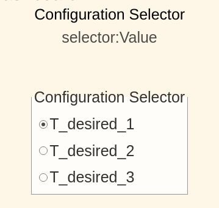
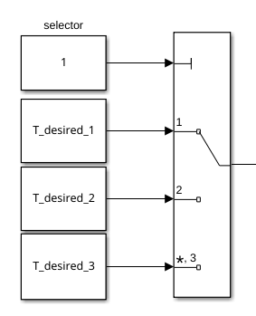
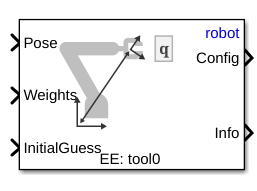
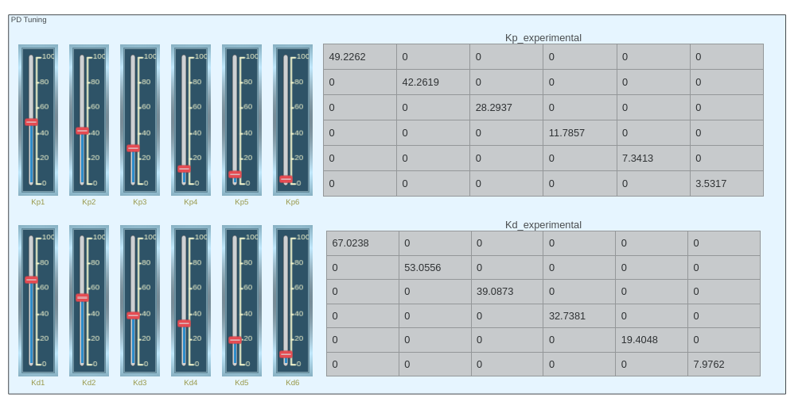

# Ejercicio 5.5 \- Universal Robots en espacio de tarea usando control por esfuerzo

En este ejercicio controlarás un manipulador Universal Robots usando una solución de cinemática inversa que se controla mediante el comando de esfuerzo. 

# Iniciar la simulación
```matlab
urmodel = 'ur3e'
StartTutorialApplication('Simulation','Controller', 'Effort', 'Model',urmodel, 'Docker', false);
StartTutorialApplication('Trajectory', 'Docker', false);
StartTutorialApplication('Safety_nodes','docker',false, 'model','threelink'); %envía un par 0 cuando no se ha enviado ningún otro comando
```

Recuerda que puedes ralentizar la simulación como: 


SetSimulationSpeed( SpeedFactor, 'docker', false)

# Cargar el robot

importa el robot Universal de tu elección usando archivos urdf y establece la gravedad en dirección \-z. 


# Parámetros

Configura tus parámetros como en el Ejercicio 4.2.


Establece: 

-  Kp (se puede escalar durante la simulación) 
-  Kd (se puede escalar durante la simulación) 
-  taulim según tu robot 

# Configuraciones 

Prueba diferentes configuraciones


guárdalas como: 

-  T\_desired\_1 
-  T\_desired\_2 
-  T\_desired\_3 
-  qd\_desired 

Usar configuraciones articulares y la cinemática directa asegura que las transformaciones resultantes sean alcanzables por el robot.

 $$ T_{\textrm{desired},i} \left(q_{\textrm{config},i} \right)=\textrm{forward}_\textrm{kinematics}\left(q_{\textrm{config},i} \right) $$ 

o usando la función de Robotic System Toolbox como


 $T_{\textrm{desired},i}$ = getTransform(robot, config\_i, "tool0", "base\_link");


Sin embargo, también puedes probar otras matrices de transformación. Puedes construirlas usando las funciones transl() y trotm(angle, 'axis'). 

```matlab
config_example1 = [0,-pi/4,pi/2,-pi/3,pi/7,pi/5]';
T_desired_1 = getTransform(robot, config_example1, "tool0", "base_link");

config_example2 = [pi/3,-pi/4,pi/4,-pi/2,pi/9,pi/2]';
T_desired_2 = getTransform(robot, config_example2, "tool0", "base_link");

config_example3 = [pi/3,pi/3,-pi/1.5,pi/9,pi/8,0]';
T_desired_3 = getTransform(robot, config_example3, "tool0", "base_link");

```
# Visualización

Visualízalo en rviz. 

```matlab
StaticFrameBroadcaster(T_desired_1, 'target_1');
```

```matlabTextOutput
Published static transform: base_link → target_1
```

```matlab
StaticFrameBroadcaster(T_desired_2, 'target_2');
```

```matlabTextOutput
Published static transform: base_link → target_2
```

```matlab
StaticFrameBroadcaster(T_desired_3, 'target_3');
```

```matlabTextOutput
Published static transform: base_link → target_3
```

# Dashboard

En el archivo de Simulink encontrarás la sección dashboard que te permite cambiar entre las configuraciones, ver la salida de par actual y escalar la matriz Kp y Kd durante la simulación. 

### Selector de configuración 

Marca una de estas casillas para seleccionar las transformaciones objetivo. 





este bloque de selección está vinculado a: 




### Escalar Kd y Kp

Usando los deslizadores puedes modificar el valor de ganancia de sus bloques K\_scale correspondientes: 


### Ver trayectoria de par

El scope del Dashboard te permite ver los pares actuales en directo durante la simulación (como un scope). 


# Tarea 1 

Abre el archivo Exercise\_5\_5\_1.slx y configura un esquema de control que opere usando una matriz de transformación como entrada. 

## Tarea 1.1

Para obtener una configuración articular válida que satisfaga la pose deseada, usa el bloque "inverse Kinematic"





Especifica: 

-  'robot' como árbol de cuerpos rígidos 
-  'tool0' como EE 
### Entradas: 
-  Transformación deseada como Pose 
-  Configuración articular actual como InitialGuess 
-  $\displaystyle \textrm{weights}\in {\mathbb{R}}^{6\textrm{x1}}$ 

La entrada weights son las tolerancias permitidas. Establece la tolerancia a ${10}^{-3}$ para posición y ${10}^{-2}$ para orientación. 

## Tarea 1.2

Usa un esquema de control por dinámica inversa (como en el Ejercicio 5.4) para mover el efector final a la solución del bloque de cinemática inversa. 

# Tarea 2

Abre el archivo Exercise\_5\_5\_2.slx y configura un esquema de control que opere usando una matriz de transformación como entrada. 

## Tarea 2.1

Igual que la Tarea 1.1 

## Tarea 1.2

Usa un PID con compensación de gravedad para alcanzar la configuración articular calculada. 

### Ajuste de ganancias 

Puedes seguir el enfoque de estimar las ganancias usando la matriz de inercia o intentar determinar buenas ganancias experimentalmente. 


Puedes ajustar las ganancias usando los deslizadores verticales; en el lado derecho verás la matriz de ganancias resultante. 





Para usarlas puedes utilizar los bloques "From": 


Puedes hacer cálculos con las matrices usando, por ejemplo, un bloque matrix multiply: 


