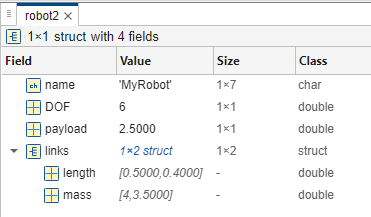

```matlab
clear all;
```
# <span style="color:rgb(213,80,0)">Structures in MATLAB</span>

In this tutorial we will explain what MATLAB structures are and how to work with them.


Please enable "Output inline" on the right side of your scroll bar. 


 

# Create a Simple Structure

A structure is a data type that groups related data using named fields.


You can create one using the struct function, or by direct assignment.

```matlab
robot.name      = 'MyRobot';
robot.DOF       = 6;
robot.payload   = 2.5           
```

```matlabTextOutput
robot = struct with fields:
       name: 'MyRobot'
        DOF: 6
    payload: 2.5000

```

Equivalent creation with struct()

```matlab
robot2 = struct('name','MyRobot', ...
    'DOF',6, ...
    'payload',2.5)
```

```matlabTextOutput
robot2 = struct with fields:
       name: 'MyRobot'
        DOF: 6
    payload: 2.5000

```
# Nested Structures

Structures can contain other structures, enabling hierarchical data.

```matlab
robot2.links(1) = struct('length',0.5,'mass',4.0)
```

```matlabTextOutput
robot2 = struct with fields:
       name: 'MyRobot'
        DOF: 6
    payload: 2.5000
      links: [1x1 struct]

```

```matlab
robot2.links(2) = struct('length',0.4,'mass',3.5)
```

```matlabTextOutput
robot2 = struct with fields:
       name: 'MyRobot'
        DOF: 6
    payload: 2.5000
      links: [1x2 struct]

```

<p style="text-align:left">
   
</p>

# Accessing Fields

Fields are accessed with dot notation: StructureName.FieldName

## Read a field
```matlab
robotName=robot.name
```

```matlabTextOutput
robotName = 'MyRobot'
```

## Write/update a field
```matlab
robot.payload = 3.0
```

```matlabTextOutput
robot = struct with fields:
       name: 'MyRobot'
        DOF: 6
    payload: 3

```
## Access nested field
```matlab
link1_length = robot2.links(1).length
```

```matlabTextOutput
link1_length = 0.5000
```

```matlab
robot2.links(2).length = 0.8;
```
# Dynamic Field Names

You can add or access fields with variable names using parentheses.

```matlab
newfield = 'maxSpeed';
robot.(newfield) = 1.2;               % adds a new field maxSpeed
```
## Check existence before access
```matlab
if isfield(robot, newfield)
    RobotMaxSpeed = robot.maxSpeed
end
```

```matlabTextOutput
RobotMaxSpeed = 1.2000
```
# Adding and Removing Fields

Use setfield and rmfield, or direct manipulation.


Add a field

```matlab
robot = setfield(robot, 'manufacturer', 'UniversalRobots')
```

```matlabTextOutput
robot = struct with fields:
            name: 'MyRobot'
             DOF: 6
         payload: 3
        maxSpeed: 1.2000
    manufacturer: 'UniversalRobots'

```

Remove a field

```matlab
robot = rmfield(robot, 'manufacturer')
```

```matlabTextOutput
robot = struct with fields:
        name: 'MyRobot'
         DOF: 6
     payload: 3
    maxSpeed: 1.2000

```
