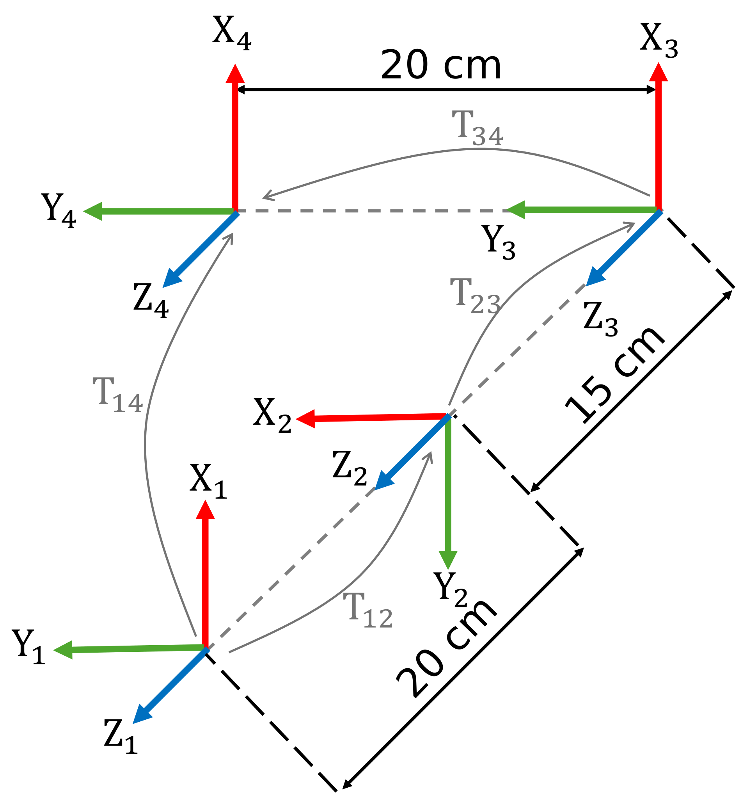
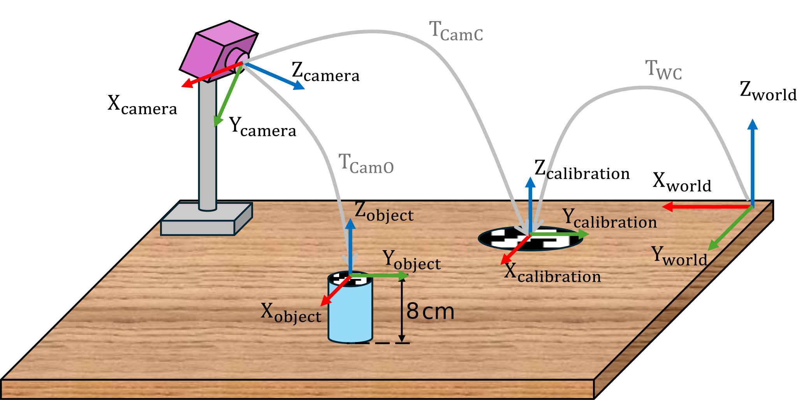

```matlab
clear all; 
```
# Exercise 1.1 \- Find the Transforms

In this exercise you will need to find transforms between coordinate frames. 


Please store your solutions in the predefined variables!

# Task description:

given this set of Coordinate frames:





Answer all the questions and store your solution in the correct variable

# Task 1
1.  Find the homogeneous transforms between frames 1 and 2
2. Find the homogeneous transforms between frames 2 and 3
3. Find the homogeneous transforms between frames 3 and 4

Use the following variables  to store your solution:

-  T12 (homogeneous transform from frame 1 to frame 2) 
-  T23 (homogeneous transform from frame 2 to frame 3) 
-  T34 (homogeneous transform from frame 3 to frame 4) 
```matlab
T12 = [];  
T23 = []; 
T34 = [];  
```

You can check your work by clicking the Run: 

```matlab
 
check_exercise('1-1-1')
```

```matlabTextOutput
Checking exercise 1-2: Check a homogeneous transformation matrix

Checking variable structure:
Checking Variable T12 
[OK]   T12 is of type double
```
# Task 2
1.  Find the homogeneous transform between frame 1 and frame 4.
2. Find the origin of frame 4 w.r.t. frame 1.

Use the following variables to store your solution: 

-  T14 (homogeneous transform from frame 1 to frame 4) 
-  origin14 (vector containing xyz coordinates) 
```matlab
T14 = []; 
origin14 = []; 
```

You can check your work by clicking the Run: 

```matlab
 
check_exercise('1-1-2')
```

```matlabTextOutput
Checking exercise 1-1-2: Check transform and position of origin

Checking variable structure:
Checking Variable T14 
[OK]   T14 is of type double
[FAIL] T14 does not match expected value

Checking Variable origin14 
[OK]   origin14 is of type double
[FAIL] origin14 does not match expected value
```
# Task 3
1.  Find the homogeneous transform from frame 4 to frame 1.
2. Give the origin of frame 1 w.r.t. frame 4.

Use the following variables to store your solution: 

-  T41 (homogeneous transform from frame 4 to frame 1) 
-  origin41 (vector containing xyz coordinates) 
```matlab
T41 = []; 
origin41 = []; 
```

You can check your work by clicking the Run: 

```matlab
 
check_exercise('1-1-3')
```

```matlabTextOutput
Checking exercise 1-2: Check a homogeneous transformation matrix

Checking variable structure:
[FAIL] TB0 not found in workspace
[FAIL] TB1 not found in workspace

 Running 1 functional test(s):

Test 1: Checking Transform TB0
```
# Task 4

Calibrate the Camera and find the location of the object w.r.t. the world frame. 


Look at the following setup: 





To calibrate the camera we want to locate it w.r.t. the world frame.


You know the relative position and orientation from the world frame to the calibration marker. 

 $$ T_{\textrm{WC}} =\left\lbrack \begin{array}{cccc} 0 & -1 & 0 & 0\ldotp 14\newline 1 & 0 & 0 & 0\ldotp 25\newline 0 & 0 & 1 & 0\newline 0 & 0 & 0 & 1 \end{array}\right\rbrack $$ 

From the camera image you can obtain the relative position between the camera and the calibration marker: 

 $$ T_{\textrm{CamC}} =\left\lbrack \begin{array}{cccc} 0\ldotp 9397 & -0\ldotp 2620 & 0\ldotp 2198 & -0\ldotp 3237\newline 1 & -0\ldotp 6428 & -0\ldotp 766 & 0\ldotp 4655\newline 0\ldotp 342 & 0\ldotp 7198 & -0\ldotp 604 & 0\ldotp 4507\newline 0 & 0 & 0 & 1 \end{array}\right\rbrack $$ 

From the camera image you also obtain the relative position between the camera and the desired object: 

 $$ T_{\textrm{CamO}} =\left\lbrack \begin{array}{cccc} 0\ldotp 9397 & -0\ldotp 2620 & 0\ldotp 2198 & -0\ldotp 0893\newline 1 & -0\ldotp 6428 & -0\ldotp 766 & 0\ldotp 4749\newline 0\ldotp 342 & 0\ldotp 7198 & -0\ldotp 604 & 0\ldotp 3916\newline 0 & 0 & 0 & 1 \end{array}\right\rbrack $$ 

1.  Find the Transform between the World and the Camera
2. Find the transform between the World and the Object

Use the following variables to store your solution: 

-  TWCam (homogeneous transform from the world frame to camera frame) 
-  TWO (homogeneous transform from World to Object) 
```matlab
TWC = [
    0  -1   0   0.14;
    1   0   0   0.25;
    0   0   1   0 ;
    0   0   0   1];

TCamC = [
    0.9397    -0.2620     0.2198     -0.3237;
    0        -0.6428     -0.766    0.4655 ;
    0.342    0.7198         -0.604    0.4507 ;
    0        0             0        1];

TCamO = [
    0.9397    -0.2620     0.2198     -0.0893 ;
    0        -0.6428     -0.766    0.4749 ;
    0.342    0.7198         -0.604    0.3916;
    0        0             0        1];

TWCam = [];

TWO = [];
```

You can check your work by clicking the Run: 

```matlab
 
check_exercise('1-1-4')
```
