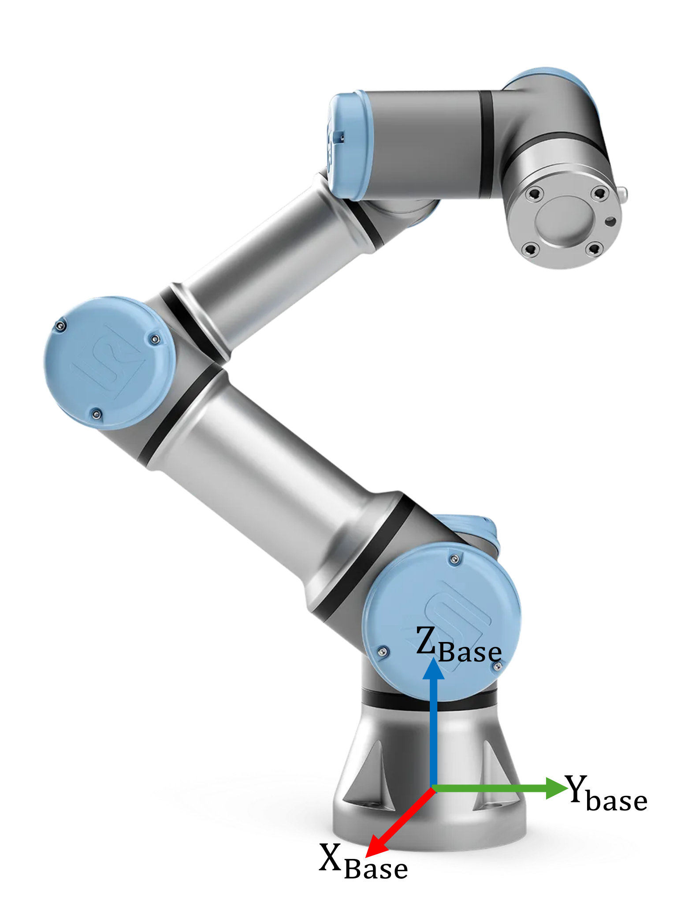

```matlab
clear all; 
```
# Exercise 1.2 \- Modeling of a Robot

In this exercise you will model a Universal UR3e robot from given DH parameters.


 


Please store your solutions in the predefined variables!

# Task description:

Given the DH parameters of a UR3e Robot: 

|      |      |      |      |      |
| :-: | :-- | :-: | :-: | :-: |
| Link <br>  | a \[m\] <br>  | alpha <br>  | d \[m\] <br>  | theta <br>   |
| 1 <br>  | 0 <br>  | pi/2 <br>  | 0.15185 <br>  | 0 <br>   |
| 2 <br>  | \-0.24355 <br>  | 0 <br>  | 0 <br>  | 0 <br>   |
| 3 <br>  | \-0.2132 <br>  | 0 <br>  | 0 <br>  | 0 <br>   |
| 4 <br>  | 0 <br>  | pi/2 <br>  | 0.13105 <br>  | 0 <br>   |
| 5 <br>  | 0 <br>  | \-pi/2 <br>  | 0.08535 <br>  | 0 <br>   |
| 6 <br>  | 0 <br>  | 0 <br>  | 0.0921 <br>  | 0 <br>   |
|      |      |      |      |       |


The base and the coordinate frame of the first joint are identical!


Answer all the questions and store your solution in the correct variable

# Task 1

1.  Setup the robot structure and use the data format "column"
2. Define bodies, name them body\_1, ..., body\_n
3. Define joints, name them joint\_1, ..., joint\_n

Use the following variables  to store your solution:

-  robot (name of your robot) 
-  bodies (name of your variable containing the bodies) 
-  joints (name of your variable containing the joints) 
```matlab
robot = rigidBodyTree(DataFormat="column");

bodies = cell(6,1); 
joints = cell(6,1); 

for i=1:6
bodies{i} = rigidBody(['body_',num2str(i)]);

joints{i} = rigidBodyJoint(['joint_',num2str(i)], 'revolute');
end
```

You can check your work by clicking the Run: 

```matlab
 
check_exercise('1-2-1')
```

```matlabTextOutput
Checking exercise 1-2-1: Variable Structure

Checking variables:
 
Checking Variable robot
[OK] robot is of type rigidBodyTree

Checking robot data format
[OK] Correct data format

Checking Variable bodies
[OK] bodies is of type cell

Checking Variable joints
[OK] joints is of type cell

checking body elements
[OK]   Result matches expected value
checking joint elements
[OK]   Result matches expected value
```
# Task 2

1.  Link the DH parameters to the corresponding joints.
2. Link the joints to their bodies.
3. Add the bodies to the robot
```matlab
DH=[
   %a       alpha       d       theta
   0        pi/2        0.15185  0;
   -0.24355 0           0       0;
   -0.2132  0           0       0;
   0        pi/2        0.13105 0;
   0        -pi/2       0.08535 0;
   0        0           0.0921  0;
    ]
```

```matlabTextOutput
DH = 6x4
         0    1.5708    0.1519         0
   -0.2435         0         0         0
   -0.2132         0         0         0
         0    1.5708    0.1310         0
         0   -1.5708    0.0853         0
         0         0    0.0921         0

```

Add your code here: 

```matlab
for i=1:6
    setFixedTransform(joints{i}, DH(i,:), 'dh');
    bodies{i}.Joint = joints{i};

    if i==1
        addBody(robot,bodies{i}, "base")
    else
        addBody(robot,bodies{i},bodies{i-1}.Name)
    end

end
```

You can check your work by clicking the Run: 

```matlab
 
check_exercise('1-2-2')
```

```matlabTextOutput
Checking exercise 1-2-2: Checking Robot Setup

Checking variables:
 
Checking Variable joints{1}.ChildToJointTransform
[OK] joints{1}.ChildToJointTransform correct

Checking Variable joints{2}.ChildToJointTransform
[OK] joints{2}.ChildToJointTransform correct

Checking Variable joints{3}.ChildToJointTransform
[OK] joints{3}.ChildToJointTransform correct

Checking Variable joints{4}.ChildToJointTransform
[OK] joints{4}.ChildToJointTransform correct

Checking Variable joints{5}.ChildToJointTransform
[OK] joints{5}.ChildToJointTransform correct

Checking Variable joints{6}.ChildToJointTransform
[OK] joints{6}.ChildToJointTransform correct

Checking Variable bodies{1}.Joint.Name
[OK] bodies{1}.Joint.Name matches expected value

Checking Variable bodies{2}.Joint.Name
[OK] bodies{2}.Joint.Name matches expected value

Checking Variable bodies{3}.Joint.Name
[OK] bodies{3}.Joint.Name matches expected value

Checking Variable bodies{4}.Joint.Name
[OK] bodies{4}.Joint.Name matches expected value

Checking Variable bodies{5}.Joint.Name
[OK] bodies{5}.Joint.Name matches expected value

Checking Variable bodies{6}.Joint.Name
[OK] bodies{6}.Joint.Name matches expected value

Checking Variable robot.NumBodies
[OK] robot.NumBodies correct

Checking Variable cell2mat(robot.FrameNames)
[OK] cell2mat(robot.FrameNames) matches expected value
```
# Task 3
1.  Define the gravity to be in negative Z direction with a magnitude of $9\ldotp 81\;\frac{m}{s^2 }$ (see figure above)
2. Set the home position for joints 1, 3 and 5 to $\frac{\pi }{2}$

Add your code here:

```matlab
robot.Gravity=[0,0,-9.81];
newHome=homeConfiguration(robot);
Homepos=[pi/2,0,pi/2,0,pi/2,0];
for i=1:6
robot.Bodies{i}.Joint.HomePosition=Homepos(i);
end
```

You can check your work by clicking the Run: 

```matlab
 
check_exercise('1-2-3')
```

```matlabTextOutput
Checking exercise 1-2-3: Checking Robot Setup

Checking variables:
 
Checking Variable robot.Gravity
[OK] robot.Gravity correct

Checking Variable homeConfiguration(robot)
[OK] homeConfiguration(robot) correct
```
