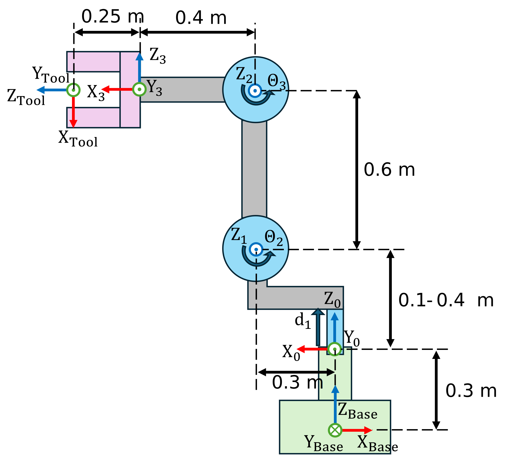

```matlab
clear all; 
```
# Exercise 1.3 \- Find the DH parameters

In this exercise you will compute the DH parameters of an arbitrary robot manipulator, setup the equations using the symbolic toolbox and the define the robot using the robotic system toolbox. 


Please store your solutions in the predefined variables!

# Task description:

Find the DH parameters and homogeneous transforms to describe the following robot manipulator:





Answer all the questions and store your solution in the correct variable

# Task 1
1.  Define real symbolic variables for each joint (q1, ..., qn)
2. Store them in a column array (q)
3. Define the position limits for each of the joints, for revolute joints the limit is $\pm 2\pi \;$ (limit\_1, ..., limit\_n)

Use the following variables to store your solution:

-  qi (joint position of joint i) 
-  q (an array with all the symbolic joint states) 
-  limit\_i (array with minimum and maximum permitted joint value) 
```matlab
syms q1 q2 q3 real
q = [q1, q2, q3];
limit_1 = [0.1, 0.4];
limit_2 = [-2*pi, 2*pi]; 
limit_3 = [-2*pi, 2*pi]; 
```

You can check your work by clicking the Run: 

```matlab
 
check_exercise('1-3-1')
```

```matlabTextOutput
Checking exercise 1-3-1: Checking Symbolic Variable Setup and Joint Limits

Checking variables:
 
Checking Variable q1
[OK] q1 is of type sym

Checking Variable q2
[OK] q2 is of type sym

Checking Variable q3
[OK] q3 is of type sym

Checking if variables are real
[OK] variables are setup correctly

Checking Variable q
[OK] q is of type sym

Checking dimension of q
[OK] correct dimensions of q

Checking Variable limit_1
[OK] limit_1 is of type double
[OK] limit_1 correct

Checking Variable limit_2
[OK] limit_2 is of type double
[OK] limit_2 correct

Checking Variable limit_3
[OK] limit_3 is of type double
[OK] limit_3 correct
```
# Task 2
1.  compute the DH parameters, include the symbolic variables in their correct position. Don't include the offsets.
2. Compute the homogeneous transform between the base and the first joint (TB0)
3. Compute the homogeneous transform between the frame 3 and the tool frame (T3tool)

You can use the function dh2tf(DH) to get the homogeneous transform from a row of DH parameters. 


Use the following variables to store your solution:

-  DH (a , alpha, d, theta) 
-  TB0 (homogeneous transform from base to frame 0) 
-  T3tool 
```matlab
DH=[
   %a       alpha       d       theta
    0.3      -pi/2     q1        0;
    0.6       0        0         q2;
    0.4       pi/2     0         q3
   ];
```

```matlabTextOutput
Unrecognized function or variable 'q3'.
```

```matlab

TB0 = dh2tf([0,0,0.3,pi]);
T3tool = transl([0.25,0,0])*troty(pi/2);
```

You can check your work by clicking the Run: 

```matlab
 
check_exercise('1-3-2')
```
# Task 3
1.  Setup the robot using the Robotic System toolbox
2. Define the data format as column

use the following names for the joints and bodies:

-  body\_base (body name for base offset) 
-  base\_link (joint name for body\_base) 
-  body\_1, ..., body\_n (bodies for joints) 
-  joint\_1, ..., joint\_n (robot joints) 
-  tool (body name of the tool) 
-  tool\_link (joint name for tool body) 

Use the following variables to store your solution:

-  robot (name of your robot) 
-  bodies (cell array containing all bodies) 
-  joints (cell array containing all joints) 

Note: 


in order to use your previously setup DH parameters, you need to convert them to a double. Use the subs() function to substitute your symbolic variables into numeric ones. Remember that the toolbox will disregard any item in the controlled field (e.g. theta for revolute joints)

```matlab

bodies = cell(5,1);
joints = cell(5,1); 
robot = rigidBodyTree(DataFormat="column");

bodies{1}=rigidBody('body_base');
joints{1} = rigidBodyJoint('base_link', 'fixed');
setFixedTransform(joints{1}, TB0); 
bodies{1}.Joint = joints{1};
addBody(robot, bodies{1}, "base");

bodies{2}=rigidBody('body_2');
joints{2}=rigidBodyJoint('joint_2','prismatic');

DH=double(subs(DH,q,zeros(1,3)));

setFixedTransform(joints{2}, DH(1,:), "dh");
bodies{2}.Joint = joints{2};
addBody(robot, bodies{2}, bodies{1}.Name);

for i=3:4
bodies{i}=rigidBody(['body_', num2str(i)]);
joints{i}=rigidBodyJoint(['joint_', num2str(i)], 'revolute');
setFixedTransform(joints{i}, DH(i-1,:), "dh");
bodies{i}.Joint = joints{i};
addBody(robot, bodies{i}, bodies{i-1}.Name);
end

bodies{5}=rigidBody('tool');
joints{5} = rigidBodyJoint('tool_link', 'fixed');
setFixedTransform(joints{5}, T3tool); 
bodies{5}.Joint = joints{5};

addBody(robot, bodies{5}, bodies{4}.Name);
```

You can check your work by clicking the Run: 

```matlab
 
check_exercise('1-3-3')

```
# Task 4
1.  Set the home configuration so the robot matches the image (use the lower limit for the first joint)
2. Set the joint limits
```matlab
robot.Bodies{2}.Joint.PositionLimits = limit_1; 
robot.Bodies{3}.Joint.PositionLimits = limit_2; 
robot.Bodies{4}.Joint.PositionLimits = limit_3;

newhome = [limit_1(1), -pi/2, pi/2]; 

robot.Bodies{2}.Joint.HomePosition = newhome(1);
robot.Bodies{3}.Joint.HomePosition = newhome(2);
robot.Bodies{4}.Joint.HomePosition = newhome(3);
```

You can check your work by clicking the Run: 

```matlab
 
check_exercise('1-3-4')
```
