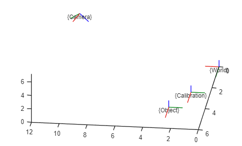

```matlab
figure; 
plotTransforms([0, 0, 0], rotm2quat(eye(3)), "FrameLabel","World");
 hold on; 
% 
 plotTransforms([1.4,2.5,0],rotm2quat(rotz(pi/2)), "FrameLabel","Calibration");
TWC=transl([0.14,0.25,0]);
TWC(1:3,1:3)=rotz(pi/2);

view([187.045 52.727])

 rotWCam=rotx(-pi/2)*roty(-pi/2)*rotx(-40*pi/180)*roty(20*pi/180);

 TWCam=transl([0.25,0.4,0.7]);
 TWCam(1:3,1:3)=rotWCam;

 plotTransforms([10, 0, 7], rotm2quat(rotWCam), "FrameLabel","Camera");

 plotTransforms([2.5,4.5,0.8],rotm2quat(rotz(pi/2)), "FrameLabel","Object");
TWO = transl([0.25,0.45,0.08]);
TWO(1:3,1:3) = rotz(pi/2);

TCamO=round(TWCam\TWO,4)
```

```matlabTextOutput
TCamO = 4x4
    0.9397   -0.2620    0.2198   -0.0893
         0   -0.6428   -0.7660    0.4749
    0.3420    0.7198   -0.6040    0.3916
         0         0         0    1.0000

```

```matlab
TCamC=round(TWCam\TWC,4)
```

```matlabTextOutput
TCamC = 4x4
    0.9397   -0.2620    0.2198   -0.3237
         0   -0.6428   -0.7660    0.4655
    0.3420    0.7198   -0.6040    0.4507
         0         0         0    1.0000

```

```matlab

 hold off
```

<center></center>

