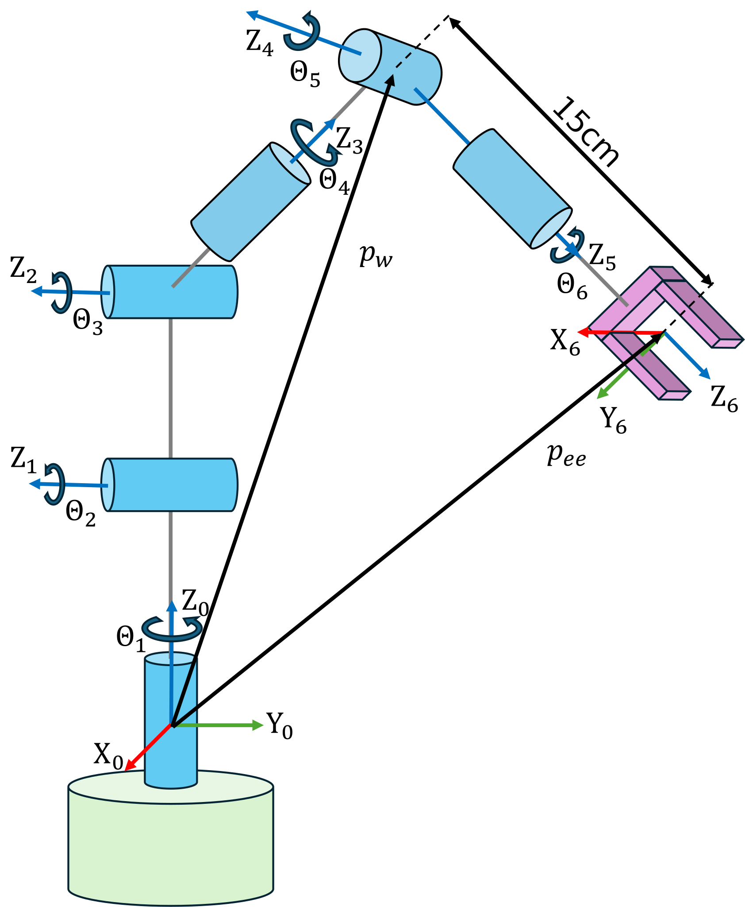

```matlab
clear all; 
```
# Exercise 2.3 \- Inverse Kinematic Anthropomorpic arm with Spherical Wrist

In this Exercise you will compute the inverse kinematic of an antropomorphic arm with a spherical wrist


Please store your solutions in the predefined variables!

# Task description:

below you will see a model of an Anthropomorphic arm with a spherical wrist. 


Consider the following set of DH parameters: 

|      |      |      |      |      |
| :-: | :-- | :-: | :-: | :-- |
| Link <br>  | a \[m\] <br>  | alpha <br>  | d \[m\] <br>  | theta <br>   |
| 1 <br>  | 0 <br>  | pi/2 <br>  | 0 <br>  | $\displaystyle \theta_1$ <br>   |
| 2 <br>  | 0.3 <br>  | 0 <br>  | 0 <br>  | $\displaystyle \theta_2$ <br>   |
| 3 <br>  |   0.2 <br>  | pi/2 <br>  | 0 <br>  | $\displaystyle \theta_3$ <br>   |
| 4 <br>  | 0 <br>  | \-pi/2 <br>  | 0.2 <br>  | $\displaystyle \theta_4$ <br>   |
| 5 <br>  | 0 <br>  | pi/2 <br>  | 0 <br>  | $\displaystyle \theta_5$ <br>   |
| 6 <br>  | 0 <br>  | 0 <br>  | 0.15 <br>  | $\displaystyle \theta_6$ <br>   |
|      |      |      |      |       |





In the case of this manipulator with a spherical wrist, the solution is decoupled between position and orientation, i.e. the three joints of the arm are used to position the end\-effector, and thethree joints are used to fix its orientation.


Given the end\-effector position $p_{\textrm{ee}}$ and orientation $R_{\textrm{ee}}$ , the following steps should be followed:

1.  Compute the wrist position $p_w =p_{\textrm{ee}} -d_6 \cdot z_6$
2. Solve inverse kinematics for the Anthropomorphic Arm: $\theta_3 ,\theta_2 ,\theta_1$
3. Compute $R_3^0 \left(\theta_1 ,\theta_2 ,\theta_3 \right)$
4. Compute $R_6^3 \left(\theta_4 ,\theta_5 ,\theta_6 \right)={R_3^0 }^T \cdot R_{\textrm{ee}}$
5. Solve inverse kinematics for Spherical Wrist: $\theta_4 ,\theta_5 ,\theta_6$

The four solutions of the IK of the arm combined with the two solution of the wrist result in a total of eight solutions.


Reach the following pose: 

 $$ T_{\textrm{desired}} =\left\lbrack \begin{array}{cccc} 0\ldotp 5 & 0 & 0\ldotp 866 & 0\ldotp 25\newline 0\ldotp 866 & 0 & -0\ldotp 5 & 0\ldotp 1\newline 0 & 1 & 0 & 0\ldotp 35\newline 0 & 0 & 0 & 1 \end{array}\right\rbrack $$ 

Answer all the questions and store your solution in the correct variable

```matlab
syms q1 q2 q3 q4 q5 q6 real 
% DH Parameters Table
        % a      alpha      d       theta
DH = [    0,     pi/2,     0,       q1;    % Link 1
          0.3,   0,        0,       q2;    % Link 2
          0.2,   pi/2,     0,       q3;    % Link 3
          0,     -pi/2,    0.2,     q4;    % Link 4
          0,     pi/2,     0,       q5;    % Link 5
          0,     0,        0.15,    q6];   % Link 6
```
# Task 1
1.  Compute the wrist position $p_w =p_{\textrm{ee}} -d_6 \cdot z_6$
2. Solve inverse kinematics for the Anthropomorphic Arm: $\theta_3 ,\theta_2 ,\theta_1$

Use the following variables  to store your solution:

-  pee (endeffector position) 
-  pw (the wrist position) 
-  anthro\_solutions (inverse kinematic solution where each row is a solution) 
```matlab
pee = [];
pw = [];
anthro_solutions = []; 
```

You can check your work by clicking the Run: 

```matlab
 
check_exercise('2-3-1')
```
# Task 2
1.  Compute $R_3^0 \left(\theta_1 ,\theta_2 ,\theta_3 \right)$
2. Compute $R_6^3 \left(\theta_4 ,\theta_5 ,\theta_6 \right)={R_3^0 }^T \cdot R_{\textrm{ee}}$

Use the following variables  to store your solution:

-  Ree (Rotation of the end\-effector) 
-  R03 (Rotation from frame 0 to frame 3) 
-  R36 (Rotation from frame 3 to frame 6) 
```matlab
Ree = []; 
R03 = []; 
R36 = [];
```

You can check your work by clicking the Run: 

```matlab
 
check_exercise('2-3-2')

```
# Task 3
1.  Solve inverse kinematics for Spherical Wrist: $\theta_4 ,\theta_5 ,\theta_6$

Use the following variables  to store your solution:

-  spherical\_solutions (inverse kinematic solution where each row is a solution)  
-  solutions (complete inverse kinematic solution for the anthropomorpic arm with spherical wrist, where each row represents a unique solution) 
```matlab
spherical_solutions = [];
solutions = [];
```

You can check your work by clicking the Run: 

```matlab
 
check_exercise('2-3-3')

```
