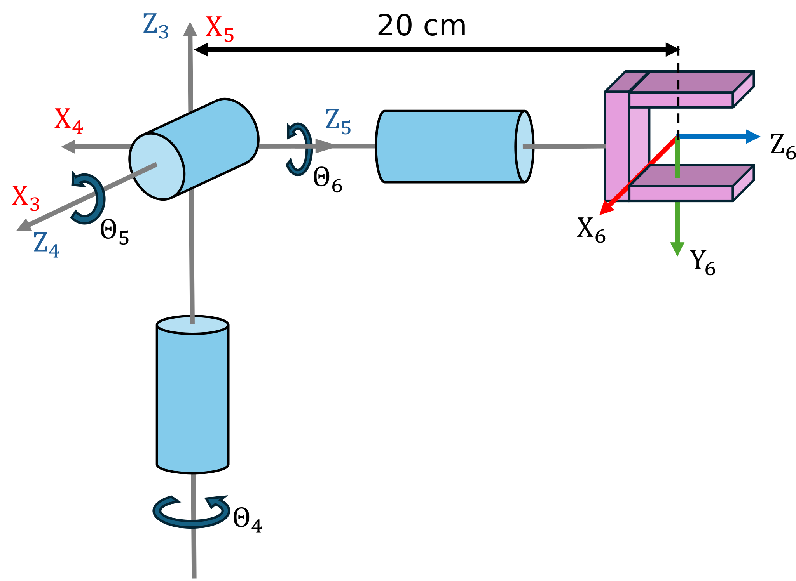
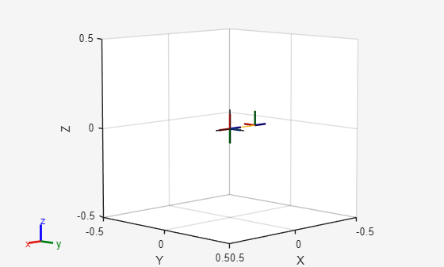

```matlab
clear all; 
```
# <span style="color:rgb(213,80,0)">Exercise 2.1 \- Forward Kinematics</span>

In this exercise you will setup the forward kinematics equations for different robot manipulators. 


Please store your solutions in the predefined variables!

# Task description:

Find the DH parameters and setup the forward kinematics for the shown strucutre.


Answer all the questions and store your solution in the correct variable

# Task 1

Given this Spherical Wrist setup. 

1.  Find the DH parameters and setup the Forward Kinematics matrix.


Use the following variables  to store your solution:

-  q4 ... q6 (Real Symbolic variable for the Joint angle Theta 4\-6) 
-  q (vector containing the symbolic Joint angles) 
-  A36 (Forward Kinematic Equation) 
```matlab
syms q4 q5 q6 real
q = [q4, q5, q6]; 
syms d6 q4 q5 q6 real

DH = [
        0  -pi/2    0   q4; 
        0  pi/2     0   q5; 
        0  0        0.2  q6
]; 

A34 = dh2tf(DH(1,:));
A45 = dh2tf(DH(2,:));
A56 = dh2tf(DH(3,:));

A36 = A34 * A45 * A56;
A36 = simplify(A36);
```

You can check your work by clicking the Run: 

```matlab
 
check_exercise('2-1-1')
```

```matlabTextOutput
Checking exercise 2-1-1: Checking forward kinematic

Checking variables:
 
Checking Variable A36
[OK] A36 is of type sym

Checking Variable q4
[OK] q4 is of type sym

Checking Variable q5
[OK] q5 is of type sym

Checking Variable q6
[OK] q6 is of type sym

Checking if variables are real
[OK] variables are setup correctly

Checking Variable q
[OK] q is of type sym

Checking dimension of q
[OK] correct dimensions of q

Checking A36 matrix
[OK] Forward Kinematics matches solution
```
# Task 2
1.  Find the forward kinematics for the joint configuration \[0, 0, 0\], convert them to a numerical type
2. Find the forward kinematics for the joint configuration \[pi/2, 0 , pi/7\], convert them to a numerical type

Use the following variables  to store your solution:

-  T\_1 (Homogeneous Transform for  joint configuration \[0, 0, 0\])  
-  T\_2 (Homogeneous Transform for  joint configuration \[pi/2, 0 , pi/7\])  
```matlab
T_1 = double(subs(A36, q, zeros(1,3))); 
T_2 = double(subs(A36, q, [pi/2, 0, pi/7])); 
```

You can check your work by clicking the Run: 

```matlab
 
check_exercise('2-1-2')
```

```matlabTextOutput
Checking exercise 2-1-2: Tranform matrices

Checking variables:
 
Checking Variable T_1
[OK] T_1 is of type double
[OK] T_1 correct

Checking Variable T_2
[OK] T_2 is of type double
[OK] T_2 correct
```
# Task 3
1.  Setup the Wrist using the Robotic System toolbox with the Dataformat "column"
2. Define the data format as column

use the following names:

-  spherical\_wrist (name of the robot) 
-  world (base of the robot) 
-  wrist\_1\_link ... wrist\_3\_link (body name of the wrist links) 
-  wrist\_1\_joint ... wrist\_3\_joint (joint names of the wrist) 
-  tool0 (name of the tool link) 
```matlab
spherical_wrist = rigidBodyTree("DataFormat","column");
bodies=cell(3,1);
joints=cell(3,1);
spherical_wrist.BaseName = 'world'; 
for i = 1:3
    bodies{i} = rigidBody(['wrist_' num2str(i) '_link']);
    joints{i} = rigidBodyJoint(['wrist_' num2str(i) '_joint'], 'revolute');
    setFixedTransform(joints{i}, double(subs(DH(i,:),q,zeros(1,3))), "dh");
    bodies{i}.Joint = joints{i};
end
```

```matlabTextOutput
Unrecognized function or variable 'DH'.
```

```matlab
addBody(spherical_wrist,bodies{1},spherical_wrist.BaseName)
addBody(spherical_wrist, bodies{2},bodies{1}.Name)
addBody(spherical_wrist, bodies{3},bodies{2}.Name)

```

You can check your work by clicking the Run: 

```matlab
 
check_exercise('2-1-3')
```
# Task 4
1.  Obtain the Transform for the Joint Configuration \[0,\-pi/2,\-pi/2\]

Use the following variables  to store your solution:

-  T\_config (Transform for the Joint Configuration \[0,\-pi/2,\-pi/2\]) 
```matlab
T_config = getTransform(spherical_wrist, [0,-pi/2,-pi/2]', "world", "wrist_3_link"); 
%show(spherical_wrist, [0,-pi/2,-pi/2]')
```

<center></center>


```matlabTextOutput
ans = 
  Axes (Primary) with properties:

             XLim: [-0.5000 0.5000]
             YLim: [-0.5000 0.5000]
           XScale: 'linear'
           YScale: 'linear'
    GridLineStyle: '-'
         Position: [0.1300 0.1100 0.7750 0.8150]
            Units: 'normalized'

  Show all properties

```

You can check your work by clicking the Run: 

```matlab
 
check_exercise('2-1-4')
```

```matlabTextOutput
Checking exercise 2-1-4: Checking Tranform matrices

Checking variables:
 
Checking Variable T_config
[OK] T_config is of type double
[OK] T_config correct
```
# Task 5
1.  Using the Robotic System toolbox load a UR10e model
2. Obtain the transform from the baseframe to the first wrist link for the configuration \[0,0,0,0,0,0\]
3. Obtain the transform from the baseframe to the tool0 frame for the configuration \[0, \-pi/2, 0, \-pi/2, 0, 0\]

Use the following variables  to store your solution:

-  ur10e (Name of the robot) 
-  TBW1 (Homogeneous Transform Base to first wrist) 
-  TBT (Homogeneous Transform from Base to tool0) 
```matlab
ur10e = loadrobot("universalUR10e", "DataFormat","column");
TBW1 = getTransform(ur10e, zeros(6,1), "base_link", "wrist_1_link")
```

```matlabTextOutput
TBW1 = 4x4
   -1.0000   -0.0000         0    1.1843
   -0.0000    0.0000    1.0000   -0.1807
   -0.0000    1.0000   -0.0000   -0.1741
         0         0         0    1.0000

```

```matlab
TBT = getTransform(ur10e, [0, -pi/2, 0, -pi/2, 0, 0]', "base_link", "tool0")
```

```matlabTextOutput
TBT = 4x4
1.0000    0.0000   -0.0000    0.0000
   -0.0000   -0.0000   -1.0000    1.4848
   -0.0000    1.0000   -0.0000   -0.2907
         0         0         0    1.0000

```

You can check your work by clicking the Run: 

```matlab
 
check_exercise('2-1-5')
```

```matlabTextOutput
Checking exercise 2-1-5: Checking Tranform matrices

Checking variables:
 
Checking Variable ur10e
[OK] ur10e is of type rigidBodyTree

Checking Variable ur10e.DataFormat
[OK] ur10e.DataFormat matches expected value

Checking Robot kinematic output
[OK] Robot matches expected behaviour

Checking Variable TBW1
[OK] TBW1 is of type double
[OK] TBW1 correct

Checking Variable TBT
[OK] TBT is of type double
[OK] TBT correct
```

