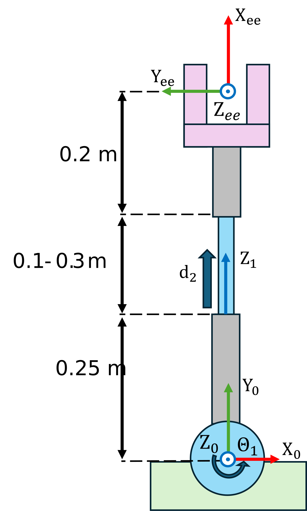
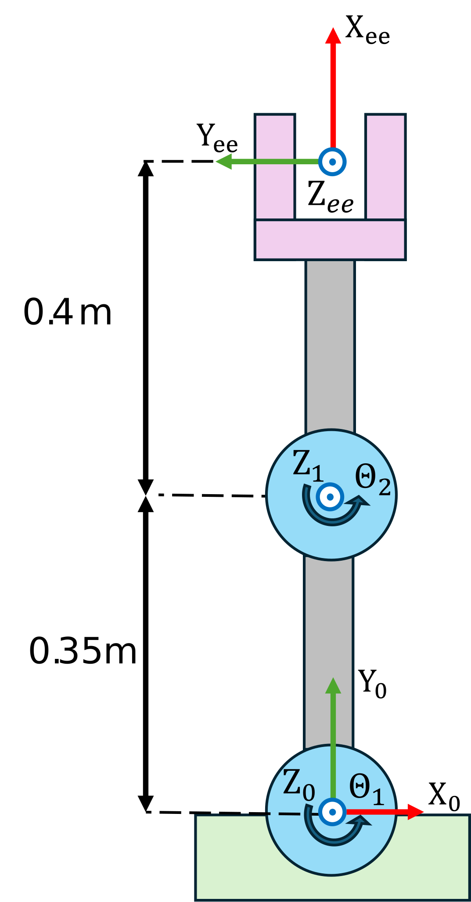

```matlab
clear all; 
```
# <span style="color:rgb(213,80,0)">Exercise 2.3 \- Inverse Kinematic Planar Arms</span>

In this Exercise you will compute the inverse kinematic solutions of differnet planar manipulators


Please store your solutions in the predefined variables!

# Task description:

Compute the solutions to the inverse kinematics to reach a desired position or pose.


Answer all the questions and store your solution in the correct variable

# Task 1
<p style="text-align:left">
   
</p>


Reach the Position 

 $$ t_{\textrm{desired}} =\left\lbrack \begin{array}{c} 0\ldotp 3333\newline 0\ldotp 4989\newline 0 \end{array}\right\rbrack $$ 

w.r.t. frame 0

1.  compute the solution to reach this position

Use the following variables  to store your solution:

-  sol\_1 (row vector as: \[q1,q2\]) 
```matlab
t=[0.3333; 0.4989]; 
R = sqrt(0.333^2+0.4989^2); %Required arm reach 
q2 = R-(0.25+0.2); %compute q2 
q1 = atan(t(2)/t(1));

sol_1 = [q1 , q2]; 
```

You can check your work by clicking the Run: 

```matlab
 
check_exercise('2-2-1')
```

```matlabTextOutput
Checking exercise 2-2-1: Checking IK solutions for first manipulator

Checking variables:
 
Checking Type of solution
[OK] sol_1 is of type double

checking solution size
[OK] size(sol_1,1) correct

Checking q1
[OK] solution for q1 is correct

Checking q2
[OK] solution for q2 is correct
```
# Task 2
<p style="text-align:left">
   
</p>


Reach the Position 

 $$ t_{\textrm{desired}} =\left\lbrack \begin{array}{c} 0\ldotp 2582\newline 0\ldotp 6944\newline 0 \end{array}\right\rbrack $$ 

w.r.t. frame 0

1.  find all solutions to this problem

Use the following variables  to store your solution:

-  sol\_2 (Matrix where each row represents a solution as: \[q1,q2\]) 
```matlab
% link lengths
a1 = 0.35;  
a2 = 0.40;

% desired end‑effector position
x = 0.2582;  
y = 0.6944;

% distance to target
R = sqrt(x^2 + y^2);

% compute cos(q2) and the positive sin(q2) for elbow‑up
cosq2 = (R^2 - a1^2 - a2^2)/(2*a1*a2);
sinq2 =  sqrt(1 - cosq2^2);

% pre‑allocate solution matrix [q1, q2] per row
sol_2 = zeros(2,2);

for k = 1:2
    % choose +sinq2 for row 1, -sinq2 for row 2
    s = (-1)^(k-1);           
    q2k = atan2( s * sinq2, cosq2 );
    
    % intermediate geometry
    K1 = a1 + a2*cos(q2k);
    K2 = a2*sin(q2k);

    % compute cos(q1), sin(q1)
    cosq1 = ( x*K1 + y*K2 ) / ( K1^2 + K2^2 );
    sinq1 = ( y*K1 - x*K2 ) / ( K1^2 + K2^2 );

    % finally q1 via atan2
    q1k = atan2(sinq1, cosq1);

    % store [q1, q2] in row k
    sol_2(k, :) = [ q1k, q2k ];
end

```

You can check your work by clicking the Run: 

```matlab
 
check_exercise('2-2-2')
```

```matlabTextOutput
Checking exercise 2-2-2: Checking IK solutions for second manipulator

Checking variables:
 
checking solution type
[OK] sol_2 is of type double

checking solution size
[OK] size(sol_2,1) correct

checking first solution for q1
[OK] first solution for q1 is correct

checking first solution for q2
[OK] first solution for q2 is correct

checking second solution for q1
[OK] second solution for q1 is correct

checking second solution for q2
[OK] second solution for q2 is correct
```


# Task 3
<p style="text-align:left">
   
</p>


Reach the pose: 

 $$ T_{\textrm{desired}} =\left\lbrack \begin{array}{cccc} 0\ldotp 3303 & 0\ldotp 9439 & 0 & 0\ldotp 3\newline 0\ldotp 9439 & -0\ldotp 3303 & 0 & 0\ldotp 25\newline 0 & 0 & -1 & 0\newline 0 & 0 & 0 & 1 \end{array}\right\rbrack $$ 

w.r.t. frame 0

1.  Find all inverse kinematics solutions

Use the following variables  to store your solution:

-  sol\_3 (Matrix where each row represents a solution as: \[q1,q2,q3\]) 
-  
```matlab
% link lengths
a1 = 0.35;  
a2 = 0.25;

syms q1 q2 q3 real 
DH = [a1,0,0,q1;
    a2,0,0,q2;
    0,pi,0,q3];

T = simplify(dh2tf(DH(1,:))*dh2tf(DH(2,:))*dh2tf(DH(3,:)))
```
T = 
 $\displaystyle \left(\begin{array}{cccc} \cos \left(q_1 +q_2 +q_3 \right) & \sin \left(q_1 +q_2 +q_3 \right) & 0 & \frac{\cos \left(q_1 +q_2 \right)}{4}+\frac{7\,\cos \left(q_1 \right)}{20}\newline \sin \left(q_1 +q_2 +q_3 \right) & -\cos \left(q_1 +q_2 +q_3 \right) & 0 & \frac{\sin \left(q_1 +q_2 \right)}{4}+\frac{7\,\sin \left(q_1 \right)}{20}\newline 0 & 0 & -1 & 0\newline 0 & 0 & 0 & 1 \end{array}\right)$
 

```matlab

% desired end‑effector position
x = 0.3;  
y = 0.25;

% desired end-effector orientation
rotation = [0.3303, 0.9439,0; 
    0.9439, -0.3303,0;
    0,0,-1]; 

Tdes= eye(4);
Tdes(1:3,1:3)=rotation; 
Tdes(1:2,4)=[x;y]; 

% distance to target
R = sqrt(x^2 + y^2);

% compute cos(q2) and the positive sin(q2) for elbow‑up
cosq2 = (R^2 - a1^2 - a2^2)/(2*a1*a2);
sinq2 =  sqrt(1 - cosq2^2);

% pre‑allocate solution matrix [q1, q2] per row
sol_3 = zeros(2,3);

for k = 1:2
    % choose +sinq2 for row 1, -sinq2 for row 2
    s = (-1)^(k-1);           
    q2k = atan2( s * sinq2, cosq2 );
    
    % intermediate geometry
    K1 = a1 + a2*cos(q2k);
    K2 = a2*sin(q2k);

    % compute cos(q1), sin(q1)
    cosq1 = ( x*K1 + y*K2 ) / ( K1^2 + K2^2 );
    sinq1 = ( y*K1 - x*K2 ) / ( K1^2 + K2^2 );

    % finally q1 via atan2
    q1k = atan2(sinq1, cosq1);

    % store [q1, q2] in row k
    q3e = atan2(rotation(2,1), rotation(1,1)) - (q1 + q2);
    q3k = double(subs(q3e,[q1,q2], [q1k,q2k]));
    sol_3(k, :) = [ q1k, q2k, q3k];
    
end

Test= zeros(4,4,2); 
for i=1:2
    Test(:,:,i)=round(subs(T, [q1,q2,q3], sol_3(i,:)),4);
end
```

You can check your work by clicking the Run: 

```matlab
 
check_exercise('2-2-3')
```

```matlabTextOutput
Checking exercise 2-2-3: Checking IK solutions for third manipulator

Checking variables:
 
checking solution type
[OK] sol_3 is of type double

checking solution size
[OK] size(sol_3,1) correct

checking first solution for q1
[OK] first solution for q1 is correct

checking first solution for q2
[OK] first solution for q2 is correct

checking first solution for q3
[OK] first solution for q3 is correct

checking second solution for q1
[OK] second solution for q1 is correct

checking second solution for q2
[OK] second solution for q2 is correct

checking second solution for q3
[OK] second solution for q3 is correct
```


