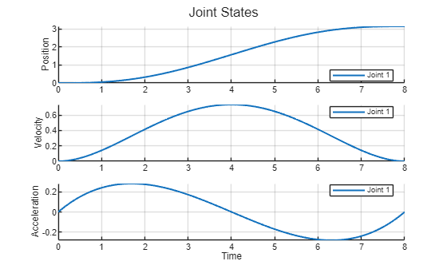
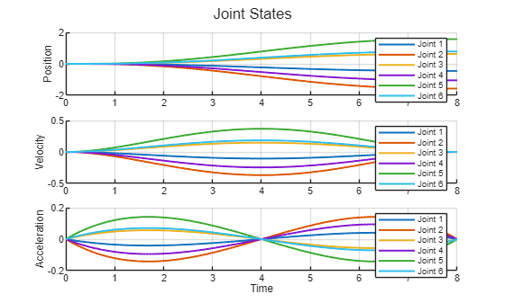
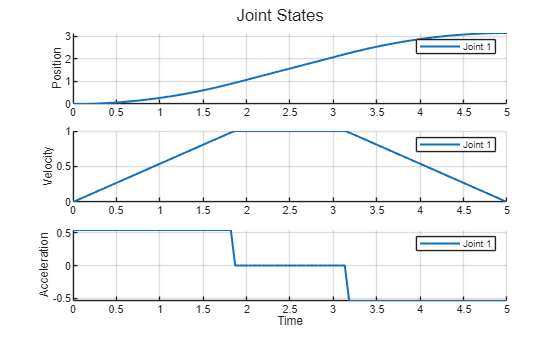
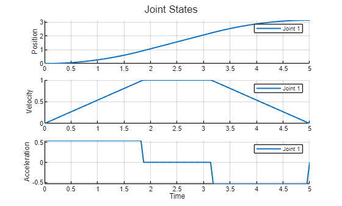
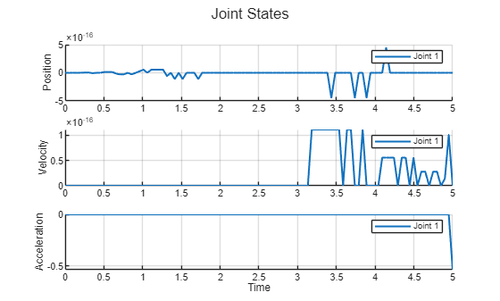

```matlab
clear all; 
```
# Exercise 2.4 \- Trajectory Planning

In this exercise you will develop functions to compute joint trajectories. 


Please store your solutions in the predefined variables!

# Task description:

Follow the tasks and setup the required functions for differnt trajectory computations. 


Answer all the questions and store your solution in the correct variable

# Task 1

Write a function that computes a quintic joint trajectory for a single joint. This function takes four inputs: 

1.  initial joint state (q0)
2. target joint state (qf)
3. time to reach pose (t)
4. Intermediate joint states (N)
5. initial velocity (v0)
6. velocity at target joint state (vf)
7. initial acceleration (a0)
8. acceleration at target joint state (af)

and returns the jont trajectory as a where each row corresponds to a joint configuration, the joint speed trajectory, the joint acceleration trajectory and a vector containing the time at each trajectory entry. 


Assume that both, the velocity and acceleration at the start and end of the trajectory are 0. 


Use the following function name for your solution:

-  SingleQuinticTrajectory(q0, qf, T, N, v0, vf, a0, af) 

Solve this exercise without using the functions: 

-  quinticpolytraj() 
```matlab
function [q_trajectory, qd_trajectory, qdd_trajectory, timevec] = SingleQuinticTrajectory(q0, qf, T, N, v0, vf, a0, af)

syms A B C D E F t real 

coeffs = [A,B,C,D,E,F];

pos = A*t^5+B*t^4+C*t^3+D*t^2+E*t+F; 
vel = diff(pos, t); 
acc = diff(vel, t); 

pos0 = q0 == subs(pos, t, 0);
posf = qf == subs(pos, t, T);

vel0 = v0 == subs(vel, t, 0); 
velf = vf == subs(vel, t, T); 

acc0 = a0 == subs(acc, t, 0); 
accf = af == subs(acc, t, T); 

eq_sys = [pos0, posf, vel0, velf, acc0, accf]; 

sol = solve(eq_sys, coeffs); 

numsol = cell2mat(struct2cell(sol))'; 

posfunc = subs(pos, coeffs, numsol); 
velfunc = subs(vel, coeffs, numsol); 
accfunc = subs(acc, coeffs, numsol); 

timevec = linspace(0,T,N); 

q_trajectory = double(subs(posfunc, t, timevec));
qd_trajectory = double(subs(velfunc, t, timevec));
qdd_trajectory = double(subs(accfunc, t, timevec));
end

```

You can check your work by clicking the Run: 

```matlab
 
check_exercise('2-4-1')
```

```matlabTextOutput
Checking exercise 2-4-1: Checking Single Quintic Trajectory 
[OK] Output for: SingleQuinticTrajectory(0,3.1416,8,100,0,0,0,0) matched expectation within tolerance
```

```matlab
 
q0 = 0; 
qf = pi;
v0 = 0; 
vf = 0; 
a0 = 0;
af = 0; 
T = 8; 
N = 100; 
[q_trajectory, qd_trajectory, qdd_trajectory, timevec] = SingleQuinticTrajectory(q0,qf,T,N,v0,vf,a0,af);
plotTrajectory(q_trajectory, qd_trajectory, qdd_trajectory, timevec)
```


# Task 2

Write a function that takes two joint configurations and computes the quintic trajectory for each joint. You may use your previously defined function


Use the following variables  to store your solution:

-  QuinticConfigurationTrajectory(q0, qf, T, N, v0, vf, a0, af) 

Solve this exercise without using the functions: 

-  quinticpolytraj() 
```matlab
function [q_config_trajectory, qd_config_trajectory, qdd_config_trajectory, timevec] = QuinticConfigurationTrajectory(q0, qf, T, N, v0, vf, a0, af)
    
    q_config_trajectory = zeros(N,size(q0,2)); 
    qd_config_trajectory = zeros(N,size(q0,2)); 
    qdd_config_trajectory = zeros(N,size(q0,2)); 

for i = 1:size(q0,2)
    [q_trajectory, qd_trajectory, qdd_trajectory, timevec] = SingleQuinticTrajectory(q0(i), qf(i), T, N, v0(i), vf(i), a0(i), af(i));
    q_config_trajectory(:, i) = q_trajectory'; 
    qd_config_trajectory(:, i) = qd_trajectory'; 
    qdd_config_trajectory(:, i) = qdd_trajectory'; 
end

end


```

You can view your trajectory in Rviz: 

```matlab
 
q0 = zeros(1,6); 
qf = [-pi/7,-pi/2,pi/5,-pi/3,pi/2,pi/4];
v0 = zeros(1,6); 
vf = zeros(1,6); 
a0 = zeros(1,6);
af = zeros(1,6); 
T = 8; 
N = 300; 
[q_trajectory, qd_trajectory, qdd_trajectory, timevec] = QuinticConfigurationTrajectory(q0,qf,T,N,v0,vf,a0,af);
plotTrajectory(q_trajectory, qd_trajectory, qdd_trajectory, timevec)
```



```matlab
JointStatesToRviz(q_trajectory, 'ur3e', [], T);
```

```matlabTextOutput
Error using JointStatesToRviz (line 423)
Expected a string scalar or character vector for the parameter name.
```


You can check your work by clicking the Run: 

```matlab
 
check_exercise('2-4-2')
```

```matlabTextOutput
Error using fileread (line 10)
Could not open file exercises\exercise-2-4-2.json. No such file or directory.

Error in check_exercise (line 8)
    data = jsondecode( fileread(json_file) );
    ^^^^^^^^^^^^^^^^^^^^^^^^^^^^^^^^^^^^^^^^^
```
# Task 3

Write a function that computes the Trapezoidal Trajectory for a single Joint. This function takes four inputs: 

1.  initial joint state (q0)
2. target joint state (qt)
3. time to reach pose (t)
4. number of steps to reach pose (N)
5. cruise velocity (vc)

Notice that you now have a different restiction compared to the tutorial. Thus your function should determine the required constant acceleration. 


The function should have four outputs: 

1.  joint state trajectory q
2. joint speed trajectory qd
3. joint acceleration trajectory qdd
4. time vector timevec

Use the following function name for your solution:

-  SingleTrapezoidalTrajectory(q0, qt, T, N, vc) 

Solve this exercise without using the functions: 

-  solve() 
-  trapveltraj() 
```matlab
function [q, qd, qdd, timevec] = SingleTrapezoidalTrajectory(q0, qt, T, N, vc)

    % Ensure column vectors
    q0 = q0;
    qt = qt;
    n  = numel(q0);

    % Generate time vector
    timevec = linspace(0, T, N).';
    t       = timevec.';

    q   = zeros(1, N);
    qd  = zeros(1, N);
    qdd = zeros(1, N);

    for i = 1:n
        D     = qt(i) - q0(i);
        s     = sign(D);
        D     = abs(D);
        if D == 0
            continue;
        end
        vc_i   = abs(vc(min(i, end)));
        vc_tri = 2 * D / T;

        if vc_i < vc_tri
            % Trapezoidal profile
            a  = vc_i^2 / (vc_i * T - D);
            t1 = vc_i / a;
            t2 = T - t1;
            for k = 1:N
                tk = t(k);
                if tk <= t1
                    qdd(i,k) =  s * a;
                    qd(i,k)  =  s * a * tk;
                    q(i,k)   =  q0(i) + s * (0.5 * a * tk^2);
                elseif tk <= t2
                    qdd(i,k) = 0;
                    qd(i,k)  =  s * vc_i;
                    q(i,k)   =  q0(i) + s * (0.5 * a * t1^2 + vc_i * (tk - t1));
                elseif tk <= T
                    tau      = T - tk;
                    qdd(i,k) = -s * a;
                    qd(i,k)  =  s * a * tau;
                    q(i,k)   =  qt(i) - s * (0.5 * a * tau^2);
                else
                    qdd(i,k) = 0;
                    qd(i,k)  = 0;
                    q(i,k)   = qt(i);
                end
            end
        else
            % Triangular (no cruise) profile
            t1 = T / 2;
            a  = (2 * D) / (t1^2);
            for k = 1:N
                tk = t(k);
                if tk <= t1
                    qdd(i,k) =  s * a;
                    qd(i,k)  =  s * a * tk;
                    q(i,k)   =  q0(i) + s * (0.5 * a * tk^2);
                elseif tk <= T
                    tau      = T - tk;
                    qdd(i,k) = -s * a;
                    qd(i,k)  =  s * a * tau;
                    q(i,k)   =  qt(i) - s * (0.5 * a * tau^2);
                else
                    qdd(i,k) = 0;
                    qd(i,k)  = 0;
                    q(i,k)   = qt(i);
                end
            end
        end
    end

    q   = q.'; 
    qd  = qd.'; 
    qdd = qdd.'; 
end

[q, qd, qdd, timevec] = SingleTrapezoidalTrajectory(0,pi,5,100, 1);
[qt,qdt,qddt] = trapveltraj([0,pi], 100, "PeakVelocity",1, EndTime=5);
plotTrajectory(q, qd, qdd, timevec);
```



```matlab
plotTrajectory(qt,qdt,qddt, timevec);
```



```matlab
plotTrajectory(q-qt', qd-qdt', qdd-qddt', timevec);
```



You can check your work by clicking the Run: 

```matlab
 
check_exercise('2-4-3')
```
# Task 4

Extent your function from Task 3. This function takes six inputs: 

1.  initial joint state (q0)
2. target joint state (qt)
3. time to reach pose (t)
4. number of steps to reach pose (N)
5. cruise velocity (vc)
6. maximum acceleration (amax)

This function should check rather or not the computed joint trajectory results in an acceleration that is larger than a maximum allowed acceleration. If this is the case the function should increase the time to reach the pose in increments of 0.1s until the resuting acceleration is within the limits. 


You may use your function from Task 3


Use the following function name for your solution:

-  LimitedTrapezoidalTrajectory(q0, qt, t, N, vc, amax) 

The function should have four outputs: 

1.  joint state trajectory q
2. joint speed trajectory qd
3. joint acceleration trajectory qdd
4. time vector

Solve this exercise without using the functions: 

-  solve() 
-  trapveltraj() 
```matlab
function [q, qd, qdd, timevec] = LimitTrapezoidalTrajectory(q0,qt,t,N,vc,amax)

flag = true;
tnew=t; 

while flag

    [q, qd, qdd, timevec] = SingleTrapezoidalTrajectory(q0,qt,tnew,N,vc);
    if amax>=max(qdd)
        flag=false;
    else
        tnew =tnew+ 0.1;
    end

end

end

[q, qd, qdd, timevec] = LimitTrapezoidalTrajectory(0,pi,5,100, 1,0.5);
```

You can check your work by clicking the Run: 

```matlab
 
check_exercise('2-4-4')
```
