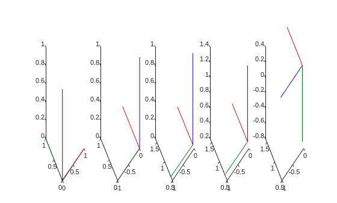
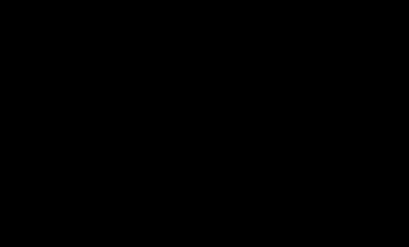

# Forward Kinematic

A foundational capability enabling robots to interact reliably with their environment is the ability to compute where each part of the mechanism will be, given a set of joint inputs. This process, known as **forward kinematics**, underpins everything from basic motion visualization to advanced trajectory planning. In this tutorial, we'll explore the mathematical framework and practical implementation strategies that allow you to determine an end\-effector's pose (position and orientation) in space, given the configuration of its joints.

# Problem

At its core, forward kinematics is the problem of mapping **joint space**, the vector of actuator or joint variables, to **Cartesian space**, the spatial pose of a robot's link or end\-effector.


Using the DH parameters to compute a homogeneous transform matrix that is dependent on a joint state. Recall that a homogeneous transform is defined as: 

 $$ T=\left\lbrack \begin{array}{ccccc}  &  &  & | & \newline  & R\in {\mathbb{R}}^{3\textrm{x3}}  &  & | & t\in {\mathbb{R}}^{3\textrm{x1}} \newline  &  &  & | & \newline -- & -- & -- & + & --\newline 0 & 0 & 0 & | & 1 \end{array}\right\rbrack =\left\lbrack \begin{array}{cccc} r_{11}  & r_{12}  & r_{13}  & \Delta \;x\newline r_{21}  & r_{22}  & r_{23}  & \Delta \;y\newline r_{13}  & r_{32}  & r_{33}  & \Delta \;z\newline 0 & 0 & 0 & 1 \end{array}\right\rbrack $$ 

The goal is to compute a transformation matrix that is only depending on the actuator variable q: 

 $$ T\left(q\right)=\left\lbrack \begin{array}{ccccc}  &  &  & | & \newline  & R\left(q\right) &  & | & t\left(q\right)\newline  &  &  & | & \newline -- & -- & -- & + & --\newline 0 & 0 & 0 & | & 1 \end{array}\right\rbrack $$ 

These transformation matrices define the translation and rotation from two consecutive joints. Concatenating them lets us compute the pose of a series of links up to the endeffector. 


Consider the Universal Robots UR3, notice the joint states qi in the theta position, as all joints are revolute: 

```matlab
syms q1 q2 q3 q4 q5 q6 real
DH=[ %by Universal Robots (website)
   %a       alpha       d       theta
   0        pi/2        0.1519  q1;
   -0.24365 0           0       q2;
   -0.21325 0           0       q3;
   0        pi/2        0.11235 q4;
   0        -pi/2       0.08535 q5;
   0        0           0.0819  q6;
    ];
```

Using the Symbolic Math Toolbox we can transform these DH parameters into a homogeneous transform matrix depending on the jointstate q. 

# Symbolic Math Toolbox

To model the Robot using the Symbolic Math Toolbox, we need to define Transform matrices using symbolic variables. We can later substitute real values to compute the cartesian pose of a series of links. 

## DH to Homogeneous Transform

Lets understand how to construct a homogeneous transform matrix from the DH parameters. 


For DH modeling we have two translations and two rotations. Following these steps sequence: 

1.  **Rotation around Z**, aligning the common normals (X\-axis) using theta (using DH parameter $\theta \;$ , for revolute joints this is the input q).
2. **Translation along the X\-axis**, placing the origins in the same Y\-Z plane (using DH parameter a).
3. **Translation along the Z\-axis**, placing the origins in the same point. (using DH parameter d, for prismatic joints this will be input q)
4. **Rotation around X\-axis**, alligning both Z\-axis. (using DH parameter $\alpha$ )
```matlab
syms alpha theta a d real %setup symbolic variables and define them as real 

FirstRotation=trotz(theta) %create a homogeneous transformation matrix -->Rotate around z axis
```
FirstRotation = 
 $\displaystyle \left(\begin{array}{cccc} \cos \left(\theta \right) & -\sin \left(\theta \right) & 0 & 0\newline \sin \left(\theta \right) & \cos \left(\theta \right) & 0 & 0\newline 0 & 0 & 1 & 0\newline 0 & 0 & 0 & 1 \end{array}\right)$
 

```matlab
FirstTranslation=transl([a 0 0]) %create a homogeneous transformation matrix --> Move along x axis
```
FirstTranslation = 
 $\displaystyle \left(\begin{array}{cccc} 1 & 0 & 0 & a\newline 0 & 1 & 0 & 0\newline 0 & 0 & 1 & 0\newline 0 & 0 & 0 & 1 \end{array}\right)$
 

```matlab
SecondTranslation=transl([0 0 d]) %create a homogeneous transformation matrix --> move along z axis 
```
SecondTranslation = 
 $\displaystyle \left(\begin{array}{cccc} 1 & 0 & 0 & 0\newline 0 & 1 & 0 & 0\newline 0 & 0 & 1 & d\newline 0 & 0 & 0 & 1 \end{array}\right)$
 

```matlab
SecondRotation=trotx(alpha) %create a homogeneous transformation matrix -->rotate around x axis
```
SecondRotation = 
 $\displaystyle \left(\begin{array}{cccc} 1 & 0 & 0 & 0\newline 0 & \cos \left(\alpha \right) & -\sin \left(\alpha \right) & 0\newline 0 & \sin \left(\alpha \right) & \cos \left(\alpha \right) & 0\newline 0 & 0 & 0 & 1 \end{array}\right)$
 

Let us visualize what is happening with each of these transforms.


Consider this arbitrary set of DH parameters: 

```matlab
          % a      alpha     d          theta
DHexample=[0.6,    -pi/2,    0.24,      pi/2]
```

```matlabTextOutput
DHexample = 1x4
    0.6000   -1.5708    0.2400    1.5708

```

See how each step is multiplied with the previous transformation: 

```matlab
                                % Input matrix      variable    value 
exampleFirstRotation =      subs(FirstRotation,     theta,      DHexample(4));
exampleFirstTranslation =   subs(FirstTranslation,  a,          DHexample(1));
exampleSecondTranslation =  subs(SecondTranslation, d,          DHexample(3));
exampleSecondRotation =     subs(SecondRotation,    alpha,      DHexample(2));

M=zeros(4,4,5);
M(:,:,1)=eye(4); 
M(:,:,2)=M(:,:,1)*double(exampleFirstRotation); 
M(:,:,3)=M(:,:,2)*double(exampleFirstTranslation); 
M(:,:,4)=M(:,:,3)*double(exampleSecondTranslation);
M(:,:,5)=M(:,:,4)*double(exampleSecondRotation); 

figure; 
axis(2*[-1,1,-1,1,-1,1])
for i=1:5
subplot(1,5,i)
plotTransforms(M(1:3,4,i)',tform2quat(M(:,:,i)))
end
```



Following these steps will result in a homogeneous transformation matrix that concatenates all the DH parameters. We will call these transformation matrices $A_{\textrm{source}\;\textrm{link}\to \textrm{target}\;\textrm{link}}$ . Using the Symbolic Toolbox we can setup a template as:

```matlab
Ai=FirstRotation*FirstTranslation*SecondTranslation*SecondRotation
```
Ai = 
 $\displaystyle \left(\begin{array}{cccc} \cos \left(\theta \right) & -\cos \left(\alpha \right)\,\sin \left(\theta \right) & \sin \left(\alpha \right)\,\sin \left(\theta \right) & a\,\cos \left(\theta \right)\newline \sin \left(\theta \right) & \cos \left(\alpha \right)\,\cos \left(\theta \right) & -\sin \left(\alpha \right)\,\cos \left(\theta \right) & a\,\sin \left(\theta \right)\newline 0 & \sin \left(\alpha \right) & \cos \left(\alpha \right) & d\newline 0 & 0 & 0 & 1 \end{array}\right)$
 

or manually set it as:

```matlab
Ai_symbolic = [
                  cos(theta)     -sin(theta)*cos(alpha)    sin(theta)*sin(alpha)     a*cos(theta);
                  sin(theta)     cos(theta)*cos(alpha)     -cos(theta)*sin(alpha)    a*sin(theta);
                  0              sin(alpha)                cos(alpha)                d;
                  0              0                         0                         1
              ]
```
Ai_symbolic = 
 $\displaystyle \left(\begin{array}{cccc} \cos \left(\theta \right) & -\cos \left(\alpha \right)\,\sin \left(\theta \right) & \sin \left(\alpha \right)\,\sin \left(\theta \right) & a\,\cos \left(\theta \right)\newline \sin \left(\theta \right) & \cos \left(\alpha \right)\,\cos \left(\theta \right) & -\sin \left(\alpha \right)\,\cos \left(\theta \right) & a\,\sin \left(\theta \right)\newline 0 & \sin \left(\alpha \right) & \cos \left(\alpha \right) & d\newline 0 & 0 & 0 & 1 \end{array}\right)$
 

Using this symbolic matrix lets us easily substitute different DH parameters to compute the transforms between two consecutive frames. 


For the UR3 the resulting matrices are: 

```matlab
A01 = subs(Ai_symbolic, [a alpha d theta], DH(1,:))
```
A01 = 
 $\displaystyle \left(\begin{array}{cccc} \cos \left(q_1 \right) & 0 & \sin \left(q_1 \right) & 0\newline \sin \left(q_1 \right) & 0 & -\cos \left(q_1 \right) & 0\newline 0 & 1 & 0 & \frac{1519}{10000}\newline 0 & 0 & 0 & 1 \end{array}\right)$
 

```matlab
A12 = subs(Ai_symbolic, [a alpha d theta], DH(2,:))
```
A12 = 
 $\displaystyle \left(\begin{array}{cccc} \cos \left(q_2 \right) & -\sin \left(q_2 \right) & 0 & -\frac{4873\,\cos \left(q_2 \right)}{20000}\newline \sin \left(q_2 \right) & \cos \left(q_2 \right) & 0 & -\frac{4873\,\sin \left(q_2 \right)}{20000}\newline 0 & 0 & 1 & 0\newline 0 & 0 & 0 & 1 \end{array}\right)$
 

```matlab
A23 = subs(Ai_symbolic, [a alpha d theta], DH(3,:))
```
A23 = 
 $\displaystyle \left(\begin{array}{cccc} \cos \left(q_3 \right) & -\sin \left(q_3 \right) & 0 & -\frac{853\,\cos \left(q_3 \right)}{4000}\newline \sin \left(q_3 \right) & \cos \left(q_3 \right) & 0 & -\frac{853\,\sin \left(q_3 \right)}{4000}\newline 0 & 0 & 1 & 0\newline 0 & 0 & 0 & 1 \end{array}\right)$
 

```matlab
A34 = subs(Ai_symbolic, [a alpha d theta], DH(4,:))
```
A34 = 
 $\displaystyle \left(\begin{array}{cccc} \cos \left(q_4 \right) & 0 & \sin \left(q_4 \right) & 0\newline \sin \left(q_4 \right) & 0 & -\cos \left(q_4 \right) & 0\newline 0 & 1 & 0 & \frac{2247}{20000}\newline 0 & 0 & 0 & 1 \end{array}\right)$
 

```matlab
A45 = subs(Ai_symbolic, [a alpha d theta], DH(5,:))
```
A45 = 
 $\displaystyle \left(\begin{array}{cccc} \cos \left(q_5 \right) & 0 & -\sin \left(q_5 \right) & 0\newline \sin \left(q_5 \right) & 0 & \cos \left(q_5 \right) & 0\newline 0 & -1 & 0 & \frac{1707}{20000}\newline 0 & 0 & 0 & 1 \end{array}\right)$
 

```matlab
A56 = subs(Ai_symbolic, [a alpha d theta], DH(6,:))
```
A56 = 
 $\displaystyle \left(\begin{array}{cccc} \cos \left(q_6 \right) & -\sin \left(q_6 \right) & 0 & 0\newline \sin \left(q_6 \right) & \cos \left(q_6 \right) & 0 & 0\newline 0 & 0 & 1 & \frac{819}{10000}\newline 0 & 0 & 0 & 1 \end{array}\right)$
 

Composing these Transforms lets us find more complex transforms between a series of frames. To get the transformation between frame 0 and frame 2 we can simply multiply A01 and A12: 

```matlab
A02=A01*A12
```
A02 = 
 $\displaystyle \left(\begin{array}{cccc} \cos \left(q_1 \right)\,\cos \left(q_2 \right) & -\cos \left(q_1 \right)\,\sin \left(q_2 \right) & \sin \left(q_1 \right) & -\frac{4873\,\cos \left(q_1 \right)\,\cos \left(q_2 \right)}{20000}\newline \cos \left(q_2 \right)\,\sin \left(q_1 \right) & -\sin \left(q_1 \right)\,\sin \left(q_2 \right) & -\cos \left(q_1 \right) & -\frac{4873\,\cos \left(q_2 \right)\,\sin \left(q_1 \right)}{20000}\newline \sin \left(q_2 \right) & \cos \left(q_2 \right) & 0 & \frac{1519}{10000}-\frac{4873\,\sin \left(q_2 \right)}{20000}\newline 0 & 0 & 0 & 1 \end{array}\right)$
 

To find the position of frame 2 at the configuration \[0, 0\] we can substitute: 

```matlab
A02_configuration = subs(A02, [q1,q2], [0,0])
```
A02_configuration = 
 $\displaystyle \left(\begin{array}{cccc} 1 & 0 & 0 & -\frac{4873}{20000}\newline 0 & 0 & -1 & 0\newline 0 & 1 & 0 & \frac{1519}{10000}\newline 0 & 0 & 0 & 1 \end{array}\right)$
 

You can view it as a decimal with n decimals as: 

```matlab
n=4; 
A02_config_decimal = vpa(A02_configuration, n)
```
A02_config_decimal = 
 $\displaystyle \left(\begin{array}{cccc} 1.0 & 0 & 0 & -0.2436\newline 0 & 0 & -1.0 & 0\newline 0 & 1.0 & 0 & 0.1519\newline 0 & 0 & 0 & 1.0 \end{array}\right)$
 

Using this composition we can compute the endeffector position when concatenating: 

```matlab
A06 = A01 * A12 * A23 * A34 * A45 * A56; 
A06_config=vpa(subs(A06,[q1,q2,q3,q4,q5,q6],[0,0,0,0,0,0]),4)
```
A06_config = 
 $\displaystyle \left(\begin{array}{cccc} 1.0 & 0 & 0 & -0.4569\newline 0 & 0 & -1.0 & -0.1943\newline 0 & 1.0 & 0 & 0.06655\newline 0 & 0 & 0 & 1.0 \end{array}\right)$
 
# Robotic System Toolbox

Load a predefined robot or set it up yourself.

```matlab
ur3=loadrobot("universalUR3", "DataFormat", "column");
```

You can get the transformation matrix using the getTransform() function. 


Use it by giving the following inputs: 

1.  RigidBodyTree Structure (robot)
2. Joint Configuration (depending on your data format it is a row/column vector or a strucutre)
3. Target Link name
4. Source Link name
```matlab

A06_RS_toolbox = getTransform(ur3, [0;0;0;0;0;0], "wrist_3_link", "base")
```

```matlabTextOutput
A06_RS_toolbox = 4x4
1.0000    0.0000   -0.0000   -0.4569
    0.0000   -1.0000   -0.0000   -0.1124
   -0.0000         0   -1.0000    0.0666
         0         0         0    1.0000

```

We can visualize a configuration in MATLAB as

```matlab
figure; 
show(ur3,[0;0;0;0;0;0]);
```



Or display it in ROS using the prebuild function: 

```matlab
JointStatesToRviz([0;0;0;0;0;0],'ur3');
```
