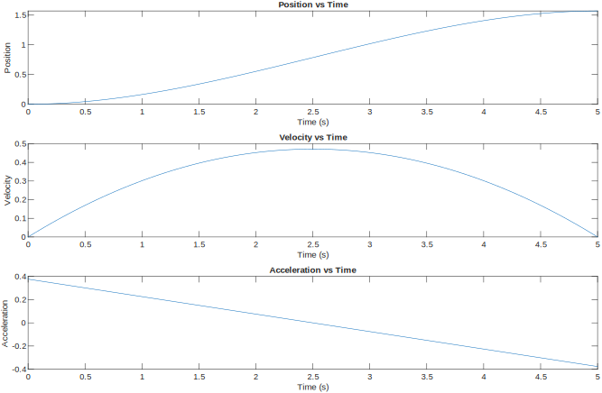
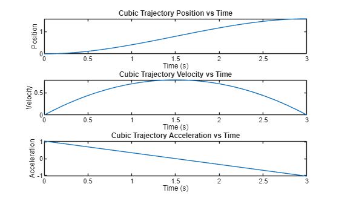
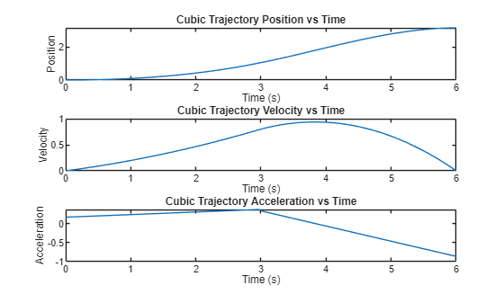
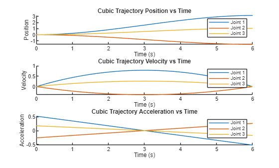
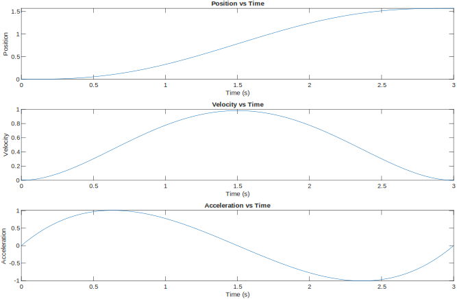
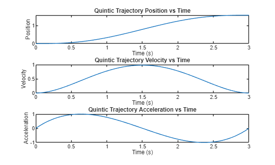
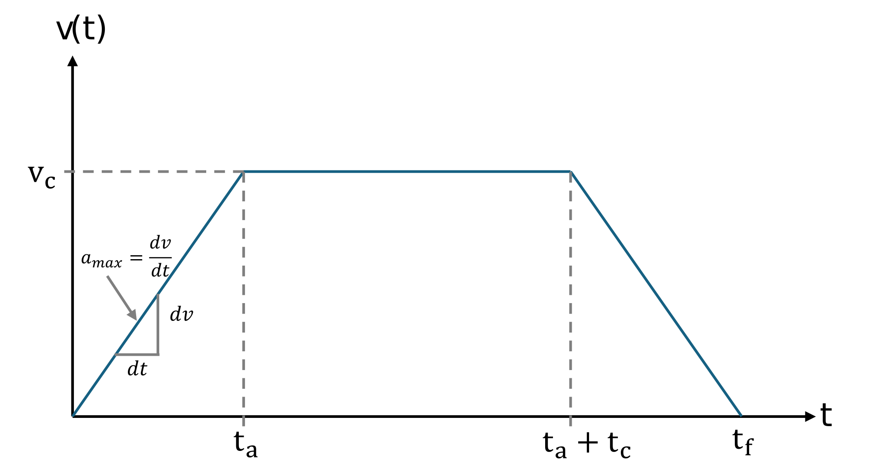
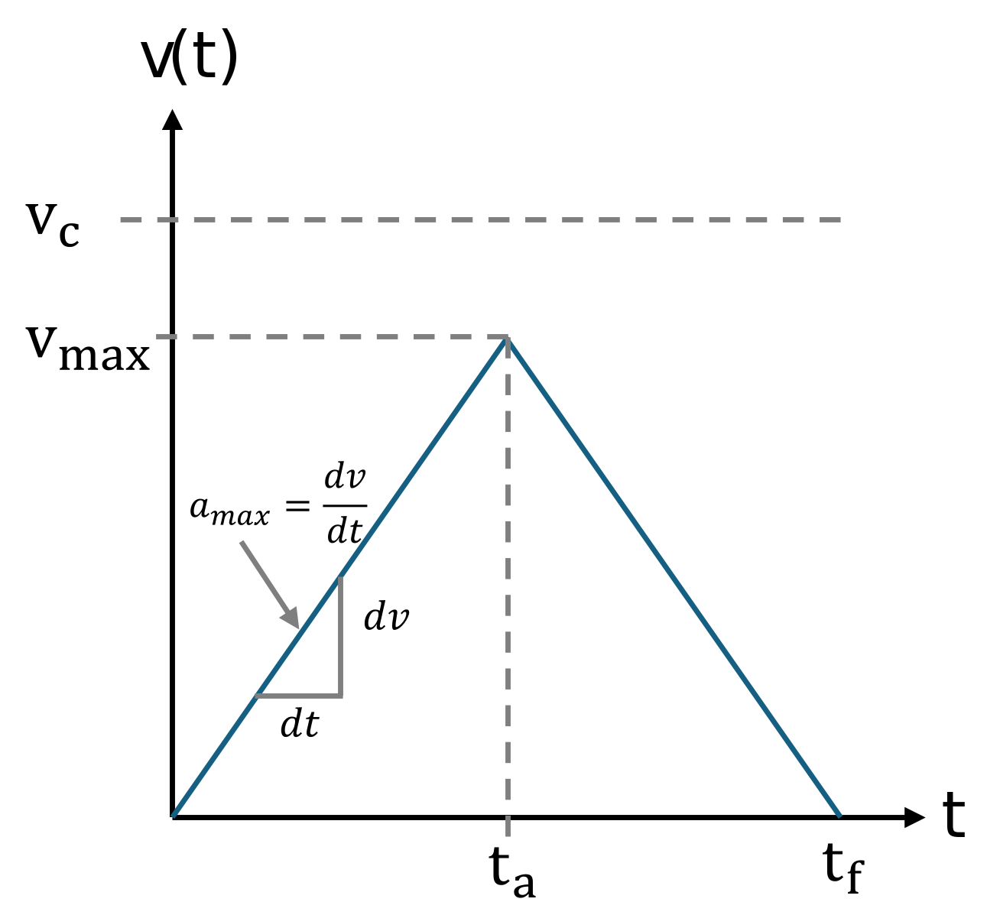
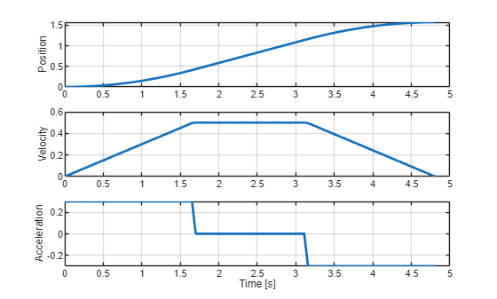
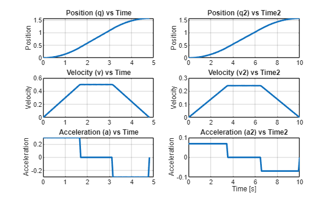

# <span style="color:rgb(213,80,0)">Joint Space Trajectory Planning </span>

Trajectory planning is a cornerstone of robot motion control: it defines **how** a robot moves between two configurations or end\-effector poses over time, subject to requirements on smoothness, timing, and physical limits (velocities, accelerations) of its joints or links.  By generating continuous profiles for position, velocity and acceleration, trajectory planners enable robots to carry out tasks safely, precisely and efficiently—whether following a pick\-and\-place path, welding a seam, or cooperating with humans.

# Cartesian Space and Joint Space

The inverse kinematics solution maps cartesian coordinates into the joint space. If we want to move the robot from one cartesian pose to another we aquire the inital joint positions and the a solution at the desired pose. Given these configurations, we need to compute how each joint will move to have a smooth trajectory.

# Polynominal Interpolation

Polynominal interpolation allows us to compute the joint states, speeds and accelerations so that they track a specific profile. Usually you will use a cubic or quintic equation.

## Cubic Profile

to achieve a cobic profile as seen below, you need to solve the following parametric equations:


 $S\left(t\right)=A\cdot t^3 +B\cdot t^2 +C\cdot t+D$ = Joint Position


 $\dot{\;S} \left(t\right)=3\cdot A\cdot t^2 +2\cdot B\cdot t+C$ = Joint Speed


This system of equations has four unknowns (A,B,C,D), therefore you need to come up with 4 equations to solve this system. For a set of desired parameters like: 


Initial joint state = 0


Desired joint state = $\frac{\pi }{2}$ 


Initial  velocity = 0


Desired velocity at the desired joint state = 0


Time for movement = 5 s


This set of parameters results in the linear system: 

 $$ \left\lbrace \begin{array}{ll} ~I & S(0)=0=D\newline ~II & \dot{S} (0)=0=C\newline ~III & S(5)=\pi /2=A\cdot 5^3 +B\cdot 5^2 +C\cdot 5+D\newline ~IV & \dot{S} (5)=0=3\cdot A\cdot 5^2 +2\cdot B\cdot 5+C \end{array}\right. $$ 

we can simplify the equations III and IV when substituting the results of I&II as: 

 $$ \left\lbrace \begin{array}{ll} ~I & S(0)=0=D\newline ~II & \dot{S} (0)=0=C\newline ~III & S(5)=\pi /2=A\cdot 5^3 +B\cdot 5^2 \newline ~IV & \dot{S} (5)=0=3\cdot A\cdot 5^2 +2\cdot B\cdot 5 \end{array}\right. $$ 

we can find a parametic equation for B when rewriting IV as:

 $$ B=-7\ldotp 5\cdot A $$ 

Substituting this in equation III we can derive: 

 $$ A=-\frac{\pi }{125} $$ 

and finally 

 $$ B=\frac{3}{50}\cdot \pi \; $$ 

Using these values yields the trajectories: 


The position graph follows the cubic function with the parameters A,B,C,D.

<p style="text-align:left">
   
</p>


you can code this using the symbolic toolbox. 


Create symbolic variables for the parameters and time

```matlab
clear all 
syms A B C D t real
```

Define the parametric function and its derivertive: 

```matlab
S = A * t^3 + B*t^2 + C*t + D;
S_d = diff(S, t);
```

Create expressions for t=0 

```matlab
S_0 = subs(S, t, 0) == 0;
S_d0 = subs(S_d, t, 0) == 0;
```

and T = desired time

```matlab
T = 5; 
S_T = subs(S, t, T) == pi/2;
S_dT = subs(S_d, t, T) == 0;
```

Now either find the solutions algebraically or use the solve function of the symbolic toolbox: 

```matlab
eqns = [S_0, S_d0,  S_T, S_dT];
vars = [A, B, C, D];
% Use vpasolve for numerical solutions
sol = solve(eqns, vars);
```

Convert the solution to a matrix: 

```matlab
% Convert solution to a matrix
solution = struct2cell(sol);
solution = cell2mat(solution);
```

Substitute the values for the parameters A,B,C,D into the equations for position, velocity and acceleration:

```matlab
posfunc = subs(S, vars, solution')
```
posfunc = 
 $\displaystyle \frac{3\,\pi \,t^2 }{50}-\frac{\pi \,t^3 }{125}$
 

```matlab
velfunc = subs(S_d, vars, solution')
```
velfunc = 
 $\displaystyle \frac{3\,\pi \,t}{25}-\frac{3\,\pi \,t^2 }{125}$
 

```matlab
S_dd = diff(S_d, t);
accfunc = subs(S_dd, vars, solution')
```
accfunc = 
 $\displaystyle \frac{3\,\pi }{25}-\frac{6\,\pi \,t}{125}$
 

To get a vector containing the the joint states at descrete time you can substitute a time vector into the equations and obtain the joint positions, velocities or accelerations:

```matlab
time = linspace(0, T, 100);
position = double(subs(posfunc, t, time));
velocity = double(subs(velfunc, t, time));
acceleration = double(subs(accfunc, t, time));
```
### Robotic System Toolbox

To generate this trajectory using the robotic system toolbox, you can use the cubicpolytraj() function: 


create a time vector defining the resolution:

```matlab
clear all
T = 3; 
```

create an equally spaced time vector as: 

```matlab
timevec = linspace(0, T, 100);
```

Define the desired waypoint

```matlab
waypoints = [0, pi/2]; 
```

Define at which times these waypoints have to be reached

```matlab
timepoints = [0,T];
```

call the trajectory planning function

```matlab
[position,velocity,acceleration,pp] = cubicpolytraj(waypoints,timepoints,timevec); 
% Plot the cubic trajectory
figure;
subplot(3,1,1);
plot(timevec,position);
title('Cubic Trajectory Position vs Time');
xlabel('Time (s)');
ylabel('Position');

subplot(3,1,2);
plot(timevec,velocity);
title('Cubic Trajectory Velocity vs Time');
xlabel('Time (s)');
ylabel('Velocity');

subplot(3,1,3);
plot(timevec,acceleration);
title('Cubic Trajectory Acceleration vs Time');
xlabel('Time (s)');
ylabel('Acceleration');
```

<center></center>

### Multiple waypoints

You may also give multiple waypoints at once. You can define specific : 

```matlab
timevec = linspace(0, 2*T, 100);
waypoints = [0, pi/3,pi]; 
timepoints = [0,T, 2*T];
velocities = [0,0.8,0];
[position,velocity,acceleration,pp] = cubicpolytraj(waypoints,timepoints,timevec, "VelocityBoundaryCondition",velocities); 

% Plot the Quintic trajectory
figure;
subplot(3,1,1);
plot(timevec,position);
title('Cubic Trajectory Position vs Time');
xlabel('Time (s)');
ylabel('Position');

subplot(3,1,2);
plot(timevec,velocity);
title('Cubic Trajectory Velocity vs Time');
xlabel('Time (s)');
ylabel('Velocity');

subplot(3,1,3);
plot(timevec,acceleration);
title('Cubic Trajectory Acceleration vs Time');
xlabel('Time (s)');
ylabel('Acceleration');
```

<center></center>


to access the polynominal coefficients use:  

```matlab
pp.coefs(2,:) %coefficients for trajectory from 0 -> pi/2 (same as calculated above)
```

```matlabTextOutput
ans = 1x4
    0.0113    0.0824         0         0

```

where each row corresponds to a waypoint

```matlab
pp.coefs(3,:) %coefficients for the trajectory from pi/2 -> pi 
```

```matlabTextOutput
ans = 1x4
   -0.0663    0.1648    0.8000    1.0472

```
### Joint Configurations

You can also compute the trajectories of entire joint configurations: 

```matlab
initialConfig = [0, 0, 0]; 
desiredConfig = [pi, -pi/2, pi/3]; 
timepoints = [0,timevec(end)]
```

```matlabTextOutput
timepoints = 1x2
     0     6

```

```matlab
waypoints = [initialConfig; desiredConfig]'
```

```matlabTextOutput
waypoints = 3x2
         0    3.1416
         0   -1.5708
         0    1.0472

```

```matlab
[position,velocity,acceleration,pp] = cubicpolytraj(waypoints,timepoints,timevec); 

figure;

% Define colors for each joint
colors = lines(size(position, 1));

% Position
subplot(3,1,1);
hold on;
for i = 1:size(position, 1)
    plot(timevec, position(i,:), 'Color', colors(i,:), 'DisplayName', sprintf('Joint %d', i));
end
title('Cubic Trajectory Position vs Time');
xlabel('Time (s)');
ylabel('Position');
legend show;
hold off;

% Velocity
subplot(3,1,2);
hold on;
for i = 1:size(velocity, 1)
    plot(timevec, velocity(i,:), 'Color', colors(i,:), 'DisplayName', sprintf('Joint %d', i));
end
title('Cubic Trajectory Velocity vs Time');
xlabel('Time (s)');
ylabel('Velocity');
legend show;
hold off;

% Acceleration
subplot(3,1,3);
hold on;
for i = 1:size(acceleration, 1)
    plot(timevec, acceleration(i,:), 'Color', colors(i,:), 'DisplayName', sprintf('Joint %d', i));
end
title('Cubic Trajectory Acceleration vs Time');
xlabel('Time (s)');
ylabel('Acceleration');
legend show;
hold off;
```

<center></center>

## **Quintic** Profile

While the cubic profile only accounts for desired position and speed at the target time, the quintic profile allows to also define a desired acceleration at the start and end of a movement. This can result in the acceleration to be 0 at the start and end, thus making the robot motion much more smooth than in a cubic profile. See the profiles in the figure below. 


To achieve a quintic profile as seen below, you need to solve the following parametric equations:


 $S\left(t\right)=A\cdot t^5 +B\cdot t^4 +C\cdot t^3 +D\cdot t^2 +E\cdot t+F$ = Joint Position


 $\dot{\;S} \left(t\right)=5\cdot A\cdot t^4 +4\cdot B\cdot t^3 +3\cdot C\cdot t^2 +2\cdot D\cdot t+E$ = Joint Speed


 $\ddot{\;S} \left(t\right)=20\cdot A\cdot t^3 +12\cdot B\cdot t^2 +6\cdot C\cdot t+2\cdot D$ = Joint acceleration


solving these equations will result in a trajectory as seen below: 

<p style="text-align:left">
   
</p>

### Robotic System Toolbox

To generate this trajectory using the robotic system toolbox, you can use the quinticpolytraj() function: 


create a time vector defining the resolution:

```matlab
clear all
T = 3; 
```

create an equally spaced time vector as: 

```matlab
timevec = linspace(0, T, 100);
```

Define the desired waypoint

```matlab
waypoints = [0, pi/2]; 
```

Define at which times these waypoints have to be reached

```matlab
timepoints = [0,T];
```

call the trajectory planning function

```matlab
[position,velocity,acceleration,pp] = quinticpolytraj(waypoints,timepoints,timevec); 
% Plot the Quintic trajectory
figure;
subplot(3,1,1);
plot(timevec,position);
title('Quintic Trajectory Position vs Time');
xlabel('Time (s)');
ylabel('Position');

subplot(3,1,2);
plot(timevec,velocity);
title('Quintic Trajectory Velocity vs Time');
xlabel('Time (s)');
ylabel('Velocity');

subplot(3,1,3);
plot(timevec,acceleration);
title('Quintic Trajectory Acceleration vs Time');
xlabel('Time (s)');
ylabel('Acceleration');
```

<center></center>


# Trapezoidal Profile

A trapezoidal profile is defined by three phases:

-  Acceleration phase, with a constant acceleration $a_{\max }$ 
-  Constant velocity phase, with the constant cruise speed $v_c$ 
-  Deacceleration phase, with a constant acceleration $-a_{\max }$ 

See the joint speed profile below. 

<p style="text-align:left">
   
</p>


This trajectory is defined by the cruise speed $v_c$ and the maximum acceleration $a_{\max }$ .


The joint states can be described by the following set of equations:  

 $$ q(t)=\left\lbrace \begin{array}{ll} q_0 +\frac{1}{2}\cdot sign(\Delta q)\cdot a_{\max } \cdot t^2 , & 0\le t<t_a \newline q_a +sign(\Delta q)\cdot v_{\textrm{c}} \cdot (t-t_a ), & t_a \le t<t_a +t_c \newline q_f -\frac{1}{2}\cdot sign(\Delta q)\cdot a_{\max } \cdot (t_f -t)^2 , & t_a +t_c \le t\le t_f  \end{array}\right. $$ 

with the initial joint state $q_0$ and the target joint state $q_f$ at the time $t_f$ and the direction of the displacement $\textrm{sign}\left(\Delta q\right)$ . 


Where the time to reach $t_a$ can be calculated as: 

 $$ t_a =\frac{v_c }{a_{\max } } $$ 

resulting in the joint state 

 $$ q\left(t_a \right)=q_a =q_0 +\frac{1}{2}\cdot a_{\max } \cdot t_a^2 $$ 

with a displacement of

 $$ \Delta q_a =\frac{1}{2}\cdot a_{\max } \cdot t_a^2 $$ 

now let

 $$ \Delta q=q_f -q_0 $$ 

since the displacement between $t_0$ and $t_a$ is equal to the displacement between $t_c$ and $t_f$ , we can use the following formulation to determine the value of $t_c$ which represents the time spend at constant velocity 

 $$ {\Delta q}_c =\Delta q-2\cdot \left(\frac{1}{2}\cdot a_{\max } \cdot t_a^2 \right) $$ 

where $\Delta q_c$ the displacement during the constant velocity phase and the resulting joint state

 $$ q_c =q_a +\Delta q_c \; $$ 

and 

 $$ t_c =\frac{{\Delta \;q}_c }{v_c } $$ 

resulting in a total time of

 $$ t_f =2\cdot t_a +t_c $$ 
## Special Case

In case the joint displacement $\Delta q\;$ is small w.r.t. to the desired cruise velocity and acceleration, the cruise velocity may not  be reached before the deacceleration phase. 

<p style="text-align:left">
   
</p>


The maximum reachable velocity can be computed as:

 $$ v_{\max } =\sqrt{\;a_{\max } \cdot |\Delta q|\;} $$ 

if $v_{\max } <v_c$ this profile will have a triangular shape without reaching $v_c$ .


where: 

 $$ t_a =\sqrt{\;\frac{|\Delta q|\;}{a_{\max } }} $$ 

and

 $$ t_f =2\cdot t_a $$ 
```matlab
q0 = 0; 
qf = pi/2; 
v_c = 0.5; 
a_max=0.3; 

direction = sign(qf - q0);
delta_q = abs(qf - q0);

v_max = sqrt(a_max*delta_q);

if v_max <= v_c
    t_a = sqrt(delta_q/a_max)
else
    t_a = v_c / a_max;
end

q_a = 0.5 * a_max * t_a^2;

delta_qc = delta_q - 2 * q_a;
t_c = delta_qc / v_c;

t_f = 2 * t_a + t_c;

syms t real
delta_q_2a = 0.5 * a_max * t^2;
delta_q_2c = q_a + v_c * (t - t_a);
delta_q_2f = delta_q - 0.5 * a_max * (t_f - t)^2;

time = linspace(0, t_f, 100); 
q = zeros(100,1); 
v = zeros(100,1); 
a = zeros(100,1);

for i = 1:length(time)
    ti = time(i);
    if ti <= t_a
        q(i) = subs(delta_q_2a, t, ti);
        v(i) = subs(diff(delta_q_2a, t), t, ti);
        a(i) = a_max;
    elseif ti <= (t_a + t_c)
        q(i) = subs(delta_q_2c, t, ti);
        v(i) = subs(diff(delta_q_2c, t), t, ti);
        a(i) = 0;
    else
        q(i) = subs(delta_q_2f, t, ti);
        v(i) = subs(diff(delta_q_2f, t), t, ti);
        a(i) = -a_max;
    end
end

% Apply direction and offset
q = q0 + direction * double(q);
v = direction * double(v);
a = direction * a;

subplot(3,1,1); 
plot(time, q, 'LineWidth', 2);
ylabel('Position'); grid on;

subplot(3,1,2); 
plot(time, v, 'LineWidth', 2);
ylabel('Velocity'); grid on;

subplot(3,1,3); 
plot(time, a, 'LineWidth', 2);
ylabel('Acceleration'); xlabel('Time [s]'); grid on;
```

<center></center>


```matlab
clear all
```
## Robotic System Toolbox

To generate this trajectory using the robotic system toolbox, you can use the trapveltraj() function: 


define the waypoints 

```matlab
q0 = 0; 
qf = pi/2; 
v_c = 0.5; 
a_max=0.3; 
waypoints = [q0 , qf];
```

define the amount of steps to reach the waypoints

```matlab
N = 100; 
```

call the function with the options for velocity and acceleration constrains:

```matlab
[q, v, a, time, pp]=trapveltraj(waypoints, N, "PeakVelocity", v_c, "Acceleration", a_max);
```

Other optional constains are EndTime defining the duration of the trajectory and AccelTime defining the length of the acceleration phases. 

```matlab
desiredTime = 10; 
desiredAccelerationTime = 3.5;
[q2, v2, a2, time2, pp2]=trapveltraj(waypoints, N, "EndTime",desiredTime, "AccelTime",desiredAccelerationTime);
```

You can combine any combination of two constrains to generate a trajectoy.

```matlab
figure;
subplot(3,2,1); 
plot(time, q, 'LineWidth', 2);
title('Position (q) vs Time');
ylabel('Position'); 
grid on;

subplot(3,2,3); 
plot(time, v, 'LineWidth', 2);
title('Velocity (v) vs Time');
ylabel('Velocity'); 
grid on;

subplot(3,2,5); 
plot(time, a, 'LineWidth', 2);
title('Acceleration (a) vs Time');
ylabel('Acceleration'); 
grid on;

subplot(3,2,2); 
plot(time2, q2, 'LineWidth', 2);
title('Position (q2) vs Time2');
ylabel('Position'); 
grid on;

subplot(3,2,4); 
plot(time2, v2, 'LineWidth', 2);
title('Velocity (v2) vs Time2');
ylabel('Velocity'); 
grid on;

subplot(3,2,6); 
plot(time2, a2, 'LineWidth', 2);
title('Acceleration (a2) vs Time2');
ylabel('Acceleration'); 
xlabel('Time [s]'); 
grid on;
```

<center></center>

# Example Trajectories in Rviz

Execute the buttons below to see a trajectory in Rviz. 

```matlab
initialConfig = zeros(1,6); 
desiredConfig = [0, -pi/2, pi/3, 0, -pi/2, pi]; 
wayPoints = [initialConfig;desiredConfig]';
timePoints = [0,5]; 
N=200; 
tSamples = linspace(0, 5, N);

[qc, qdc, qddc, ppc] = cubicpolytraj(wayPoints, timePoints, tSamples);
[qq, qdq, qddq, ppq] = quinticpolytraj(wayPoints, timePoints, tSamples);
[qt, qdt, qddt, ppt] = trapveltraj(wayPoints, N, "EndTime",5);

JointStatesToRviz(initialConfig)
```

```matlabTextOutput
ans = logical
   1

```

```matlab
  
JointStatesToRviz(qc', [], 5)
```

```matlabTextOutput
ans = logical
   1

```

```matlab
 
JointStatesToRviz(qq', [], 5)
```

```matlabTextOutput
ans = logical
   1

```

```matlab
 
JointStatesToRviz(qt', [], 5)
```

To view your own trajectory you can use the prebuild function JointStatesToRviz with the inputs: 

1.  Joint state or trajectory
2. UR model (leave it empty as "\[ \]" to have ur3e by default)
3. Time to complete the joint trajectory
4. (optional) input 'trajectory' and a boolean value to display the trajectory as a yellow line in Rviz, this is true by default for trajectories. (to stop the display of an old trajectory hit the reset button on the bottom left corner)
```matlab
 
yourTrajectory = zeros(1,6); 
TimeToComplete = 1; 
URModel = 'ur3e';
JointStatesToRviz(yourTrajectory, URModel, TimeToComplete)
```
