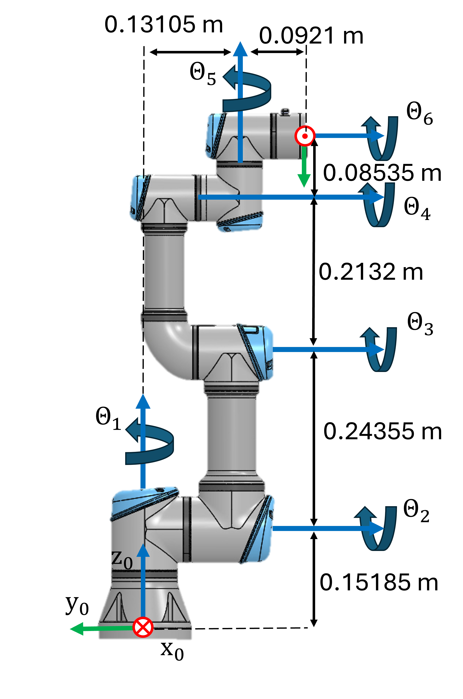

```matlab
clear all; 
```
# <span style="color:rgb(213,80,0)">Exercise 3.1 \- Jacobian </span>

In this exercise you will setup different function relating to the jacobian of a UR3e robot. 


Consider this UR3e robot and its dimensions. 


<p style="text-align:left">
   
</p>

# Task 1

Setup the geometric Jacobian using the symbolic toolbox. The resulting symbolic expression should only depend on the joint states 

1.  Find the DH parameters and setup the Jacobian matrix.

Use the following variables  to store your solution:

-  q1 ... q6 (Real Symbolic variable for the Joint angle Theta 1\-6) 
-  Jp (translational part of the Jacobian) 
-  Jtheta (rotational part of the Jacobian) 
-  J (complete Jacobian as $J\left(q\right)=\left\lbrack \begin{array}{c} J_{\theta } \left(q\right)\newline J_p \left(q\right) \end{array}\right\rbrack$ )  

Solve this exercise using the geometric approach! Use the function: 

-  cross() 

Solve this exercise without using the function: 

-  dh2tf() 

and without using the relation matrix $T_A \left(\Phi \right)$ : 

-  $\displaystyle T_A \left(\Phi \right)=\left\lbrack \begin{array}{ccc} 0 & -\sin \left(\phi \right) & \cos \left(\phi \right)\cdot \sin \left(\theta \right)\newline 0 & -\sin \left(\phi \right)\cdot \sin \left(\theta \right) & -\sin \left(\phi \right)\cdot \sin \left(\theta \right)\newline 1 & \cos \left(\theta \right) & \cos \left(\theta \right) \end{array}\right\rbrack$ 
```matlab
Jp = []; 
Jtheta = []; 
J = []; 
```

You can check your work by clicking the Run: 

```matlab
 
check_exercise('3-1-1')
```
# Task 2

Write a function that computes the analytical jacobian (using ZYZ euler angles) for a given configuration. This function takes one vector as an input: 

1.  configuration (q) as a row vector ( $q\in {\mathbb{R}}^{6\textrm{x1}}$ )

and returns the analytical jacobian as $J_a \left(q\right)=\left\lbrack \begin{array}{c} J_{\Phi \;} \left(q\right)\newline J_p \left(q\right) \end{array}\right\rbrack$ and its rank at the configuration.


Use the following function name for your solution:

-   ComputeAnalyticalJacobian(q) 

Solve this exercise using an analytical approach! Use the function: 

-  diff() 

Solve this exercise without using the relation matrix $T_A \left(\Phi \right)$ : 

-  $\displaystyle T_A \left(\Phi \right)=\left\lbrack \begin{array}{ccc} 0 & -\sin \left(\phi \right) & \cos \left(\phi \right)\cdot \sin \left(\theta \right)\newline 0 & -\sin \left(\phi \right)\cdot \sin \left(\theta \right) & -\sin \left(\phi \right)\cdot \sin \left(\theta \right)\newline 1 & \cos \left(\theta \right) & \cos \left(\theta \right) \end{array}\right\rbrack$ 
```matlab
function [Ja, Rank] = ComputeAnalyticalJacobian(q)

Ja = []; 
Rank = rank(Ja); 

end
```

You can check your work by clicking the Run: 

```matlab
 
check_exercise('3-1-2')
```
# Task 3

Write a function that computes the required joint velocities to achieve a specific translational motion of the endeffector for a given configuration. Only consider the endeffector position and not its orientation. This function takes two vector as an input: 

1.  configuration (q) as a row vector ( $q\in {\mathbb{R}}^{6\textrm{x1}}$ )
2. desired motion v, relative to the base frame,  as a row vector where $v=\left\lbrack \begin{array}{c} \dot{x} \newline \dot{y} \newline \dot{z}  \end{array}\right\rbrack$

and returns the required joint speeds as a row vector ( $\dot{q} \in {\mathbb{R}}^{6\textrm{x1}}$ ) and the rank of the Jacobian.


Use the following function name for your solution:

-   ComputeJointSpeed(q,v) 

Solve this exercise using a geometric approach! Use the function: 

-  cross() 
```matlab
function [qdot , Rank]= ComputeJointSpeed(q,v)

qdot = []; 
Rank = []; 

end
```

You can check your work by clicking the Run: 

```matlab
 
check_exercise('3-1-3')
```
# Task 4

Use your function from Task 3 to compute a trajectory that follows the desired motion. 


Approximate the new joint states by $q_{k+1} =q_k +\dot{q} \cdot \Delta t$ where $\dot{q}$ is the computed joint velocity for the configuration $q_k$ . 


The function takes four inputs: 

1.  Initial Joint configuration (q)
2. desired motion (v)
3. timestep (dt)
4. total time (T)

The function has three outputs: 

1.  Joint State trajectory ( $q_{\textrm{traj}} \in {\mathbb{R}}^{6\textrm{xN}}$ where N is the amount of points in the trajectory, usually $N=\frac{T}{\Delta t}$ )
2. Joint Velocity trajectory ( $\dot{q_{\textrm{traj}} } \in {\mathbb{R}}^{6\textrm{xN}}$ )
3. Success, false if the manipulator hits a singularity in the desired motion dimensions (success $\in \left\lbrack \textrm{false},\textrm{true}\right\rbrack$ ). If a singularity is reached the function needs to end and send the joint states until the singularity

Use the following function name for your solution:

-   ComputeLinearTrajectory(q, v, dt, T) 
```matlab
function [q_traj, qdot_traj, success] = ComputeLinearTrajectory(q,v, dt, T)

end
```

You can check your work by clicking the Run: 

```matlab
 
check_exercise('3-1-4')
```

You can view your trajectory in Rviz: 

```matlab
  

q_example = [-2.5408, -1.3607, 0.7146, 0.3767, 1.7134, 0]';
v_example = [-0.5;-0.5;0]; 
dt_example =0.01; 
T_example = 1; 
[q_traj_ex, q_dot_traj ,success_example] = ComputeLinearTrajectory(q_example, v_example, dt_example, T_example); 

if success_example
    JointStatesToRviz(q_traj_ex, 'ur3e', T_example);
else
    [~,points_until_singular,~] = size(q_traj_ex);
    Time_until_singular = points_until_singular*dt; 
    JointStatesToRviz(q_traj_ex, 'ur3e', Time_until_singular, 'Ellipsoid', true); 
end

plotTrajectory(q_traj_ex, q_dot_traj, linspace(0,T_example,T_example/dt_example))
```

Try adjusting some parameters and see how the trajectory behaves. Keep in mind that the computation may take some time depending on the resolution and hardware. 

