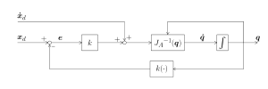

```matlab
clear all; 
```
# <span style="color:rgb(213,80,0)">Exercise 3.2 \- Inverse Kinematic Algorithm</span>

In this exercise you will setup an inverse kinematics algorithm using the pseudoinverse of the jacobian. 


Consider this UR3e robot: 

<p style="text-align:left">
   
</p>


Consider this DH table for the UR3e: 

|      |      |      |      |      |
| :-: | :-- | :-: | :-: | :-: |
| Link <br>  | a \[m\] <br>  | alpha <br>  | d \[m\] <br>  | theta <br>   |
| 1 <br>  | 0 <br>  | pi/2 <br>  | 0.15185 <br>  | q1 <br>   |
| 2 <br>  | \-0.24355 <br>  | 0 <br>  | 0 <br>  | q2 <br>   |
| 3 <br>  | \-0.2132 <br>  | 0 <br>  | 0 <br>  | q3 <br>   |
| 4 <br>  | 0 <br>  | pi/2 <br>  | 0.13105 <br>  | q4 <br>   |
| 5 <br>  | 0 <br>  | \-pi/2 <br>  | 0.08535 <br>  | q5 <br>   |
| 6 <br>  | 0 <br>  | 0 <br>  | 0.0921 <br>  | q6 <br>   |
|      |      |      |      |       |


The control scheme you have to implement is: 

<p style="text-align:left">
   
</p>


where $k\left(\cdot \right)$ is the forward kinematic of the q. 

# Task 1

Write a function that computes a solution to the inverse kinematic using the pseudoinverse of the Jacobian. The function has the following inputs: 

1.  the initial joint states as a row vector ( $q_0 \in {\mathbb{R}}^{6\textrm{x1}}$ )
2. desired pose vector using euler angles (ZYZ) $x_{\textrm{desired}} =\left\lbrack \begin{array}{c} x\newline y\newline z\newline \phi \newline \theta \newline \psi  \end{array}\right\rbrack$
3. gain (k)
4. tolerance (tol)
5. max iterations (Imax)

The function should return the required joint states as a row vector ( $q\in {\mathbb{R}}^{6\textrm{x1}}$ )


For this task, consider $\dot{x_d } =\left\lbrack \begin{array}{c} 0\newline 0\newline 0\newline 0\newline 0\newline 0 \end{array}\right\rbrack$ and $\Delta t=0\ldotp 01\;s$ 


Use the following function name for your solution:

-   PseudoInverseAlgorithm(q0, x\_desired, k, tol, Imax) 

You may use the function below to compute the symbolic transform from the base to the endeffector. 

-  dh2tf() 

Solve this exercise without using the function: 

-  inverseKinematics() 
```matlab
function q = PseudoInverseAlgorithm(q0, x_desired, k, tol, Imax)
syms q1 q2 q3 q4 q5 q6 real
DH=[
   %a       alpha       d       theta
   0        pi/2        0.15185  q1;
   -0.24355 0           0       q2;
   -0.2132  0           0       q3;
   0        pi/2        0.13105 q4;
   0        -pi/2       0.08535 q5;
   0        0           0.0921  q6;
    ];
```
DH = 
 $\displaystyle \left(\begin{array}{cccc} 0 & \frac{\pi }{2} & \frac{3037}{20000} & q_1 \newline -\frac{4871}{20000} & 0 & 0 & q_2 \newline -\frac{533}{2500} & 0 & 0 & q_3 \newline 0 & \frac{\pi }{2} & \frac{2621}{20000} & q_4 \newline 0 & -\frac{\pi }{2} & \frac{1707}{20000} & q_5 \newline 0 & 0 & \frac{921}{10000} & q_6  \end{array}\right)$
 

```matlab

T06 = dh2tf(DH); 
```
ans = 
 $\displaystyle \begin{array}{l} \left(\begin{array}{cccc} \cos \left(q_6 \right)\,\sigma_3 -\sigma_1 \,\cos \left(q_1 \right)\,\sin \left(q_6 \right) & -\sin \left(q_6 \right)\,\sigma_3 -\sigma_1 \,\cos \left(q_1 \right)\,\cos \left(q_6 \right) & \cos \left(q_5 \right)\,\sin \left(q_1 \right)-\sigma_4 \,\cos \left(q_1 \right)\,\sin \left(q_5 \right) & \frac{2621\,\sin \left(q_1 \right)}{20000}-\frac{4871\,\cos \left(q_1 \right)\,\cos \left(q_2 \right)}{20000}+\frac{921\,\cos \left(q_5 \right)\,\sin \left(q_1 \right)}{10000}-\frac{921\,\sigma_4 \,\cos \left(q_1 \right)\,\sin \left(q_5 \right)}{10000}+\frac{1707\,\cos \left(q_2 +q_3 \right)\,\cos \left(q_1 \right)\,\sin \left(q_4 \right)}{20000}+\frac{1707\,\sin \left(q_2 +q_3 \right)\,\cos \left(q_1 \right)\,\cos \left(q_4 \right)}{20000}-\frac{533\,\cos \left(q_1 \right)\,\cos \left(q_2 \right)\,\cos \left(q_3 \right)}{2500}+\frac{533\,\cos \left(q_1 \right)\,\sin \left(q_2 \right)\,\sin \left(q_3 \right)}{2500}\newline -\cos \left(q_6 \right)\,\sigma_2 -\sigma_1 \,\sin \left(q_1 \right)\,\sin \left(q_6 \right) & \sin \left(q_6 \right)\,\sigma_2 -\sigma_1 \,\cos \left(q_6 \right)\,\sin \left(q_1 \right) & -\cos \left(q_1 \right)\,\cos \left(q_5 \right)-\sigma_4 \,\sin \left(q_1 \right)\,\sin \left(q_5 \right) & \frac{533\,\sin \left(q_1 \right)\,\sin \left(q_2 \right)\,\sin \left(q_3 \right)}{2500}-\frac{921\,\cos \left(q_1 \right)\,\cos \left(q_5 \right)}{10000}-\frac{4871\,\cos \left(q_2 \right)\,\sin \left(q_1 \right)}{20000}-\frac{2621\,\cos \left(q_1 \right)}{20000}-\frac{921\,\sigma_4 \,\sin \left(q_1 \right)\,\sin \left(q_5 \right)}{10000}+\frac{1707\,\cos \left(q_2 +q_3 \right)\,\sin \left(q_1 \right)\,\sin \left(q_4 \right)}{20000}+\frac{1707\,\sin \left(q_2 +q_3 \right)\,\cos \left(q_4 \right)\,\sin \left(q_1 \right)}{20000}-\frac{533\,\cos \left(q_2 \right)\,\cos \left(q_3 \right)\,\sin \left(q_1 \right)}{2500}\newline \sigma_4 \,\sin \left(q_6 \right)+\sigma_1 \,\cos \left(q_5 \right)\,\cos \left(q_6 \right) & \sigma_4 \,\cos \left(q_6 \right)-\sigma_1 \,\cos \left(q_5 \right)\,\sin \left(q_6 \right) & -\sigma_1 \,\sin \left(q_5 \right) & \frac{1707\,\sin \left(q_2 +q_3 \right)\,\sin \left(q_4 \right)}{20000}-\frac{4871\,\sin \left(q_2 \right)}{20000}-\sin \left(q_5 \right)\,{\left(\frac{921\,\cos \left(q_2 +q_3 \right)\,\sin \left(q_4 \right)}{10000}+\frac{921\,\sin \left(q_2 +q_3 \right)\,\cos \left(q_4 \right)}{10000}\right)}-\frac{1707\,\cos \left(q_2 +q_3 \right)\,\cos \left(q_4 \right)}{20000}-\frac{533\,\sin \left(q_2 +q_3 \right)}{2500}+\frac{3037}{20000}\newline 0 & 0 & 0 & 1 \end{array}\right)\\\mathrm{}\\\textrm{where}\\\mathrm{}\\\;\;\sigma_1 =\sin \left(q_2 +q_3 +q_4 \right)\\\mathrm{}\\\;\;\sigma_2 =\cos \left(q_1 \right)\,\sin \left(q_5 \right)-\sigma_4 \,\cos \left(q_5 \right)\,\sin \left(q_1 \right)\\\mathrm{}\\\;\;\sigma_3 =\sin \left(q_1 \right)\,\sin \left(q_5 \right)+\sigma_4 \,\cos \left(q_1 \right)\,\cos \left(q_5 \right)\\\mathrm{}\\\;\;\sigma_4 =\cos \left(q_2 +q_3 +q_4 \right)\end{array}$
 

```matlab

q=[]; 

end

```

You can check your work by clicking the Run: 

```matlab
 
check_exercise('3-2-1')
```
# Task 2

Extend your function from before. 


Add the input: 

-  dt (time for discrete algorithm step) 

Add the outputs: 

-  total\_time (time it takes for the algorithm to find a solution) 
-  total\_iterations (iterations until the solution was found) 
-  solution\_error (the pose square error for the solution configuration $\left({\textrm{error}}_{\textrm{solution}} \left(q\right)={e\left(q\right)}^T \cdot e\left(q\right)\right)$ ) 

Use "tic" and "toc" to measure the compuational time. 


Use the following function name for your solution:

-   ExtendedPseudoInverseAlgorithm(t\_desired, k, dt, tol, Imax) 

Solve this exercise without using the function: 

-  inverseKinematics() 
```matlab
function [q,total_time,total_iterations,solution_error] = ExtendedPseudoInverseAlgorithm(t_desired, k, dt, tol, Imax)

q=[]; 
total_time = []; 
total_iterations=[]; 
solution_error = []; 

end
```

Analyze how your algorithm behaves when you change the tolerance, gain or timestep. 

