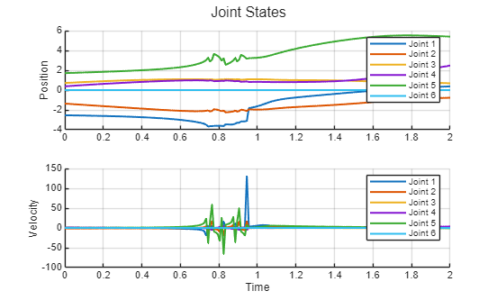

```matlab
clear all; 
```
# Exercise 3.1 \- Jacobian

In this exercise you will setup different function relating to the jacobian of a UR3e robot. 


Consider this UR3e robot and its dimensions. 


# Task 1

Setup the geometric Jacobian using the symbolic toolbox. The resulting symbolic expression should only depend on the joint states 

1.  Find the DH parameters and setup the Jacobian matrix.

Use the following variables  to store your solution:

-  q1 ... q6 (Real Symbolic variable for the Joint angle Theta 1\-6) 
-  Jp (translational part of the Jacobian) 
-  Jtheta (rotational part of the Jacobian) 
-  J (complete Jacobian  as $J\left(q\right)=\left\lbrack \begin{array}{c} J_{\theta } \left(q\right)\newline J_p \left(q\right) \end{array}\right\rbrack$ )  

Solve this exercise using the geometric approach! Use the function: 

-  cross() 

Solve this exercise without using the function: 

-  dh2tf() 

and without using the relation matrix $T_A \left(\Phi \right)$ : 

-  $\displaystyle T_A \left(\Phi \right)=\left\lbrack \begin{array}{ccc} 0 & -\sin \left(\phi \right) & \cos \left(\phi \right)\cdot \sin \left(\theta \right)\newline 0 & -\sin \left(\phi \right)\cdot \sin \left(\theta \right) & -\sin \left(\phi \right)\cdot \sin \left(\theta \right)\newline 1 & \cos \left(\theta \right) & \cos \left(\theta \right) \end{array}\right\rbrack$ 
```matlab
syms q1 q2 q3 q4 q5 q6 real
syms a alpha_ d theta real

Tsym = [ cos(theta), -sin(theta)*cos(alpha_),  sin(theta)*sin(alpha_), a*cos(theta);
         sin(theta),  cos(theta)*cos(alpha_), -cos(theta)*sin(alpha_), a*sin(theta);
         0,           sin(alpha_),            cos(alpha_),            d;
         0,           0,                      0,                      1];

DH = [ %   a        alpha         d        theta   (STANDARD DH)
        0        pi/2         0.15185     q1;
       -0.24355  0            0           q2;
       -0.2132   0            0           q3;
        0        pi/2         0.13105     q4;
        0       -pi/2         0.08535     q5;
        0        0            0.0921      q6 ];

% Forward transforms to each frame i
A0_i = sym(zeros(4,4,6));
for i = 1:6
    Ai = subs(Tsym, [a, alpha_, d, theta], DH(i,:));
    if i == 1
        A0_i(:,:,i) = Ai;
    else
        A0_i(:,:,i) = A0_i(:,:,i-1) * Ai;
    end
end

% End-effector position in base frame
p_ee = A0_i(1:3,4,6);

% Jacobian (revolute joints)
Jp = sym(zeros(3,6));
Jtheta = sym(zeros(3,6));
for i = 1:6
    if i == 1
        z_prev = sym([0;0;1]);     % z0
        p_prev = sym([0;0;0]);     % p0
    else
        z_prev = A0_i(1:3,3,i-1);   % z_{i-1}
        p_prev = A0_i(1:3,4,i-1);   % p_{i-1}
    end
    Jp(:,i) = simplify(cross(z_prev, p_ee - p_prev));
    Jtheta(:,i) = z_prev;
end

J = [Jtheta; Jp];  % 6x6 geometric Jacobian

```

```matlab
ur3e = loadrobot("universalUR3e", DataFormat="column"); 
Config = [0,-pi/3,pi/7,pi/2,pi/2,0]';
J_toolbox = geometricJacobian(ur3e, Config, 'tool0')

J_sub = round(subs(J, [q1,q2,q3,q4,q5,q6],Config'),4)
```

You can check your work by clicking the Run: 

```matlab
 
check_exercise('3-1-1')
```
# Task 2

Write a function that computes the analytical jacobian (using ZYZ euler angles) for a given configuration. This function takes one vector as an input: 

1.  configuration (q) as a row vector ( $q\in {\mathbb{R}}^{6\textrm{x1}}$ )

and returns the analytical jacobian as $J_a \left(q\right)=\left\lbrack \begin{array}{c} J_{\Phi \;} \left(q\right)\newline J_p \left(q\right) \end{array}\right\rbrack$ and its rank at the configuration.


Use the following function name for your solution:

-   ComputeAnalyticalJacobian(q) 

Solve this exercise using an analytical approach! Use the function: 

-  diff() 

Solve this exercise without using the relation matrix $T_A \left(\Phi \right)$ : 

-  $\displaystyle T_A \left(\Phi \right)=\left\lbrack \begin{array}{ccc} 0 & -\sin \left(\phi \right) & \cos \left(\phi \right)\cdot \sin \left(\theta \right)\newline 0 & -\sin \left(\phi \right)\cdot \sin \left(\theta \right) & -\sin \left(\phi \right)\cdot \sin \left(\theta \right)\newline 1 & \cos \left(\theta \right) & \cos \left(\theta \right) \end{array}\right\rbrack$ 
```matlab
function [Ja, Rank] = ComputeAnalyticalJacobian(q)
syms q1 q2 q3 q4 q5 q6 real 
q_syms = [q1,q2,q3,q4,q5,q6]; 

DH = [ %   a        alpha         d        theta   (STANDARD DH)
        0        pi/2         0.15185     q1;
       -0.24355  0            0           q2;
       -0.2132   0            0           q3;
        0        pi/2         0.13105     q4;
        0       -pi/2         0.08535     q5;
        0        0            0.0921      q6 ];

A06=dh2tf(DH); 
p_ee = A06(1:3,4); 

Ree = A06(1:3,1:3); 
 
phi = atan2(Ree(2,3), Ree(1,3)); 
theta = atan2(sqrt(Ree(1,3)^2+Ree(2,3)^2),Ree(3,3));
psi = atan2(Ree(3,2), -Ree(3,1));  
Jphi = [phi; theta; psi]; 

Jp = []; 
J_phi_i = []; 

    for i=1:6
    Jp = [Jp, diff(p_ee, q_syms(i))]; 
    J_phi_i = [J_phi_i, diff(Jphi, q_syms(i))];
    end


Ja = double(subs(simplify([J_phi_i; Jp]), q_syms, q')); 
Rank = rank(Ja); 

end
Config=[0,-pi/2,0,-pi/2,0,0]'; 
[Ja , Rank]= ComputeAnalyticalJacobian(Config)

```

You can check your work by clicking the Run: 

```matlab
 
check_exercise('3-1-2')
```
# Task 3

Write a function that computes the required joint velocities to achieve a specific translational motion of the endeffector for a given configuration. Only consider the endeffector position and not its orientation. This function takes two vector as an input: 

1.  configuration (q) as a row vector ( $q\in {\mathbb{R}}^{6\textrm{x1}}$ )
2. desired motion v, relative to the base frame,  as a row vector where $v=\left\lbrack \begin{array}{c} \dot{x} \newline \dot{y} \newline \dot{z}  \end{array}\right\rbrack$

and returns the required joint speeds as a row vector ( $\dot{q} \in {\mathbb{R}}^{6\textrm{x1}}$ ) and the Rank of the Jacobian.


Use the following function name for your solution:

-   ComputeJointSpeed(q,v) 

Solve this exercise using a geometric approach! Use the function: 

-  cross() 
```matlab
function [qdot, Rank] = ComputeJointSpeed(q,v)
syms q1 q2 q3 q4 q5 q6 real
syms a alpha_ d theta real
q_syms = [q1,q2,q3,q4,q5,q6]; 

Tsym = [ cos(theta), -sin(theta)*cos(alpha_),  sin(theta)*sin(alpha_), a*cos(theta);
         sin(theta),  cos(theta)*cos(alpha_), -cos(theta)*sin(alpha_), a*sin(theta);
         0,           sin(alpha_),            cos(alpha_),            d;
         0,           0,                      0,                      1];

DH = [ %   a        alpha         d        theta   (STANDARD DH)
        0        pi/2         0.15185     q1;
       -0.24355  0            0           q2;
       -0.2132   0            0           q3;
        0        pi/2         0.13105     q4;
        0       -pi/2         0.08535     q5;
        0        0            0.0921      q6 ];

% Forward transforms to each frame i
A0_i = sym(zeros(4,4,6));
for i = 1:6
    Ai = subs(Tsym, [a, alpha_, d, theta], DH(i,:));
    if i == 1
        A0_i(:,:,i) = Ai;
    else
        A0_i(:,:,i) = A0_i(:,:,i-1) * Ai;
    end
end

% End-effector position in base frame
p_ee = A0_i(1:3,4,6);

% Jacobian (revolute joints)
Jp = sym(zeros(3,6));

for i = 1:6
    if i == 1
        z_prev = sym([0;0;1]);     % z0
        p_prev = sym([0;0;0]);     % p0
    else
        z_prev = A0_i(1:3,3,i-1);   % z_{i-1}
        p_prev = A0_i(1:3,4,i-1);   % p_{i-1}
    end
    Jp(:,i) = simplify(cross(z_prev, p_ee - p_prev));
end

J_sub = double(subs(Jp,q_syms, q'));

qdot = (pinv(J_sub)*v);
Rank = rank(J_sub); 

end
singularConfig = [0,pi/2,0,-pi/2,0,0]';
[qdot, Rank] = ComputeJointSpeed(singularConfig, [1;1;1]) 
```

You can check your work by clicking the Run: 

```matlab
 
check_exercise('3-1-3')
```
# Task 4

Use your function from Task 3 to compute a trajectory that follows the desired motion. 


Approximate the new joint states by $q_{k+1} =q_k +\dot{q} \cdot \Delta t$ where $\dot{q}$ is the computed joint velocity for the configuration $q_k$ . 


The function takes four inputs: 

1.  Initial Joint configuration (q)
2. desired motion (v)
3. timestep (dt)
4. total time (T)

The function has three outputs: 

1.  Joint State trajectory ( $q_{\textrm{traj}} \in {\mathbb{R}}^{6\textrm{xN}}$ where N is the amount of points in the trajectory, usually $N=\frac{T}{\Delta t}$ )
2. Joint Velocity trajectory ( $\dot{q_{\textrm{traj}} } \in {\mathbb{R}}^{6\textrm{xN}}$ )
3. Success, false if the manipulator hits a singularity in the desired motion dimensions (success $\in \left\lbrack \textrm{false},\textrm{true}\right\rbrack$ ). If a singularity is reached the function needs to end and send the joint states until the singularity

Use the following function name for your solution:

-   ComputeLinearTrajectory(q, v, dt, T) 
```matlab
function [q_traj, qdot_traj, success] = ComputeLinearTrajectory(q,v, dt, T)
N = uint8(T/dt);
q_traj = zeros(6, N); 
qdot_traj = zeros(6,N); 
q_current = q; 
success = true; 
for k = 1:T/dt

    q_traj(:,k) = q_current; 
    [qdot_traj(:,k), Rank] = ComputeJointSpeed(q_current, v); 
    if Rank ~= 3
        success = false; 
         q_traj =  q_traj(:,1:k);
         qdot_traj = qdot_traj(:,1:k);
        break
    else
        q_current = q_current + qdot_traj(:,k) * dt; 
        
    end
    
end

end

```

You can check your work by clicking the Run: 

```matlab
 
check_exercise('3-1-4')
```

You can view your trajectory in Rviz: 

```matlab
  
q_example = [0,-pi/2,pi/4,pi/5,pi/4,0]';
q_example = [-2.5408, -1.3607, 0.7146, 0.3767, 1.7134, 0]';

v_example = [-0.25;-0.35;0]; 
dt_example =0.01; 
T_example = 2; 
[q_traj_ex, q_dot_traj ,success_example] = ComputeLinearTrajectory(q_example, v_example, dt_example, T_example); 
```

```matlab

if success_example
    JointStatesToRviz(q_traj_ex, 'ur3e', T_example, 'Ellipsoid', true);
else
    [~,points_until_singular,~] = size(q_traj_ex);
    Time_until_singular = points_until_singular*dt_example; 
    JointStatesToRviz(q_traj_ex, 'ur3e', Time_until_singular, 'Ellipsoid', true); 
end
plotTrajectory(q_traj_ex, q_dot_traj, linspace(0,T_example,T_example/dt_example))
```



```matlabTextOutput
ans = 'C:\Users\Const\AppData\Local\Temp\Editor_rgfkt\LiveEditorEvaluationHelperEeditor32824249motw'
```
