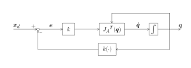

# Inverse Kinematic Algorithm

Utilizing the Jacobian lets us setup an algorithm to find a numerical inverse kinematic solution. This approach can be used for redundnant manipulators or manipulators where no closed\-form solution (analytical solution) exists. 

The general idea is to compute the direction from the current endeffector to the desired pose. Using this velocity vector, you iteratively approach the desired pose using an euler discretization. At each discrete step, you consider the new endeffector pose and the new velocity vector until convergence. 

These algorithms use the analytical Jacobian, as it encodes the desired orientation in terms of e.g. euler angles.

# Jacobian (pseudo\-)inverse 

### Objective: 

Select $\dot{q}$ so that $\dot{e} =\dot{x_d } -\dot{x_{\textrm{ee}} } =\dot{x_d } -J_A \left(q\right)\cdot \dot{q} <0$ 

### Theory: 

If we choose $\dot{q} =J_A^{-1} \left(q\right)\cdot \left(\dot{x_d } +K\cdot e\right)$, then the error dynamics is linear: 

 $$ \dot{e} +K\cdot e=0 $$ 

The convergence to zero depends on the eigenvalues of K. The larger the Eigenvalues, the faster the convergence. Very large gains however, can break discrete\-time implementations (overshoot) or violate joint limits.

### Algorithm: 

for each discrete time step k with $\Delta t$:

 $$ q\left(t_{k+1} \right)=q\left(t_k \right)+\dot{q} \left(t_k \right)\cdot \Delta t $$ 

until convergence. 

The Jacobian used for computations is only valid for the joint configuration they were computed with. Choosing a timestep $\Delta t$ that is too large may result not result in convergence. 

### Control scheme: 

where $k\left(\cdot \right)$ is the forward kinematic of the q. 

### Notes: 
-  usually $\dot{x_d } =0$ and the steady\-state error is 0 since there is an integrator in the loop 
-  For redundant manipulators the pseudo\-inverse has to be used as J is a nonsquare matrix. 
# Jacobian Transposed 

### Objective: 

Select $\dot{q}$ so that $\dot{e} =\dot{x_d } -\dot{x_{\textrm{ee}} } =\dot{x_d } -J_A \left(q\right)\cdot \dot{q} <0$ 

### Theory: 

Use Lyapunov direct method to ensure the asymptotic stability:

 $$ V\left(e\right)=\frac{1}{2}\cdot e^T \cdot K\cdot e $$ 

 $$ \dot{V} \left(e\right)=e^T \cdot K\cdot \dot{x_d } -e^T \cdot K\cdot J_A \left(q\right)\cdot \dot{q} $$ 
### Steps: 

Choosing $\dot{q} =J_A^T \left(q\right)\cdot K\cdot e$ then: 

 $$ \dot{V} \left(e\right)=e^T \cdot K\cdot \dot{x_d } -e^T \cdot K\cdot J_A^T \left(q\right)\cdot \dot{q} $$ 

if $\dot{x_d } =0$, then $\dot{V} <0$ when $J_A$ is full rank, assuring asymptotic stability. 

### Scheme: 

where $k\left(\cdot \right)$ is the forward kinematic of the manipulator. 

### Notes: 
-  Only the computation of $J_A^T \left(q\right)$ and $k\left(\cdot \right)$ is required.  
-  The error in orientation has to be handled with care (the use of Euler angles is not the best option)  

