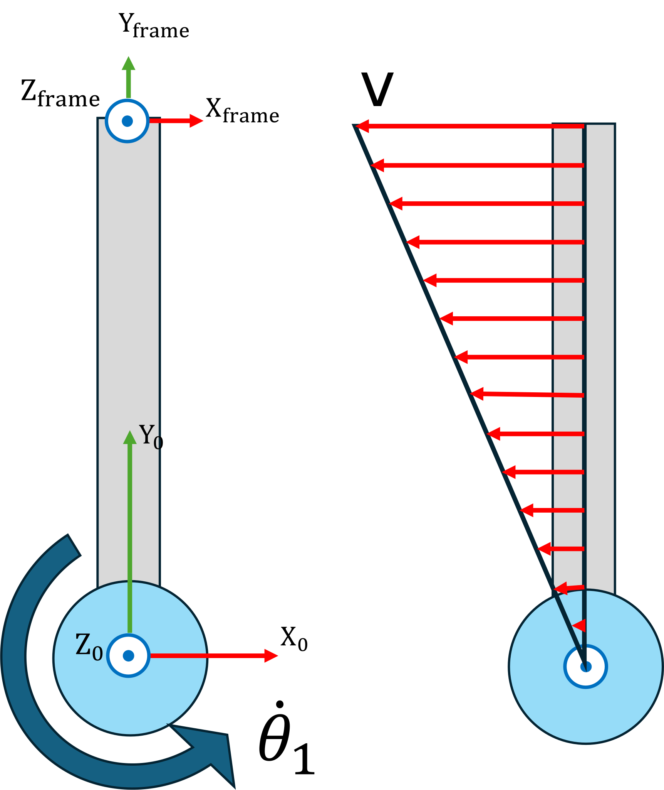
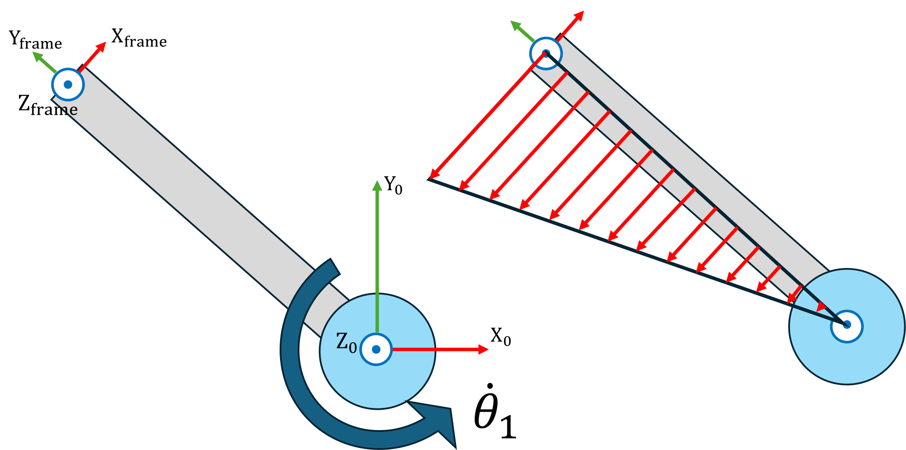
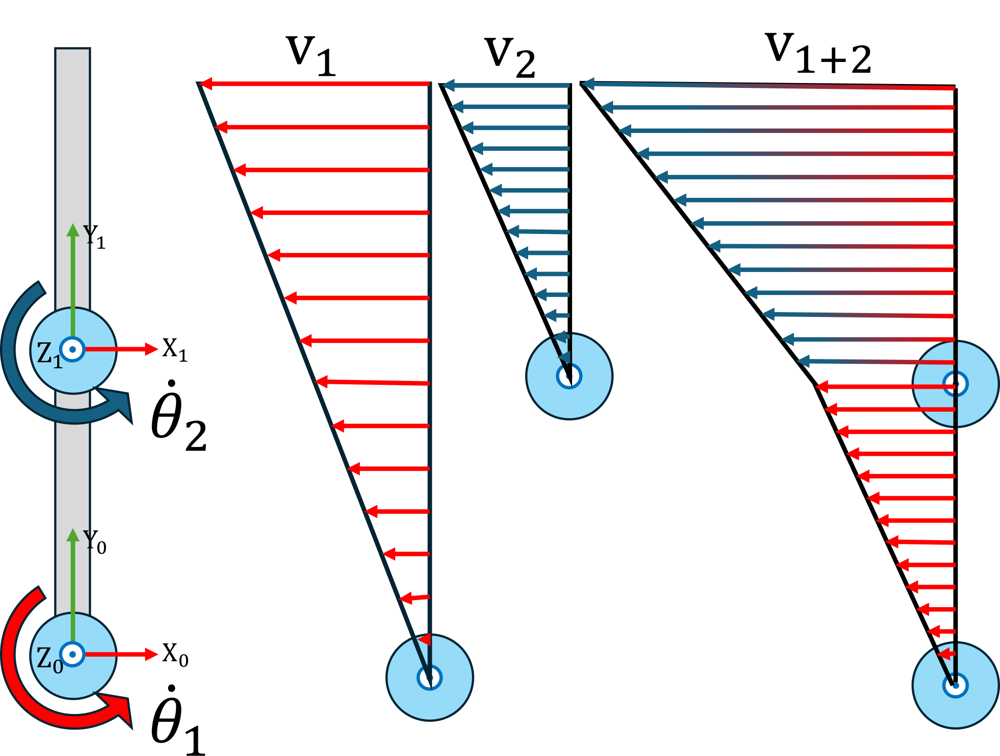
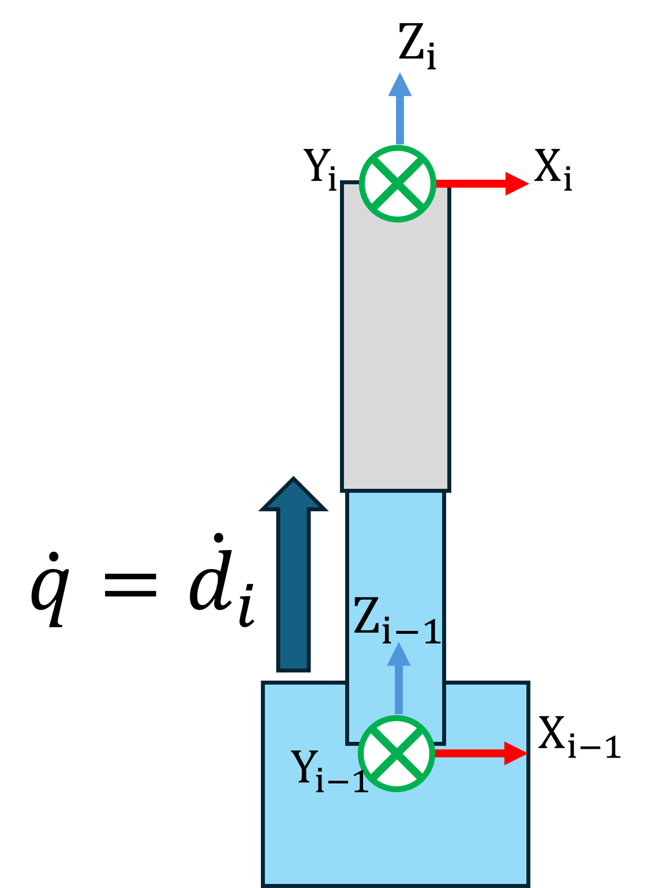
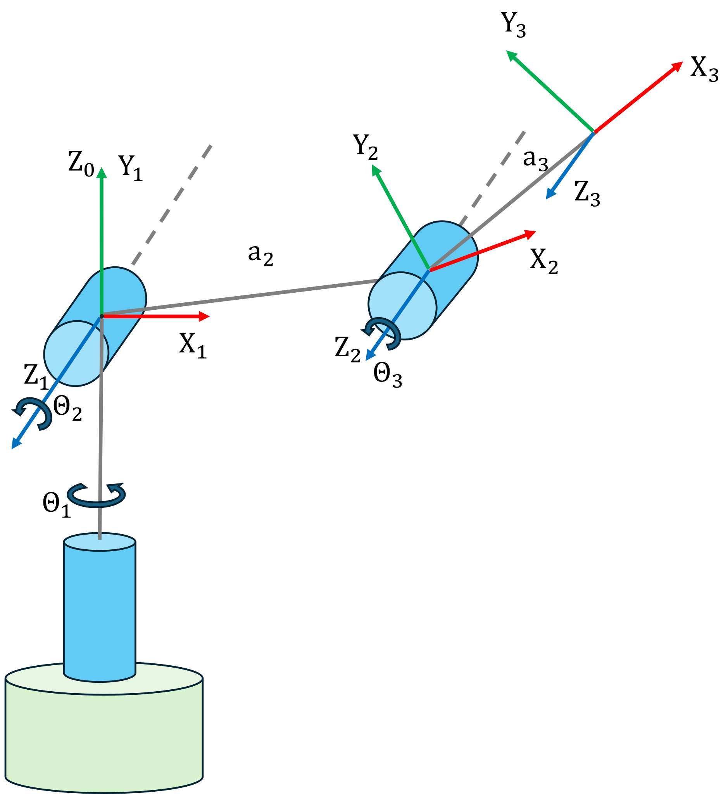

# <span style="color:rgb(213,80,0)">Differential Kinematics \- Jacobians</span>

Differential kinematics is the study of how infinitesimal changes in a robot's joint coordinates translate into instantaneous linear and angular velocities of its end\-effector.  By focusing on velocity relationships rather than finite displacements, it provides the foundation for velocity control, trajectory following, and real\-time motion planning in robotic manipulators.


At the heart of differential kinematics lies the **geometric Jacobian**, J(q), which maps the vector of joint velocities $\dot{\;q}$ to the spatial velocity of the end\-effector, $v=\left\lbrack \begin{array}{c} \dot{\;p} \newline \omega  \end{array}\right\rbrack =\left\lbrack \begin{array}{c} \dot{\;x} \newline \dot{\;y} \newline \dot{\;z} \newline \omega_x \newline \omega_y \newline \omega_z  \end{array}\right\rbrack$ , via $v=J\left(q\right)\cdot \dot{\;q}$ . 


Here, the upper block of J(q) captures how joint motions induce translational velocity, while the lower block captures induced angular velocity


In addition to the geometric form, one often works with the **analytical Jacobian**, which relates joint velocities to the time\-derivative of a chosen orientation parametrization (e.g., ZYZ Euler angles).  This requires an additional transformation that accounts for the kinematics of the orientation representation, ensuring compatibility with whatever angular coordinates are used for control or trajectory specification.

# Geometric Jacobian

The Geometric Jacobian can be partitioned in two parts. 

 $$ J\left(q\right)=\left\lbrack \begin{array}{c} J_p \left(q\right)\newline J_{\Theta } \left(q\right) \end{array}\right\rbrack $$ 

the translational part $J_p \left(q\right)\in {\mathbb{R}}^{3\;x\;n}$ 


and the rotational part $J_{\Theta } \left(q\right)\in \mathbb{R}{\;}^{3\;x\;n\;}$ 


for n joints. 


Picture a single Joint that rotates at a constant angular velocity $\dot{\;\theta \;}$ , as the entire joint will rotate at this angular velocity, we can visualize the linear velocities at a given moment. The velocity w.r.t. the joint axis can be computed as $||\vec{\;v} ||=\dot{\theta} \cdot \textrm{distance}\;\textrm{to}\;\textrm{center}\;\textrm{of}\;\textrm{rotation}$ , resulting in a  linear speed increase  with the distance to the axis. Look at the image below, you can see that at this configuration, a rotation of $\dot{\theta_1 }$ will result in a velocity in \-x direction, and no velocities in y or z direction. 

<p style="text-align:left">
   
</p>


At the next configuration, the situation has changed. While there is still no velocity in z direction, the velocity vector now has a non zero component in x and y position. Notice how a Jacobian is only valid for the joint configuration it was computed for, thus it needs to be recomputed for each time instance. 

<p style="text-align:left">
   
</p>


## Translation part $J_p \left(q\right)$ \- Revolute Joints

To find the direction of the velocity, you use the cross product. Remember that the cross product of two vectors yields a vector perpendicular to its computation vectors. For this application, we want to find the vector that is perpendicular to both the joint axis (z) and the direction to the End Effector or target frame. The size (magnitude) of this vector will be defined by the distance (length) to the End Effector as the length of the z axis is $\vec{\;z_i } =A_{i-1}^0 \cdot \;\;\left\lbrack \begin{array}{c} 0\newline 0\newline 1 \end{array}\right\rbrack$ ; $||\vec{\;z_i } ||=1$ 


The formula is

 $$ J_{p,i} \;\left(q\right)=\vec{\;z_{i-1} } \times \left(p_{\textrm{ee}} -p_{i-1} \right) $$ 

you must consider all the joints and links that come after a given joint. As a rotation of the base will influence all consecutive joints going into the direction of the endeffector. 


Below you can see an image that illusrtrates how the endeffector velocity may behave if multiple joints are actuated. Notice how Joint 1 impacts both the Z1 frame and the EE frame. While. in this example, the second Joint only influences the target frame. 

<p style="text-align:left">
   
</p>


## Translation part $J_p \left(q\right)$ \- Prismatic Joints

The translational part for prismatic joints is computed easier, as the actuator speed $\dot{\;q}$ is directly the speed of the joint. Thus the magnitude of the speed vector is

 $$ ||\vec{\;v} ||=\dot{\;q} =\dot{\;d} =||\;\vec{\;z} \cdot \dot{\;q} \;|| $$ 

<p style="text-align:left">
   
</p>


The formula is 

 $$ J_{p,i} \;\left(q\right)=\vec{\;z_{i-1} } =A_{i-1}^0 \cdot \;\;\left\lbrack \begin{array}{c} 0\newline 0\newline 1 \end{array}\right\rbrack $$ 
### Velocity vector from Translation part $J_{p\;} \left(q\right)$ 

To compute the velocity vector, multiply the joint speed vector as: 

 $$ \left\lbrack \begin{array}{c} \dot{x\;} \newline \dot{y\;} \newline \dot{z\;}  \end{array}\right\rbrack =J_p \left(q\right)\cdot \dot{\;q} $$ 
## Rotational part $J_{\Theta } \left(q\right)$ \- Revolute Joints

Similar to the translation of a prismatic joint, the rotational part of $J_{\Theta } \left(q\right)$ is the joint speed. 

 $$ ||\omega_i ||=\dot{\;q} =\dot{\;\theta \;} $$ 

now 

 $$ J_{\theta ,i} \;\left(q\right)=\vec{\;z_{i-1} } $$ 
## Rotation part $J_{\Theta } \left(q\right)$ \- Prismatic Joints

Prismatic joints only actuate linearly, thus the rotational part becomes 0. 

 $$ J_{\Theta ,i} \;\left(q\right)=0 $$ 
### Velocity vector from Rotation part $J_{\Theta } \left(q\right)$ 

To use the rotation part of the jacobian, multiply the joint speed vector as: 

 $$ \left\lbrack \begin{array}{c} \omega_x \;\newline \omega_y \newline \omega_z  \end{array}\right\rbrack =J_{\Theta \;} \left(q\right)\cdot \dot{\;q} $$ 
## Matlab implementation
<p style="text-align:left">
   
</p>


consider the DH parameters of an anthropomorpic arm:

|      |      |      |      |      |
| :-: | :-- | :-: | :-: | :-- |
| Link <br>  | a \[m\] <br>  | alpha <br>  | d \[m\] <br>  | theta <br>   |
| 1 <br>  | 0 <br>  | pi/2 <br>  | 0 <br>  | $\displaystyle \theta_1$ <br>   |
| 2 <br>  | 0.3 <br>  | 0 <br>  | 0 <br>  | $\displaystyle \theta_2$ <br>   |
| 3 <br>  |   0.4 <br>  | pi/2 <br>  | 0 <br>  | $\displaystyle \theta_3$ <br>   |
|      |      |      |      |       |

```matlab
syms q1 q2 q3 q4 q5 q6 real 
% DH Parameters Table
        % a      alpha      d       theta
DH = [    0,     pi/2,     0,       q1;    % Link 1
          0.3,   0,        0,       q2;    % Link 2
          0.4,   0,        0,       q3;    % Link 3
          ]; 

A01 = dh2tf(DH(1,:)); 
A12 = dh2tf(DH(2,:));
A23 = dh2tf(DH(3,:));

A02 = A01 * A12; 
A03 = A02 * A23; 

R01 = A01(1:3,1:3); 
R02 = A02(1:3,1:3);
R03 = A03(1:3,1:3); 

z0 = [0;0;1]; 
z1 = R01 * z0; 
z2 = R02 * z0; 

p0 = [0;0;0]; 
p1 = A01(1:3,4); 
p2 = A02(1:3,4); 

pee=A03(1:3,4); 

Jp1 = cross(z0,(pee-p0));
Jp2 = cross(z1, (pee - p1));
Jp3 = cross(z2, (pee - p2));

 J(1:3,:) = [Jp1,Jp2,Jp3]; 
 J(4:6,:) = [z0, z1, z2];

 simplify(J)

 Config = [0,-pi/2,0]; 

 % Substitute the joint variables with the configuration values
J_substituted = subs(J, [q1, q2, q3], Config(1:3))

```
### Robotic System Toolbox Implementation

We can use the Robotic System Toolbox to get the geometric jacobian. However, the function geometricJacobian returns the Jacobian in the format: 

 $$ J=\left\lbrack \begin{array}{c} J_{\Theta \;} \newline J_p  \end{array}\right\rbrack $$ 

Notice how the translation and rotation part are switched. 

```matlab
 ur3e = loadrobot("universalUR3e", "DataFormat", "column"); 
 Config2 = [0,-pi/3,pi/7,pi/2,pi/2,0]';
 J_toolbox = geometricJacobian(ur3e, Config2, 'tool0')
 J_p_toolbox = J_toolbox(4:6,:); 
 J_theta_toolbox = J_toolbox(1:3,:); 
```
# Analytical Jacobian

The analytical Jacobian relates the joint velocities of a manipulator directly to the time derivatives of a chosen position–orientation parameterization of the end\-effector, such as Euler angles or roll–pitch–yaw angles.


Unlike the geometric Jacobian, which uses angular velocity vectors for the rotational part, the analytical Jacobian expresses both linear and angular motion in terms that match the chosen coordinate representation. The linear velocity part is obtained by differentiating the end\-effector position vector with respect to the joint variables, while the angular part is obtained by transforming angular velocity into orientation parameter rates through a configuration\-dependent mapping matrix.


This form is particularly useful when control laws, trajectory planning, or constraints are specified directly in position–orientation coordinates rather than in spatial velocity form.


The analytical Jacobian consists of two parts: 

 $$ J_A \left(q\right)=\left\lbrack \begin{array}{c} J_p \left(q\right)\newline J_{\Phi } \left(q\right) \end{array}\right\rbrack =\left\lbrack \begin{array}{c} \frac{\partial p_{\textrm{ee}} }{\partial q}\newline \frac{\partial \;\Phi_{\textrm{ee}} \;}{\partial q} \end{array}\right\rbrack $$ 

In contrast to the Geometric Jacobian, using the analytical computation approach of the jacobian, only has one formula for prismatic and revolute joints.

## Translation part $J_p \left(q\right)$ 

As the analytical jacobian it relies on derivation, it directly maps changes in joint states to velocities (and thus in position), without using geometric relations. Both translation parts of the geometric and analytical jacobian are identical. 


Given a translation vector of the endeffector $p_{\textrm{ee}}$ (here the anthropomorphic arm), the translational part $J_p \left(q\right)$ is computed as follows: 

 $$ p_{\textrm{ee}} =\left\lbrack \begin{array}{c} \cos \left(q_1 \right)\cdot \left(a_2 \cdot \cos \left(q_2 \right)+a_3 \cdot \cos \left(q_2 +q_3 \right)\right)\newline \sin \left(q_1 \right)\cdot \left(a_2 \cdot \cos \left(q_2 \right)+a_3 \cdot \cos \left(q_2 +q_3 \right)\right)\newline a_2 \cdot \sin \left(q_2 \right)+a_3 \cdot \sin \left(q_2 +q_3 \right) \end{array}\right\rbrack =\left\lbrack \begin{array}{c} x\newline y\newline z \end{array}\right\rbrack $$ 

 $$ J_p (q)=\left\lbrack \begin{array}{ccc} \frac{\partial x}{\partial q_1 } & \frac{\partial x}{\partial q_2 } & \frac{\partial x}{\partial q_3 }\newline \frac{\partial y}{\partial q_1 } & \frac{\partial y}{\partial q_2 } & \frac{\partial y}{\partial q_3 }\newline \frac{\partial z}{\partial q_1 } & \frac{\partial z}{\partial q_2 } & \frac{\partial z}{\partial q_3 } \end{array}\right\rbrack =\left\lbrack \begin{array}{ccc} -\sin (q_1 )\cdot \big(a_2 \cdot \cos (q_2 )+a_3 \cdot \cos (q_2 +q_3 )\big) & -\cos (q_1 )\cdot \big(a_2 \cdot \sin (q_2 )+a_3 \cdot \sin (q_2 +q_3 )\big) & -\cos (q_1 )\cdot a_3 \cdot \sin (q_2 +q_3 )\newline \cos (q_1 )\cdot \big(a_2 \cdot \cos (q_2 )+a_3 \cdot \cos (q_2 +q_3 )\big) & -\sin (q_1 )\cdot \big(a_2 \cdot \sin (q_2 )+a_3 \cdot \sin (q_2 +q_3 )\big) & -\sin (q_1 )\cdot a_3 \cdot \sin (q_2 +q_3 )\newline 0 & a_2 \cdot \cos (q_2 )+a_3 \cdot \cos (q_2 +q_3 ) & a_3 \cdot \cos (q_2 +q_3 ) \end{array}\right\rbrack . $$ 

## Rotation part $J_{\Phi \;} \left(q\right)$ \- ZYZ 

To compute the rotational part of the analytical jacobian, one must first decide which angle representation to use. 


Example: 


For the ZYZ euler angles $\phi ,\theta \;$ and $\psi \;$ you need to find an expression that represents the angles in terms of the end effector rotation matrix. Refer to the tutorial "Transforms" in the section Modelling for other representations. 


Given the end effector rotaton matrix $R_{\textrm{ee}}$ :

 $$ R_{ee} =\Phi_{ee} =\left\lbrack \begin{array}{ccc} \cos (q_1 )\cdot \cos (q_2 +q_3 ) & -\cos (q_1 )\cdot \sin (q_2 +q_3 ) & \sin (q_1 )\newline \sin (q_1 )\cdot \cos (q_2 +q_3 ) & -\sin (q_1 )\cdot \sin (q_2 +q_3 ) & -\cos (q_1 )\newline \sin (q_2 +q_3 ) & \cos (q_2 +q_3 ) & 0 \end{array}\right\rbrack =\left\lbrack \begin{array}{ccc} r_{11}  & r_{12}  & r_{13} \newline r_{21}  & r_{22}  & r_{23} \newline r_{31}  & r_{32}  & r_{33}  \end{array}\right\rbrack =R_z (\phi )\cdot R_{y^{\prime } } (\theta )\cdot R_{z^{\prime \prime } } (\psi ) $$ 

 $$ \begin{array}{l} \phi =atan2(r_{23} ,\,r_{13} )=atan2\big(-\cos (q_1 ),\,\sin (q_1 )\big)=q_1 -\frac{\pi }{2}\newline \theta =atan2\big(\sqrt{r_{13}^2 +r_{23}^2 },\,r_{33} \big)=atan2(1,\,0)=\frac{\pi }{2}\newline \psi =atan2(r_{32} ,\,-r_{31} )=atan2\big(\cos (q_2 +q_3 ),\,-\sin (q_2 +q_3 )\big)=q_2 +q_3 +\frac{\pi }{2} \end{array} $$ 

now differentiating these angles w.r.t. the joints yields the rotation part  of the Jacobian $J_{\Phi \;} \left(q\right)$ 

 $$ J_{\phi } (q)=\left\lbrack \begin{array}{ccc} \frac{\partial \phi }{\partial q_1 } & \frac{\partial \phi }{\partial q_2 } & \frac{\partial \phi }{\partial q_3 }\newline \frac{\partial \theta }{\partial q_1 } & \frac{\partial \theta }{\partial q_2 } & \frac{\partial \theta }{\partial q_3 }\newline \frac{\partial \psi }{\partial q_1 } & \frac{\partial \psi }{\partial q_2 } & \frac{\partial \psi }{\partial q_3 } \end{array}\right\rbrack =\left\lbrack \begin{array}{ccc} 1 & 0 & 0\newline 0 & 0 & 0\newline 0 & 1 & 1 \end{array}\right\rbrack $$ 
### Conversion between $J_{\Theta } \left(q\right)$ and $J_{\Phi } \left(q\right)$ 

The rotation parts of the geometric and analytical jacobians are related by the matrix $T_A \left(\Phi \right)$ and can be converted to one another. 

 $$ J_{\Theta \;} \left(q\right)=T_A \left(\Phi \right)\cdot J_{\Phi } \left(q\right) $$ 

with 

 $$ T_A \left(\Phi \right)=\left\lbrack \begin{array}{ccc} 0 & -\sin \left(\phi \right) & \cos \left(\phi \right)\cdot \sin \left(\theta \right)\newline 0 & -\sin \left(\phi \right)\cdot \sin \left(\theta \right) & -\sin \left(\phi \right)\cdot \sin \left(\theta \right)\newline 1 & \cos \left(\theta \right) & \cos \left(\theta \right) \end{array}\right\rbrack $$ 

 $$ J_{\Theta } (q)=T_A (\Phi )\cdot J_{\Phi } (q)=\left\lbrack \begin{array}{ccc} 0 & -\sin (\phi ) & \cos (\phi )\cdot \sin (\theta )\newline 0 & \cos (\phi ) & \sin (\phi )\cdot \sin (\theta )\newline 1 & 0 & \cos (\theta ) \end{array}\right\rbrack \cdot \left\lbrack \begin{array}{ccc} 1 & 0 & 0\newline 0 & 0 & 0\newline 0 & 1 & 1 \end{array}\right\rbrack =\left\lbrack \begin{array}{ccc} 0 & \cos (\phi )\cdot \sin (\theta ) & \cos (\phi )\cdot \sin (\theta )\newline 0 & \sin (\phi )\cdot \sin (\theta ) & \sin (\phi )\cdot \sin (\theta )\newline 1 & \cos (\theta ) & \cos (\theta ) \end{array}\right\rbrack $$ 

since $\phi =q_1 -\frac{\pi }{2}$ and $\theta =\frac{\pi }{2}$ , then $\cos \left(\phi \right)=\sin \left(q_1 \right),\;\;\;\sin \left(\phi \right)=-\cos \left(q_1 \right),\;\;\cos \left(\theta \right)=0$ and $\sin \left(\theta \right)=1$ . Therefore: 

 $$ J_{\Theta } \left(q\right)=\left\lbrack \begin{array}{ccc} 0 & \sin \left(q_1 \right) & \sin \left(q_1 \right)\newline 0 & -\cos \left(q_1 \right) & -\cos \left(q_1 \right)\newline 1 & 0 & 0 \end{array}\right\rbrack $$ 
### Velocity vector from Rotation part $J_{\Phi \;} \left(q\right)$ 

To use the rotation part of the jacobian, multiply the joint speed vector as: 

 $$ \left\lbrack \begin{array}{c} \dot{\;\phi \;} \newline \dot{\;\theta \;} \newline \dot{\;\psi \;}  \end{array}\right\rbrack =J_{\Phi } \left(q\right)\cdot \dot{\;q} $$ 
## Matlab implementation
```matlab
 Jpa_1 = diff(pee, q1);
 Jpa_2 = diff(pee, q2);
 Jpa_3 = diff(pee, q3);
 
 Ree = simplify(R03); 
 
 phi = atan2(Ree(2,3), Ree(1,3)); 
 theta = atan2(sqrt(Ree(1,3)^2+Ree(2,3)^2),Ree(3,3));
 psi = atan2(Ree(3,2), -Ree(3,1)); 

 Jphi = [phi; theta; psi]; 

 Jphi_1 = diff(Jphi, q1); 
 Jphi_2 = diff(Jphi, q2); 
 Jphi_3 = diff(Jphi, q3);

 J_A = simplify([Jpa_1,Jpa_2,Jpa_3; ...
     Jphi_1, Jphi_2, Jphi_3]) 

 J_A_subs = subs(J_A, [q1,q2,q3], Config)
```

