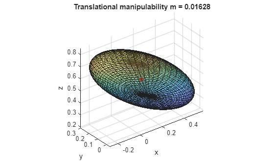
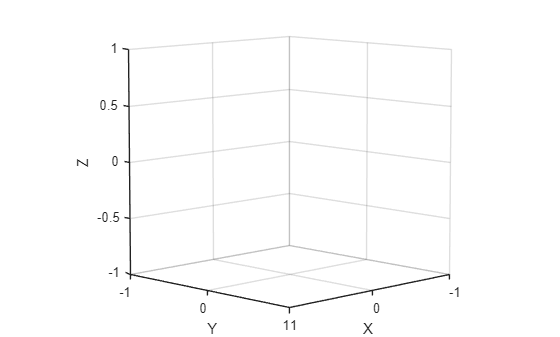
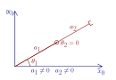
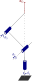
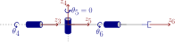

# Manipulability

Manipulability is a key concept in robotics that quantifies how easily a manipulator can produce motion or exert forces in different directions from a given configuration. It is closely linked to the properties of the robot's Jacobian matrix, which maps joint velocities to end\-effector velocities. By studying the  *rank* of the Jacobian, we can determine whether the robot can achieve arbitrary velocities in task space or if it is operating under constraints. Situations where the Jacobian loses rank are known as  *singularities. At these singularity* configurations certain directions of motion become unattainable or require disproportionately large joint velocities. Conversely, robots with more joints than the minimum required to perform a task exhibit *redundancy*, which can be exploited to improve manipulability, avoid obstacles, or optimize secondary criteria. Understanding these interrelated concepts is essential for effective motion planning, control, and safe operation of robotic manipulators.


**1. Manipulability Ellipsoids**


We can visualize the manipulability as an ellipsoid. 


By projecting the Jacobian into the task space, we can visualize the set of achievable end\-effector velocities for a unit norm of joint velocities. The eigenvalues and eigenvectors of $J_p$ or $J_{\Theta \;}$ define the elipsoid shape, where the eigenvectors correspond to the direction and the eigenvalue to the length of this axis. This set forms an **ellipsoid**:

-  **Large axes** → motion is easy in that direction. 
-  **Small axes** → motion is limited. 
-  **Collapsed axes** → motion is impossible in that direction (singularity). 

Consider the UR3e robot in a random configuration

```matlab
ur3e = loadrobot("universalUR3e", "DataFormat","column");

%config = [0,-pi/2,0,-pi/2,0,0]'; 
config = randomConfiguration(ur3e); 
config = [0,-pi/1.5, pi/2.5, -pi/2,-pi/2,0]'; 
% config = [0,-pi/2,0,-pi/2,0,0]'; 


```

for the each part of the Jacobian (translation and rotation) we can compute the axis using the singular value decomposition (SVD). With 

 $$ J_t \;=U*\Sigma *V\prime $$ 

where U is a matrix of the semi axis vectors of the elipsoid, $\Sigma$ holds the singular values, $\sigma_i$, which are equal to the length of the axis. Finally V holds the realtive configuration to achieve velocities in the axis of U. 


The manipulability index is the volume of the ellipsoid. 


To compute the manipulability index for a specific configuration:

 $$ m_{\textrm{trans}} =\sqrt{\det \left(J_p \cdot J_p^T \right)}=\sqrt{\lambda_1 \cdot \lambda_2 \cdot \lambda_3 }=\sigma_1 \cdot \sigma_2 \cdot \sigma_3 $$ 

and


 $m_{\textrm{rot}} =\sqrt{\det \left(J_{\Theta } \cdot J_{\Theta \;\;} \right)}$ or $\sqrt{\det \left(J_{\Phi \;} \cdot J_{\Phi \;} \right)}=\sqrt{\lambda_1 \cdot \lambda_2 \cdot \lambda_3 }=\sigma_1 \cdot \sigma_2 \cdot \sigma_3$ 

```matlab
J  = geometricJacobian(ur3e, config, "tool0");   % 6×6, base frame
J_r = J(1:3,:); 
J_t = J(4:6,:);   
T = getTransform(ur3e, config, 'tool0'); 
p_ee = T(1:3,4); 

% SVD: J_t = U*S*V'

[U_t,S_t,~] = svd(J_t,'econ');                        % U: axes (base frame), S: diag(σ)
trans_axes_lengths = diag(S_t)';                          % [σ1 σ2 σ3]
m_t = prod(trans_axes_lengths)                           % manipulability index
```

```matlabTextOutput
m_t = 0.0163
```

```matlab

[U_r,S_r,~] = svd(J_r,'econ');                        % U: axes (base frame), S: diag(σ)
rot_axes_lengths = diag(S_r)';                          % [σ1 σ2 σ3]
m_r = prod(rot_axes_lengths)   
```

```matlabTextOutput
m_r = 2.4495
```

```matlab

% % Unit sphere -> ellipsoid: E = U*S*[sphere points]
[xu,yu,zu] = sphere(50);
P_t = [xu(:)'; yu(:)'; zu(:)'];                           % 3×N
E_t = U_t*S_t*P_t;                                        % 3×N, base frame
x_t = reshape(E_t(1,:), size(xu))+p_ee(1);
y_t = reshape(E_t(2,:), size(yu))+p_ee(2);
z_t = reshape(E_t(3,:), size(zu))+p_ee(3);

figure; surf(x_t,y_t,z_t,'FaceAlpha',0.4'); hold on;

plot3(p_ee(1),p_ee(2),p_ee(3),'.','MarkerSize',20,'Color','r');
axis equal; grid on; xlabel x; ylabel y; zlabel z;
title(sprintf('Translational manipulability m = %.4g', m_t)); hold off; 
```



see in Rviz

```matlab
JointStatesToRviz(config, 'ur3e', [],  'Ellipsoid', true);
```

```matlabTextOutput
gz-modified
```

## Robotic System Toolbox

using the Robotic System Toolbox, you can easily compute the manipulability index of a configuration. 

```matlab
m_rs = manipulabilityIndex(ur3e, config');
```

this will return the combined manipulability of translation and rotation. 


for a set of task space dimension you can check the index as: 

```matlab
m_rs_rot = manipulabilityIndex(ur3e, config',MotionComponent="angular");
```

or for for specific motions you can use a vector to specify the required taskspace. 

```matlab
m_rs_custom = manipulabilityIndex(ur3e, config',MotionComponent=[1,0,1,1,0,0]);
```


the function generateRobotWorkspace, allow you to visualize the workspace of your robot and analyze the manipulability index in each point. 

```matlab
figure; 
show(ur3e, [0,-pi/2,0,-pi/2,0,0]');
ee = "tool0";

rng default
[workspace,configs] = generateRobotWorkspace(ur3e,{},ee,IgnoreSelfCollision="on");

mIdx = manipulabilityIndex(ur3e,configs,ee);

hold on
showWorkspaceAnalysis(workspace,mIdx,Voxelize=true)
axis auto
title("Voxelized Manipulability-Encoded Workspace")
hold off
```


# Rank of the Jacobian 

The rank of the Jacobian provides crucial information about the robot's manipulability. For a given task\-space dimension N, the rank of the corresponding part of the Jacobian should be N to achieve full manipulability. If the Jacobian's rank is less than N, there exists at least one motion that cannot be realized or independently controlled.


In linear algebra terms, the rank corresponds to the number of pivot elements in the row\-echelon form of the Jacobian. Each pivot represents an independent direction of motion in task space. Missing pivots indicate dependent motions and a reduction in manipulability.


Similarly, in terms of singular values, each nonzero singular value corresponds to a controllable direction. A zero singular value indicates a direction along which the end\-effector cannot move, directly reflecting the loss of manipulability in that direction.

```matlab
N = rank(J)
N_t = rank(J_t)
N_r = rank(J_r)
```
# Singularities

Points where the Jacobian looses rank are known as singularities or singular configurations. In these configurations the ellipsoid becomes an ellipse or a line. 


There are two types of Singularities:

### Boundary singularities
-  Occure when the robot is retracted/outstretched (for UR e.g. configuration \[0,\-pi/2,0,\-pi/2,0,0\]) 
-  This can generally be avoided if the target pose is inside the reachable workspace 

The figure below shows a fully streteched out arm, for the shown configuration, no velocity in only x or y is possible. In other terms, if $\theta_2 =0$ you can consider the robot arm to be a single joint controlled by $\theta_1$ with the length $a_1 +a_2$. As you need at least one joint per DoF, this manipulator only has 1 DoF left. 

 $$ J\left(q\right)=\left\lbrack \begin{array}{cc} -a_1 \cdot \sin \left(q_1 \right)-a_2 \cdot \sin \left(q_1 +q_2 \right) & -a_2 \cdot \sin \left(q_1 +q_2 \right)\newline a_1 \cdot \cos \left(q_1 \right)+a_2 \cdot \cos \left(q_1 +q_2 \right) & a_2 \cdot \cos \left(q_1 +q_2 \right) \end{array}\right\rbrack $$ 



### Internal singularities 
-  Occur inside the reachable workspace 
-  Generally caused by alignment of two or more axes of motion 

The figure below shows a spherical wrist in a singular configuration. As $\theta_4$ and $\theta_6$ lay in the same axis, they control the same movement. Consider the rotation part of the Jacobian for this spherical wrist: 

 $$ J_{\Theta } =\left\lbrack \begin{array}{ccc} \vec{\;z_3 }  & \vec{\;z_4 }  & \vec{\;z_5 }  \end{array}\right\rbrack =\left\lbrack \begin{array}{ccc} \vec{\;z_3 }  & \vec{\;z_4 }  & \vec{\;z_3 }  \end{array}\right\rbrack =\left\lbrack \begin{array}{ccc} 1 & 0 & 1\newline 0 & 1 & 0\newline 0 & 0 & 0 \end{array}\right\rbrack $$ 


## Decoupeling of Singularities 

For a manipulator with a spherical wrist, the singularities can be decoupled. This allows you to analyzed arm singularities and wrist singularities seperatly. 


Let $p_e$ be the place where the three wrist joints axes intersect: 

 $$ J=\left\lbrack \begin{array}{cc} J_{11}  & J_{12} \newline J_{21}  & J_{22}  \end{array}\right\rbrack $$ 

 $$ \left\lbrack \begin{array}{c} J_{12} \newline J_{22}  \end{array}\right\rbrack =\left\lbrack \begin{array}{ccc} z_3 \cdot \;\left(p_e -p_3 \right) & z_4 \cdot \;\left(p_e -p_4 \right) & z_5 \cdot \;\left(p_e -p_5 \right)\newline z_3  & z_4  & z_5  \end{array}\right\rbrack =\left\lbrack \begin{array}{ccc} 0 & 0 & 0\newline z_3  & z_4  & z_5  \end{array}\right\rbrack $$ 

Then $\det \left(J\right)=\det \left(J_{11} \right)\cdot \det \left(J_{22} \right)$, i.e. the singularities of the manipulator are those of the arm ( $\det \left(J_{11} \right)=0$ ) plus those of the arm ( $\det \left(J_{22} \right)=0$ ).

### Arm singularities
-  Depend on the kinemaitc structure  
-  For the anthropomorphic arm:  

 


given the Jacobian of the anthropomorphic arm: 

 $$ J_p (q)=\left\lbrack \begin{array}{ccc} -\sin (q_1 )\cdot \left(a_2 \cdot \cos (q_2 )+a_3 \cdot \cos (q_2 +q_3 )\right) & -\cos (q_1 )\cdot \left(a_2 \cdot \sin (q_2 )+a_3 \cdot \sin (q_2 +q_3 )\right) & -a_3 \cdot \cos (q_1 )\cdot \sin (q_2 +q_3 )\newline +\cos (q_1 )\cdot \left(a_2 \cdot \cos (q_2 )+a_3 \cdot \cos (q_2 +q_3 )\right) & -\sin (q_1 )\cdot \left(a_2 \cdot \sin (q_2 )+a_3 \cdot \sin (q_2 +q_3 )\right) & -a_3 \cdot \sin (q_1 )\cdot \sin (q_2 +q_3 )\newline 0 & a_2 \cdot \cos (q_2 )+a_3 \cdot \cos (q_2 +q_3 ) & a_3 \cdot \cos (q_2 +q_3 ) \end{array}\right\rbrack $$ 

the determinant is:  

 $$ \det \left(J_p \right)=-a_2 \cdot a_3 \cdot \sin \left(q_3 \right)\cdot \left(a_2 \cdot \cos \left(q_2 \right)+a_3 \cdot \cos \left(q_2 +q_3 \right)\right) $$ 

then $\det \left(J_p \right)=0$ if:

-  $\displaystyle \sin \left(q_3 \right)=0$ 
-  $\displaystyle a_2 \cdot \cos \left(q_2 \right)+a_3 \cdot \cos \left(q_2 +q_3 \right)=0$ 
### Wrist singuarities
-  Caused by allignment of $z_3$ and $z_5$ 
-  Happens when $q_5 =0$, or $q_5 =\pi \;$ 




with $J_{22} =\left\lbrack \begin{array}{ccc} \vec{\;z_3 }  & \vec{\;z_4 }  & \vec{\;z_5 }  \end{array}\right\rbrack$ 


View the Ellipsoid in Rviz while crossing through a singularity

```matlab
trajectory1 = quinticpolytraj([0,0,0,0,0,0; 0,-pi/2,0,-pi/2,0,0; -pi/2,-pi/3,pi/5,pi/7,-pi/10,pi;0,0,0,0,0,0]',[0,10, 20,30],linspace(0,30,300));
JointStatesToRviz(trajectory1, 'ur3e', 30, 'Ellipsoid', true, 'EllipsoidKind', 'trans', 'trajectory', false)
```

```matlabTextOutput
ans = logical
   1

```

# Redundancy

A manipulator is said to be kinematically redundant when it has more degrees of freedom (DoFs) than the dimensionality of its task space. The task space typically corresponds to the number of independent variables required to fully specify the end\-effector's position and orientation (e.g., 6 DoFs for a full 3D pose). For example, a 7\-joint robotic arm operating in three\-dimensional space has 7 DoFs, but the end\-effector pose only requires 6, the extra DoF introduces redundancy. Redundancy allows the robot to achieve the same end\-effector pose with multiple joint configurations, enabling optimization of secondary criteria such as obstacle avoidance, joint limit avoidance, energy efficiency, preferred postures or manipulability. Understanding and exploiting redundancy is fundamental in trajectory planning and inverse kinematics.


As the Jacobian may be a non square matrix, we need to use the pseudo inverse. 


Remember that: 

 $$ A^{\dagger} ={\left(A^T \cdot A\right)}^{-1} \cdot A^T $$ 

To compute the ideal joint configuration to maximize the manipulability of a redundant manipulator: 

 $$ \begin{array}{l} \dot{\mathbf{q}} =J^{\dagger} \cdot {\mathbf{v}}_e +\left(I_n -J^{\dagger} \cdot J\right)\cdot {\dot{\mathbf{q}} }_0 \newline {\dot{\mathbf{q}} }_0 =k_0 \cdot {\left(\frac{\partial \omega (\mathbf{q})}{\partial \mathbf{q}}\right)}^T \newline \omega (\mathbf{q})=\sqrt{\det \left(J(\mathbf{q})\cdot J^T (\mathbf{q})\right)} \end{array} $$ 

