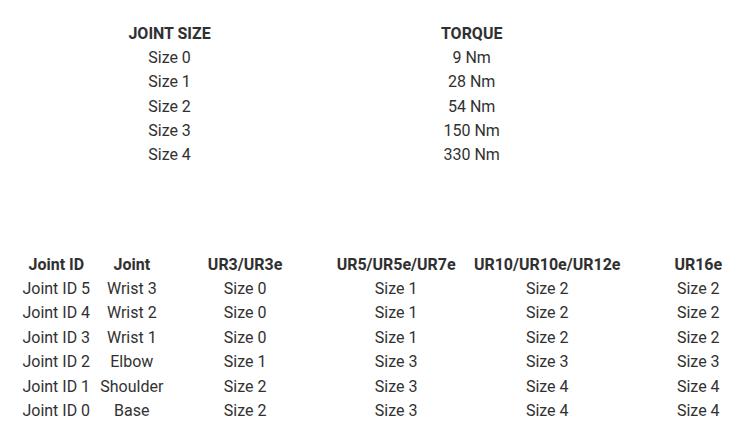

# Exercise 4.2 \- Effort\-Based Control using the Dynamic Model 

In this exercise, you will implement a **joint\-space PD controller** with **gravity and dynamic compensation** for a UR manipulator. The goal is to drive all joints of the robot smoothly toward a desired configuration (`qd`) while respecting joint torque limits.

# Task

Your controller will operate in the **effort control mode**, meaning it will directly send **joint torques** to the simulated robot.


At each control step, you will:

1.  Read the current joint positions and velocities from the simulator.
2. Compute the dynamic model of the robot (mass matrix, Coriolis/centrifugal terms, and gravity torques).
3. Calculate the control torques using a PD law in the joint space.
4. Apply **torque saturation** to stay within physical actuator limits.
5. Send the computed torques back to the simulator.
# Import the Robot

Instead of using the standard library of MATLAB, for this exercise import the robot using the raw URDF file. 

-  importrobot(\["robotics/Ros/src/ur5e.urdf"\]); 

Hint: Remember to set the gravity and data structure. 

# Functions to Interface the Simulation

Use the following helper functions to communicate with the simulator:

-  **`[q, q_dot, ~] = GetJointValues('All')`**Reads the current **joint positions** (`q`, in radians) and **joint velocities** (`q_dot`, in radians/second`) from the ROS network.Both are returned as 6×1 column vectors. 
-  **`SendJointTorques(tau\_sat)`**Sends a 6×1 vector of torques (in **Nm**) to the robot joints.The vector must respect the robot’s torque limits. 
# **Controller Structure**

The implemented PD controller with dynamics compensation has the following general form:

 $$ \tau =M\left(q\right)\cdot \left(\textrm{Kp}\cdot e+\textrm{Kd}\cdot \dot{e} \right)+C\left(q,\dot{q} \right)\cdot \;\dot{q} +g\left(q\right) $$ 

with the errors: 

 $$ e=q_{\textrm{desired}} -q $$ 

 $\dot{e} =\dot{q_{\textrm{desired}} } -\dot{q}$ in our case $\dot{q_{\textrm{desired}} } =0$ 

# Torque Saturation

Real robots cannot produce infinite torque.


To avoid unrealistic commands, we apply **torque saturation** using element-wise limits. 

 $$ \tau_{\textrm{sat}} \le \tau_{\max } $$ 

Use the figure below to construct the torque limit vector specific to your robot. 




# Other properties: 

This controller needs to be fast. Try to achieve a frequency of 50 - 100 Hz for a stable simulation. 

# Optional Visualization: 

You can store the joint states, speeds and torques and visualize them using the function: 

-  plotTrajectory(qstorage, qdstorage, tau_storage) 

You can visualize the Kineo Static Duality as a manipulability ellipsoid using the function: 

-   JointStatesToRviz(q, ur_model, [], 'Ellipsoid', true, EllipsoidResolution', 15, 'EllipsoidDuality', 'Force', 'SendJointStates', false); 

 **IMPORTANT:** The computation of the ellipsoid is relatively expensive, therefore to maintain a high control frequency only plot the Ellipsoid every N loops. If N is too low the controller will fail!

```matlab
   

    qstorage = []; 
    qdstorage = []; 
    tau_storage = []; 
    %================== User-tunable parameters ==================%
    qd      = zeros(6,1);                     % target configuration (rad)

    % Base gains (per joint) — tune as needed
    Kp = diag([90 90 70 45 30 18]);           % proportional
    Kd = diag([18 18 12  8  6  3.6]);         % derivative


```

