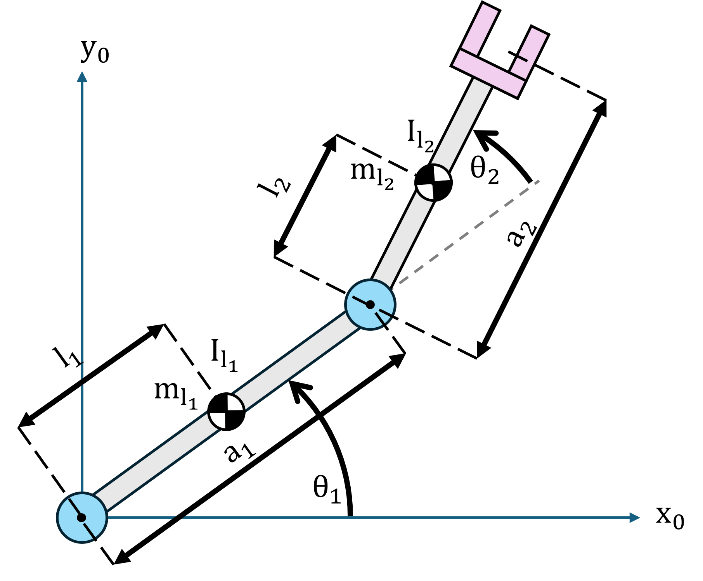

# Dynamics 

In robotics, understanding the dynamics of a manipulator is essential for precise motion control, trajectory planning, and interaction with the environment. Dynamics describes the relationship between forces, torques, and the resulting motion of the robot, capturing the influence of inertia, Coriolis and centrifugal forces, and gravity.


A widely used approach to derive the equations of motion is the **Lagrange formulation**, which provides a systematic framework based on energy principles. By expressing the kinetic and potential energy of the system, the Lagrange method yields a set of differential equations that describe the evolution of joint positions and velocities under applied torques. This formulation is particularly convenient for robots with complex kinematics or multiple degrees of freedom, as it avoids explicitly computing the forces at each joint due to constraint reactions.

# Lagrange Formultaion 

The eqation:

 $$ B\left(q\right)\cdot \;\ddot{\;q} +C\left(q,\dot{q} \right)\cdot \dot{q} +F\cdot \dot{q} +g\left(q\right)=\tau $$ 

with the inertia matrix $B\left(q\right)$, the Coriolis matrix $C\left(q,\dot{q} \right)$, the friction matrix $F$ and the gravity term $g\left(q\right)$, 


describes the torque $\tau$ exerted on the joints for a given configuration q and its velocity $\dot{q}$. 


This lagrange formulation can be rewritten to get the **forward dynamics** equation:

 $$ \ddot{q} =B^{-1} \left(q\right)\cdot \left(\tau -C\left(q,\dot{q} \right)\cdot \dot{q} -F\cdot \dot{q} -g\left(q\right)\right) $$ 

which computes the joint accelerations resulting from a given set of joint torques.

### Example

Consider this two link manipulator





with the following properties of the link: 

||||||
| :-- | :-- | :-- | :-- | :-- |
| Link  | Mass \[kg\]  | Radius \[m\]  | Link length \[m\]  | Center of mass \[m\]   |
| 1  | 0.5   | 0.04  | 0.5  | 0.25   |
| 2  | 0.7  | 0.04  | 0.7  | 0.35   |


The manipulator can be modeled using these DH parameters: 

||||||
| :-: | :-: | :-: | :-: | :-- |
| Link  | a \[m\]  | alpha  | d \[m\]  | theta   |
| 1  | 0.5  | 0  | 0  | $\displaystyle q_1$   |
| 2  | 0.7  | 0  | 0  | $\displaystyle q_2$   |

```matlab
        %a      alpha   d       theta
DH = [0.5,     0,       0,       0;
      0.7,     0,       0,       0];

mass1 = 0.5; 
radius1 = 0.04; 
center_of_mass1 = [DH(1,1)/2,0,0]; 

mass2 = 0.7;
radius2 = 0.04; 
center_of_mass2 = [DH(2,1)/2,0,0]; 

config = [pi/3;pi/2];
```
## Innertia Matrix $B\left(q\right)$ 

The inertia matrix of a robotic manipulator, captures how the robot's mass and geometry influence its resistance to motion. It is a symmetric, positive\-definite matrix that depends on the joint configuration q, and it relates joint accelerations $\ddot{q}$ to the required joint torques $\tau \;$ in the dynamic equations.

 $$ B(q)=\sum_{i=1}^n \Big(m_{l_i } \cdot J_p^{l_i ~T} (q)\cdot J_p^{l_i } (q)+J_{\Theta }^{l_i ~T} (q)\cdot R_i (q)\cdot I_{l_i } \cdot R_i^T (q)\cdot J_{\Theta }^{l_i } (q)\Big) $$ 

with 

-  $m_{l_i }$: mass of link i 
-  $J_P^{l_i }$: linear part of Jacobian of link i 
-  $J_{\Theta }^{l_i }$: rotational part of Jacobian of link i 
-  $R_i$: rotation matrix from link i frame to base frame 
-  $I_{l_i }$: inertia tensor of link i in its local frame 
-  $B\left(q\right)$: total inertia matrix of the manipulator 

To compute the intertia matrix for the example manipulator you need to compute: 

 $$ B(q)=\sum_{i=1}^2 \Big(m_{l_i } \cdot J_p^{l_i ~T} (q)\cdot J_p^{l_i } (q)+J_{\Theta }^{l_i ~T} (q)\cdot R_i (q)\cdot I_{l_i } \cdot R_i^T (q)\cdot J_{\Theta }^{l_i } (q)\Big) $$ 

The jacobians of the center of mass of each link are: 

 $$ J_P^{l_1 } =\left\lbrack \begin{array}{cc} -l_1 \cdot \sin \left(\theta_1 \right) & 0\newline l_1 \cdot \cos \left(\theta_1 \right) & 0\newline 0 & 0 \end{array}\right\rbrack $$ 

 $$ J_P^{l_2 } =\left\lbrack \begin{array}{cc} -a_1 \cdot \sin \left(\theta_1 \right)-l_2 \cdot \sin \left(\theta_1 +\theta_2 \right) & -l_2 \cdot \sin \left(\theta_1 +\theta_2 \right)\newline a_1 \cdot \cos \left(\theta_1 \right)+l_2 \cdot \cos \left(\theta_1 +\theta_2 \right) & l_2 \cdot \cos \left(\theta_1 +\theta_2 \right)\newline 0 & 0 \end{array}\right\rbrack $$ 

 $$ J_{\Theta }^{l_1 } =\left\lbrack \begin{array}{cc} 0 & 0\newline 0 & 0\newline 1 & 0 \end{array}\right\rbrack $$ 

 $$ J_{\Theta }^{l_2 } =\left\lbrack \begin{array}{cc} 0 & 0\newline 0 & 0\newline 1 & 1 \end{array}\right\rbrack $$ 

Notice how the Jacobians for link 1 only consider the Link 1 and has 0 in the columns corresponding to the following links. 


Consider the arms as a cylinders. The inertia tensor for a solid cylinder, with a radius r, the length a and its principal axis in x, is computed as: 

 $$ I_{\textrm{xx}} =\frac{1}{2}\cdot m\cdot r^2 $$ 

 $$ I_{\textrm{yy}} =I_{\textrm{zz}} =\frac{1}{12}\cdot m\cdot a^2 +\frac{1}{4}\cdot m\cdot r^2 $$ 

resulting in the intertia tensor $I$ (located around the center of mass)

 $$ I=\left\lbrack \begin{array}{ccc} I_{\textrm{xx}}  & 0 & 0\newline 0 & I_{\textrm{yy}}  & 0\newline 0 & 0 & I_{\textrm{zz}}  \end{array}\right\rbrack $$ 
### Matlab Implementation \- Symbolic Toolbox

This code computes the inertia matrix for the example two link robot manipulator. 

```matlab
syms a1 a2 l1 l2 q1 q2 m1 m2 theta_i alpha_i a_i d_i m_i r_i l_i r1 r2 real 

p0 = [0,0,0]';
z0 = [0,0,1]'; 
origin = [0,0,0,1]'; 
Ai = [cos(theta_i), -sin(theta_i)*cos(alpha_i), sin(theta_i)*sin(alpha_i), a_i*cos(theta_i);
    sin(theta_i), cos(theta_i)*cos(alpha_i), -cos(theta_i)*sin(alpha_i), a_i*sin(theta_i);
    0, sin(alpha_i), cos(alpha_i), d_i;
    0, 0, 0, 1];

Ixx=0.5*m_i*r_i^2; 
Iyy=1/4*m_i*(1/3 * a_i^2 +r_i^2 );
Izz=Iyy;
LinkInertiaMatrix=diag([Ixx,Iyy,Izz]);

%% INERTIA MATRIX
A01_l = subs(Ai,{a_i,d_i,alpha_i,theta_i},{ l1, 0, 0, q1});
A01 = subs(Ai,{a_i,d_i,alpha_i,theta_i},{a1,0,0,q1}); 
R1 = A01(1:3,1:3);
z1 = R1*z0; 
p1 = A01*origin; 

A12_l = subs(Ai,{a_i,d_i,alpha_i,theta_i},{ l2, 0, 0, q2});

A02_l = A01*A12_l;
R2 = A02_l(1:3,1:3);

pl1 = A01_l*origin;
pl2 = A02_l*origin;
JP_l1 = [cross(z0,pl1(1:3)-p0(1:3)), [0 0 0]'];
JP_l2 = [cross(z0,pl2(1:3)-p0(1:3)), cross(z1,pl2(1:3)-p1(1:3))];
Jtheta_l1 = [z0 [0 0 0]'];
Jtheta_l2 = [z0 z1];
B1 = simplify(m1*JP_l1'*JP_l1);
B2 = simplify(m2*JP_l2'*JP_l2);


I_1 = subs(LinkInertiaMatrix,{a_i, m_i, r_i},{a1, m1, r1});
Il1 = R1*I_1*R1';

I_2 = subs(LinkInertiaMatrix,{a_i, m_i,r_i},{a2, m2,r2});
Il2 = R2*I_2*R2';

B3 = Jtheta_l1'*Il1*Jtheta_l1;
B4 = Jtheta_l2'*Il2*Jtheta_l2;

B = simplify(B1+B2+B3+B4);

B_twolink = (subs(B, [a1, m1, r1, l1, a2, m2, r2, l2], [DH(1,1), mass1, radius1, center_of_mass1(1), DH(2,1), mass2, radius2, center_of_mass2(1)]));
B_twolink_subs = double(subs(B_twolink, [q1 q2], config.'))
```
### Robotic System Toolbox 

The robotic system toolbox allows us to compute the intertia matrix. 


The center of mass is configured as a structur property of a body as a vector $\left\lbrack \begin{array}{ccc} x & y & z \end{array}\right\rbrack$ realative to the body frame in $\left\lbrack \mathrm{m}\right\rbrack$, this means for our manipulator the distance in x is negative!


the inertia matrix is passed as a vector of the form: $\left\lbrack \begin{array}{cccccc} I_{\textrm{xx}}  & I_{\textrm{yy}}  & I_{\textrm{zz}}  & I_{\textrm{yz}}  & I_{\textrm{xz}}  & I_{\textrm{xy}}  \end{array}\right\rbrack \;\textrm{in}\;\left\lbrack \frac{\textrm{kg}}{{\mathrm{m}}^2 }\right\rbrack$, however the inertia matrix here is about the joint frame. To convert the previously computed Inertia, you need to apply the parallel\-axis theorem. 


For this cylinder, only $I_{\textrm{yy}}$ and $I_{\textrm{zz}}$ will be altered as: 

 $$ I_{\textrm{yy}}^{\prime } =I_{\textrm{zz}}^{\prime } =I_{\textrm{yy}} +m\cdot l_i^2 $$ 
```matlab
twolink = rigidBodyTree("DataFormat","column"); 
bodies = cell(2,1);
joints = cell(2,1);

bodies{1} = rigidBody('body_1');
bodies{2} = rigidBody('body_2');

joints{1} = rigidBodyJoint('joint_1', 'revolute');
joints{2} = rigidBodyJoint('joint_2', 'revolute');

% 1) Inertia about CoM (solid cylinder of length a along x)
Ixx1_C = 0.5*mass1*radius1^2;
Iyy1_C = (1/12)*mass1*(3*radius1^2 + DH(1,1)^2);
Izz1_C = Iyy1_C;

Ixx2_C = 0.5*mass2*radius2^2;
Iyy2_C = (1/12)*mass2*(3*radius2^2 + DH(2,1)^2);
Izz2_C = Iyy2_C;

% 2) Parallel-axis shift to body frame origin (r = [lc,0,0])
lc1 = center_of_mass1(1); lc2 = center_of_mass2(1);

Ixx1_O = Ixx1_C;
Iyy1_O = Iyy1_C + mass1*lc1^2;
Izz1_O = Izz1_C + mass1*lc1^2;

Ixx2_O = Ixx2_C;
Iyy2_O = Iyy2_C + mass2*lc2^2;
Izz2_O = Izz2_C + mass2*lc2^2;

Inertia_1 = [Ixx1_O, Iyy1_O, Izz1_O, 0, 0, 0];
Inertia_2 = [Ixx2_O, Iyy2_O, Izz2_O, 0, 0, 0];

% 3) Assign to the rigid bodies
bodies{1}.Mass = mass1; 
bodies{2}.Mass = mass2;

bodies{1}.CenterOfMass = -center_of_mass1;
bodies{2}.CenterOfMass = -center_of_mass2;

bodies{1}.Inertia = Inertia_1;
bodies{2}.Inertia = Inertia_2;

% 4) Keep using standard DH:
setFixedTransform(joints{1}, DH(1,:), 'dh');
setFixedTransform(joints{2}, DH(2,:), 'dh');

% Add bodies and joints to the rigid body tree
bodies{1}.Joint = joints{1}; 
bodies{2}.Joint = joints{2}; 

twolink.addBody(bodies{1}, 'base');
twolink.addBody(bodies{2}, 'body_1');
B_toolbox = massMatrix(twolink, config) 
```
## Coriolis Matrix $C\left(q,\dot{q} \right)$ 

The Coriolis matrix captures the velocity\-dependent forces that arise when a manipulator's joints move simultaneously. These forces, known as Coriolis and centrifugal forces, can significantly affect motion, especially at high speeds or in robots with long or heavy links. 


The centripetal terms is proportional to ${\dot{q_j } }^2$ and the Coriolis terms proportional to $\dot{q_i } \cdot \dot{q_j }$ 

 $$ C\left(q,\dot{q} \right)=\left\lbrack \begin{array}{cccc} c_{11}  & c_{12}  & \cdots  & c_{1n} \newline c_{21}  & c_{22}  & \cdots  & c_{2n} \newline \vdots  & \vdots  & \ddots  & \vdots \newline c_{\textrm{n1}}  & c_{\textrm{n2}}  & \cdots  & c_{\textrm{nn}}  \end{array}\right\rbrack $$ 

 $$ c_{\textrm{ij}} =\sum_{k=1}^n c_{\textrm{ijk}} \cdot \dot{q_k } $$ 

 $$ c_{ijk} (q,\dot{q} )=\frac{1}{2}\left(\frac{\partial b_{ij} }{\partial q_k }+\frac{\partial b_{ik} }{\partial q_j }-\frac{\partial b_{kj} }{\partial q_i }\right) $$ 

with 

 $$ B\left(q\right)=\left\lbrack \begin{array}{cccc} b_{11}  & b_{12}  & \cdots  & b_{1n} \newline b_{21}  & b_{22}  & \cdots  & b_{2n} \newline \vdots  & \vdots  & \ddots  & \vdots \newline b_{\textrm{n1}}  & b_{\textrm{n2}}  & \cdots  & b_{\textrm{nn}}  \end{array}\right\rbrack $$ 

where $C\left(q,\dot{q} \right)\in {\mathbb{R}}^{\textrm{nxn}}$ where $\dot{q} \in {\mathbb{R}}^{\textrm{nx1}}$ 

### Matlab Implementation \- Symbolic Toolbox

For the example of the two link manipulator solve the equations: 

 $$ C\left(q,\dot{q} \right)=\left\lbrack \begin{array}{cc} c_{11}  & c_{12} \newline c_{21}  & c_{22}  \end{array}\right\rbrack $$ 

 $$ c_{\textrm{ij}} =\sum_{k=1}^2 c_{\textrm{ijk}} \cdot \dot{q_k } $$ 
```matlab
jointVel = [pi/4; pi/10]; 
%% CORIOLIS MATRIX
syms qdot1 qdot2 real 
%Coriolis and centrifual terms
b11 = B_twolink(1,1);
b12 = B_twolink(1,2);
b21 = B_twolink(2,1);
b22 = B_twolink(2,2);

%cijk = simplify(0.5*(diff(bij,qk) + diff(bik,qj)-diff(bjk,qi)))
c111 = simplify(0.5*(diff(b11,q1) + diff(b11,q1)-diff(b11,q1)));
c112 = simplify(0.5*(diff(b11,q2) + diff(b12,q1)-diff(b12,q1)));
c121 = c112;
c122 = simplify(0.5*(diff(b12,q2) + diff(b12,q2)-diff(b22,q1)));
c211 = simplify(0.5*(diff(b21,q1) + diff(b21,q1)-diff(b11,q2)));
c212 = simplify(0.5*(diff(b21,q2) + diff(b22,q1)-diff(b12,q2)));
c221 = c212;
c222 = simplify(0.5*(diff(b22,q2) + diff(b22,q2)-diff(b22,q2)));
c11 = c111*qdot1+c112*qdot2;
c12 = c121*qdot1+c122*qdot2;
c21 = c211*qdot1+c212*qdot2;
c22 = c221*qdot1+c222*qdot2;

C = [c11 c12; c21 c22]
C_product = double(subs(C, [q1,q2, qdot1, qdot2],[config', jointVel']))*jointVel    
```
## Robotic System Toolbox 

the function velocityProduct returns the product of $C\left(q,\dot{q} \right)\cdot \dot{q}$ rather than just the matrix itself. 

```matlab
C_toolbox = velocityProduct(twolink, config, jointVel)
```
# Gravity Term $g\left(q\right)$ 

In robotic manipulators, the gravity term represents the torques required at each joint to counteract the effect of gravity on the links. It depends on the configuration of the robot, the mass distribution of each link, and the position of their centers of mass. This term is crucial for motion control, as it allows the robot to maintain static positions or follow trajectories while compensating for gravitational forces. In practical applications, accurate computation of the gravitational forces ensures stable and efficient operation, especially for lightweight or flexible manipulators where gravity effects are significant.


Start by idenfitying the direction of gravity in the zero frame. In the example twolink manipulator the \-y axis is the direction of influence. 

 $$ g_0 =\left\lbrack \begin{array}{c} 0\newline -g\newline 0 \end{array}\right\rbrack $$ 

with $g=9\ldotp 81\;\frac{\mathrm{m}}{{\mathrm{s}}^2 }$ 


form the gravity term as: 

 $$ g\left(q\right)=\left\lbrack \begin{array}{cccc} g_1 \left(q\right) & g_2 \left(q\right) & \cdots  & g_n \left(q\right) \end{array}\right\rbrack $$ 

with $g_i \left(q\right)=\sum_{j=1}^n m_{l_j } \cdot g_0^T \cdot J_{P_i }^{l_j }$ 

## Matlab Implementation \- Symbolic Toolbox
```matlab
syms g real
g0 = [0 -g 0]';
g1 = simplify(-m1*g0'*JP_l1(:,1) - m2*g0'*JP_l2(:,1))
g2 = simplify(-m1*g0'*JP_l1(:,2) - m2*g0'*JP_l2(:,2))
G = [g1 g2]'
G_subs = double(subs(G, [m1,m2,a1,a2,l1,l2,g, q1,q2], [mass1, mass2, DH(1,1), DH(2,1), center_of_mass1(1), center_of_mass2(1), 9.81, config']))
```
## Robotic System Toolbox 
```matlab
twolink.Gravity = [0,-9.81,0]; 
G_toolbox = gravityTorque(twolink, config)
```
# Friction Term $F$ 

The friction term in robot dynamics accounts for resistive torques at the joints due to internal friction in motors, gears, and bearings. Unlike the inertia, Coriolis, or gravity terms, friction is non\-conservative and depends on the motion of the joints rather than their configuration.


The Friction term consists of two parts, the viscous friction depending on $B_m$ scaled by the squared gear ratio $G^2$ and the Coulomb friction $T_c$ scaled by $G$.

 $$ F\cdot \dot{q} =B_m \cdot G^2 \cdot \dot{q} +T_c \cdot \textrm{sign}\left(\dot{q} \right) $$ 
## Matlab Implementation \- Symbolic Toolbox
```matlab
syms bm1 bm2 Tc1 Tc2 G1 G2 qdot real 
F = [bm1, bm2].*[G1, G2].^2

F_torque = F * qdot + sign(qdot)* [Tc1, Tc2]
```

As of now the Robotic System toolbox does offer a function to compute the friction term. If the parameters are known, you need to add them to the torque computed by the toolbox functions.

# Dynamics functions from Robotic System Toolbox

 The Robotic sytem toolbox offeres other functions to compute the dynamics terms as a whole. 


The Dynamics function of the toolbox excludes the friction term, thus the equation becomes: 

 $$ B\left(q\right)\cdot \;\ddot{\;q} +C\left(q,\dot{q} \right)\cdot \dot{q} +g\left(q\right)=\tau $$ 

The function externalForce() returns the external force matrix for a desired force on a specified manipulator frame: 

```matlab
                                  % Mx My Mz Fx Fy Fz
                               %in [Nm Nm Nm N  N  N] 
desired_endeffector_forces_body1 = [0, 0, 0, 0, 1, 0];
desired_endeffector_forces_body2 = [0, 0, 0, 5, 0, 0];

fext1 = externalForce(twolink,'body_1', desired_endeffector_forces_body1', config)
fext2 = externalForce(twolink,'body_2', desired_endeffector_forces_body2', config)
```

Adding external force matrices combines the external forces. This may be used for a robot with multiple endeffectors: 

```matlab
total_external_forces = fext1 + fext2
```

To compute the requrired joint accelerations you can use the forwardDynamics() function with the external force matrix as an input: 

```matlab
q_dot_dot = forwardDynamics(twolink, config, [],[], total_external_forces)
```

The outout of this function is a vector containing the required joint accelertations to fulfill the input requirement (here its the external forces). 


 the forwardDynamics function also allows the joint velocity as an input: 

```matlab
q_dot = [-pi/2; pi/5]; 
q_dot_dot_vel = forwardDynamics(twolink, config, q_dot)
```

 or joint torques: 

```matlab
tau = [5; 5]; 
q_dot_dot_torque = forwardDynamics(twolink, config, [], tau) 
```

To compute the required joint torques, use the function inverseDynamics(): 

```matlab
tau_vel = inverseDynamics(twolink, config, q_dot)
tau_accel = inverseDynamics(twolink, config, [], q_dot_dot)
tau_force = inverseDynamics(twolink, config, [],[], fext1)
```

The outout of this function is a vector containing the required joint torques to fulfill the input requirement. 


